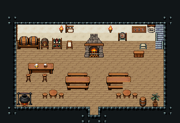

# 여관 1층 · 주점과 접수대

여관 주인이 운영하는 1층. 손님은 문으로 들어와 오른쪽 접수대에서 방을 잡고, 바에서 술을 받아 긴 식탁에서 먹는다. 계단으로 2층 객실에 오른다.

크림 벽 18×8칸 홀. 왼쪽 뒤 술통 선반·맥주통·포도주 선반, 그 앞 바 카운터와 높은 걸상 둘(주인 자리 (4,6)), 벽에 술집 간판·메뉴 칠판, 가운데 뒤 장작 벽난로, 벽 다트판, 긴 식탁과 벤치 두 벌, 앞 왼쪽 솥 걸이와 원형 식탁. 오른쪽 뒤 여관 간판 57·열쇠판·접수 계산대·편지 쟁반, 벽에 뚫은 오르막 계단 111/141/171(x=19). 22×15, tilesetId=tibo_interior_expanded. 입구 (11,13), 주인·담당 자리 (4,6). 통행 검사 목표 [[4,6],[9,7],[16,5],[19,5]].



## 놓은 소품 (저작 순서)
tibo-kit은 tibo_interior_expanded의 structureKits id, tiles는 직접 놓은 번호 행렬, rug는 카펫 오토타일 섬, floor는 바닥 재질 칠. (x,y)는 왼쪽 위.
```json
[
  {
    "kind": "tibo-kit",
    "kitId": "tibo-fantasy-ale-rack",
    "name": "술통 선반",
    "x": 2,
    "y": 4,
    "w": 3,
    "h": 2
  },
  {
    "kind": "tibo-kit",
    "kitId": "tibo-library-133",
    "name": "받침대 맥주통",
    "x": 5,
    "y": 4,
    "w": 1,
    "h": 2
  },
  {
    "kind": "tibo-kit",
    "kitId": "tibo-library-134",
    "name": "포도주 병 선반",
    "x": 6,
    "y": 4,
    "w": 2,
    "h": 2
  },
  {
    "kind": "tibo-kit",
    "kitId": "tibo-fantasy-bar-counter",
    "name": "바 카운터",
    "x": 3,
    "y": 7,
    "w": 4,
    "h": 2
  },
  {
    "kind": "tibo-kit",
    "kitId": "tibo-library-029",
    "name": "높은 걸상",
    "x": 3,
    "y": 9,
    "w": 1,
    "h": 1
  },
  {
    "kind": "tibo-kit",
    "kitId": "tibo-library-029",
    "name": "높은 걸상",
    "x": 5,
    "y": 9,
    "w": 1,
    "h": 1
  },
  {
    "kind": "tibo-kit",
    "kitId": "tibo-library-144",
    "name": "술집 실내 간판",
    "x": 8,
    "y": 3,
    "w": 1,
    "h": 1
  },
  {
    "kind": "tibo-kit",
    "kitId": "tibo-library-034",
    "name": "메뉴 칠판",
    "x": 8,
    "y": 4,
    "w": 1,
    "h": 2
  },
  {
    "kind": "tibo-kit",
    "kitId": "tibo-medieval-stone-fireplace",
    "name": "장작 벽난로",
    "x": 10,
    "y": 4,
    "w": 3,
    "h": 3
  },
  {
    "kind": "tibo-kit",
    "kitId": "tibo-library-138",
    "name": "술집 다트판",
    "x": 14,
    "y": 3,
    "w": 2,
    "h": 2
  },
  {
    "kind": "tibo-kit",
    "kitId": "tibo-fantasy-dining-set",
    "name": "긴 식탁과 벤치",
    "x": 8,
    "y": 8,
    "w": 3,
    "h": 3
  },
  {
    "kind": "tibo-kit",
    "kitId": "tibo-fantasy-dining-set",
    "name": "긴 식탁과 벤치",
    "x": 13,
    "y": 8,
    "w": 3,
    "h": 3
  },
  {
    "kind": "tibo-kit",
    "kitId": "tibo-fantasy-hanging-pot",
    "name": "솥 걸이",
    "x": 2,
    "y": 11,
    "w": 2,
    "h": 2
  },
  {
    "kind": "tibo-kit",
    "kitId": "tibo-library-025",
    "name": "원형 식탁",
    "x": 6,
    "y": 10,
    "w": 1,
    "h": 2
  },
  {
    "kind": "tibo-kit",
    "kitId": "tibo-library-030",
    "name": "낮은 걸상",
    "x": 5,
    "y": 11,
    "w": 1,
    "h": 1
  },
  {
    "kind": "tibo-kit",
    "kitId": "tibo-library-030",
    "name": "낮은 걸상",
    "x": 7,
    "y": 11,
    "w": 1,
    "h": 1
  },
  {
    "kind": "tiles",
    "layer": "upper",
    "x": 18,
    "y": 3,
    "w": 1,
    "h": 1,
    "rows": [
      [
        57
      ]
    ]
  },
  {
    "kind": "tibo-kit",
    "kitId": "tibo-v8-1-0",
    "name": "열쇠판",
    "x": 16,
    "y": 3,
    "w": 2,
    "h": 1
  },
  {
    "kind": "tibo-kit",
    "kitId": "tibo-library-125",
    "name": "상점 계산대",
    "x": 16,
    "y": 6,
    "w": 2,
    "h": 1
  },
  {
    "kind": "tibo-kit",
    "kitId": "tibo-library-079",
    "name": "편지 쟁반",
    "x": 17,
    "y": 5,
    "w": 1,
    "h": 1
  },
  {
    "kind": "tiles",
    "layer": "lower",
    "x": 19,
    "y": 3,
    "w": 1,
    "h": 3,
    "rows": [
      [
        111
      ],
      [
        141
      ],
      [
        171
      ]
    ]
  },
  {
    "kind": "tibo-kit",
    "kitId": "tibo-library-209",
    "name": "키 큰 실내 야자",
    "x": 18,
    "y": 11,
    "w": 2,
    "h": 2
  },
  {
    "kind": "tibo-kit",
    "kitId": "tibo-library-229",
    "name": "뚜껑 둥근 통",
    "x": 17,
    "y": 11,
    "w": 1,
    "h": 2
  },
  {
    "kind": "tibo-kit",
    "kitId": "tibo-library-025",
    "name": "원형 식탁",
    "x": 15,
    "y": 10,
    "w": 1,
    "h": 2
  },
  {
    "kind": "tibo-kit",
    "kitId": "tibo-library-030",
    "name": "낮은 걸상",
    "x": 14,
    "y": 11,
    "w": 1,
    "h": 1
  },
  {
    "kind": "tibo-kit",
    "kitId": "tibo-library-030",
    "name": "낮은 걸상",
    "x": 16,
    "y": 11,
    "w": 1,
    "h": 1
  },
  {
    "kind": "tiles",
    "layer": "upper",
    "x": 7,
    "y": 3,
    "w": 1,
    "h": 1,
    "rows": [
      [
        24
      ]
    ]
  },
  {
    "kind": "tiles",
    "layer": "upper",
    "x": 13,
    "y": 3,
    "w": 1,
    "h": 1,
    "rows": [
      [
        24
      ]
    ]
  }
]
```

전체 두 레이어는 다음 배열 문서가 정답이다.
