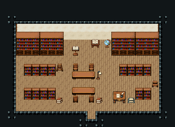

# 도서관

책을 빌려 읽는 도서관. 문에서 곧장 가운데 열람 탁자로, 양옆 서가 두 줄 사이 통로로 책을 찾고, 문 오른쪽 사서 책상에서 대출을 받는다.

크림 벽·널 바닥 102, 18×9칸. 뒷벽에 큰 책장 18~80(3×3, 아래층) 넷과 독서대·펼친 지도책 받침·지구본, 양옆에 1×2 서가 147/177를 줄지어 세운 두 줄(y=8, 11)로 통로를 만들고, 가운데 긴 열람 탁자 325·326·327 둘(위 탁자는 탁자를 보는 의자 267, 아래 탁자는 등을 보인 의자 268, 두 탁자 사이 한 줄은 통로)·독서등, 서가 옆 접이 사다리·책 더미·발판, 오른쪽 앞 서가 두 칸을 비운 자리에 사서의 필경사 책상과 편지 쟁반(사서 자리 (14,10)). 22×16, tilesetId=tibo_interior_expanded. 입구 (11,14), 주인·담당 자리 (14,10). 통행 검사 목표 [[10,6],[8,10],[14,10],[19,12],[2,10]].



## 놓은 소품 (저작 순서)
tibo-kit은 tibo_interior_expanded의 structureKits id, tiles는 직접 놓은 번호 행렬, rug는 카펫 오토타일 섬, floor는 바닥 재질 칠. (x,y)는 왼쪽 위.
```json
[
  {
    "kind": "tiles",
    "layer": "lower",
    "x": 2,
    "y": 4,
    "w": 3,
    "h": 3,
    "rows": [
      [
        18,
        19,
        20
      ],
      [
        48,
        49,
        50
      ],
      [
        78,
        79,
        80
      ]
    ]
  },
  {
    "kind": "tiles",
    "layer": "lower",
    "x": 5,
    "y": 4,
    "w": 3,
    "h": 3,
    "rows": [
      [
        18,
        19,
        20
      ],
      [
        48,
        49,
        50
      ],
      [
        78,
        79,
        80
      ]
    ]
  },
  {
    "kind": "tiles",
    "layer": "lower",
    "x": 14,
    "y": 4,
    "w": 3,
    "h": 3,
    "rows": [
      [
        18,
        19,
        20
      ],
      [
        48,
        49,
        50
      ],
      [
        78,
        79,
        80
      ]
    ]
  },
  {
    "kind": "tiles",
    "layer": "lower",
    "x": 17,
    "y": 4,
    "w": 3,
    "h": 3,
    "rows": [
      [
        18,
        19,
        20
      ],
      [
        48,
        49,
        50
      ],
      [
        78,
        79,
        80
      ]
    ]
  },
  {
    "kind": "tibo-kit",
    "kitId": "tibo-lectern",
    "name": "독서대",
    "x": 9,
    "y": 5,
    "w": 1,
    "h": 2
  },
  {
    "kind": "tibo-kit",
    "kitId": "tibo-library-074",
    "name": "펼친 지도책 받침",
    "x": 11,
    "y": 4,
    "w": 2,
    "h": 2
  },
  {
    "kind": "tibo-kit",
    "kitId": "tibo-v12-1-2",
    "name": "지구본",
    "x": 13,
    "y": 4,
    "w": 1,
    "h": 2
  },
  {
    "kind": "tiles",
    "layer": "upper",
    "x": 3,
    "y": 8,
    "w": 1,
    "h": 2,
    "rows": [
      [
        147
      ],
      [
        177
      ]
    ]
  },
  {
    "kind": "tiles",
    "layer": "upper",
    "x": 4,
    "y": 8,
    "w": 1,
    "h": 2,
    "rows": [
      [
        147
      ],
      [
        177
      ]
    ]
  },
  {
    "kind": "tiles",
    "layer": "upper",
    "x": 5,
    "y": 8,
    "w": 1,
    "h": 2,
    "rows": [
      [
        147
      ],
      [
        177
      ]
    ]
  },
  {
    "kind": "tiles",
    "layer": "upper",
    "x": 6,
    "y": 8,
    "w": 1,
    "h": 2,
    "rows": [
      [
        147
      ],
      [
        177
      ]
    ]
  },
  {
    "kind": "tiles",
    "layer": "upper",
    "x": 15,
    "y": 8,
    "w": 1,
    "h": 2,
    "rows": [
      [
        147
      ],
      [
        177
      ]
    ]
  },
  {
    "kind": "tiles",
    "layer": "upper",
    "x": 16,
    "y": 8,
    "w": 1,
    "h": 2,
    "rows": [
      [
        147
      ],
      [
        177
      ]
    ]
  },
  {
    "kind": "tiles",
    "layer": "upper",
    "x": 17,
    "y": 8,
    "w": 1,
    "h": 2,
    "rows": [
      [
        147
      ],
      [
        177
      ]
    ]
  },
  {
    "kind": "tiles",
    "layer": "upper",
    "x": 18,
    "y": 8,
    "w": 1,
    "h": 2,
    "rows": [
      [
        147
      ],
      [
        177
      ]
    ]
  },
  {
    "kind": "tiles",
    "layer": "upper",
    "x": 3,
    "y": 11,
    "w": 1,
    "h": 2,
    "rows": [
      [
        147
      ],
      [
        177
      ]
    ]
  },
  {
    "kind": "tiles",
    "layer": "upper",
    "x": 4,
    "y": 11,
    "w": 1,
    "h": 2,
    "rows": [
      [
        147
      ],
      [
        177
      ]
    ]
  },
  {
    "kind": "tiles",
    "layer": "upper",
    "x": 5,
    "y": 11,
    "w": 1,
    "h": 2,
    "rows": [
      [
        147
      ],
      [
        177
      ]
    ]
  },
  {
    "kind": "tiles",
    "layer": "upper",
    "x": 6,
    "y": 11,
    "w": 1,
    "h": 2,
    "rows": [
      [
        147
      ],
      [
        177
      ]
    ]
  },
  {
    "kind": "tiles",
    "layer": "upper",
    "x": 17,
    "y": 11,
    "w": 1,
    "h": 2,
    "rows": [
      [
        147
      ],
      [
        177
      ]
    ]
  },
  {
    "kind": "tiles",
    "layer": "upper",
    "x": 18,
    "y": 11,
    "w": 1,
    "h": 2,
    "rows": [
      [
        147
      ],
      [
        177
      ]
    ]
  },
  {
    "kind": "tiles",
    "layer": "upper",
    "x": 9,
    "y": 9,
    "w": 3,
    "h": 1,
    "rows": [
      [
        325,
        326,
        327
      ]
    ]
  },
  {
    "kind": "tiles",
    "layer": "upper",
    "x": 9,
    "y": 8,
    "w": 1,
    "h": 1,
    "rows": [
      [
        267
      ]
    ]
  },
  {
    "kind": "tiles",
    "layer": "upper",
    "x": 11,
    "y": 8,
    "w": 1,
    "h": 1,
    "rows": [
      [
        267
      ]
    ]
  },
  {
    "kind": "tiles",
    "layer": "upper",
    "x": 9,
    "y": 11,
    "w": 3,
    "h": 1,
    "rows": [
      [
        325,
        326,
        327
      ]
    ]
  },
  {
    "kind": "tiles",
    "layer": "upper",
    "x": 9,
    "y": 12,
    "w": 1,
    "h": 1,
    "rows": [
      [
        268
      ]
    ]
  },
  {
    "kind": "tiles",
    "layer": "upper",
    "x": 11,
    "y": 12,
    "w": 1,
    "h": 1,
    "rows": [
      [
        268
      ]
    ]
  },
  {
    "kind": "tibo-kit",
    "kitId": "tibo-library-083",
    "name": "독서등",
    "x": 12,
    "y": 8,
    "w": 1,
    "h": 2
  },
  {
    "kind": "tibo-kit",
    "kitId": "tibo-library-240",
    "name": "접이 사다리",
    "x": 7,
    "y": 8,
    "w": 1,
    "h": 1
  },
  {
    "kind": "tibo-kit",
    "kitId": "tibo-library-073",
    "name": "덮은 책 더미",
    "x": 7,
    "y": 12,
    "w": 1,
    "h": 1
  },
  {
    "kind": "tibo-kit",
    "kitId": "tibo-library-073",
    "name": "덮은 책 더미",
    "x": 12,
    "y": 12,
    "w": 1,
    "h": 1
  },
  {
    "kind": "tibo-kit",
    "kitId": "tibo-warm-scribe-desk",
    "name": "필경사 책상",
    "x": 14,
    "y": 11,
    "w": 2,
    "h": 2
  },
  {
    "kind": "tibo-kit",
    "kitId": "tibo-library-079",
    "name": "편지 쟁반",
    "x": 16,
    "y": 12,
    "w": 1,
    "h": 1
  },
  {
    "kind": "tibo-kit",
    "kitId": "tibo-library-084",
    "name": "도서관 발판",
    "x": 19,
    "y": 10,
    "w": 1,
    "h": 1
  }
]
```

전체 두 레이어는 다음 배열 문서가 정답이다.
