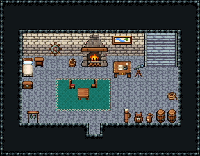

# 등대 · 1층 등대지기 방

등대지기가 사는 등대 1층. 문으로 들어와 왼쪽 침대에서 자고, 벽난로에 불을 때며, 동쪽 책상에서 항해 일지를 쓰고 망원경으로 바다를 본다. 동쪽 계단으로 꼭대기 등불 방에 오르고, 기름통의 등유를 날라 올린다.

석벽 134~136/164~166·돌바닥 42, 14×6칸. 왼쪽 침대 324/354·협탁·배 조타륜 장식, 가운데 장작 벽난로 3×3·장작 바구니, 바다 지도 액자, 동쪽 3칸 폭 돌계단 141|111|171(x=13~15, 첫 바닥 줄 y=5에서 벽면 두 줄을 타고 오름) → 등불 방, 계단 곁 필경사 책상(일지)·천체망원경, 가운데 청록 러그 위 정사각 식탁과 의자 둘, 침대 발치 궤짝, 오른쪽 앞 등유 통 둘·술 항아리·밧줄, 왼쪽 앞 생선 건조대, 지도통·가죽 배낭. 18×14, tilesetId=tibo_interior_expanded. 입구 (8,11), 주인·담당 자리 (10,7). 통행 검사 목표 [[10,7],[14,6],[3,7],[13,8]].



## 놓은 소품 (저작 순서)
tibo-kit은 tibo_interior_expanded의 structureKits id, tiles는 직접 놓은 번호 행렬, rug는 카펫 오토타일 섬, floor는 바닥 재질 칠. (x,y)는 왼쪽 위.
```json
[
  {
    "kind": "tiles",
    "layer": "upper",
    "x": 2,
    "y": 5,
    "w": 1,
    "h": 2,
    "rows": [
      [
        324
      ],
      [
        354
      ]
    ],
    "role": "furn"
  },
  {
    "kind": "tibo-kit",
    "kitId": "tibo-library-039",
    "name": "침대 옆 협탁",
    "x": 3,
    "y": 5,
    "w": 1,
    "h": 1,
    "role": "furn"
  },
  {
    "kind": "tibo-kit",
    "kitId": "tibo-library-224",
    "name": "배 조타륜 장식",
    "x": 4,
    "y": 3,
    "w": 2,
    "h": 2,
    "role": "hang"
  },
  {
    "kind": "tibo-kit",
    "kitId": "tibo-medieval-stone-fireplace",
    "name": "장작 벽난로",
    "x": 7,
    "y": 3,
    "w": 3,
    "h": 3,
    "role": "furn"
  },
  {
    "kind": "tibo-kit",
    "kitId": "tibo-v8-1-2",
    "name": "장작 바구니",
    "x": 6,
    "y": 5,
    "w": 1,
    "h": 1,
    "role": "furn"
  },
  {
    "kind": "tibo-kit",
    "kitId": "tibo-v6-2-0",
    "name": "강 지도 액자",
    "x": 10,
    "y": 3,
    "w": 2,
    "h": 1,
    "role": "hang"
  },
  {
    "kind": "tiles",
    "layer": "lower",
    "x": 13,
    "y": 3,
    "w": 3,
    "h": 3,
    "rows": [
      [
        141,
        111,
        171
      ],
      [
        141,
        111,
        171
      ],
      [
        141,
        111,
        171
      ]
    ],
    "role": "stairs"
  },
  {
    "kind": "tibo-kit",
    "kitId": "tibo-warm-scribe-desk",
    "name": "필경사 책상",
    "x": 10,
    "y": 5,
    "w": 2,
    "h": 2,
    "role": "table"
  },
  {
    "kind": "tibo-kit",
    "kitId": "tibo-v11-1-3",
    "name": "천체망원경",
    "x": 12,
    "y": 5,
    "w": 1,
    "h": 2,
    "role": "furn"
  },
  {
    "kind": "rug",
    "group": "harness-interior-house-v1-terrain-teal-carpet",
    "x": 5,
    "y": 7,
    "w": 5,
    "h": 3,
    "role": "rug"
  },
  {
    "kind": "tibo-kit",
    "kitId": "tibo-library-026",
    "name": "정사각 식탁",
    "x": 7,
    "y": 7,
    "w": 1,
    "h": 2,
    "role": "table"
  },
  {
    "kind": "tibo-kit",
    "kitId": "tibo-v7-1-2",
    "name": "붉은 방석 의자",
    "x": 6,
    "y": 7,
    "w": 1,
    "h": 1,
    "role": "seat"
  },
  {
    "kind": "tiles",
    "layer": "upper",
    "x": 8,
    "y": 7,
    "w": 1,
    "h": 1,
    "rows": [
      [
        298
      ]
    ],
    "role": "seat"
  },
  {
    "kind": "tibo-kit",
    "kitId": "tibo-library-045",
    "name": "여행용 궤짝",
    "x": 2,
    "y": 7,
    "w": 1,
    "h": 1,
    "role": "furn"
  },
  {
    "kind": "tibo-kit",
    "kitId": "tibo-library-229",
    "name": "뚜껑 둥근 통",
    "x": 14,
    "y": 9,
    "w": 1,
    "h": 2,
    "role": "furn"
  },
  {
    "kind": "tibo-kit",
    "kitId": "tibo-library-229",
    "name": "뚜껑 둥근 통",
    "x": 15,
    "y": 9,
    "w": 1,
    "h": 2,
    "role": "furn"
  },
  {
    "kind": "tibo-kit",
    "kitId": "tibo-library-137",
    "name": "술 항아리",
    "x": 13,
    "y": 10,
    "w": 1,
    "h": 1,
    "role": "furn"
  },
  {
    "kind": "tibo-kit",
    "kitId": "tibo-library-196",
    "name": "밧줄 뭉치",
    "x": 15,
    "y": 8,
    "w": 1,
    "h": 1,
    "role": "furn"
  },
  {
    "kind": "tibo-kit",
    "kitId": "tibo-library-022",
    "name": "생선 건조대",
    "x": 2,
    "y": 9,
    "w": 2,
    "h": 2,
    "role": "furn"
  },
  {
    "kind": "tibo-kit",
    "kitId": "tibo-library-198",
    "name": "지도통",
    "x": 11,
    "y": 9,
    "w": 1,
    "h": 2,
    "role": "furn"
  },
  {
    "kind": "tibo-kit",
    "kitId": "tibo-library-194",
    "name": "가죽 배낭",
    "x": 12,
    "y": 10,
    "w": 1,
    "h": 1,
    "role": "furn"
  }
]
```

전체 두 레이어는 다음 배열 문서가 정답이다.
