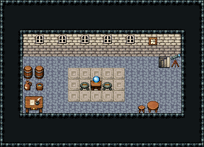

# 등대 · 꼭대기 등불 방

등대 꼭대기의 등불 방. 1층 동쪽 계단으로 올라오면 내리막 계단 앞. 가운데 단 위 수정 렌즈 곁 화로에 불을 지켜 밤바다를 비추고, 창 너머 바다를 망원경으로 살핀다. 등유와 불 끌 물은 서쪽 통 곁에 모아 둔다.

석벽·돌바닥 42, 14×5칸. 남쪽 문을 닫고 1층 계단 가운데(x=14)에 1×1 내리막 돌계단 474 하나. 뒷벽 창 54 다섯, 가운데 무늬 석판 163 단 5×3 위 수정구 받침(렌즈)과 화로 둘, 서쪽 등유 통 둘·술 항아리·물 양동이(불 끄기)를 한데 모으고 그 아래 필경사 책상(당번 일지), 동쪽 천체망원경·벽시계와 밤 당번의 작은 탁자·걸상. 바닥에 따로 흩어 둔 소품 없음. 18×13, tilesetId=tibo_interior_expanded. 입구 (14,7). 통행 검사 목표 [[8,9],[4,6],[15,7],[5,7]].



## 놓은 소품 (저작 순서)
tibo-kit은 tibo_interior_expanded의 structureKits id, tiles는 직접 놓은 번호 행렬, rug는 카펫 오토타일 섬, floor는 바닥 재질 칠. (x,y)는 왼쪽 위.
```json
[
  {
    "kind": "tiles",
    "layer": "upper",
    "x": 14,
    "y": 5,
    "w": 1,
    "h": 1,
    "rows": [
      [
        474
      ]
    ],
    "role": "stairs"
  },
  {
    "kind": "tiles",
    "layer": "upper",
    "x": 3,
    "y": 3,
    "w": 1,
    "h": 1,
    "rows": [
      [
        54
      ]
    ],
    "role": "hang"
  },
  {
    "kind": "tiles",
    "layer": "upper",
    "x": 5,
    "y": 3,
    "w": 1,
    "h": 1,
    "rows": [
      [
        54
      ]
    ],
    "role": "hang"
  },
  {
    "kind": "tiles",
    "layer": "upper",
    "x": 7,
    "y": 3,
    "w": 1,
    "h": 1,
    "rows": [
      [
        54
      ]
    ],
    "role": "hang"
  },
  {
    "kind": "tiles",
    "layer": "upper",
    "x": 9,
    "y": 3,
    "w": 1,
    "h": 1,
    "rows": [
      [
        54
      ]
    ],
    "role": "hang"
  },
  {
    "kind": "tiles",
    "layer": "upper",
    "x": 11,
    "y": 3,
    "w": 1,
    "h": 1,
    "rows": [
      [
        54
      ]
    ],
    "role": "hang"
  },
  {
    "kind": "floor",
    "tile": 163,
    "x": 6,
    "y": 6,
    "w": 5,
    "h": 3,
    "role": "floor"
  },
  {
    "kind": "tibo-kit",
    "kitId": "tibo-fantasy-crystal-stand",
    "name": "수정구 받침",
    "x": 8,
    "y": 6,
    "w": 1,
    "h": 2,
    "role": "furn"
  },
  {
    "kind": "tibo-kit",
    "kitId": "tibo-brazier",
    "name": "화로",
    "x": 7,
    "y": 7,
    "w": 1,
    "h": 1,
    "role": "furn"
  },
  {
    "kind": "tibo-kit",
    "kitId": "tibo-brazier",
    "name": "화로",
    "x": 9,
    "y": 7,
    "w": 1,
    "h": 1,
    "role": "furn"
  },
  {
    "kind": "tibo-kit",
    "kitId": "tibo-library-229",
    "name": "뚜껑 둥근 통",
    "x": 2,
    "y": 5,
    "w": 1,
    "h": 2,
    "role": "furn"
  },
  {
    "kind": "tibo-kit",
    "kitId": "tibo-library-229",
    "name": "뚜껑 둥근 통",
    "x": 3,
    "y": 5,
    "w": 1,
    "h": 2,
    "role": "furn"
  },
  {
    "kind": "tibo-kit",
    "kitId": "tibo-library-137",
    "name": "술 항아리",
    "x": 2,
    "y": 7,
    "w": 1,
    "h": 1,
    "role": "furn"
  },
  {
    "kind": "tibo-kit",
    "kitId": "tibo-v11-1-3",
    "name": "천체망원경",
    "x": 15,
    "y": 4,
    "w": 1,
    "h": 2,
    "role": "furn"
  },
  {
    "kind": "tibo-kit",
    "kitId": "tibo-v9-1-0",
    "name": "벽시계",
    "x": 13,
    "y": 3,
    "w": 1,
    "h": 1,
    "role": "hang"
  },
  {
    "kind": "tibo-kit",
    "kitId": "tibo-warm-scribe-desk",
    "name": "필경사 책상",
    "x": 2,
    "y": 8,
    "w": 2,
    "h": 2,
    "role": "table"
  },
  {
    "kind": "tibo-kit",
    "kitId": "tibo-v6-1-1",
    "name": "물 양동이",
    "x": 3,
    "y": 7,
    "w": 1,
    "h": 1,
    "role": "furn"
  },
  {
    "kind": "tibo-kit",
    "kitId": "tibo-library-025",
    "name": "원형 식탁",
    "x": 13,
    "y": 8,
    "w": 1,
    "h": 2,
    "role": "table"
  },
  {
    "kind": "tibo-kit",
    "kitId": "tibo-library-030",
    "name": "낮은 걸상",
    "x": 12,
    "y": 9,
    "w": 1,
    "h": 1,
    "role": "seat"
  }
]
```

전체 두 레이어는 다음 배열 문서가 정답이다.
