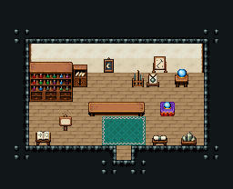

# 마법 상점

마법 도구를 파는 가게. 손님은 청록 러그를 따라 카운터로 가고, 상인은 카운터 뒤에서 물약·두루마리·마법봉을 꺼내 준다. 오른쪽 점술대에서 점을 봐 준다.

크림 벽 12×5칸(무기점과 같은 가게 틀). 뒷벽에 물약 진열장 3×3·두루마리 수납장·달 위상 벽판·별자리 판·마법봉 걸이·부적 진열대·수정구 받침, 카운터 325·326·327(상인 자리 (7,6)) 옆 가격 표지판과 점술대 329, 앞쪽에 펼친 룬 서적·수정 표본 쟁반·봉인 주문 두루마리. 16×13, tilesetId=tibo_interior_expanded. 입구 (8,10), 주인·담당 자리 (7,6). 통행 검사 목표 [[7,8],[7,6],[11,8]].



## 놓은 소품 (저작 순서)
tibo-kit은 tibo_interior_expanded의 structureKits id, tiles는 직접 놓은 번호 행렬, rug는 카펫 오토타일 섬, floor는 바닥 재질 칠. (x,y)는 왼쪽 위.
```json
[
  {
    "kind": "tibo-kit",
    "kitId": "tibo-v4-2-0",
    "name": "물약 진열장",
    "x": 2,
    "y": 4,
    "w": 3,
    "h": 3
  },
  {
    "kind": "tibo-kit",
    "kitId": "tibo-v4-2-2",
    "name": "두루마리 수납장",
    "x": 5,
    "y": 4,
    "w": 1,
    "h": 2
  },
  {
    "kind": "tibo-kit",
    "kitId": "tibo-library-163",
    "name": "달 위상 벽판",
    "x": 7,
    "y": 3,
    "w": 1,
    "h": 2
  },
  {
    "kind": "tibo-kit",
    "kitId": "tibo-library-159",
    "name": "마법봉 걸이",
    "x": 9,
    "y": 4,
    "w": 1,
    "h": 2
  },
  {
    "kind": "tibo-kit",
    "kitId": "tibo-library-167",
    "name": "부적 진열대",
    "x": 10,
    "y": 5,
    "w": 1,
    "h": 1
  },
  {
    "kind": "tibo-kit",
    "kitId": "tibo-fantasy-crystal-stand",
    "name": "수정구 받침",
    "x": 12,
    "y": 4,
    "w": 1,
    "h": 2
  },
  {
    "kind": "tibo-kit",
    "kitId": "tibo-library-164",
    "name": "별자리 판",
    "x": 10,
    "y": 3,
    "w": 2,
    "h": 2
  },
  {
    "kind": "tiles",
    "layer": "upper",
    "x": 6,
    "y": 7,
    "w": 4,
    "h": 1,
    "rows": [
      [
        325,
        326,
        326,
        327
      ]
    ]
  },
  {
    "kind": "tiles",
    "layer": "upper",
    "x": 11,
    "y": 7,
    "w": 1,
    "h": 1,
    "rows": [
      [
        329
      ]
    ]
  },
  {
    "kind": "tibo-kit",
    "kitId": "tibo-library-129",
    "name": "가격 표지판",
    "x": 4,
    "y": 7,
    "w": 1,
    "h": 2
  },
  {
    "kind": "tibo-kit",
    "kitId": "tibo-library-158",
    "name": "펼친 룬 서적",
    "x": 2,
    "y": 9,
    "w": 2,
    "h": 1
  },
  {
    "kind": "tibo-kit",
    "kitId": "tibo-library-165",
    "name": "수정 표본 쟁반",
    "x": 12,
    "y": 9,
    "w": 2,
    "h": 1
  },
  {
    "kind": "tibo-kit",
    "kitId": "tibo-library-160",
    "name": "봉인 주문 두루마리",
    "x": 10,
    "y": 9,
    "w": 2,
    "h": 1
  },
  {
    "kind": "rug",
    "group": "harness-interior-house-v1-terrain-teal-carpet",
    "x": 7,
    "y": 8,
    "w": 3,
    "h": 2
  }
]
```

전체 두 레이어는 다음 배열 문서가 정답이다.
