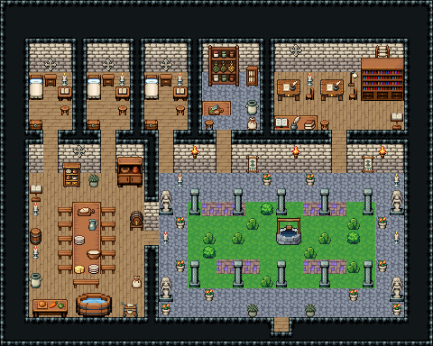

# 수도원 · 회랑과 안뜰

수도사들이 기도하고 일하며 사는 수도원. 남쪽 문으로 들어오면 회랑 — 기둥이 두른 안뜰 한가운데 돌우물에서 물을 긷고, 약초 밭을 돌본다. 회랑 북쪽 문으로 독방·약초 창고·필사실, 서쪽 문으로 긴 식탁의 식당에 간다. 식사 때는 독서대에서 한 사람이 성경을 읽는다.

석벽, 방 일곱을 파이프라인 칸막이로 나눴다: 북쪽 독방 셋(각 3×4, 나무 바닥)·약초 창고 4×4(돌바닥)·필사실 9×4(널 바닥), 남쪽 식당 8×10(널 바닥)과 회랑 17×10(돌바닥 42). 독방: 침대 324/354·협탁·촛대·독서 탁자와 걸상·궤짝, 벽 십자 장식 59. 약초 창고: 약초 건조장 3×3·약초 건조장 1×2·저장 옹기, 나무 상판 위 약초 도마와 걸상·밀가루 포대. 필사실: 필경사 책상 둘과 의자·촛대·독서등, 책장 3×3, 나무 상판 위 펼친 책·잉크와 깃펜·책 더미와 걸상, 독서대, 두루마리 걸이. 식당: 나무 상판 긴 식탁 2×5 양쪽 짧은 벤치 다섯씩과 끝 긴 벤치, 상 위 빵 도마·피처·접시·반죽 그릇·치즈, 낭독 독서대·식기장·찬장·받침대 맥주통·통·옹기·촛대·조리대·물통·음식 운반대·밀가루 포대. 회랑: 잔디 240 안뜰 13×6을 기둥 열(89/119)이 두르고, 한가운데 돌우물(2040~2043), 꽃 자갈 화단 133 넷, 관목 259/351, 벽 횃불·직조 벽걸이, 모퉁이 성인상 넷·촛대·화분. 30×24, tilesetId=tibo_interior_expanded. 입구 (19,22), 주인·담당 자리 (20,7). 통행 검사 목표 [[3,7],[7,7],[11,7],[16,6],[23,7],[8,16],[19,17],[12,16],[26,16]].



## 놓은 소품 (저작 순서)
tibo-kit은 tibo_interior_expanded의 structureKits id, tiles는 직접 놓은 번호 행렬, rug는 카펫 오토타일 섬, floor는 바닥 재질 칠. (x,y)는 왼쪽 위.
```json
[
  {
    "kind": "tiles",
    "layer": "upper",
    "x": 2,
    "y": 5,
    "w": 1,
    "h": 2,
    "rows": [
      [
        324
      ],
      [
        354
      ]
    ],
    "role": "furn"
  },
  {
    "kind": "tibo-kit",
    "kitId": "tibo-library-039",
    "name": "침대 옆 협탁",
    "x": 3,
    "y": 5,
    "w": 1,
    "h": 1,
    "role": "furn"
  },
  {
    "kind": "tiles",
    "layer": "upper",
    "x": 4,
    "y": 5,
    "w": 1,
    "h": 1,
    "rows": [
      [
        204
      ]
    ],
    "role": "furn"
  },
  {
    "kind": "tibo-kit",
    "kitId": "tibo-v4-4-2",
    "name": "독서 탁자",
    "x": 4,
    "y": 6,
    "w": 1,
    "h": 1,
    "role": "table"
  },
  {
    "kind": "tibo-kit",
    "kitId": "tibo-library-030",
    "name": "낮은 걸상",
    "x": 4,
    "y": 7,
    "w": 1,
    "h": 1,
    "role": "seat"
  },
  {
    "kind": "tibo-kit",
    "kitId": "tibo-library-045",
    "name": "여행용 궤짝",
    "x": 2,
    "y": 8,
    "w": 1,
    "h": 1,
    "role": "furn"
  },
  {
    "kind": "tiles",
    "layer": "upper",
    "x": 3,
    "y": 4,
    "w": 1,
    "h": 1,
    "rows": [
      [
        59
      ]
    ],
    "role": "hang"
  },
  {
    "kind": "tiles",
    "layer": "upper",
    "x": 6,
    "y": 5,
    "w": 1,
    "h": 2,
    "rows": [
      [
        324
      ],
      [
        354
      ]
    ],
    "role": "furn"
  },
  {
    "kind": "tibo-kit",
    "kitId": "tibo-library-039",
    "name": "침대 옆 협탁",
    "x": 7,
    "y": 5,
    "w": 1,
    "h": 1,
    "role": "furn"
  },
  {
    "kind": "tiles",
    "layer": "upper",
    "x": 8,
    "y": 5,
    "w": 1,
    "h": 1,
    "rows": [
      [
        204
      ]
    ],
    "role": "furn"
  },
  {
    "kind": "tibo-kit",
    "kitId": "tibo-v4-4-2",
    "name": "독서 탁자",
    "x": 8,
    "y": 6,
    "w": 1,
    "h": 1,
    "role": "table"
  },
  {
    "kind": "tibo-kit",
    "kitId": "tibo-library-030",
    "name": "낮은 걸상",
    "x": 8,
    "y": 7,
    "w": 1,
    "h": 1,
    "role": "seat"
  },
  {
    "kind": "tibo-kit",
    "kitId": "tibo-library-045",
    "name": "여행용 궤짝",
    "x": 6,
    "y": 8,
    "w": 1,
    "h": 1,
    "role": "furn"
  },
  {
    "kind": "tiles",
    "layer": "upper",
    "x": 7,
    "y": 4,
    "w": 1,
    "h": 1,
    "rows": [
      [
        59
      ]
    ],
    "role": "hang"
  },
  {
    "kind": "tiles",
    "layer": "upper",
    "x": 10,
    "y": 5,
    "w": 1,
    "h": 2,
    "rows": [
      [
        324
      ],
      [
        354
      ]
    ],
    "role": "furn"
  },
  {
    "kind": "tibo-kit",
    "kitId": "tibo-library-039",
    "name": "침대 옆 협탁",
    "x": 11,
    "y": 5,
    "w": 1,
    "h": 1,
    "role": "furn"
  },
  {
    "kind": "tiles",
    "layer": "upper",
    "x": 12,
    "y": 5,
    "w": 1,
    "h": 1,
    "rows": [
      [
        204
      ]
    ],
    "role": "furn"
  },
  {
    "kind": "tibo-kit",
    "kitId": "tibo-v4-4-2",
    "name": "독서 탁자",
    "x": 12,
    "y": 6,
    "w": 1,
    "h": 1,
    "role": "table"
  },
  {
    "kind": "tibo-kit",
    "kitId": "tibo-library-030",
    "name": "낮은 걸상",
    "x": 12,
    "y": 7,
    "w": 1,
    "h": 1,
    "role": "seat"
  },
  {
    "kind": "tibo-kit",
    "kitId": "tibo-library-045",
    "name": "여행용 궤짝",
    "x": 10,
    "y": 8,
    "w": 1,
    "h": 1,
    "role": "furn"
  },
  {
    "kind": "tiles",
    "layer": "upper",
    "x": 11,
    "y": 4,
    "w": 1,
    "h": 1,
    "rows": [
      [
        59
      ]
    ],
    "role": "hang"
  },
  {
    "kind": "tibo-kit",
    "kitId": "tibo-medieval-herbal-cabinet",
    "name": "약초 건조장",
    "x": 14,
    "y": 3,
    "w": 3,
    "h": 3,
    "role": "furn"
  },
  {
    "kind": "tibo-kit",
    "kitId": "tibo-library-154",
    "name": "약초 건조장",
    "x": 17,
    "y": 4,
    "w": 1,
    "h": 2,
    "role": "furn"
  },
  {
    "kind": "tibo-kit",
    "kitId": "tibo-library-234",
    "name": "저장 옹기",
    "x": 17,
    "y": 6,
    "w": 1,
    "h": 2,
    "role": "furn"
  },
  {
    "kind": "tabletop",
    "group": "harness-interior-house-v1-terrain-deck",
    "x": 14,
    "y": 7,
    "w": 2,
    "h": 1,
    "role": "tabletop"
  },
  {
    "kind": "tibo-kit",
    "kitId": "tibo-library-146",
    "name": "약초 도마",
    "x": 14,
    "y": 7,
    "w": 2,
    "h": 1,
    "role": "top"
  },
  {
    "kind": "tibo-kit",
    "kitId": "tibo-library-030",
    "name": "낮은 걸상",
    "x": 14,
    "y": 8,
    "w": 1,
    "h": 1,
    "role": "seat"
  },
  {
    "kind": "tibo-kit",
    "kitId": "tibo-library-013",
    "name": "밀가루 포대",
    "x": 17,
    "y": 8,
    "w": 1,
    "h": 1,
    "role": "furn"
  },
  {
    "kind": "tibo-kit",
    "kitId": "tibo-warm-scribe-desk",
    "name": "필경사 책상",
    "x": 19,
    "y": 5,
    "w": 2,
    "h": 2,
    "role": "table"
  },
  {
    "kind": "tiles",
    "layer": "upper",
    "x": 21,
    "y": 6,
    "w": 1,
    "h": 1,
    "rows": [
      [
        298
      ]
    ],
    "role": "seat"
  },
  {
    "kind": "tiles",
    "layer": "upper",
    "x": 21,
    "y": 5,
    "w": 1,
    "h": 1,
    "rows": [
      [
        204
      ]
    ],
    "role": "furn"
  },
  {
    "kind": "tibo-kit",
    "kitId": "tibo-warm-scribe-desk",
    "name": "필경사 책상",
    "x": 22,
    "y": 5,
    "w": 2,
    "h": 2,
    "role": "table"
  },
  {
    "kind": "tiles",
    "layer": "upper",
    "x": 24,
    "y": 6,
    "w": 1,
    "h": 1,
    "rows": [
      [
        298
      ]
    ],
    "role": "seat"
  },
  {
    "kind": "tibo-kit",
    "kitId": "tibo-library-083",
    "name": "독서등",
    "x": 24,
    "y": 4,
    "w": 1,
    "h": 2,
    "role": "furn"
  },
  {
    "kind": "tiles",
    "layer": "lower",
    "x": 25,
    "y": 4,
    "w": 3,
    "h": 3,
    "rows": [
      [
        18,
        19,
        20
      ],
      [
        48,
        49,
        50
      ],
      [
        78,
        79,
        80
      ]
    ],
    "role": "furn"
  },
  {
    "kind": "tibo-kit",
    "kitId": "tibo-lectern",
    "name": "독서대",
    "x": 27,
    "y": 7,
    "w": 1,
    "h": 2,
    "role": "furn"
  },
  {
    "kind": "tabletop",
    "group": "harness-interior-house-v1-terrain-deck",
    "x": 19,
    "y": 8,
    "w": 3,
    "h": 1,
    "role": "tabletop"
  },
  {
    "kind": "tiles",
    "layer": "upper",
    "x": 19,
    "y": 8,
    "w": 1,
    "h": 1,
    "rows": [
      [
        145
      ]
    ],
    "role": "furn"
  },
  {
    "kind": "tibo-kit",
    "kitId": "tibo-library-076",
    "name": "잉크와 깃펜",
    "x": 20,
    "y": 8,
    "w": 1,
    "h": 1,
    "role": "top"
  },
  {
    "kind": "tibo-kit",
    "kitId": "tibo-library-073",
    "name": "덮은 책 더미",
    "x": 21,
    "y": 8,
    "w": 1,
    "h": 1,
    "role": "top"
  },
  {
    "kind": "tibo-kit",
    "kitId": "tibo-library-030",
    "name": "낮은 걸상",
    "x": 22,
    "y": 8,
    "w": 1,
    "h": 1,
    "role": "seat"
  },
  {
    "kind": "tiles",
    "layer": "upper",
    "x": 20,
    "y": 3,
    "w": 1,
    "h": 1,
    "rows": [
      [
        59
      ]
    ],
    "role": "hang"
  },
  {
    "kind": "tibo-kit",
    "kitId": "tibo-library-075",
    "name": "두루마리 걸이",
    "x": 26,
    "y": 3,
    "w": 1,
    "h": 1,
    "role": "hang"
  },
  {
    "kind": "tabletop",
    "group": "harness-interior-house-v1-terrain-deck",
    "x": 5,
    "y": 14,
    "w": 2,
    "h": 5,
    "role": "tabletop"
  },
  {
    "kind": "tibo-kit",
    "kitId": "tibo-library-027",
    "name": "짧은 벤치",
    "x": 4,
    "y": 14,
    "w": 1,
    "h": 1,
    "role": "seat"
  },
  {
    "kind": "tibo-kit",
    "kitId": "tibo-library-027",
    "name": "짧은 벤치",
    "x": 7,
    "y": 14,
    "w": 1,
    "h": 1,
    "role": "seat"
  },
  {
    "kind": "tibo-kit",
    "kitId": "tibo-library-027",
    "name": "짧은 벤치",
    "x": 4,
    "y": 15,
    "w": 1,
    "h": 1,
    "role": "seat"
  },
  {
    "kind": "tibo-kit",
    "kitId": "tibo-library-027",
    "name": "짧은 벤치",
    "x": 7,
    "y": 15,
    "w": 1,
    "h": 1,
    "role": "seat"
  },
  {
    "kind": "tibo-kit",
    "kitId": "tibo-library-027",
    "name": "짧은 벤치",
    "x": 4,
    "y": 16,
    "w": 1,
    "h": 1,
    "role": "seat"
  },
  {
    "kind": "tibo-kit",
    "kitId": "tibo-library-027",
    "name": "짧은 벤치",
    "x": 7,
    "y": 16,
    "w": 1,
    "h": 1,
    "role": "seat"
  },
  {
    "kind": "tibo-kit",
    "kitId": "tibo-library-027",
    "name": "짧은 벤치",
    "x": 4,
    "y": 17,
    "w": 1,
    "h": 1,
    "role": "seat"
  },
  {
    "kind": "tibo-kit",
    "kitId": "tibo-library-027",
    "name": "짧은 벤치",
    "x": 7,
    "y": 17,
    "w": 1,
    "h": 1,
    "role": "seat"
  },
  {
    "kind": "tibo-kit",
    "kitId": "tibo-library-027",
    "name": "짧은 벤치",
    "x": 4,
    "y": 18,
    "w": 1,
    "h": 1,
    "role": "seat"
  },
  {
    "kind": "tibo-kit",
    "kitId": "tibo-library-027",
    "name": "짧은 벤치",
    "x": 7,
    "y": 18,
    "w": 1,
    "h": 1,
    "role": "seat"
  },
  {
    "kind": "tibo-kit",
    "kitId": "tibo-library-001",
    "name": "빵 도마",
    "x": 5,
    "y": 14,
    "w": 2,
    "h": 1,
    "role": "furn"
  },
  {
    "kind": "tibo-kit",
    "kitId": "tibo-library-036",
    "name": "물 피처",
    "x": 6,
    "y": 15,
    "w": 1,
    "h": 1,
    "role": "top"
  },
  {
    "kind": "tibo-kit",
    "kitId": "tibo-library-008",
    "name": "접시 더미",
    "x": 5,
    "y": 16,
    "w": 1,
    "h": 1,
    "role": "top"
  },
  {
    "kind": "tibo-kit",
    "kitId": "tibo-library-004",
    "name": "반죽 그릇",
    "x": 6,
    "y": 17,
    "w": 1,
    "h": 1,
    "role": "top"
  },
  {
    "kind": "tibo-kit",
    "kitId": "tibo-library-020",
    "name": "치즈 덩이",
    "x": 5,
    "y": 18,
    "w": 1,
    "h": 1,
    "role": "top"
  },
  {
    "kind": "tibo-kit",
    "kitId": "tibo-library-008",
    "name": "접시 더미",
    "x": 6,
    "y": 18,
    "w": 1,
    "h": 1,
    "role": "top"
  },
  {
    "kind": "tibo-kit",
    "kitId": "tibo-lectern",
    "name": "독서대",
    "x": 2,
    "y": 12,
    "w": 1,
    "h": 2,
    "role": "furn"
  },
  {
    "kind": "tibo-kit",
    "kitId": "tibo-warm-crockery",
    "name": "따뜻한 목재 식기장",
    "x": 4,
    "y": 11,
    "w": 2,
    "h": 2,
    "role": "furn"
  },
  {
    "kind": "tibo-kit",
    "kitId": "tibo-fantasy-cupboard",
    "name": "찬장",
    "x": 8,
    "y": 10,
    "w": 2,
    "h": 3,
    "role": "furn"
  },
  {
    "kind": "tibo-kit",
    "kitId": "tibo-library-229",
    "name": "뚜껑 둥근 통",
    "x": 2,
    "y": 15,
    "w": 1,
    "h": 2,
    "role": "furn"
  },
  {
    "kind": "tibo-kit",
    "kitId": "tibo-library-234",
    "name": "저장 옹기",
    "x": 2,
    "y": 18,
    "w": 1,
    "h": 2,
    "role": "furn"
  },
  {
    "kind": "tibo-kit",
    "kitId": "tibo-fantasy-prep-table",
    "name": "조리대",
    "x": 2,
    "y": 20,
    "w": 3,
    "h": 2,
    "role": "table"
  },
  {
    "kind": "tibo-kit",
    "kitId": "tibo-library-031",
    "name": "음식 운반대",
    "x": 8,
    "y": 20,
    "w": 2,
    "h": 2,
    "role": "furn"
  },
  {
    "kind": "tibo-kit",
    "kitId": "tibo-library-013",
    "name": "밀가루 포대",
    "x": 9,
    "y": 19,
    "w": 1,
    "h": 1,
    "role": "furn"
  },
  {
    "kind": "tibo-kit",
    "kitId": "tibo-fantasy-water-tub",
    "name": "물통",
    "x": 5,
    "y": 20,
    "w": 3,
    "h": 2,
    "role": "furn"
  },
  {
    "kind": "tibo-kit",
    "kitId": "tibo-library-133",
    "name": "받침대 맥주통",
    "x": 9,
    "y": 14,
    "w": 1,
    "h": 2,
    "role": "furn"
  },
  {
    "kind": "tibo-kit",
    "kitId": "tibo-library-028",
    "name": "긴 벤치",
    "x": 5,
    "y": 19,
    "w": 2,
    "h": 1,
    "role": "seat"
  },
  {
    "kind": "tiles",
    "layer": "upper",
    "x": 2,
    "y": 14,
    "w": 1,
    "h": 1,
    "rows": [
      [
        204
      ]
    ],
    "role": "furn"
  },
  {
    "kind": "tiles",
    "layer": "upper",
    "x": 2,
    "y": 17,
    "w": 1,
    "h": 1,
    "rows": [
      [
        204
      ]
    ],
    "role": "furn"
  },
  {
    "kind": "tibo-kit",
    "kitId": "tibo-library-215",
    "name": "둥근 관목 화분",
    "x": 6,
    "y": 12,
    "w": 1,
    "h": 1,
    "role": "furn"
  },
  {
    "kind": "tiles",
    "layer": "upper",
    "x": 5,
    "y": 10,
    "w": 1,
    "h": 1,
    "rows": [
      [
        59
      ]
    ],
    "role": "hang"
  },
  {
    "kind": "floor",
    "tile": 240,
    "x": 13,
    "y": 14,
    "w": 13,
    "h": 6,
    "role": "floor"
  },
  {
    "kind": "tiles",
    "layer": "upper",
    "x": 19,
    "y": 15,
    "w": 2,
    "h": 2,
    "rows": [
      [
        2040,
        2041
      ],
      [
        2042,
        2043
      ]
    ],
    "role": "furn"
  },
  {
    "kind": "tiles",
    "layer": "lower",
    "x": 14,
    "y": 14,
    "w": 3,
    "h": 1,
    "rows": [
      [
        133,
        133,
        133
      ]
    ],
    "role": "floor"
  },
  {
    "kind": "tiles",
    "layer": "lower",
    "x": 21,
    "y": 14,
    "w": 3,
    "h": 1,
    "rows": [
      [
        133,
        133,
        133
      ]
    ],
    "role": "floor"
  },
  {
    "kind": "tiles",
    "layer": "lower",
    "x": 15,
    "y": 18,
    "w": 3,
    "h": 1,
    "rows": [
      [
        133,
        133,
        133
      ]
    ],
    "role": "floor"
  },
  {
    "kind": "tiles",
    "layer": "lower",
    "x": 21,
    "y": 18,
    "w": 3,
    "h": 1,
    "rows": [
      [
        133,
        133,
        133
      ]
    ],
    "role": "floor"
  },
  {
    "kind": "tiles",
    "layer": "upper",
    "x": 18,
    "y": 14,
    "w": 1,
    "h": 1,
    "rows": [
      [
        351
      ]
    ],
    "role": "furn"
  },
  {
    "kind": "tiles",
    "layer": "upper",
    "x": 24,
    "y": 16,
    "w": 1,
    "h": 1,
    "rows": [
      [
        351
      ]
    ],
    "role": "furn"
  },
  {
    "kind": "tiles",
    "layer": "upper",
    "x": 14,
    "y": 17,
    "w": 1,
    "h": 1,
    "rows": [
      [
        351
      ]
    ],
    "role": "furn"
  },
  {
    "kind": "tiles",
    "layer": "upper",
    "x": 24,
    "y": 15,
    "w": 1,
    "h": 1,
    "rows": [
      [
        259
      ]
    ],
    "role": "furn"
  },
  {
    "kind": "tiles",
    "layer": "upper",
    "x": 14,
    "y": 16,
    "w": 1,
    "h": 1,
    "rows": [
      [
        259
      ]
    ],
    "role": "furn"
  },
  {
    "kind": "tiles",
    "layer": "upper",
    "x": 18,
    "y": 19,
    "w": 1,
    "h": 1,
    "rows": [
      [
        259
      ]
    ],
    "role": "furn"
  },
  {
    "kind": "tiles",
    "layer": "upper",
    "x": 24,
    "y": 18,
    "w": 1,
    "h": 1,
    "rows": [
      [
        259
      ]
    ],
    "role": "furn"
  },
  {
    "kind": "tiles",
    "layer": "upper",
    "x": 13,
    "y": 13,
    "w": 1,
    "h": 2,
    "rows": [
      [
        89
      ],
      [
        119
      ]
    ],
    "role": "furn"
  },
  {
    "kind": "tiles",
    "layer": "upper",
    "x": 13,
    "y": 18,
    "w": 1,
    "h": 2,
    "rows": [
      [
        89
      ],
      [
        119
      ]
    ],
    "role": "furn"
  },
  {
    "kind": "tiles",
    "layer": "upper",
    "x": 16,
    "y": 13,
    "w": 1,
    "h": 2,
    "rows": [
      [
        89
      ],
      [
        119
      ]
    ],
    "role": "furn"
  },
  {
    "kind": "tiles",
    "layer": "upper",
    "x": 16,
    "y": 18,
    "w": 1,
    "h": 2,
    "rows": [
      [
        89
      ],
      [
        119
      ]
    ],
    "role": "furn"
  },
  {
    "kind": "tiles",
    "layer": "upper",
    "x": 19,
    "y": 13,
    "w": 1,
    "h": 2,
    "rows": [
      [
        89
      ],
      [
        119
      ]
    ],
    "role": "furn"
  },
  {
    "kind": "tiles",
    "layer": "upper",
    "x": 19,
    "y": 18,
    "w": 1,
    "h": 2,
    "rows": [
      [
        89
      ],
      [
        119
      ]
    ],
    "role": "furn"
  },
  {
    "kind": "tiles",
    "layer": "upper",
    "x": 22,
    "y": 13,
    "w": 1,
    "h": 2,
    "rows": [
      [
        89
      ],
      [
        119
      ]
    ],
    "role": "furn"
  },
  {
    "kind": "tiles",
    "layer": "upper",
    "x": 22,
    "y": 18,
    "w": 1,
    "h": 2,
    "rows": [
      [
        89
      ],
      [
        119
      ]
    ],
    "role": "furn"
  },
  {
    "kind": "tiles",
    "layer": "upper",
    "x": 25,
    "y": 13,
    "w": 1,
    "h": 2,
    "rows": [
      [
        89
      ],
      [
        119
      ]
    ],
    "role": "furn"
  },
  {
    "kind": "tiles",
    "layer": "upper",
    "x": 25,
    "y": 18,
    "w": 1,
    "h": 2,
    "rows": [
      [
        89
      ],
      [
        119
      ]
    ],
    "role": "furn"
  },
  {
    "kind": "tiles",
    "layer": "upper",
    "x": 13,
    "y": 10,
    "w": 1,
    "h": 1,
    "rows": [
      [
        24
      ]
    ],
    "role": "hang"
  },
  {
    "kind": "tiles",
    "layer": "upper",
    "x": 20,
    "y": 10,
    "w": 1,
    "h": 1,
    "rows": [
      [
        24
      ]
    ],
    "role": "hang"
  },
  {
    "kind": "tiles",
    "layer": "upper",
    "x": 26,
    "y": 10,
    "w": 1,
    "h": 1,
    "rows": [
      [
        24
      ]
    ],
    "role": "hang"
  },
  {
    "kind": "tibo-kit",
    "kitId": "tibo-library-220",
    "name": "직조 벽걸이",
    "x": 17,
    "y": 10,
    "w": 1,
    "h": 2,
    "role": "hang"
  },
  {
    "kind": "tibo-kit",
    "kitId": "tibo-library-220",
    "name": "직조 벽걸이",
    "x": 25,
    "y": 10,
    "w": 1,
    "h": 2,
    "role": "hang"
  },
  {
    "kind": "tiles",
    "layer": "upper",
    "x": 11,
    "y": 19,
    "w": 1,
    "h": 2,
    "rows": [
      [
        88
      ],
      [
        118
      ]
    ],
    "role": "furn"
  },
  {
    "kind": "tiles",
    "layer": "upper",
    "x": 27,
    "y": 19,
    "w": 1,
    "h": 2,
    "rows": [
      [
        88
      ],
      [
        118
      ]
    ],
    "role": "furn"
  },
  {
    "kind": "tiles",
    "layer": "upper",
    "x": 11,
    "y": 13,
    "w": 1,
    "h": 2,
    "rows": [
      [
        88
      ],
      [
        118
      ]
    ],
    "role": "furn"
  },
  {
    "kind": "tiles",
    "layer": "upper",
    "x": 27,
    "y": 13,
    "w": 1,
    "h": 2,
    "rows": [
      [
        88
      ],
      [
        118
      ]
    ],
    "role": "furn"
  },
  {
    "kind": "tiles",
    "layer": "upper",
    "x": 11,
    "y": 21,
    "w": 1,
    "h": 1,
    "rows": [
      [
        288
      ]
    ],
    "role": "furn"
  },
  {
    "kind": "tiles",
    "layer": "upper",
    "x": 27,
    "y": 21,
    "w": 1,
    "h": 1,
    "rows": [
      [
        288
      ]
    ],
    "role": "furn"
  },
  {
    "kind": "tibo-kit",
    "kitId": "tibo-library-215",
    "name": "둥근 관목 화분",
    "x": 17,
    "y": 21,
    "w": 1,
    "h": 1,
    "role": "furn"
  },
  {
    "kind": "tibo-kit",
    "kitId": "tibo-library-215",
    "name": "둥근 관목 화분",
    "x": 21,
    "y": 21,
    "w": 1,
    "h": 1,
    "role": "furn"
  },
  {
    "kind": "tiles",
    "layer": "upper",
    "x": 12,
    "y": 12,
    "w": 1,
    "h": 1,
    "rows": [
      [
        204
      ]
    ],
    "role": "furn"
  },
  {
    "kind": "tiles",
    "layer": "upper",
    "x": 27,
    "y": 12,
    "w": 1,
    "h": 1,
    "rows": [
      [
        204
      ]
    ],
    "role": "furn"
  },
  {
    "kind": "tiles",
    "layer": "upper",
    "x": 11,
    "y": 16,
    "w": 1,
    "h": 1,
    "rows": [
      [
        204
      ]
    ],
    "role": "furn"
  },
  {
    "kind": "tiles",
    "layer": "upper",
    "x": 27,
    "y": 16,
    "w": 1,
    "h": 1,
    "rows": [
      [
        204
      ]
    ],
    "role": "furn"
  },
  {
    "kind": "tiles",
    "layer": "upper",
    "x": 18,
    "y": 12,
    "w": 1,
    "h": 1,
    "rows": [
      [
        288
      ]
    ],
    "role": "furn"
  },
  {
    "kind": "tiles",
    "layer": "upper",
    "x": 21,
    "y": 12,
    "w": 1,
    "h": 1,
    "rows": [
      [
        288
      ]
    ],
    "role": "furn"
  },
  {
    "kind": "tiles",
    "layer": "upper",
    "x": 14,
    "y": 20,
    "w": 1,
    "h": 1,
    "rows": [
      [
        288
      ]
    ],
    "role": "furn"
  },
  {
    "kind": "tiles",
    "layer": "upper",
    "x": 24,
    "y": 20,
    "w": 1,
    "h": 1,
    "rows": [
      [
        288
      ]
    ],
    "role": "furn"
  },
  {
    "kind": "tiles",
    "layer": "upper",
    "x": 12,
    "y": 15,
    "w": 1,
    "h": 1,
    "rows": [
      [
        288
      ]
    ],
    "role": "furn"
  },
  {
    "kind": "tiles",
    "layer": "upper",
    "x": 26,
    "y": 15,
    "w": 1,
    "h": 1,
    "rows": [
      [
        288
      ]
    ],
    "role": "furn"
  },
  {
    "kind": "tiles",
    "layer": "upper",
    "x": 12,
    "y": 18,
    "w": 1,
    "h": 1,
    "rows": [
      [
        288
      ]
    ],
    "role": "furn"
  },
  {
    "kind": "tiles",
    "layer": "upper",
    "x": 26,
    "y": 18,
    "w": 1,
    "h": 1,
    "rows": [
      [
        288
      ]
    ],
    "role": "furn"
  },
  {
    "kind": "tiles",
    "layer": "upper",
    "x": 16,
    "y": 16,
    "w": 1,
    "h": 1,
    "rows": [
      [
        259
      ]
    ],
    "role": "furn"
  },
  {
    "kind": "tiles",
    "layer": "upper",
    "x": 22,
    "y": 16,
    "w": 1,
    "h": 1,
    "rows": [
      [
        259
      ]
    ],
    "role": "furn"
  },
  {
    "kind": "tiles",
    "layer": "upper",
    "x": 17,
    "y": 15,
    "w": 1,
    "h": 1,
    "rows": [
      [
        259
      ]
    ],
    "role": "furn"
  },
  {
    "kind": "tiles",
    "layer": "upper",
    "x": 21,
    "y": 17,
    "w": 1,
    "h": 1,
    "rows": [
      [
        259
      ]
    ],
    "role": "furn"
  }
]
```

전체 두 레이어는 다음 배열 문서가 정답이다.
