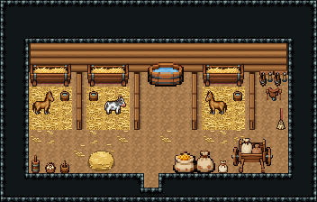

# 목장 · 마구간 헛간

목장 일꾼이 말과 소를 돌보는 헛간. 북벽 먹이통마다 판자 칸막이로 나눈 마구간 셋에 말·젖소·말이 짚을 밟고 서 있고, 가운데 통로의 물통에서 물을 떠 칸마다 양동이를 채운다. 동쪽 마구 걸이 앞 받침대에서 안장을 챙겨 말을 내고, 남쪽 건초 더미로 먹이통을 채우며 곡식 자루는 손수레로 나른다. 왼쪽 앞은 우유를 휘젓고 달걀을 모으는 자리.

통나무 벽 1980~1985·흙바닥 192, 18×7칸. 북벽 마구간 먹이통 3×2 셋(x=2·6·14) 앞마다 짚 깔린 흙바닥 2010~2012 3×3과 들쭉날쭉 흘러나온 짚 2013~2015, 칸 사이·양끝 판자 칸막이 2016/2017/2017/2018(x=5·9·13·17, y=5~8). 칸마다 가축 2×2(말 2023~ · 젖소 2031~ · 왼쪽 보는 말 2027~, EasyRPG 동물 그림)과 물 양동이. 가운데 통로 물통 3×2, 동쪽 마구 걸이 둘 앞 안장 받침대와 기댄 빗자루, 남쪽 건초 더미 2×2(2019~)·곡식 자루 3×2·밀가루 포대·목제 손수레 3×3, 왼쪽 앞 버터 교반통·달걀 바구니·막대 양동이. 22×14, tilesetId=tibo_interior_expanded. 입구 (10,12). 통행 검사 목표 [[4,8],[6,8],[16,8],[11,6],[18,7],[3,10],[14,9]].



## 놓은 소품 (저작 순서)
tibo-kit은 tibo_interior_expanded의 structureKits id, tiles는 직접 놓은 번호 행렬, rug는 카펫 오토타일 섬, floor는 바닥 재질 칠. (x,y)는 왼쪽 위.
```json
[
  {
    "kind": "tibo-kit",
    "kitId": "tibo-medieval-hay-trough",
    "name": "마구간 먹이통",
    "x": 2,
    "y": 4,
    "w": 3,
    "h": 2,
    "role": "furn"
  },
  {
    "kind": "tibo-kit",
    "kitId": "tibo-medieval-hay-trough",
    "name": "마구간 먹이통",
    "x": 6,
    "y": 4,
    "w": 3,
    "h": 2,
    "role": "furn"
  },
  {
    "kind": "tibo-kit",
    "kitId": "tibo-medieval-hay-trough",
    "name": "마구간 먹이통",
    "x": 14,
    "y": 4,
    "w": 3,
    "h": 2,
    "role": "furn"
  },
  {
    "kind": "tiles",
    "layer": "upper",
    "x": 5,
    "y": 5,
    "w": 1,
    "h": 4,
    "rows": [
      [
        2016
      ],
      [
        2017
      ],
      [
        2017
      ],
      [
        2018
      ]
    ],
    "role": "furn"
  },
  {
    "kind": "tiles",
    "layer": "upper",
    "x": 9,
    "y": 5,
    "w": 1,
    "h": 4,
    "rows": [
      [
        2016
      ],
      [
        2017
      ],
      [
        2017
      ],
      [
        2018
      ]
    ],
    "role": "furn"
  },
  {
    "kind": "tiles",
    "layer": "upper",
    "x": 13,
    "y": 5,
    "w": 1,
    "h": 4,
    "rows": [
      [
        2016
      ],
      [
        2017
      ],
      [
        2017
      ],
      [
        2018
      ]
    ],
    "role": "furn"
  },
  {
    "kind": "tiles",
    "layer": "upper",
    "x": 17,
    "y": 5,
    "w": 1,
    "h": 4,
    "rows": [
      [
        2016
      ],
      [
        2017
      ],
      [
        2017
      ],
      [
        2018
      ]
    ],
    "role": "furn"
  },
  {
    "kind": "tiles",
    "layer": "upper",
    "x": 2,
    "y": 6,
    "w": 2,
    "h": 2,
    "rows": [
      [
        2023,
        2024
      ],
      [
        2025,
        2026
      ]
    ],
    "role": "furn"
  },
  {
    "kind": "tiles",
    "layer": "upper",
    "x": 7,
    "y": 6,
    "w": 2,
    "h": 2,
    "rows": [
      [
        2031,
        2032
      ],
      [
        2033,
        2034
      ]
    ],
    "role": "furn"
  },
  {
    "kind": "tiles",
    "layer": "upper",
    "x": 14,
    "y": 6,
    "w": 2,
    "h": 2,
    "rows": [
      [
        2027,
        2028
      ],
      [
        2029,
        2030
      ]
    ],
    "role": "furn"
  },
  {
    "kind": "tibo-kit",
    "kitId": "tibo-v6-1-1",
    "name": "물 양동이",
    "x": 4,
    "y": 6,
    "w": 1,
    "h": 1,
    "role": "furn"
  },
  {
    "kind": "tibo-kit",
    "kitId": "tibo-v6-1-1",
    "name": "물 양동이",
    "x": 6,
    "y": 6,
    "w": 1,
    "h": 1,
    "role": "furn"
  },
  {
    "kind": "tibo-kit",
    "kitId": "tibo-v6-1-1",
    "name": "물 양동이",
    "x": 16,
    "y": 6,
    "w": 1,
    "h": 1,
    "role": "furn"
  },
  {
    "kind": "tibo-kit",
    "kitId": "tibo-fantasy-water-tub",
    "name": "물통",
    "x": 10,
    "y": 4,
    "w": 3,
    "h": 2,
    "role": "furn"
  },
  {
    "kind": "tibo-kit",
    "kitId": "tibo-library-204",
    "name": "마구 걸이",
    "x": 18,
    "y": 4,
    "w": 1,
    "h": 2,
    "role": "furn"
  },
  {
    "kind": "tibo-kit",
    "kitId": "tibo-library-204",
    "name": "마구 걸이",
    "x": 19,
    "y": 4,
    "w": 1,
    "h": 2,
    "role": "furn"
  },
  {
    "kind": "tibo-kit",
    "kitId": "tibo-library-203",
    "name": "안장 받침대",
    "x": 18,
    "y": 6,
    "w": 2,
    "h": 1,
    "role": "furn"
  },
  {
    "kind": "tibo-kit",
    "kitId": "tibo-library-061",
    "name": "기댄 빗자루",
    "x": 19,
    "y": 7,
    "w": 1,
    "h": 2,
    "role": "furn"
  },
  {
    "kind": "tiles",
    "layer": "upper",
    "x": 6,
    "y": 10,
    "w": 2,
    "h": 2,
    "rows": [
      [
        2019,
        2020
      ],
      [
        2021,
        2022
      ]
    ],
    "role": "furn"
  },
  {
    "kind": "tibo-kit",
    "kitId": "tibo-fantasy-grain-sacks",
    "name": "식재료 자루",
    "x": 12,
    "y": 10,
    "w": 3,
    "h": 2,
    "role": "furn"
  },
  {
    "kind": "tibo-kit",
    "kitId": "tibo-library-013",
    "name": "밀가루 포대",
    "x": 15,
    "y": 11,
    "w": 1,
    "h": 1,
    "role": "furn"
  },
  {
    "kind": "tibo-kit",
    "kitId": "tibo-medieval-handcart",
    "name": "목제 손수레",
    "x": 16,
    "y": 9,
    "w": 3,
    "h": 3,
    "role": "furn"
  },
  {
    "kind": "tibo-kit",
    "kitId": "tibo-butter-churn",
    "name": "버터 교반통",
    "x": 2,
    "y": 10,
    "w": 1,
    "h": 2,
    "role": "furn"
  },
  {
    "kind": "tibo-kit",
    "kitId": "tibo-library-023",
    "name": "달걀 바구니",
    "x": 3,
    "y": 11,
    "w": 1,
    "h": 1,
    "role": "furn"
  },
  {
    "kind": "tibo-kit",
    "kitId": "tibo-v6-2-1",
    "name": "막대 양동이",
    "x": 4,
    "y": 11,
    "w": 1,
    "h": 1,
    "role": "furn"
  }
]
```

전체 두 레이어는 다음 배열 문서가 정답이다.
