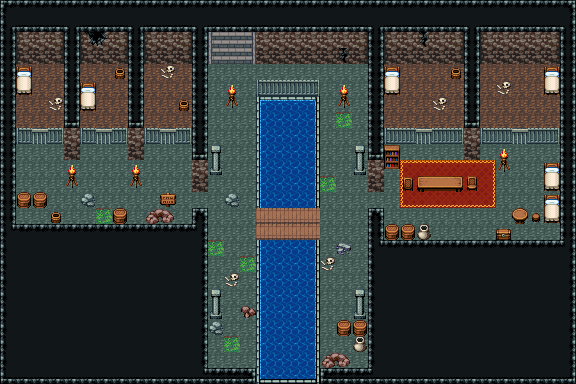

# 지하 하수 감옥

성 아래 하수도에 딸린 감옥. 위층에서 돌계단으로 내려오면 창살 친 수문 앞, 가운데 하수 물길을 따라 양쪽 둑길이 남쪽으로 흘러 나간다. 서쪽 샛길로 가면 감방 셋, 동쪽 샛길로 가면 감방 둘과 간수가 먹고 자는 간수실. 죄수는 창살 뒤에 갇혀 있다(감방 안은 일부러 못 들어간다).

던전 칩셋(oprn_dungeon_stone), 「무너진 납골당」과 같은 벽 조립(공허 테두리 + 갈색 벽면 두 줄 21~23/51~53 + 회녹색 돌바닥 187). 물길 3(4칸 폭, 남쪽 끝으로 흘러 나감) 위 판자 다리 141, 북쪽 수문 창살 234|235|235|236과 벽 균열, 둑길 석주 446/476 넷·화로 263/293 둘. 서쪽 감방 셋(3칸 폭, 공허 기둥으로 나눔)·동쪽 감방 둘(5칸 폭)은 창살 234·235·236 한 줄에 가운데 205가 감방 문, 안에 침상 384/414·해골과 뼈 299·물통 419. 감방 바닥은 흙 오토타일. 간수실: 붉은 깔개 위 긴 탁자 385~387과 양쪽 의자 327/328, 침대 둘, 둥근 탁자 326과 걸상 356, 압수품 상자(Tibo 이식 480), 나무통·항아리·책장 329/359·화로. 둑길 이끼 394·자갈 382·잔돌 383/412·돌무더기 259/260. 36×24, tilesetId=oprn_dungeon_stone. 입구 (14,4), 주인·담당 자리 (28,13). 통행 검사 목표 [[2,9],[6,9],[10,9],[26,9],[32,9],[28,13],[14,20],[21,12]].



## 놓은 소품 (저작 순서)
tibo-kit은 tibo_interior_expanded의 structureKits id, tiles는 직접 놓은 번호 행렬, rug는 카펫 오토타일 섬, floor는 바닥 재질 칠. (x,y)는 왼쪽 위. 던전 맵은 prop(조각 이름)·tiles(번호 행렬, 왼쪽 위 기준)로 적었다.
```json
[
  {
    "prop": "오르는 돌계단(벽면)",
    "x": 13,
    "y": 2,
    "w": 3,
    "h": 2,
    "layer": "lower",
    "tiles": [
      [
        483,
        484,
        485
      ],
      [
        483,
        484,
        485
      ]
    ]
  },
  {
    "prop": "쇠창살 왼끝",
    "x": 16,
    "y": 5,
    "w": 1,
    "h": 1,
    "layer": "upper",
    "tiles": [
      [
        234
      ]
    ]
  },
  {
    "prop": "쇠창살",
    "x": 17,
    "y": 5,
    "w": 1,
    "h": 1,
    "layer": "upper",
    "tiles": [
      [
        235
      ]
    ]
  },
  {
    "prop": "쇠창살",
    "x": 18,
    "y": 5,
    "w": 1,
    "h": 1,
    "layer": "upper",
    "tiles": [
      [
        235
      ]
    ]
  },
  {
    "prop": "쇠창살 오른끝",
    "x": 19,
    "y": 5,
    "w": 1,
    "h": 1,
    "layer": "upper",
    "tiles": [
      [
        236
      ]
    ]
  },
  {
    "prop": "벽 균열",
    "x": 21,
    "y": 3,
    "w": 1,
    "h": 1,
    "layer": "upper",
    "tiles": [
      [
        267
      ]
    ]
  },
  {
    "prop": "화로",
    "x": 14,
    "y": 5,
    "w": 1,
    "h": 2,
    "layer": "upper",
    "tiles": [
      [
        263
      ],
      [
        293
      ]
    ]
  },
  {
    "prop": "화로",
    "x": 21,
    "y": 5,
    "w": 1,
    "h": 2,
    "layer": "upper",
    "tiles": [
      [
        263
      ],
      [
        293
      ]
    ]
  },
  {
    "prop": "석주",
    "x": 13,
    "y": 9,
    "w": 1,
    "h": 2,
    "layer": "upper",
    "tiles": [
      [
        446
      ],
      [
        476
      ]
    ]
  },
  {
    "prop": "석주",
    "x": 22,
    "y": 9,
    "w": 1,
    "h": 2,
    "layer": "upper",
    "tiles": [
      [
        446
      ],
      [
        476
      ]
    ]
  },
  {
    "prop": "석주",
    "x": 13,
    "y": 18,
    "w": 1,
    "h": 2,
    "layer": "upper",
    "tiles": [
      [
        446
      ],
      [
        476
      ]
    ]
  },
  {
    "prop": "석주",
    "x": 22,
    "y": 18,
    "w": 1,
    "h": 2,
    "layer": "upper",
    "tiles": [
      [
        446
      ],
      [
        476
      ]
    ]
  },
  {
    "prop": "나무통",
    "x": 21,
    "y": 20,
    "w": 1,
    "h": 1,
    "layer": "upper",
    "tiles": [
      [
        417
      ]
    ]
  },
  {
    "prop": "나무통",
    "x": 22,
    "y": 20,
    "w": 1,
    "h": 1,
    "layer": "upper",
    "tiles": [
      [
        417
      ]
    ]
  },
  {
    "prop": "항아리",
    "x": 22,
    "y": 21,
    "w": 1,
    "h": 1,
    "layer": "upper",
    "tiles": [
      [
        418
      ]
    ]
  },
  {
    "prop": "이끼",
    "x": 14,
    "y": 21,
    "w": 1,
    "h": 1,
    "layer": "upper",
    "tiles": [
      [
        394
      ]
    ]
  },
  {
    "prop": "해골과 뼈",
    "x": 20,
    "y": 16,
    "w": 1,
    "h": 1,
    "layer": "upper",
    "tiles": [
      [
        299
      ]
    ]
  },
  {
    "prop": "쇠창살 왼끝",
    "x": 1,
    "y": 8,
    "w": 1,
    "h": 1,
    "layer": "upper",
    "tiles": [
      [
        234
      ]
    ]
  },
  {
    "prop": "창살 문",
    "x": 2,
    "y": 8,
    "w": 1,
    "h": 1,
    "layer": "upper",
    "tiles": [
      [
        205
      ]
    ]
  },
  {
    "prop": "쇠창살 오른끝",
    "x": 3,
    "y": 8,
    "w": 1,
    "h": 1,
    "layer": "upper",
    "tiles": [
      [
        236
      ]
    ]
  },
  {
    "prop": "쇠창살 왼끝",
    "x": 5,
    "y": 8,
    "w": 1,
    "h": 1,
    "layer": "upper",
    "tiles": [
      [
        234
      ]
    ]
  },
  {
    "prop": "창살 문",
    "x": 6,
    "y": 8,
    "w": 1,
    "h": 1,
    "layer": "upper",
    "tiles": [
      [
        205
      ]
    ]
  },
  {
    "prop": "쇠창살 오른끝",
    "x": 7,
    "y": 8,
    "w": 1,
    "h": 1,
    "layer": "upper",
    "tiles": [
      [
        236
      ]
    ]
  },
  {
    "prop": "쇠창살 왼끝",
    "x": 9,
    "y": 8,
    "w": 1,
    "h": 1,
    "layer": "upper",
    "tiles": [
      [
        234
      ]
    ]
  },
  {
    "prop": "창살 문",
    "x": 10,
    "y": 8,
    "w": 1,
    "h": 1,
    "layer": "upper",
    "tiles": [
      [
        205
      ]
    ]
  },
  {
    "prop": "쇠창살 오른끝",
    "x": 11,
    "y": 8,
    "w": 1,
    "h": 1,
    "layer": "upper",
    "tiles": [
      [
        236
      ]
    ]
  },
  {
    "prop": "침대",
    "x": 1,
    "y": 4,
    "w": 1,
    "h": 2,
    "layer": "upper",
    "tiles": [
      [
        384
      ],
      [
        414
      ]
    ]
  },
  {
    "prop": "해골과 뼈",
    "x": 3,
    "y": 6,
    "w": 1,
    "h": 1,
    "layer": "upper",
    "tiles": [
      [
        299
      ]
    ]
  },
  {
    "prop": "물통",
    "x": 7,
    "y": 4,
    "w": 1,
    "h": 1,
    "layer": "upper",
    "tiles": [
      [
        419
      ]
    ]
  },
  {
    "prop": "침대",
    "x": 5,
    "y": 5,
    "w": 1,
    "h": 2,
    "layer": "upper",
    "tiles": [
      [
        384
      ],
      [
        414
      ]
    ]
  },
  {
    "prop": "해골과 뼈",
    "x": 10,
    "y": 4,
    "w": 1,
    "h": 1,
    "layer": "upper",
    "tiles": [
      [
        299
      ]
    ]
  },
  {
    "prop": "물통",
    "x": 11,
    "y": 6,
    "w": 1,
    "h": 1,
    "layer": "upper",
    "tiles": [
      [
        419
      ]
    ]
  },
  {
    "prop": "벽 균열 큰",
    "x": 5,
    "y": 2,
    "w": 2,
    "h": 1,
    "layer": "upper",
    "tiles": [
      [
        268,
        269
      ]
    ]
  },
  {
    "prop": "화로",
    "x": 4,
    "y": 10,
    "w": 1,
    "h": 2,
    "layer": "upper",
    "tiles": [
      [
        263
      ],
      [
        293
      ]
    ]
  },
  {
    "prop": "화로",
    "x": 8,
    "y": 10,
    "w": 1,
    "h": 2,
    "layer": "upper",
    "tiles": [
      [
        263
      ],
      [
        293
      ]
    ]
  },
  {
    "prop": "나무통",
    "x": 1,
    "y": 12,
    "w": 1,
    "h": 1,
    "layer": "upper",
    "tiles": [
      [
        417
      ]
    ]
  },
  {
    "prop": "나무통",
    "x": 2,
    "y": 12,
    "w": 1,
    "h": 1,
    "layer": "upper",
    "tiles": [
      [
        417
      ]
    ]
  },
  {
    "prop": "물통",
    "x": 3,
    "y": 13,
    "w": 1,
    "h": 1,
    "layer": "upper",
    "tiles": [
      [
        419
      ]
    ]
  },
  {
    "prop": "표지판",
    "x": 10,
    "y": 12,
    "w": 1,
    "h": 1,
    "layer": "upper",
    "tiles": [
      [
        298
      ]
    ]
  },
  {
    "prop": "이끼",
    "x": 6,
    "y": 13,
    "w": 1,
    "h": 1,
    "layer": "upper",
    "tiles": [
      [
        394
      ]
    ]
  },
  {
    "prop": "쇠창살 왼끝",
    "x": 24,
    "y": 8,
    "w": 1,
    "h": 1,
    "layer": "upper",
    "tiles": [
      [
        234
      ]
    ]
  },
  {
    "prop": "쇠창살",
    "x": 25,
    "y": 8,
    "w": 1,
    "h": 1,
    "layer": "upper",
    "tiles": [
      [
        235
      ]
    ]
  },
  {
    "prop": "창살 문",
    "x": 26,
    "y": 8,
    "w": 1,
    "h": 1,
    "layer": "upper",
    "tiles": [
      [
        205
      ]
    ]
  },
  {
    "prop": "쇠창살",
    "x": 27,
    "y": 8,
    "w": 1,
    "h": 1,
    "layer": "upper",
    "tiles": [
      [
        235
      ]
    ]
  },
  {
    "prop": "쇠창살 오른끝",
    "x": 28,
    "y": 8,
    "w": 1,
    "h": 1,
    "layer": "upper",
    "tiles": [
      [
        236
      ]
    ]
  },
  {
    "prop": "쇠창살 왼끝",
    "x": 30,
    "y": 8,
    "w": 1,
    "h": 1,
    "layer": "upper",
    "tiles": [
      [
        234
      ]
    ]
  },
  {
    "prop": "쇠창살",
    "x": 31,
    "y": 8,
    "w": 1,
    "h": 1,
    "layer": "upper",
    "tiles": [
      [
        235
      ]
    ]
  },
  {
    "prop": "창살 문",
    "x": 32,
    "y": 8,
    "w": 1,
    "h": 1,
    "layer": "upper",
    "tiles": [
      [
        205
      ]
    ]
  },
  {
    "prop": "쇠창살",
    "x": 33,
    "y": 8,
    "w": 1,
    "h": 1,
    "layer": "upper",
    "tiles": [
      [
        235
      ]
    ]
  },
  {
    "prop": "쇠창살 오른끝",
    "x": 34,
    "y": 8,
    "w": 1,
    "h": 1,
    "layer": "upper",
    "tiles": [
      [
        236
      ]
    ]
  },
  {
    "prop": "침대",
    "x": 24,
    "y": 4,
    "w": 1,
    "h": 2,
    "layer": "upper",
    "tiles": [
      [
        384
      ],
      [
        414
      ]
    ]
  },
  {
    "prop": "해골과 뼈",
    "x": 27,
    "y": 6,
    "w": 1,
    "h": 1,
    "layer": "upper",
    "tiles": [
      [
        299
      ]
    ]
  },
  {
    "prop": "물통",
    "x": 28,
    "y": 4,
    "w": 1,
    "h": 1,
    "layer": "upper",
    "tiles": [
      [
        419
      ]
    ]
  },
  {
    "prop": "침대",
    "x": 34,
    "y": 4,
    "w": 1,
    "h": 2,
    "layer": "upper",
    "tiles": [
      [
        384
      ],
      [
        414
      ]
    ]
  },
  {
    "prop": "해골과 뼈",
    "x": 31,
    "y": 5,
    "w": 1,
    "h": 1,
    "layer": "upper",
    "tiles": [
      [
        299
      ]
    ]
  },
  {
    "prop": "벽 균열",
    "x": 26,
    "y": 2,
    "w": 1,
    "h": 1,
    "layer": "upper",
    "tiles": [
      [
        267
      ]
    ]
  },
  {
    "prop": "긴 탁자",
    "x": 26,
    "y": 11,
    "w": 3,
    "h": 1,
    "layer": "upper",
    "tiles": [
      [
        385,
        386,
        387
      ]
    ]
  },
  {
    "prop": "의자(오른쪽 보기)",
    "x": 25,
    "y": 11,
    "w": 1,
    "h": 1,
    "layer": "upper",
    "tiles": [
      [
        328
      ]
    ]
  },
  {
    "prop": "의자(왼쪽 보기)",
    "x": 29,
    "y": 11,
    "w": 1,
    "h": 1,
    "layer": "upper",
    "tiles": [
      [
        327
      ]
    ]
  },
  {
    "prop": "침대",
    "x": 34,
    "y": 10,
    "w": 1,
    "h": 2,
    "layer": "upper",
    "tiles": [
      [
        384
      ],
      [
        414
      ]
    ]
  },
  {
    "prop": "침대",
    "x": 34,
    "y": 12,
    "w": 1,
    "h": 2,
    "layer": "upper",
    "tiles": [
      [
        384
      ],
      [
        414
      ]
    ]
  },
  {
    "prop": "둥근 탁자",
    "x": 32,
    "y": 13,
    "w": 1,
    "h": 1,
    "layer": "upper",
    "tiles": [
      [
        326
      ]
    ]
  },
  {
    "prop": "걸상",
    "x": 33,
    "y": 13,
    "w": 1,
    "h": 1,
    "layer": "upper",
    "tiles": [
      [
        356
      ]
    ]
  },
  {
    "prop": "보물상자",
    "x": 31,
    "y": 14,
    "w": 1,
    "h": 1,
    "layer": "upper",
    "tiles": [
      [
        480
      ]
    ]
  },
  {
    "prop": "나무통",
    "x": 24,
    "y": 14,
    "w": 1,
    "h": 1,
    "layer": "upper",
    "tiles": [
      [
        417
      ]
    ]
  },
  {
    "prop": "나무통",
    "x": 25,
    "y": 14,
    "w": 1,
    "h": 1,
    "layer": "upper",
    "tiles": [
      [
        417
      ]
    ]
  },
  {
    "prop": "책장",
    "x": 24,
    "y": 9,
    "w": 1,
    "h": 2,
    "layer": "upper",
    "tiles": [
      [
        329
      ],
      [
        359
      ]
    ]
  },
  {
    "prop": "화로",
    "x": 31,
    "y": 9,
    "w": 1,
    "h": 2,
    "layer": "upper",
    "tiles": [
      [
        263
      ],
      [
        293
      ]
    ]
  },
  {
    "prop": "항아리",
    "x": 26,
    "y": 14,
    "w": 1,
    "h": 1,
    "layer": "upper",
    "tiles": [
      [
        418
      ]
    ]
  },
  {
    "prop": "돌무더기",
    "x": 9,
    "y": 13,
    "w": 2,
    "h": 1,
    "layer": "upper",
    "tiles": [
      [
        259,
        260
      ]
    ]
  },
  {
    "prop": "회색 자갈",
    "x": 5,
    "y": 12,
    "w": 1,
    "h": 1,
    "layer": "upper",
    "tiles": [
      [
        382
      ]
    ]
  },
  {
    "prop": "나무통",
    "x": 7,
    "y": 13,
    "w": 1,
    "h": 1,
    "layer": "upper",
    "tiles": [
      [
        417
      ]
    ]
  },
  {
    "prop": "이끼",
    "x": 15,
    "y": 16,
    "w": 1,
    "h": 1,
    "layer": "upper",
    "tiles": [
      [
        394
      ]
    ]
  },
  {
    "prop": "회색 자갈",
    "x": 13,
    "y": 20,
    "w": 1,
    "h": 1,
    "layer": "upper",
    "tiles": [
      [
        382
      ]
    ]
  },
  {
    "prop": "이끼",
    "x": 21,
    "y": 7,
    "w": 1,
    "h": 1,
    "layer": "upper",
    "tiles": [
      [
        394
      ]
    ]
  },
  {
    "prop": "이끼",
    "x": 20,
    "y": 11,
    "w": 1,
    "h": 1,
    "layer": "upper",
    "tiles": [
      [
        394
      ]
    ]
  },
  {
    "prop": "돌무더기",
    "x": 20,
    "y": 22,
    "w": 2,
    "h": 1,
    "layer": "upper",
    "tiles": [
      [
        259,
        260
      ]
    ]
  },
  {
    "prop": "이끼",
    "x": 13,
    "y": 15,
    "w": 1,
    "h": 1,
    "layer": "upper",
    "tiles": [
      [
        394
      ]
    ]
  },
  {
    "prop": "회색 자갈",
    "x": 14,
    "y": 12,
    "w": 1,
    "h": 1,
    "layer": "upper",
    "tiles": [
      [
        382
      ]
    ]
  },
  {
    "prop": "잔돌 더미",
    "x": 21,
    "y": 15,
    "w": 1,
    "h": 1,
    "layer": "upper",
    "tiles": [
      [
        383
      ]
    ]
  },
  {
    "prop": "갈색 잔돌",
    "x": 15,
    "y": 19,
    "w": 1,
    "h": 1,
    "layer": "upper",
    "tiles": [
      [
        412
      ]
    ]
  },
  {
    "prop": "해골과 뼈",
    "x": 14,
    "y": 17,
    "w": 1,
    "h": 1,
    "layer": "upper",
    "tiles": [
      [
        299
      ]
    ]
  }
]
```

전체 두 레이어는 다음 배열 문서가 정답이다.
