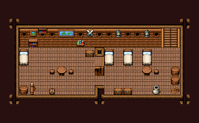

# 배 · 선실

배의 갑판 아래 선실. 갑판에서 사다리로 내려오면 오른쪽 선원 침실(침상·짐통), 칸막이 문을 지나 왼쪽이 선장실(침대·책장·해도 그림·탁자).

배 칩셋(푸른물결호 갑판과 같은 시트). 집 실내 껍데기에서 벽면만 둥근 창 벽 104~106/선체 판벽 134~136으로, 바닥을 목재 갑판 279로 바꿨다(천장 테두리 371·399~461·공허 430은 시트 배치가 같다). 선장실 침대 416/446·책장 384·책 선반 414·해도 그림 388/389·엇갈린 검 295·그림 358·둥근 탁자 387과 걸상 417·물약 선반 148·궤짝·나침반 상자·지도통, 선원실 침상 셋·오크통·항아리·밧줄·탁자·걸상·랜턴 119·궤짝, 벽에 사다리 22|23(x=17~18). 21×13, tilesetId=easyrpg_chipset_ship. 입구 (17,5). 통행 검사 목표 [[6,6],[9,8],[12,7],[16,8]].



## 놓은 소품 (저작 순서)
tibo-kit은 tibo_interior_expanded의 structureKits id, tiles는 직접 놓은 번호 행렬, rug는 카펫 오토타일 섬, floor는 바닥 재질 칠. (x,y)는 왼쪽 위. 배 맵의 tibo-kit은 이식 번호로 바뀌어 들어간다(배 규칙 문서의 이식표).
```json
[
  {
    "kind": "tiles",
    "layer": "lower",
    "x": 17,
    "y": 3,
    "w": 2,
    "h": 2,
    "rows": [
      [
        22,
        23
      ],
      [
        22,
        23
      ]
    ]
  },
  {
    "kind": "tiles",
    "layer": "upper",
    "x": 2,
    "y": 5,
    "w": 1,
    "h": 2,
    "rows": [
      [
        416
      ],
      [
        446
      ]
    ]
  },
  {
    "kind": "tiles",
    "layer": "upper",
    "x": 3,
    "y": 4,
    "w": 1,
    "h": 1,
    "rows": [
      [
        384
      ]
    ]
  },
  {
    "kind": "tiles",
    "layer": "upper",
    "x": 4,
    "y": 3,
    "w": 1,
    "h": 1,
    "rows": [
      [
        414
      ]
    ]
  },
  {
    "kind": "tiles",
    "layer": "upper",
    "x": 6,
    "y": 3,
    "w": 2,
    "h": 1,
    "rows": [
      [
        388,
        389
      ]
    ]
  },
  {
    "kind": "tiles",
    "layer": "upper",
    "x": 9,
    "y": 3,
    "w": 1,
    "h": 1,
    "rows": [
      [
        295
      ]
    ]
  },
  {
    "kind": "tiles",
    "layer": "upper",
    "x": 3,
    "y": 3,
    "w": 1,
    "h": 1,
    "rows": [
      [
        358
      ]
    ]
  },
  {
    "kind": "tiles",
    "layer": "upper",
    "x": 6,
    "y": 7,
    "w": 1,
    "h": 1,
    "rows": [
      [
        387
      ]
    ]
  },
  {
    "kind": "tiles",
    "layer": "upper",
    "x": 5,
    "y": 7,
    "w": 1,
    "h": 1,
    "rows": [
      [
        417
      ]
    ]
  },
  {
    "kind": "tiles",
    "layer": "upper",
    "x": 7,
    "y": 7,
    "w": 1,
    "h": 1,
    "rows": [
      [
        417
      ]
    ]
  },
  {
    "kind": "tiles",
    "layer": "upper",
    "x": 8,
    "y": 4,
    "w": 1,
    "h": 1,
    "rows": [
      [
        148
      ]
    ]
  },
  {
    "kind": "tibo-kit",
    "kitId": "tibo-library-045",
    "name": "여행용 궤짝",
    "x": 9,
    "y": 5,
    "w": 1,
    "h": 1
  },
  {
    "kind": "tibo-kit",
    "kitId": "tibo-library-201",
    "name": "나침반 상자",
    "x": 5,
    "y": 9,
    "w": 1,
    "h": 1
  },
  {
    "kind": "tiles",
    "layer": "upper",
    "x": 2,
    "y": 9,
    "w": 1,
    "h": 1,
    "rows": [
      [
        385
      ]
    ]
  },
  {
    "kind": "tibo-kit",
    "kitId": "tibo-library-198",
    "name": "지도통",
    "x": 3,
    "y": 8,
    "w": 1,
    "h": 2
  },
  {
    "kind": "tiles",
    "layer": "upper",
    "x": 11,
    "y": 5,
    "w": 1,
    "h": 2,
    "rows": [
      [
        416
      ],
      [
        446
      ]
    ]
  },
  {
    "kind": "tiles",
    "layer": "upper",
    "x": 13,
    "y": 5,
    "w": 1,
    "h": 2,
    "rows": [
      [
        416
      ],
      [
        446
      ]
    ]
  },
  {
    "kind": "tiles",
    "layer": "upper",
    "x": 15,
    "y": 5,
    "w": 1,
    "h": 2,
    "rows": [
      [
        416
      ],
      [
        446
      ]
    ]
  },
  {
    "kind": "tiles",
    "layer": "upper",
    "x": 18,
    "y": 7,
    "w": 1,
    "h": 1,
    "rows": [
      [
        385
      ]
    ]
  },
  {
    "kind": "tiles",
    "layer": "upper",
    "x": 18,
    "y": 8,
    "w": 1,
    "h": 1,
    "rows": [
      [
        385
      ]
    ]
  },
  {
    "kind": "tiles",
    "layer": "upper",
    "x": 16,
    "y": 9,
    "w": 1,
    "h": 1,
    "rows": [
      [
        386
      ]
    ]
  },
  {
    "kind": "tiles",
    "layer": "upper",
    "x": 18,
    "y": 9,
    "w": 1,
    "h": 1,
    "rows": [
      [
        263
      ]
    ]
  },
  {
    "kind": "tiles",
    "layer": "upper",
    "x": 15,
    "y": 7,
    "w": 1,
    "h": 1,
    "rows": [
      [
        387
      ]
    ]
  },
  {
    "kind": "tiles",
    "layer": "upper",
    "x": 16,
    "y": 7,
    "w": 1,
    "h": 1,
    "rows": [
      [
        417
      ]
    ]
  },
  {
    "kind": "tiles",
    "layer": "upper",
    "x": 12,
    "y": 3,
    "w": 1,
    "h": 1,
    "rows": [
      [
        119
      ]
    ]
  },
  {
    "kind": "tiles",
    "layer": "upper",
    "x": 15,
    "y": 3,
    "w": 1,
    "h": 1,
    "rows": [
      [
        119
      ]
    ]
  },
  {
    "kind": "tibo-kit",
    "kitId": "tibo-library-045",
    "name": "여행용 궤짝",
    "x": 13,
    "y": 9,
    "w": 1,
    "h": 1
  },
  {
    "kind": "tibo-kit",
    "kitId": "tibo-library-045",
    "name": "여행용 궤짝",
    "x": 12,
    "y": 9,
    "w": 1,
    "h": 1
  }
]
```

전체 두 레이어는 다음 배열 문서가 정답이다.
