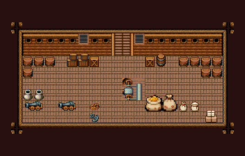

# 배 · 화물칸

배 밑바닥 화물칸. 갑판에서 사다리로 내려오면 양옆으로 짐이 쌓여 있다 — 왼쪽 물·술 오크통과 예비 대포, 가운데 급수 펌프, 오른쪽 식량 자루·상자·소포.

선실과 같은 배 칩셋 껍데기(18×6칸). 오크통 385 열 개를 양 끝 벽에 쌓고, Tibo 쌓인 나무 상자·정사각 상자·뚜껑 둥근 통·식재료 자루·밀가루/쌀 포대·소포 더미를 이 시트 뒤쪽 칸에 이식해 놓았다. 앞 왼쪽 예비 대포 324/325 둘·감긴 밧줄 263·닻 259·항아리 386, 가운데 급수 펌프 72/73/102/103(아래층), 벽에 환기 격자창 202, 사다리 22|23(x=10~11). 22×14, tilesetId=easyrpg_chipset_ship. 입구 (10,5). 통행 검사 목표 [[11,9],[3,7],[18,8]].



## 놓은 소품 (저작 순서)
tibo-kit은 tibo_interior_expanded의 structureKits id, tiles는 직접 놓은 번호 행렬, rug는 카펫 오토타일 섬, floor는 바닥 재질 칠. (x,y)는 왼쪽 위. 배 맵의 tibo-kit은 이식 번호로 바뀌어 들어간다(배 규칙 문서의 이식표).
```json
[
  {
    "kind": "tiles",
    "layer": "lower",
    "x": 10,
    "y": 3,
    "w": 2,
    "h": 2,
    "rows": [
      [
        22,
        23
      ],
      [
        22,
        23
      ]
    ]
  },
  {
    "kind": "tiles",
    "layer": "upper",
    "x": 2,
    "y": 5,
    "w": 1,
    "h": 1,
    "rows": [
      [
        385
      ]
    ]
  },
  {
    "kind": "tiles",
    "layer": "upper",
    "x": 3,
    "y": 5,
    "w": 1,
    "h": 1,
    "rows": [
      [
        385
      ]
    ]
  },
  {
    "kind": "tiles",
    "layer": "upper",
    "x": 2,
    "y": 6,
    "w": 1,
    "h": 1,
    "rows": [
      [
        385
      ]
    ]
  },
  {
    "kind": "tiles",
    "layer": "upper",
    "x": 4,
    "y": 5,
    "w": 1,
    "h": 1,
    "rows": [
      [
        385
      ]
    ]
  },
  {
    "kind": "tiles",
    "layer": "upper",
    "x": 16,
    "y": 5,
    "w": 1,
    "h": 1,
    "rows": [
      [
        385
      ]
    ]
  },
  {
    "kind": "tiles",
    "layer": "upper",
    "x": 17,
    "y": 5,
    "w": 1,
    "h": 1,
    "rows": [
      [
        385
      ]
    ]
  },
  {
    "kind": "tiles",
    "layer": "upper",
    "x": 18,
    "y": 5,
    "w": 1,
    "h": 1,
    "rows": [
      [
        385
      ]
    ]
  },
  {
    "kind": "tiles",
    "layer": "upper",
    "x": 19,
    "y": 5,
    "w": 1,
    "h": 1,
    "rows": [
      [
        385
      ]
    ]
  },
  {
    "kind": "tiles",
    "layer": "upper",
    "x": 19,
    "y": 6,
    "w": 1,
    "h": 1,
    "rows": [
      [
        385
      ]
    ]
  },
  {
    "kind": "tiles",
    "layer": "upper",
    "x": 18,
    "y": 6,
    "w": 1,
    "h": 1,
    "rows": [
      [
        385
      ]
    ]
  },
  {
    "kind": "tibo-kit",
    "kitId": "tibo-library-232",
    "name": "쌓인 나무 상자",
    "x": 6,
    "y": 4,
    "w": 1,
    "h": 2
  },
  {
    "kind": "tibo-kit",
    "kitId": "tibo-library-232",
    "name": "쌓인 나무 상자",
    "x": 7,
    "y": 4,
    "w": 1,
    "h": 2
  },
  {
    "kind": "tibo-kit",
    "kitId": "tibo-library-230",
    "name": "정사각 보관 상자",
    "x": 8,
    "y": 5,
    "w": 1,
    "h": 1
  },
  {
    "kind": "tibo-kit",
    "kitId": "tibo-library-230",
    "name": "정사각 보관 상자",
    "x": 13,
    "y": 5,
    "w": 1,
    "h": 1
  },
  {
    "kind": "tibo-kit",
    "kitId": "tibo-fantasy-grain-sacks",
    "name": "식재료 자루",
    "x": 13,
    "y": 8,
    "w": 3,
    "h": 2
  },
  {
    "kind": "tibo-kit",
    "kitId": "tibo-library-013",
    "name": "밀가루 포대",
    "x": 16,
    "y": 9,
    "w": 1,
    "h": 1
  },
  {
    "kind": "tibo-kit",
    "kitId": "tibo-library-014",
    "name": "쌀 포대",
    "x": 17,
    "y": 9,
    "w": 1,
    "h": 1
  },
  {
    "kind": "tibo-kit",
    "kitId": "tibo-library-229",
    "name": "뚜껑 둥근 통",
    "x": 14,
    "y": 4,
    "w": 1,
    "h": 2
  },
  {
    "kind": "tiles",
    "layer": "upper",
    "x": 2,
    "y": 9,
    "w": 2,
    "h": 1,
    "rows": [
      [
        324,
        325
      ]
    ]
  },
  {
    "kind": "tiles",
    "layer": "upper",
    "x": 5,
    "y": 9,
    "w": 2,
    "h": 1,
    "rows": [
      [
        324,
        325
      ]
    ]
  },
  {
    "kind": "tiles",
    "layer": "upper",
    "x": 8,
    "y": 9,
    "w": 1,
    "h": 1,
    "rows": [
      [
        263
      ]
    ]
  },
  {
    "kind": "tiles",
    "layer": "upper",
    "x": 8,
    "y": 10,
    "w": 1,
    "h": 1,
    "rows": [
      [
        259
      ]
    ]
  },
  {
    "kind": "tiles",
    "layer": "upper",
    "x": 2,
    "y": 8,
    "w": 1,
    "h": 1,
    "rows": [
      [
        386
      ]
    ]
  },
  {
    "kind": "tiles",
    "layer": "upper",
    "x": 3,
    "y": 8,
    "w": 1,
    "h": 1,
    "rows": [
      [
        386
      ]
    ]
  },
  {
    "kind": "tibo-kit",
    "kitId": "tibo-library-123",
    "name": "소포 더미",
    "x": 18,
    "y": 9,
    "w": 2,
    "h": 2
  },
  {
    "kind": "tiles",
    "layer": "upper",
    "x": 12,
    "y": 3,
    "w": 1,
    "h": 1,
    "rows": [
      [
        202
      ]
    ]
  },
  {
    "kind": "tiles",
    "layer": "upper",
    "x": 7,
    "y": 3,
    "w": 1,
    "h": 1,
    "rows": [
      [
        202
      ]
    ]
  },
  {
    "kind": "tiles",
    "layer": "lower",
    "x": 11,
    "y": 7,
    "w": 2,
    "h": 2,
    "rows": [
      [
        72,
        73
      ],
      [
        102,
        103
      ]
    ]
  }
]
```

전체 두 레이어는 다음 배열 문서가 정답이다.
