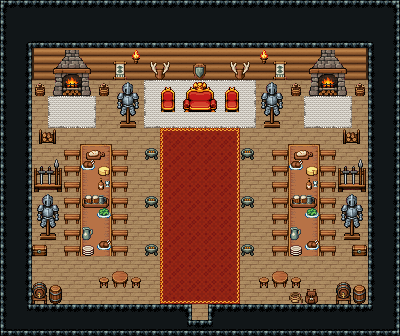

# 설원 요새 · 대전

눈 덮인 북쪽 요새의 대전. 문 곁 무기 거치대에 무기를 걸고 들어오면 화로가 늘어선 붉은 통로 양옆 긴 식탁에서 전사들이 고기와 맥주로 잔치를 벌인다. 북쪽 흰 모피 단 위 영주의 자리에서 영주가 대전을 내려다보고, 양쪽 뒷벽 큰 벽난로 앞 모피 깔개에서 몸을 녹인다.

통나무 벽 1980~1985·나무 바닥 72, 21×14칸. 북쪽 흰 모피 깔개 2000~2008 단 위 대형 왕좌(영주의 자리)와 붉은 의자 둘, 뒷벽 방패 장식·사슴뿔 벽판 둘·직조 벽걸이(깃발) 둘·횃불 둘. 양쪽 뒷벽 장작 벽난로 3×3과 앞 흰 모피 깔개, 장작 바구니 넷·장작 받침대 둘, 영주 곁 갑옷 거치대 둘(근위병). 가운데 폭5 붉은 통로(영주 단에서 문까지)와 양옆 화로 셋씩, 그 양옆 나무 상판 긴 식탁 2×7 둘과 짧은 벤치 일곱씩 양쪽, 상 위 빵 도마·고기 요리 207·샐러드 208·술병과 잔 237·맥주잔 쟁반·치즈·피처·접시 더미. 옆벽 곁 무기 거치대·갑옷 거치대·궤짝, 문 곁 파수꾼의 원형 탁자와 걸상 둘씩, 받침대 맥주통·뚜껑 둥근 통, 밧줄·가죽 배낭. 25×21, tilesetId=tibo_interior_expanded. 입구 (12,19), 주인·담당 자리 (12,7). 통행 검사 목표 [[12,7],[4,8],[20,8],[8,12],[16,12],[12,12],[4,16]].



## 놓은 소품 (저작 순서)
tibo-kit은 tibo_interior_expanded의 structureKits id, tiles는 직접 놓은 번호 행렬, rug는 카펫 오토타일 섬, floor는 바닥 재질 칠. (x,y)는 왼쪽 위.
```json
[
  {
    "kind": "rug",
    "tiles": 2004,
    "x": 9,
    "y": 5,
    "w": 7,
    "h": 3,
    "role": "rug"
  },
  {
    "kind": "tiles",
    "layer": "upper",
    "x": 11,
    "y": 5,
    "w": 3,
    "h": 2,
    "rows": [
      [
        447,
        448,
        449
      ],
      [
        477,
        478,
        479
      ]
    ],
    "role": "furn"
  },
  {
    "kind": "tiles",
    "layer": "upper",
    "x": 10,
    "y": 5,
    "w": 1,
    "h": 2,
    "rows": [
      [
        446
      ],
      [
        476
      ]
    ],
    "role": "furn"
  },
  {
    "kind": "tiles",
    "layer": "upper",
    "x": 14,
    "y": 5,
    "w": 1,
    "h": 2,
    "rows": [
      [
        446
      ],
      [
        476
      ]
    ],
    "role": "furn"
  },
  {
    "kind": "tibo-kit",
    "kitId": "tibo-library-221",
    "name": "방패 벽 장식",
    "x": 12,
    "y": 3,
    "w": 1,
    "h": 2,
    "role": "hang"
  },
  {
    "kind": "tibo-kit",
    "kitId": "tibo-library-223",
    "name": "사슴뿔 벽판",
    "x": 9,
    "y": 3,
    "w": 2,
    "h": 2,
    "role": "hang"
  },
  {
    "kind": "tibo-kit",
    "kitId": "tibo-library-223",
    "name": "사슴뿔 벽판",
    "x": 14,
    "y": 3,
    "w": 2,
    "h": 2,
    "role": "hang"
  },
  {
    "kind": "tibo-kit",
    "kitId": "tibo-library-220",
    "name": "직조 벽걸이",
    "x": 7,
    "y": 3,
    "w": 1,
    "h": 2,
    "role": "hang"
  },
  {
    "kind": "tibo-kit",
    "kitId": "tibo-library-220",
    "name": "직조 벽걸이",
    "x": 17,
    "y": 3,
    "w": 1,
    "h": 2,
    "role": "hang"
  },
  {
    "kind": "tibo-kit",
    "kitId": "tibo-medieval-stone-fireplace",
    "name": "장작 벽난로",
    "x": 3,
    "y": 3,
    "w": 3,
    "h": 3,
    "role": "furn"
  },
  {
    "kind": "tibo-kit",
    "kitId": "tibo-medieval-stone-fireplace",
    "name": "장작 벽난로",
    "x": 19,
    "y": 3,
    "w": 3,
    "h": 3,
    "role": "furn"
  },
  {
    "kind": "rug",
    "tiles": 2004,
    "x": 3,
    "y": 6,
    "w": 3,
    "h": 2,
    "role": "rug"
  },
  {
    "kind": "rug",
    "tiles": 2004,
    "x": 19,
    "y": 6,
    "w": 3,
    "h": 2,
    "role": "rug"
  },
  {
    "kind": "tibo-kit",
    "kitId": "tibo-v8-1-2",
    "name": "장작 바구니",
    "x": 2,
    "y": 5,
    "w": 1,
    "h": 1,
    "role": "furn"
  },
  {
    "kind": "tibo-kit",
    "kitId": "tibo-v8-1-2",
    "name": "장작 바구니",
    "x": 6,
    "y": 5,
    "w": 1,
    "h": 1,
    "role": "furn"
  },
  {
    "kind": "tibo-kit",
    "kitId": "tibo-v8-1-2",
    "name": "장작 바구니",
    "x": 18,
    "y": 5,
    "w": 1,
    "h": 1,
    "role": "furn"
  },
  {
    "kind": "tibo-kit",
    "kitId": "tibo-v8-1-2",
    "name": "장작 바구니",
    "x": 22,
    "y": 5,
    "w": 1,
    "h": 1,
    "role": "furn"
  },
  {
    "kind": "tibo-kit",
    "kitId": "tibo-medieval-armor-stand",
    "name": "갑옷 거치대",
    "x": 7,
    "y": 5,
    "w": 2,
    "h": 3,
    "role": "furn"
  },
  {
    "kind": "tibo-kit",
    "kitId": "tibo-medieval-armor-stand",
    "name": "갑옷 거치대",
    "x": 16,
    "y": 5,
    "w": 2,
    "h": 3,
    "role": "furn"
  },
  {
    "kind": "tiles",
    "layer": "upper",
    "x": 8,
    "y": 3,
    "w": 1,
    "h": 1,
    "rows": [
      [
        24
      ]
    ],
    "role": "hang"
  },
  {
    "kind": "tiles",
    "layer": "upper",
    "x": 16,
    "y": 3,
    "w": 1,
    "h": 1,
    "rows": [
      [
        24
      ]
    ],
    "role": "hang"
  },
  {
    "kind": "tabletop",
    "group": "harness-interior-house-v1-terrain-deck",
    "x": 5,
    "y": 9,
    "w": 2,
    "h": 7,
    "role": "tabletop"
  },
  {
    "kind": "tibo-kit",
    "kitId": "tibo-library-027",
    "name": "짧은 벤치",
    "x": 4,
    "y": 9,
    "w": 1,
    "h": 1,
    "role": "seat"
  },
  {
    "kind": "tibo-kit",
    "kitId": "tibo-library-027",
    "name": "짧은 벤치",
    "x": 7,
    "y": 9,
    "w": 1,
    "h": 1,
    "role": "seat"
  },
  {
    "kind": "tibo-kit",
    "kitId": "tibo-library-027",
    "name": "짧은 벤치",
    "x": 4,
    "y": 10,
    "w": 1,
    "h": 1,
    "role": "seat"
  },
  {
    "kind": "tibo-kit",
    "kitId": "tibo-library-027",
    "name": "짧은 벤치",
    "x": 7,
    "y": 10,
    "w": 1,
    "h": 1,
    "role": "seat"
  },
  {
    "kind": "tibo-kit",
    "kitId": "tibo-library-027",
    "name": "짧은 벤치",
    "x": 4,
    "y": 11,
    "w": 1,
    "h": 1,
    "role": "seat"
  },
  {
    "kind": "tibo-kit",
    "kitId": "tibo-library-027",
    "name": "짧은 벤치",
    "x": 7,
    "y": 11,
    "w": 1,
    "h": 1,
    "role": "seat"
  },
  {
    "kind": "tibo-kit",
    "kitId": "tibo-library-027",
    "name": "짧은 벤치",
    "x": 4,
    "y": 12,
    "w": 1,
    "h": 1,
    "role": "seat"
  },
  {
    "kind": "tibo-kit",
    "kitId": "tibo-library-027",
    "name": "짧은 벤치",
    "x": 7,
    "y": 12,
    "w": 1,
    "h": 1,
    "role": "seat"
  },
  {
    "kind": "tibo-kit",
    "kitId": "tibo-library-027",
    "name": "짧은 벤치",
    "x": 4,
    "y": 13,
    "w": 1,
    "h": 1,
    "role": "seat"
  },
  {
    "kind": "tibo-kit",
    "kitId": "tibo-library-027",
    "name": "짧은 벤치",
    "x": 7,
    "y": 13,
    "w": 1,
    "h": 1,
    "role": "seat"
  },
  {
    "kind": "tibo-kit",
    "kitId": "tibo-library-027",
    "name": "짧은 벤치",
    "x": 4,
    "y": 14,
    "w": 1,
    "h": 1,
    "role": "seat"
  },
  {
    "kind": "tibo-kit",
    "kitId": "tibo-library-027",
    "name": "짧은 벤치",
    "x": 7,
    "y": 14,
    "w": 1,
    "h": 1,
    "role": "seat"
  },
  {
    "kind": "tibo-kit",
    "kitId": "tibo-library-027",
    "name": "짧은 벤치",
    "x": 4,
    "y": 15,
    "w": 1,
    "h": 1,
    "role": "seat"
  },
  {
    "kind": "tibo-kit",
    "kitId": "tibo-library-027",
    "name": "짧은 벤치",
    "x": 7,
    "y": 15,
    "w": 1,
    "h": 1,
    "role": "seat"
  },
  {
    "kind": "tibo-kit",
    "kitId": "tibo-library-001",
    "name": "빵 도마",
    "x": 5,
    "y": 9,
    "w": 2,
    "h": 1,
    "role": "furn"
  },
  {
    "kind": "tiles",
    "layer": "upper",
    "x": 5,
    "y": 10,
    "w": 1,
    "h": 1,
    "rows": [
      [
        207
      ]
    ],
    "role": "furn"
  },
  {
    "kind": "tiles",
    "layer": "upper",
    "x": 6,
    "y": 11,
    "w": 1,
    "h": 1,
    "rows": [
      [
        237
      ]
    ],
    "role": "furn"
  },
  {
    "kind": "tibo-kit",
    "kitId": "tibo-library-136",
    "name": "맥주잔 쟁반",
    "x": 5,
    "y": 12,
    "w": 2,
    "h": 1,
    "role": "top"
  },
  {
    "kind": "tiles",
    "layer": "upper",
    "x": 6,
    "y": 13,
    "w": 1,
    "h": 1,
    "rows": [
      [
        208
      ]
    ],
    "role": "furn"
  },
  {
    "kind": "tibo-kit",
    "kitId": "tibo-library-036",
    "name": "물 피처",
    "x": 5,
    "y": 14,
    "w": 1,
    "h": 1,
    "role": "top"
  },
  {
    "kind": "tiles",
    "layer": "upper",
    "x": 6,
    "y": 15,
    "w": 1,
    "h": 1,
    "rows": [
      [
        207
      ]
    ],
    "role": "furn"
  },
  {
    "kind": "tibo-kit",
    "kitId": "tibo-library-020",
    "name": "치즈 덩이",
    "x": 6,
    "y": 10,
    "w": 1,
    "h": 1,
    "role": "top"
  },
  {
    "kind": "tibo-kit",
    "kitId": "tibo-library-008",
    "name": "접시 더미",
    "x": 5,
    "y": 15,
    "w": 1,
    "h": 1,
    "role": "top"
  },
  {
    "kind": "tabletop",
    "group": "harness-interior-house-v1-terrain-deck",
    "x": 18,
    "y": 9,
    "w": 2,
    "h": 7,
    "role": "tabletop"
  },
  {
    "kind": "tibo-kit",
    "kitId": "tibo-library-027",
    "name": "짧은 벤치",
    "x": 17,
    "y": 9,
    "w": 1,
    "h": 1,
    "role": "seat"
  },
  {
    "kind": "tibo-kit",
    "kitId": "tibo-library-027",
    "name": "짧은 벤치",
    "x": 20,
    "y": 9,
    "w": 1,
    "h": 1,
    "role": "seat"
  },
  {
    "kind": "tibo-kit",
    "kitId": "tibo-library-027",
    "name": "짧은 벤치",
    "x": 17,
    "y": 10,
    "w": 1,
    "h": 1,
    "role": "seat"
  },
  {
    "kind": "tibo-kit",
    "kitId": "tibo-library-027",
    "name": "짧은 벤치",
    "x": 20,
    "y": 10,
    "w": 1,
    "h": 1,
    "role": "seat"
  },
  {
    "kind": "tibo-kit",
    "kitId": "tibo-library-027",
    "name": "짧은 벤치",
    "x": 17,
    "y": 11,
    "w": 1,
    "h": 1,
    "role": "seat"
  },
  {
    "kind": "tibo-kit",
    "kitId": "tibo-library-027",
    "name": "짧은 벤치",
    "x": 20,
    "y": 11,
    "w": 1,
    "h": 1,
    "role": "seat"
  },
  {
    "kind": "tibo-kit",
    "kitId": "tibo-library-027",
    "name": "짧은 벤치",
    "x": 17,
    "y": 12,
    "w": 1,
    "h": 1,
    "role": "seat"
  },
  {
    "kind": "tibo-kit",
    "kitId": "tibo-library-027",
    "name": "짧은 벤치",
    "x": 20,
    "y": 12,
    "w": 1,
    "h": 1,
    "role": "seat"
  },
  {
    "kind": "tibo-kit",
    "kitId": "tibo-library-027",
    "name": "짧은 벤치",
    "x": 17,
    "y": 13,
    "w": 1,
    "h": 1,
    "role": "seat"
  },
  {
    "kind": "tibo-kit",
    "kitId": "tibo-library-027",
    "name": "짧은 벤치",
    "x": 20,
    "y": 13,
    "w": 1,
    "h": 1,
    "role": "seat"
  },
  {
    "kind": "tibo-kit",
    "kitId": "tibo-library-027",
    "name": "짧은 벤치",
    "x": 17,
    "y": 14,
    "w": 1,
    "h": 1,
    "role": "seat"
  },
  {
    "kind": "tibo-kit",
    "kitId": "tibo-library-027",
    "name": "짧은 벤치",
    "x": 20,
    "y": 14,
    "w": 1,
    "h": 1,
    "role": "seat"
  },
  {
    "kind": "tibo-kit",
    "kitId": "tibo-library-027",
    "name": "짧은 벤치",
    "x": 17,
    "y": 15,
    "w": 1,
    "h": 1,
    "role": "seat"
  },
  {
    "kind": "tibo-kit",
    "kitId": "tibo-library-027",
    "name": "짧은 벤치",
    "x": 20,
    "y": 15,
    "w": 1,
    "h": 1,
    "role": "seat"
  },
  {
    "kind": "tibo-kit",
    "kitId": "tibo-library-001",
    "name": "빵 도마",
    "x": 18,
    "y": 9,
    "w": 2,
    "h": 1,
    "role": "furn"
  },
  {
    "kind": "tiles",
    "layer": "upper",
    "x": 18,
    "y": 10,
    "w": 1,
    "h": 1,
    "rows": [
      [
        207
      ]
    ],
    "role": "furn"
  },
  {
    "kind": "tiles",
    "layer": "upper",
    "x": 19,
    "y": 11,
    "w": 1,
    "h": 1,
    "rows": [
      [
        237
      ]
    ],
    "role": "furn"
  },
  {
    "kind": "tibo-kit",
    "kitId": "tibo-library-136",
    "name": "맥주잔 쟁반",
    "x": 18,
    "y": 12,
    "w": 2,
    "h": 1,
    "role": "top"
  },
  {
    "kind": "tiles",
    "layer": "upper",
    "x": 19,
    "y": 13,
    "w": 1,
    "h": 1,
    "rows": [
      [
        208
      ]
    ],
    "role": "furn"
  },
  {
    "kind": "tibo-kit",
    "kitId": "tibo-library-036",
    "name": "물 피처",
    "x": 18,
    "y": 14,
    "w": 1,
    "h": 1,
    "role": "top"
  },
  {
    "kind": "tiles",
    "layer": "upper",
    "x": 19,
    "y": 15,
    "w": 1,
    "h": 1,
    "rows": [
      [
        207
      ]
    ],
    "role": "furn"
  },
  {
    "kind": "tibo-kit",
    "kitId": "tibo-library-020",
    "name": "치즈 덩이",
    "x": 19,
    "y": 10,
    "w": 1,
    "h": 1,
    "role": "top"
  },
  {
    "kind": "tibo-kit",
    "kitId": "tibo-library-008",
    "name": "접시 더미",
    "x": 18,
    "y": 15,
    "w": 1,
    "h": 1,
    "role": "top"
  },
  {
    "kind": "rug",
    "group": "harness-interior-house-v1-terrain-red-carpet",
    "x": 10,
    "y": 8,
    "w": 5,
    "h": 11,
    "role": "rug"
  },
  {
    "kind": "tibo-kit",
    "kitId": "tibo-brazier",
    "name": "화로",
    "x": 9,
    "y": 9,
    "w": 1,
    "h": 1,
    "role": "furn"
  },
  {
    "kind": "tibo-kit",
    "kitId": "tibo-brazier",
    "name": "화로",
    "x": 15,
    "y": 9,
    "w": 1,
    "h": 1,
    "role": "furn"
  },
  {
    "kind": "tibo-kit",
    "kitId": "tibo-brazier",
    "name": "화로",
    "x": 9,
    "y": 12,
    "w": 1,
    "h": 1,
    "role": "furn"
  },
  {
    "kind": "tibo-kit",
    "kitId": "tibo-brazier",
    "name": "화로",
    "x": 15,
    "y": 12,
    "w": 1,
    "h": 1,
    "role": "furn"
  },
  {
    "kind": "tibo-kit",
    "kitId": "tibo-brazier",
    "name": "화로",
    "x": 9,
    "y": 15,
    "w": 1,
    "h": 1,
    "role": "furn"
  },
  {
    "kind": "tibo-kit",
    "kitId": "tibo-brazier",
    "name": "화로",
    "x": 15,
    "y": 15,
    "w": 1,
    "h": 1,
    "role": "furn"
  },
  {
    "kind": "tibo-kit",
    "kitId": "tibo-fantasy-weapon-rack",
    "name": "무기 거치대",
    "x": 2,
    "y": 9,
    "w": 2,
    "h": 3,
    "role": "furn"
  },
  {
    "kind": "tibo-kit",
    "kitId": "tibo-medieval-armor-stand",
    "name": "갑옷 거치대",
    "x": 2,
    "y": 12,
    "w": 2,
    "h": 3,
    "role": "furn"
  },
  {
    "kind": "tibo-kit",
    "kitId": "tibo-library-045",
    "name": "여행용 궤짝",
    "x": 2,
    "y": 15,
    "w": 1,
    "h": 1,
    "role": "furn"
  },
  {
    "kind": "tibo-kit",
    "kitId": "tibo-fantasy-weapon-rack",
    "name": "무기 거치대",
    "x": 21,
    "y": 9,
    "w": 2,
    "h": 3,
    "role": "furn"
  },
  {
    "kind": "tibo-kit",
    "kitId": "tibo-medieval-armor-stand",
    "name": "갑옷 거치대",
    "x": 21,
    "y": 12,
    "w": 2,
    "h": 3,
    "role": "furn"
  },
  {
    "kind": "tibo-kit",
    "kitId": "tibo-library-045",
    "name": "여행용 궤짝",
    "x": 22,
    "y": 15,
    "w": 1,
    "h": 1,
    "role": "furn"
  },
  {
    "kind": "tibo-kit",
    "kitId": "tibo-library-133",
    "name": "받침대 맥주통",
    "x": 2,
    "y": 17,
    "w": 1,
    "h": 2,
    "role": "furn"
  },
  {
    "kind": "tibo-kit",
    "kitId": "tibo-library-229",
    "name": "뚜껑 둥근 통",
    "x": 3,
    "y": 17,
    "w": 1,
    "h": 2,
    "role": "furn"
  },
  {
    "kind": "tibo-kit",
    "kitId": "tibo-library-229",
    "name": "뚜껑 둥근 통",
    "x": 22,
    "y": 17,
    "w": 1,
    "h": 2,
    "role": "furn"
  },
  {
    "kind": "tibo-kit",
    "kitId": "tibo-library-133",
    "name": "받침대 맥주통",
    "x": 21,
    "y": 17,
    "w": 1,
    "h": 2,
    "role": "furn"
  },
  {
    "kind": "tibo-kit",
    "kitId": "tibo-library-196",
    "name": "밧줄 뭉치",
    "x": 18,
    "y": 18,
    "w": 1,
    "h": 1,
    "role": "furn"
  },
  {
    "kind": "tibo-kit",
    "kitId": "tibo-library-194",
    "name": "가죽 배낭",
    "x": 19,
    "y": 18,
    "w": 1,
    "h": 1,
    "role": "furn"
  },
  {
    "kind": "tibo-kit",
    "kitId": "tibo-library-235",
    "name": "장작 받침대",
    "x": 2,
    "y": 8,
    "w": 2,
    "h": 1,
    "role": "furn"
  },
  {
    "kind": "tibo-kit",
    "kitId": "tibo-library-235",
    "name": "장작 받침대",
    "x": 21,
    "y": 8,
    "w": 2,
    "h": 1,
    "role": "furn"
  },
  {
    "kind": "tibo-kit",
    "kitId": "tibo-library-025",
    "name": "원형 식탁",
    "x": 7,
    "y": 16,
    "w": 1,
    "h": 2,
    "role": "table"
  },
  {
    "kind": "tibo-kit",
    "kitId": "tibo-library-030",
    "name": "낮은 걸상",
    "x": 6,
    "y": 17,
    "w": 1,
    "h": 1,
    "role": "seat"
  },
  {
    "kind": "tibo-kit",
    "kitId": "tibo-library-030",
    "name": "낮은 걸상",
    "x": 8,
    "y": 17,
    "w": 1,
    "h": 1,
    "role": "seat"
  },
  {
    "kind": "tibo-kit",
    "kitId": "tibo-library-025",
    "name": "원형 식탁",
    "x": 17,
    "y": 16,
    "w": 1,
    "h": 2,
    "role": "table"
  },
  {
    "kind": "tibo-kit",
    "kitId": "tibo-library-030",
    "name": "낮은 걸상",
    "x": 16,
    "y": 17,
    "w": 1,
    "h": 1,
    "role": "seat"
  },
  {
    "kind": "tibo-kit",
    "kitId": "tibo-library-030",
    "name": "낮은 걸상",
    "x": 18,
    "y": 17,
    "w": 1,
    "h": 1,
    "role": "seat"
  }
]
```

전체 두 레이어는 다음 배열 문서가 정답이다.
