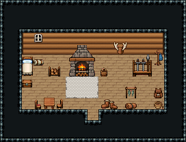

# 설원 · 사냥꾼 오두막

눈 덮인 숲가에 사는 사냥꾼의 통나무 오두막. 가운데 벽난로 앞 흰 모피 깔개에서 몸을 녹이고, 왼쪽 침대에서 자며, 오른쪽 거치대의 활·창을 챙겨 나간다. 잡은 짐승의 가죽과 고기는 문 옆 건조대에서 말린다.

통나무 벽 1980~1985·나무 바닥 72, 13×5칸. 왼쪽 침대 324/354·말린 침낭·궤짝·창 54, 가운데 장작 벽난로 3×3과 장작 받침대·장작 바구니, 벽난로 앞 흰 모피 깔개 2000~2008(3×2), 뒷벽 사슴뿔 벽판, 오른쪽 무기 거치대·옷걸이, 그 앞 가죽 배낭·밧줄, 문 옆 생선·고기 건조대 2×2와 가죽 두루마리·여행 장화, 왼쪽 앞 정사각 식탁과 의자 둘. 17×13, tilesetId=tibo_interior_expanded. 입구 (8,10). 통행 검사 목표 [[7,8],[3,8],[13,8],[10,6]].



## 놓은 소품 (저작 순서)
tibo-kit은 tibo_interior_expanded의 structureKits id, tiles는 직접 놓은 번호 행렬, rug는 카펫 오토타일 섬, floor는 바닥 재질 칠. (x,y)는 왼쪽 위.
```json
[
  {
    "kind": "tiles",
    "layer": "upper",
    "x": 2,
    "y": 5,
    "w": 1,
    "h": 2,
    "rows": [
      [
        324
      ],
      [
        354
      ]
    ],
    "role": "furn"
  },
  {
    "kind": "tiles",
    "layer": "upper",
    "x": 3,
    "y": 3,
    "w": 1,
    "h": 1,
    "rows": [
      [
        54
      ]
    ],
    "role": "hang"
  },
  {
    "kind": "tibo-kit",
    "kitId": "tibo-library-193",
    "name": "말린 침낭",
    "x": 3,
    "y": 5,
    "w": 1,
    "h": 1,
    "role": "furn"
  },
  {
    "kind": "tibo-kit",
    "kitId": "tibo-library-045",
    "name": "여행용 궤짝",
    "x": 2,
    "y": 7,
    "w": 1,
    "h": 1,
    "role": "furn"
  },
  {
    "kind": "tibo-kit",
    "kitId": "tibo-medieval-stone-fireplace",
    "name": "장작 벽난로",
    "x": 6,
    "y": 4,
    "w": 3,
    "h": 3,
    "role": "furn"
  },
  {
    "kind": "tibo-kit",
    "kitId": "tibo-library-235",
    "name": "장작 받침대",
    "x": 4,
    "y": 6,
    "w": 2,
    "h": 1,
    "role": "furn"
  },
  {
    "kind": "tibo-kit",
    "kitId": "tibo-v8-1-2",
    "name": "장작 바구니",
    "x": 9,
    "y": 6,
    "w": 1,
    "h": 1,
    "role": "furn"
  },
  {
    "kind": "rug",
    "tiles": 2004,
    "x": 6,
    "y": 7,
    "w": 3,
    "h": 2,
    "role": "rug"
  },
  {
    "kind": "tibo-kit",
    "kitId": "tibo-library-223",
    "name": "사슴뿔 벽판",
    "x": 10,
    "y": 3,
    "w": 2,
    "h": 2,
    "role": "hang"
  },
  {
    "kind": "tibo-kit",
    "kitId": "tibo-fantasy-weapon-rack",
    "name": "무기 거치대",
    "x": 12,
    "y": 4,
    "w": 2,
    "h": 3,
    "role": "furn"
  },
  {
    "kind": "tibo-kit",
    "kitId": "tibo-coat-rack",
    "name": "옷걸이",
    "x": 14,
    "y": 4,
    "w": 1,
    "h": 2,
    "role": "furn"
  },
  {
    "kind": "tibo-kit",
    "kitId": "tibo-library-194",
    "name": "가죽 배낭",
    "x": 14,
    "y": 8,
    "w": 1,
    "h": 1,
    "role": "furn"
  },
  {
    "kind": "tibo-kit",
    "kitId": "tibo-library-196",
    "name": "밧줄 뭉치",
    "x": 14,
    "y": 9,
    "w": 1,
    "h": 1,
    "role": "furn"
  },
  {
    "kind": "tibo-kit",
    "kitId": "tibo-library-022",
    "name": "생선 건조대",
    "x": 11,
    "y": 7,
    "w": 2,
    "h": 2,
    "role": "furn"
  },
  {
    "kind": "tibo-kit",
    "kitId": "tibo-library-119",
    "name": "가죽 두루마리",
    "x": 11,
    "y": 9,
    "w": 2,
    "h": 1,
    "role": "furn"
  },
  {
    "kind": "tibo-kit",
    "kitId": "tibo-library-200",
    "name": "여행 장화",
    "x": 9,
    "y": 9,
    "w": 2,
    "h": 1,
    "role": "furn"
  },
  {
    "kind": "tibo-kit",
    "kitId": "tibo-library-026",
    "name": "정사각 식탁",
    "x": 4,
    "y": 8,
    "w": 1,
    "h": 2,
    "role": "table"
  },
  {
    "kind": "tibo-kit",
    "kitId": "tibo-v7-1-2",
    "name": "붉은 방석 의자",
    "x": 3,
    "y": 9,
    "w": 1,
    "h": 1,
    "role": "seat"
  },
  {
    "kind": "tiles",
    "layer": "upper",
    "x": 5,
    "y": 9,
    "w": 1,
    "h": 1,
    "rows": [
      [
        298
      ]
    ],
    "role": "seat"
  }
]
```

전체 두 레이어는 다음 배열 문서가 정답이다.
