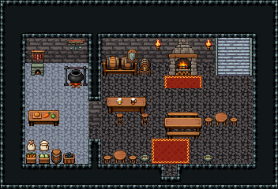

# 화산 · 잿빛 마을 여관

재가 내리는 화산 마을의 여관 1층. 광부와 대장장이가 문으로 들어와 바에서 술을 받고, 벽난로 앞 긴 식탁이나 원형 식탁에서 먹는다. 왼쪽 돌바닥 주방에서 요리하고 동쪽 계단으로 2층 객실에 오른다.

현무암 벽·현무암 바닥 1998, 주방 5×8(돌바닥 42)과 홀 12×8을 칸막이로 나눴다(문 (7,10)). 주방: 작은 빵 화덕·불 피운 솥 걸이·소시지 걸이·국자 걸이·조리대·밀가루·쌀 포대·당근·양배추 상자·뚜껑 통·석탄 통. 홀: 술통 선반·받침대 맥주통·바 카운터와 높은 걸상 둘(주인 자리 (9,6)), 방패 벽 장식, 장작 벽난로와 횃불 둘·붉은 깔개, 동쪽 3칸 폭 돌계단 141|111|171(x=17~19), 긴 식탁과 벤치·원형 식탁 둘과 걸상, 문 앞 붉은 깔개와 양옆 화로. 22×15, tilesetId=tibo_interior_expanded. 입구 (13,13), 주인·담당 자리 (9,6). 통행 검사 목표 [[9,6],[18,6],[4,7],[13,11],[17,10]].



## 놓은 소품 (저작 순서)
tibo-kit은 tibo_interior_expanded의 structureKits id, tiles는 직접 놓은 번호 행렬, rug는 카펫 오토타일 섬, floor는 바닥 재질 칠. (x,y)는 왼쪽 위.
```json
[
  {
    "kind": "tibo-kit",
    "kitId": "tibo-bread-oven",
    "name": "작은 빵 화덕",
    "x": 2,
    "y": 5,
    "w": 2,
    "h": 1,
    "role": "furn"
  },
  {
    "kind": "tibo-kit",
    "kitId": "tibo-fantasy-hanging-pot",
    "name": "솥 걸이",
    "x": 5,
    "y": 5,
    "w": 2,
    "h": 2,
    "role": "furn"
  },
  {
    "kind": "tibo-kit",
    "kitId": "tibo-library-021",
    "name": "소시지 걸이",
    "x": 2,
    "y": 3,
    "w": 2,
    "h": 2,
    "role": "hang"
  },
  {
    "kind": "tibo-kit",
    "kitId": "tibo-library-012",
    "name": "국자 걸이",
    "x": 5,
    "y": 3,
    "w": 2,
    "h": 1,
    "role": "hang"
  },
  {
    "kind": "tibo-kit",
    "kitId": "tibo-fantasy-prep-table",
    "name": "조리대",
    "x": 2,
    "y": 8,
    "w": 3,
    "h": 2,
    "role": "table"
  },
  {
    "kind": "tibo-kit",
    "kitId": "tibo-library-013",
    "name": "밀가루 포대",
    "x": 2,
    "y": 11,
    "w": 1,
    "h": 1,
    "role": "furn"
  },
  {
    "kind": "tibo-kit",
    "kitId": "tibo-library-014",
    "name": "쌀 포대",
    "x": 3,
    "y": 11,
    "w": 1,
    "h": 1,
    "role": "furn"
  },
  {
    "kind": "tibo-kit",
    "kitId": "tibo-library-018",
    "name": "당근 상자",
    "x": 2,
    "y": 12,
    "w": 1,
    "h": 1,
    "role": "furn"
  },
  {
    "kind": "tibo-kit",
    "kitId": "tibo-library-019",
    "name": "양배추 상자",
    "x": 3,
    "y": 12,
    "w": 1,
    "h": 1,
    "role": "furn"
  },
  {
    "kind": "tibo-kit",
    "kitId": "tibo-library-229",
    "name": "뚜껑 둥근 통",
    "x": 4,
    "y": 11,
    "w": 1,
    "h": 2,
    "role": "furn"
  },
  {
    "kind": "tibo-kit",
    "kitId": "tibo-library-098",
    "name": "석탄 통",
    "x": 5,
    "y": 12,
    "w": 1,
    "h": 1,
    "role": "furn"
  },
  {
    "kind": "tibo-kit",
    "kitId": "tibo-fantasy-ale-rack",
    "name": "술통 선반",
    "x": 8,
    "y": 4,
    "w": 3,
    "h": 2,
    "role": "furn"
  },
  {
    "kind": "tibo-kit",
    "kitId": "tibo-library-133",
    "name": "받침대 맥주통",
    "x": 11,
    "y": 4,
    "w": 1,
    "h": 2,
    "role": "furn"
  },
  {
    "kind": "tibo-kit",
    "kitId": "tibo-fantasy-bar-counter",
    "name": "바 카운터",
    "x": 8,
    "y": 7,
    "w": 4,
    "h": 2,
    "role": "table"
  },
  {
    "kind": "tibo-kit",
    "kitId": "tibo-library-029",
    "name": "높은 걸상",
    "x": 9,
    "y": 9,
    "w": 1,
    "h": 1,
    "role": "seat"
  },
  {
    "kind": "tibo-kit",
    "kitId": "tibo-library-029",
    "name": "높은 걸상",
    "x": 11,
    "y": 9,
    "w": 1,
    "h": 1,
    "role": "seat"
  },
  {
    "kind": "tibo-kit",
    "kitId": "tibo-medieval-stone-fireplace",
    "name": "장작 벽난로",
    "x": 13,
    "y": 3,
    "w": 3,
    "h": 3,
    "role": "furn"
  },
  {
    "kind": "rug",
    "group": "harness-interior-house-v1-terrain-red-carpet",
    "x": 13,
    "y": 6,
    "w": 3,
    "h": 1,
    "role": "rug"
  },
  {
    "kind": "tiles",
    "layer": "upper",
    "x": 12,
    "y": 3,
    "w": 1,
    "h": 1,
    "rows": [
      [
        24
      ]
    ],
    "role": "hang"
  },
  {
    "kind": "tiles",
    "layer": "upper",
    "x": 16,
    "y": 3,
    "w": 1,
    "h": 1,
    "rows": [
      [
        24
      ]
    ],
    "role": "hang"
  },
  {
    "kind": "tiles",
    "layer": "lower",
    "x": 17,
    "y": 3,
    "w": 3,
    "h": 3,
    "rows": [
      [
        141,
        111,
        171
      ],
      [
        141,
        111,
        171
      ],
      [
        141,
        111,
        171
      ]
    ],
    "role": "stairs"
  },
  {
    "kind": "tibo-kit",
    "kitId": "tibo-fantasy-dining-set",
    "name": "긴 식탁과 벤치",
    "x": 13,
    "y": 8,
    "w": 3,
    "h": 3,
    "role": "table"
  },
  {
    "kind": "tibo-kit",
    "kitId": "tibo-library-025",
    "name": "원형 식탁",
    "x": 17,
    "y": 8,
    "w": 1,
    "h": 2,
    "role": "table"
  },
  {
    "kind": "tibo-kit",
    "kitId": "tibo-library-030",
    "name": "낮은 걸상",
    "x": 16,
    "y": 9,
    "w": 1,
    "h": 1,
    "role": "seat"
  },
  {
    "kind": "tibo-kit",
    "kitId": "tibo-library-030",
    "name": "낮은 걸상",
    "x": 18,
    "y": 9,
    "w": 1,
    "h": 1,
    "role": "seat"
  },
  {
    "kind": "tibo-kit",
    "kitId": "tibo-library-025",
    "name": "원형 식탁",
    "x": 9,
    "y": 11,
    "w": 1,
    "h": 2,
    "role": "table"
  },
  {
    "kind": "tibo-kit",
    "kitId": "tibo-library-030",
    "name": "낮은 걸상",
    "x": 8,
    "y": 12,
    "w": 1,
    "h": 1,
    "role": "seat"
  },
  {
    "kind": "tibo-kit",
    "kitId": "tibo-library-030",
    "name": "낮은 걸상",
    "x": 10,
    "y": 12,
    "w": 1,
    "h": 1,
    "role": "seat"
  },
  {
    "kind": "rug",
    "group": "harness-interior-house-v1-terrain-red-carpet",
    "x": 12,
    "y": 11,
    "w": 3,
    "h": 2,
    "role": "rug"
  },
  {
    "kind": "tibo-kit",
    "kitId": "tibo-brazier",
    "name": "화로",
    "x": 11,
    "y": 12,
    "w": 1,
    "h": 1,
    "role": "furn"
  },
  {
    "kind": "tibo-kit",
    "kitId": "tibo-brazier",
    "name": "화로",
    "x": 16,
    "y": 12,
    "w": 1,
    "h": 1,
    "role": "furn"
  },
  {
    "kind": "tibo-kit",
    "kitId": "tibo-library-221",
    "name": "방패 벽 장식",
    "x": 10,
    "y": 3,
    "w": 1,
    "h": 2,
    "role": "hang"
  }
]
```

전체 두 레이어는 다음 배열 문서가 정답이다.
