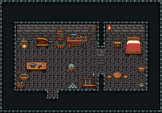

# 화산 · 대장장이 집

화산 기슭 대장장이의 현무암 집. 서쪽 대장간에서 화덕에 풀무질을 해 쇠를 달구고, 모루 작업대에서 두드려 담금질 물통에 식힌 뒤 숫돌에 간다. 완성한 무기는 거치대에 세운다. 칸막이 문 너머 동쪽이 살림방.

현무암 벽 1992~1997·현무암 바닥 1998, 대장간 10×6과 살림방 5×6을 칸막이로 나눴다(문 (12,8)). 대장간: 뒷벽 작은 대장간 화덕 2×2·풀무 3×2·공구 벽판·대장장이 작업대 3×2·쇠집게 걸이, 풀무 곁 석탄 통, 모루 작업대 3×2와 담금질 물통, 숫돌 2×2·금속 주괴 더미·고철 상자·무기 거치대. 살림방: 목제 침대·협탁·벽 횃불, 원형 식탁과 걸상 둘, 궤짝, 화로. 20×14, tilesetId=tibo_interior_expanded. 입구 (6,11), 주인·담당 자리 (6,7). 통행 검사 목표 [[6,7],[7,9],[16,8],[13,7]].



## 놓은 소품 (저작 순서)
tibo-kit은 tibo_interior_expanded의 structureKits id, tiles는 직접 놓은 번호 행렬, rug는 카펫 오토타일 섬, floor는 바닥 재질 칠. (x,y)는 왼쪽 위.
```json
[
  {
    "kind": "tibo-kit",
    "kitId": "tibo-library-104",
    "name": "작은 대장간 화덕",
    "x": 2,
    "y": 4,
    "w": 2,
    "h": 2,
    "role": "furn"
  },
  {
    "kind": "tibo-kit",
    "kitId": "tibo-fantasy-bellows",
    "name": "풀무",
    "x": 4,
    "y": 4,
    "w": 3,
    "h": 2,
    "role": "furn"
  },
  {
    "kind": "tibo-kit",
    "kitId": "tibo-library-088",
    "name": "공구 벽판",
    "x": 7,
    "y": 3,
    "w": 1,
    "h": 2,
    "role": "hang"
  },
  {
    "kind": "tibo-kit",
    "kitId": "tibo-medieval-smith-bench",
    "name": "대장장이 작업대",
    "x": 8,
    "y": 4,
    "w": 3,
    "h": 2,
    "role": "furn"
  },
  {
    "kind": "tibo-kit",
    "kitId": "tibo-library-099",
    "name": "쇠집게 걸이",
    "x": 11,
    "y": 3,
    "w": 1,
    "h": 1,
    "role": "hang"
  },
  {
    "kind": "tibo-kit",
    "kitId": "tibo-library-098",
    "name": "석탄 통",
    "x": 7,
    "y": 5,
    "w": 1,
    "h": 1,
    "role": "furn"
  },
  {
    "kind": "tibo-kit",
    "kitId": "tibo-fantasy-anvil-bench",
    "name": "모루 작업대",
    "x": 3,
    "y": 7,
    "w": 3,
    "h": 2,
    "role": "furn"
  },
  {
    "kind": "tibo-kit",
    "kitId": "tibo-library-101",
    "name": "담금질 물통",
    "x": 2,
    "y": 9,
    "w": 2,
    "h": 1,
    "role": "furn"
  },
  {
    "kind": "tibo-kit",
    "kitId": "tibo-grindstone",
    "name": "숫돌",
    "x": 8,
    "y": 7,
    "w": 2,
    "h": 2,
    "role": "furn"
  },
  {
    "kind": "tibo-kit",
    "kitId": "tibo-library-100",
    "name": "금속 주괴 더미",
    "x": 8,
    "y": 10,
    "w": 2,
    "h": 1,
    "role": "furn"
  },
  {
    "kind": "tibo-kit",
    "kitId": "tibo-fantasy-weapon-rack",
    "name": "무기 거치대",
    "x": 10,
    "y": 8,
    "w": 2,
    "h": 3,
    "role": "furn"
  },
  {
    "kind": "tibo-kit",
    "kitId": "tibo-library-106",
    "name": "고철 상자",
    "x": 2,
    "y": 10,
    "w": 1,
    "h": 1,
    "role": "furn"
  },
  {
    "kind": "tibo-kit",
    "kitId": "tibo-fantasy-bed",
    "name": "목제 침대",
    "x": 15,
    "y": 4,
    "w": 3,
    "h": 3,
    "role": "furn"
  },
  {
    "kind": "tibo-kit",
    "kitId": "tibo-library-039",
    "name": "침대 옆 협탁",
    "x": 14,
    "y": 5,
    "w": 1,
    "h": 1,
    "role": "furn"
  },
  {
    "kind": "tiles",
    "layer": "upper",
    "x": 13,
    "y": 3,
    "w": 1,
    "h": 1,
    "rows": [
      [
        24
      ]
    ],
    "role": "hang"
  },
  {
    "kind": "tibo-kit",
    "kitId": "tibo-library-025",
    "name": "원형 식탁",
    "x": 14,
    "y": 8,
    "w": 1,
    "h": 2,
    "role": "table"
  },
  {
    "kind": "tibo-kit",
    "kitId": "tibo-library-030",
    "name": "낮은 걸상",
    "x": 13,
    "y": 9,
    "w": 1,
    "h": 1,
    "role": "seat"
  },
  {
    "kind": "tibo-kit",
    "kitId": "tibo-library-030",
    "name": "낮은 걸상",
    "x": 15,
    "y": 9,
    "w": 1,
    "h": 1,
    "role": "seat"
  },
  {
    "kind": "tibo-kit",
    "kitId": "tibo-library-045",
    "name": "여행용 궤짝",
    "x": 17,
    "y": 8,
    "w": 1,
    "h": 1,
    "role": "furn"
  },
  {
    "kind": "tibo-kit",
    "kitId": "tibo-brazier",
    "name": "화로",
    "x": 17,
    "y": 10,
    "w": 1,
    "h": 1,
    "role": "furn"
  }
]
```

전체 두 레이어는 다음 배열 문서가 정답이다.
