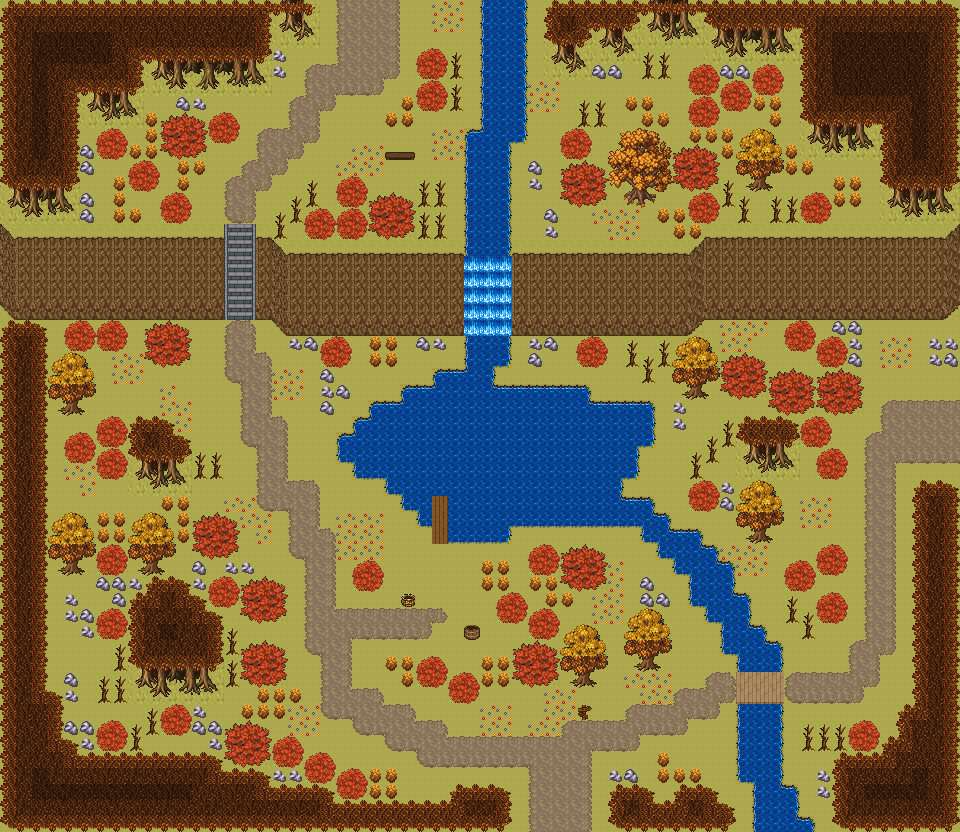

# 붉은 단풍 골짜기

단풍 숲 사이 골짜기 필드. 북쪽 절벽을 한 줄기 큰 폭포가 넘어 단풍 못을 이루고, 못물이 동쪽으로 흘러 나간다. 계단으로 절벽 위 고개에 오른다. 양옆을 붉은 단풍 숲이 두른 골짜기다. 북쪽 절벽을 한 줄기 큰 폭포가 넘어 골짜기 가운데 단풍 못에 떨어지고, 못물은 남동쪽 개울로 흘러 맵 밖으로 나간다. 남쪽 입구 길은 개울을 나무다리로 건너 못 서쪽 기슭을 따라 올라가 돌계단으로 절벽 위에 오르고, 절벽 위 길은 북쪽 고개로 이어진다. 못가엔 낚시 선착장, 절벽 위엔 폭포를 내려다보는 쉼터 벤치. 60×52, tilesetId=forest_harmony_autumn. 통행 검사 시작 (34,47).



## 출구 — 어디와 맞닿나
- 출구0 남쪽 (34,51) → 단풍 과수원 언덕길 북쪽 필드
- 출구1 북쪽 (22,0) → 가을 종탑 언덕 교구 쪽 고개(필드)
- 출구2 동쪽 (59,26) → 다음 가을 필드

## 지형
```json
{"cliffs":[{"points":[[0,14],[16,14],[18,15],[42,15],[44,14],[59,14]],"height":5,"left":"open","right":"open"}],"stairs":[{"x":14,"y":14,"height":5}],"falls":[{"x":29,"y":15,"height":5,"tile":2700},{"x":30,"y":15,"height":5,"tile":2700},{"x":31,"y":15,"height":5,"tile":2700}],"landmarks":[]}
```

## 집 (템플릿·역할·문)
```json
[]
```

## 소품 (주인·이유가 있는 것만 남겼다)
```json
[{"name":"낚시 바구니","x":25,"y":37,"w":1,"h":1,"owner":"선착장","purpose":"선착장 낚시꾼 자리"},{"name":"나무통","x":29,"y":39,"w":1,"h":1,"owner":"선착장","purpose":"미끼 통"},{"name":"벤치","x":24,"y":9,"w":2,"h":1,"owner":"절벽 위 길","purpose":"폭포를 내려다보는 쉼터 벤치"},{"name":"나무 이정표","x":36,"y":44,"w":1,"h":1,"purpose":"갈림길 표지 · 못 / 동쪽"}]
```

## 포장·다리·부두·덩이
```json
[{"name":"나무다리","kind":"bridge","x":46,"y":42,"w":3,"h":2},{"name":"선착장","kind":"dock","x":27,"y":31,"w":1,"h":3},{"name":"나무 · small-bush","kind":"vegetation","x":6,"y":8,"w":2,"h":2},{"name":"나무 · small-bush","kind":"vegetation","x":53,"y":45,"w":2,"h":2},{"name":"나무 · tree","kind":"vegetation","x":3,"y":22,"w":3,"h":4},{"name":"나무 · round-bush","kind":"vegetation","x":10,"y":7,"w":3,"h":3},{"name":"나무 · round-bush","kind":"vegetation","x":42,"y":9,"w":3,"h":3},{"name":"나무 · big-oak","kind":"vegetation","x":38,"y":8,"w":4,"h":5},{"name":"나무 · round-bush","kind":"vegetation","x":35,"y":10,"w":3,"h":3},{"name":"나무 · round-bush","kind":"vegetation","x":32,"y":40,"w":3,"h":3},{"name":"나무 · tree","kind":"vegetation","x":35,"y":39,"w":3,"h":4},{"name":"나무 · tree","kind":"vegetation","x":46,"y":30,"w":3,"h":4},{"name":"나무 · round-bush","kind":"vegetation","x":9,"y":20,"w":3,"h":3},{"name":"나무 · round-bush","kind":"vegetation","x":48,"y":23,"w":3,"h":3},{"name":"나무 · round-bush","kind":"vegetation","x":45,"y":22,"w":3,"h":3},{"name":"나무 · tree","kind":"vegetation","x":42,"y":21,"w":3,"h":4},{"name":"나무 · round-bush","kind":"vegetation","x":51,"y":23,"w":3,"h":3},{"name":"나무 · tree","kind":"vegetation","x":3,"y":32,"w":3,"h":4},{"name":"나무 · small-bush","kind":"vegetation","x":6,"y":34,"w":2,"h":2},{"name":"나무 · tree","kind":"vegetation","x":8,"y":32,"w":3,"h":4},{"name":"나무 · small-bush","kind":"vegetation","x":33,"y":34,"w":2,"h":2},{"name":"나무 · round-bush","kind":"vegetation","x":35,"y":34,"w":3,"h":3},{"name":"나무 · small-bush","kind":"vegetation","x":51,"y":34,"w":2,"h":2},{"name":"나무 · small-bush","kind":"vegetation","x":49,"y":35,"w":2,"h":2},{"name":"나무 · round-bush","kind":"vegetation","x":15,"y":40,"w":3,"h":3},{"name":"나무 · tree","kind":"vegetation","x":39,"y":38,"w":3,"h":4},{"name":"나무 · small-bush","kind":"vegetation","x":28,"y":42,"w":2,"h":2},{"name":"나무 · small-bush","kind":"vegetation","x":26,"y":41,"w":2,"h":2},{"name":"나무 · small-bush","kind":"vegetation","x":4,"y":27,"w":2,"h":2},{"name":"나무 · small-bush","kind":"vegetation","x":6,"y":28,"w":2,"h":2},{"name":"나무 · small-bush","kind":"vegetation","x":31,"y":37,"w":2,"h":2},{"name":"나무 · round-bush","kind":"vegetation","x":12,"y":32,"w":3,"h":3},{"name":"나무 · small-bush","kind":"vegetation","x":45,"y":5,"w":2,"h":2},{"name":"나무 · small-bush","kind":"vegetation","x":43,"y":6,"w":2,"h":2},{"name":"나무 · small-bush","kind":"vegetation","x":47,"y":4,"w":2,"h":2},{"name":"나무 · small-bush","kind":"vegetation","x":22,"y":35,"w":2,"h":2},{"name":"나무 · small-bush","kind":"vegetation","x":17,"y":46,"w":2,"h":2},{"name":"나무 · round-bush","kind":"vegetation","x":14,"y":45,"w":3,"h":3},{"name":"나무 · round-bush","kind":"vegetation","x":23,"y":12,"w":3,"h":3},{"name":"나무 · small-bush","kind":"vegetation","x":21,"y":13,"w":2,"h":2},{"name":"나무 · small-bush","kind":"vegetation","x":19,"y":13,"w":2,"h":2},{"name":"나무 · round-bush","kind":"vegetation","x":15,"y":36,"w":3,"h":3},{"name":"나무 · small-bush","kind":"vegetation","x":20,"y":21,"w":2,"h":2},{"name":"나무 · small-bush","kind":"vegetation","x":21,"y":11,"w":2,"h":2},{"name":"나무 · small-bush","kind":"vegetation","x":43,"y":12,"w":2,"h":2},{"name":"나무 · small-bush","kind":"vegetation","x":51,"y":37,"w":2,"h":2},{"name":"나무 · small-bush","kind":"vegetation","x":6,"y":20,"w":2,"h":2},{"name":"나무 · small-bush","kind":"vegetation","x":43,"y":30,"w":2,"h":2},{"name":"나무 · small-bush","kind":"vegetation","x":13,"y":7,"w":2,"h":2},{"name":"나무 · tree","kind":"vegetation","x":46,"y":8,"w":3,"h":4},{"name":"나무 · small-bush","kind":"vegetation","x":19,"y":47,"w":2,"h":2},{"name":"나무 · small-bush","kind":"vegetation","x":26,"y":5,"w":2,"h":2},{"name":"나무 · small-bush","kind":"vegetation","x":51,"y":21,"w":2,"h":2},{"name":"나무 · small-bush","kind":"vegetation","x":35,"y":8,"w":2,"h":2},{"name":"나무 · small-bush","kind":"vegetation","x":10,"y":44,"w":2,"h":2},{"name":"나무 · small-bush","kind":"vegetation","x":51,"y":28,"w":2,"h":2},{"name":"나무 · small-bush","kind":"vegetation","x":6,"y":38,"w":2,"h":2},{"name":"나무 · small-bush","kind":"vegetation","x":6,"y":26,"w":2,"h":2},{"name":"나무 · small-bush","kind":"vegetation","x":26,"y":3,"w":2,"h":2},{"name":"나무 · small-bush","kind":"vegetation","x":50,"y":26,"w":2,"h":2},{"name":"나무 · small-bush","kind":"vegetation","x":33,"y":38,"w":2,"h":2},{"name":"나무 · small-bush","kind":"vegetation","x":21,"y":48,"w":2,"h":2},{"name":"나무 · small-bush","kind":"vegetation","x":43,"y":4,"w":2,"h":2},{"name":"나무 · small-bush","kind":"vegetation","x":49,"y":20,"w":2,"h":2},{"name":"나무 · small-bush","kind":"vegetation","x":8,"y":10,"w":2,"h":2},{"name":"나무 · small-bush","kind":"vegetation","x":50,"y":12,"w":2,"h":2},{"name":"나무 · small-bush","kind":"vegetation","x":13,"y":36,"w":2,"h":2},{"name":"나무 · small-bush","kind":"vegetation","x":6,"y":45,"w":2,"h":2},{"name":"나무 · small-bush","kind":"vegetation","x":10,"y":12,"w":2,"h":2},{"name":"나무 · small-bush","kind":"vegetation","x":4,"y":20,"w":2,"h":2},{"name":"나무 · small-bush","kind":"vegetation","x":36,"y":21,"w":2,"h":2}]
```


## 채우기 규칙 (빈칸 게이트: 마을·장면 한 화면 17×13 에 맨땅 40% 이하·가장 큰 빈 네모 4칸 이하, 필드 50%·5칸)
맨땅(plain)으로 세는 칸: 잔디 240·잔디 질감 1140~1147, 포장 몸통 포석 190·석판 307·자갈 310·흙 421·모래 424·눈 67. 빈칸은 **자연 덩이로 먼저** 줄이고, 생활 소품은 주인이 있을 때만 둔다.
- 나무 덩이: 나무 키트(활엽수 978~980/1008~1010·1038~1040/1068~1070 3×4, 둥근 덤불 983~985/1013~1015/1043~1045 3×3, 작은 덤불 1073/1074/1103/1104 2×2)를 어깨를 붙여 3~7그루씩. 줄·바둑판으로 세우지 않는다.
- 꽃: 들꽃 348 을 **3~5칸 묶음**(2×2 속 + 한두 칸)이나 화단 키트(꽃 화단·화분)로만. 한 칸씩 흩은 「색종이 밭」 금지.
- 덤불 289 묶음·작은 덤불 2×2, 바위 537·29 는 3~6칸 무리로 절벽 발치·물가·숲 가장자리에만. 한 줄(가로·세로 3칸 이상 일렬) 금지.
- 키큰 풀 E/F/G 금지: 모래·눈·재·가을 시트에 깐 풀(재칠본 포함)은 초록 띠나 진흙 얼룩으로 읽힌다. 이 시트에는 풀 덩이를 깔지 않는다.
- 금지 재료: 짙은 수풀 builtin_undergrowth(9·11·39~41·69~71·99~101, 검은 초록 구불이), 어두운 덤불 986~988·1016~1018·1046~1048(구덩이로 보임), 마른 가지 740·바위·뼈 383·부서진 울타리 410 을 고르게 흩뿌리기(절벽·폐허 벽·물가 곁 1~3곳에 몰아 둔다).
- 주인 없는 소품 금지: 벤치·통나무·상자·항아리·허수아비·표지판은 2칸 안에 이유(집 문·가게·밭·우물·부두·작업장·길)가 있어야 한다. 없으면 두지 말고 뺀다.

## 검사
```json
{"reachable":1038,"emptiness":{"maxSq":4,"screen":0.439,"at":[26,34],"screenAt":[16,32]}}
```

전체 두 레이어는 「붉은 단풍 골짜기 · 0행부터 전체 배열」 문서가 정답이다.
