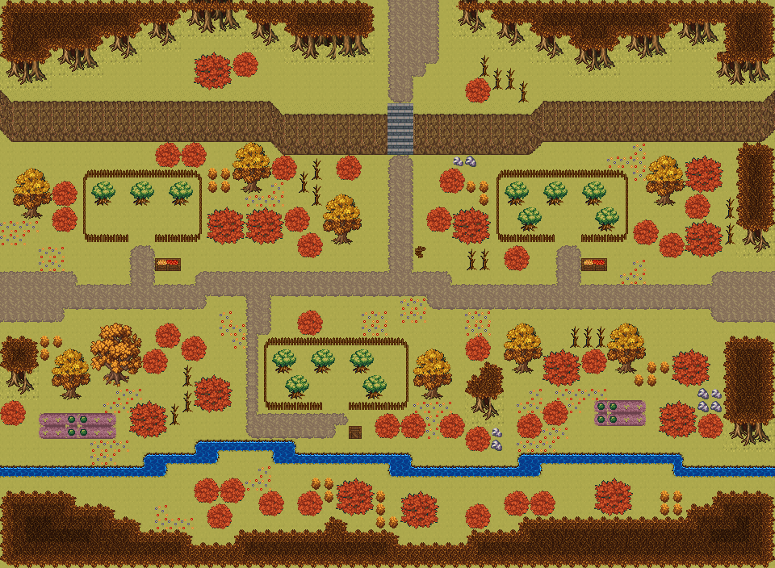

# 단풍 과수원 언덕길

울타리 친 과수원 사이로 난 가을 들길. 개울가 밭과 허수아비, 과수원마다 과일 상자, 낮은 언덕 위로 계단 하나. 금빛 들판 가운데로 흙길이 서쪽에서 동쪽으로 지나고, 길 양옆에 나무 울타리를 두른 과수원 셋이 붙어 있다. 과수원 안엔 과실나무가 서고 문 앞에 과일 상자·궤짝이 쌓였다. 남쪽 개울가엔 채소밭과 허수아비, 개울엔 작은 나무다리. 북쪽 낮은 언덕으로 돌계단 하나가 오르고, 그 위로 가을 종탑 언덕 교구 가는 길이 이어진다. 60×44, tilesetId=forest_harmony_autumn. 통행 검사 시작 (4,22).



## 출구 — 어디와 맞닿나
- 출구0 서쪽 (0,22) → 가을 두 폭포 강마을 쪽 필드
- 출구1 동쪽 (59,22) → 단풍 여울 벼랑길 서쪽 필드
- 출구2 북쪽 (31,0) → 가을 종탑 언덕 교구 남쪽 입구

## 지형
```json
{"cliffs":[{"points":[[0,7],[20,7],[22,8],[40,8],[42,7],[59,7]],"height":3,"left":"open","right":"open"}],"stairs":[{"x":30,"y":8,"height":3}],"landmarks":[]}
```

## 집 (템플릿·역할·문)
```json
[]
```

## 소품 (주인·이유가 있는 것만 남겼다)
```json
[{"name":"활엽수 작은","x":7,"y":14,"w":2,"h":2,"owner":"과수원","purpose":"과실나무"},{"name":"활엽수 작은","x":10,"y":14,"w":2,"h":2,"owner":"과수원","purpose":"과실나무"},{"name":"활엽수 작은","x":13,"y":14,"w":2,"h":2,"owner":"과수원","purpose":"과실나무"},{"name":"활엽수 작은","x":39,"y":14,"w":2,"h":2,"owner":"과수원","purpose":"과실나무"},{"name":"활엽수 작은","x":42,"y":14,"w":2,"h":2,"owner":"과수원","purpose":"과실나무"},{"name":"활엽수 작은","x":45,"y":14,"w":2,"h":2,"owner":"과수원","purpose":"과실나무"},{"name":"활엽수 작은","x":40,"y":16,"w":2,"h":2,"owner":"과수원","purpose":"과실나무"},{"name":"활엽수 작은","x":46,"y":16,"w":2,"h":2,"owner":"과수원","purpose":"과실나무"},{"name":"활엽수 작은","x":21,"y":27,"w":2,"h":2,"owner":"과수원","purpose":"과실나무"},{"name":"활엽수 작은","x":24,"y":27,"w":2,"h":2,"owner":"과수원","purpose":"과실나무"},{"name":"활엽수 작은","x":27,"y":27,"w":2,"h":2,"owner":"과수원","purpose":"과실나무"},{"name":"활엽수 작은","x":22,"y":29,"w":2,"h":2,"owner":"과수원","purpose":"과실나무"},{"name":"활엽수 작은","x":28,"y":29,"w":2,"h":2,"owner":"과수원","purpose":"과실나무"},{"name":"과일 상자","x":12,"y":20,"w":2,"h":1,"owner":"과수원","purpose":"과수원 문 앞 과일 상자"},{"name":"과일 상자","x":45,"y":20,"w":2,"h":1,"owner":"과수원","purpose":"과수원 문 앞 과일 상자"},{"name":"나무 상자","x":27,"y":33,"w":1,"h":1,"owner":"과수원","purpose":"과수원 문 앞 과일 궤짝"},{"name":"나무 이정표","x":32,"y":19,"w":1,"h":1,"purpose":"갈림길 표지 · 교구 / 강마을"}]
```

## 포장·다리·부두·덩이
```json
[{"name":"과수원","kind":"fence","x":6,"y":13,"w":10,"h":6},{"name":"과수원","kind":"fence","x":38,"y":13,"w":11,"h":6},{"name":"과수원","kind":"fence","x":20,"y":26,"w":12,"h":6},{"name":"개울가 밭","kind":"paving","x":46,"y":31,"w":4,"h":2,"group":"farm"},{"name":"개울가 밭","kind":"paving","x":3,"y":32,"w":6,"h":2,"group":"farm"},{"name":"나무 · round-bush","kind":"vegetation","x":46,"y":37,"w":3,"h":3},{"name":"나무 · small-bush","kind":"vegetation","x":36,"y":39,"w":2,"h":2},{"name":"나무 · small-bush","kind":"vegetation","x":23,"y":38,"w":2,"h":2},{"name":"나무 · big-oak","kind":"vegetation","x":7,"y":25,"w":4,"h":5},{"name":"나무 · tree","kind":"vegetation","x":4,"y":27,"w":3,"h":4},{"name":"나무 · small-bush","kind":"vegetation","x":11,"y":27,"w":2,"h":2},{"name":"나무 · round-bush","kind":"vegetation","x":16,"y":16,"w":3,"h":3},{"name":"나무 · round-bush","kind":"vegetation","x":19,"y":16,"w":3,"h":3},{"name":"나무 · small-bush","kind":"vegetation","x":22,"y":16,"w":2,"h":2},{"name":"나무 · tree","kind":"vegetation","x":50,"y":12,"w":3,"h":4},{"name":"나무 · round-bush","kind":"vegetation","x":53,"y":12,"w":3,"h":3},{"name":"나무 · round-bush","kind":"vegetation","x":42,"y":27,"w":3,"h":3},{"name":"나무 · small-bush","kind":"vegetation","x":45,"y":27,"w":2,"h":2},{"name":"나무 · tree","kind":"vegetation","x":39,"y":25,"w":3,"h":4},{"name":"나무 · tree","kind":"vegetation","x":47,"y":25,"w":3,"h":4},{"name":"나무 · tree","kind":"vegetation","x":1,"y":13,"w":3,"h":4},{"name":"나무 · tree","kind":"vegetation","x":25,"y":15,"w":3,"h":4},{"name":"나무 · round-bush","kind":"vegetation","x":35,"y":16,"w":3,"h":3},{"name":"나무 · small-bush","kind":"vegetation","x":33,"y":16,"w":2,"h":2},{"name":"나무 · small-bush","kind":"vegetation","x":51,"y":18,"w":2,"h":2},{"name":"나무 · round-bush","kind":"vegetation","x":53,"y":17,"w":3,"h":3},{"name":"나무 · small-bush","kind":"vegetation","x":14,"y":26,"w":2,"h":2},{"name":"나무 · round-bush","kind":"vegetation","x":52,"y":27,"w":3,"h":3},{"name":"나무 · round-bush","kind":"vegetation","x":15,"y":29,"w":3,"h":3},{"name":"나무 · tree","kind":"vegetation","x":32,"y":27,"w":3,"h":4},{"name":"나무 · small-bush","kind":"vegetation","x":31,"y":32,"w":2,"h":2},{"name":"나무 · small-bush","kind":"vegetation","x":29,"y":32,"w":2,"h":2},{"name":"나무 · round-bush","kind":"vegetation","x":10,"y":31,"w":3,"h":3},{"name":"나무 · small-bush","kind":"vegetation","x":54,"y":32,"w":2,"h":2},{"name":"나무 · round-bush","kind":"vegetation","x":51,"y":31,"w":3,"h":3},{"name":"나무 · round-bush","kind":"vegetation","x":31,"y":38,"w":3,"h":3},{"name":"나무 · small-bush","kind":"vegetation","x":17,"y":37,"w":2,"h":2},{"name":"나무 · small-bush","kind":"vegetation","x":15,"y":37,"w":2,"h":2},{"name":"나무 · small-bush","kind":"vegetation","x":40,"y":32,"w":2,"h":2},{"name":"나무 · small-bush","kind":"vegetation","x":42,"y":31,"w":2,"h":2},{"name":"나무 · small-bush","kind":"vegetation","x":34,"y":13,"w":2,"h":2},{"name":"나무 · small-bush","kind":"vegetation","x":21,"y":12,"w":2,"h":2},{"name":"나무 · tree","kind":"vegetation","x":18,"y":11,"w":3,"h":4},{"name":"나무 · small-bush","kind":"vegetation","x":20,"y":38,"w":2,"h":2},{"name":"나무 · small-bush","kind":"vegetation","x":36,"y":26,"w":2,"h":2},{"name":"나무 · round-bush","kind":"vegetation","x":26,"y":37,"w":3,"h":3},{"name":"나무 · small-bush","kind":"vegetation","x":34,"y":32,"w":2,"h":2},{"name":"나무 · small-bush","kind":"vegetation","x":39,"y":38,"w":2,"h":2},{"name":"나무 · small-bush","kind":"vegetation","x":41,"y":38,"w":2,"h":2},{"name":"나무 · small-bush","kind":"vegetation","x":26,"y":12,"w":2,"h":2},{"name":"나무 · small-bush","kind":"vegetation","x":36,"y":33,"w":2,"h":2},{"name":"나무 · small-bush","kind":"vegetation","x":4,"y":14,"w":2,"h":2},{"name":"나무 · small-bush","kind":"vegetation","x":39,"y":19,"w":2,"h":2},{"name":"나무 · small-bush","kind":"vegetation","x":14,"y":11,"w":2,"h":2},{"name":"나무 · small-bush","kind":"vegetation","x":23,"y":24,"w":2,"h":2},{"name":"나무 · small-bush","kind":"vegetation","x":16,"y":39,"w":2,"h":2},{"name":"나무 · small-bush","kind":"vegetation","x":0,"y":31,"w":2,"h":2},{"name":"나무 · small-bush","kind":"vegetation","x":49,"y":17,"w":2,"h":2},{"name":"나무 · small-bush","kind":"vegetation","x":36,"y":6,"w":2,"h":2},{"name":"나무 · small-bush","kind":"vegetation","x":12,"y":11,"w":2,"h":2},{"name":"나무 · small-bush","kind":"vegetation","x":4,"y":16,"w":2,"h":2},{"name":"나무 · small-bush","kind":"vegetation","x":53,"y":15,"w":2,"h":2},{"name":"나무 · small-bush","kind":"vegetation","x":23,"y":18,"w":2,"h":2},{"name":"나무 · round-bush","kind":"vegetation","x":15,"y":4,"w":3,"h":3},{"name":"나무 · small-bush","kind":"vegetation","x":18,"y":4,"w":2,"h":2},{"name":"나무 · small-bush","kind":"vegetation","x":12,"y":25,"w":2,"h":2}]
```


## 채우기 규칙 (빈칸 게이트: 마을·장면 한 화면 17×13 에 맨땅 40% 이하·가장 큰 빈 네모 4칸 이하, 필드 50%·5칸)
맨땅(plain)으로 세는 칸: 잔디 240·잔디 질감 1140~1147, 포장 몸통 포석 190·석판 307·자갈 310·흙 421·모래 424·눈 67. 빈칸은 **자연 덩이로 먼저** 줄이고, 생활 소품은 주인이 있을 때만 둔다.
- 나무 덩이: 나무 키트(활엽수 978~980/1008~1010·1038~1040/1068~1070 3×4, 둥근 덤불 983~985/1013~1015/1043~1045 3×3, 작은 덤불 1073/1074/1103/1104 2×2)를 어깨를 붙여 3~7그루씩. 줄·바둑판으로 세우지 않는다.
- 꽃: 들꽃 348 을 **3~5칸 묶음**(2×2 속 + 한두 칸)이나 화단 키트(꽃 화단·화분)로만. 한 칸씩 흩은 「색종이 밭」 금지.
- 덤불 289 묶음·작은 덤불 2×2, 바위 537·29 는 3~6칸 무리로 절벽 발치·물가·숲 가장자리에만. 한 줄(가로·세로 3칸 이상 일렬) 금지.
- 키큰 풀 E/F/G 금지: 모래·눈·재·가을 시트에 깐 풀(재칠본 포함)은 초록 띠나 진흙 얼룩으로 읽힌다. 이 시트에는 풀 덩이를 깔지 않는다.
- 금지 재료: 짙은 수풀 builtin_undergrowth(9·11·39~41·69~71·99~101, 검은 초록 구불이), 어두운 덤불 986~988·1016~1018·1046~1048(구덩이로 보임), 마른 가지 740·바위·뼈 383·부서진 울타리 410 을 고르게 흩뿌리기(절벽·폐허 벽·물가 곁 1~3곳에 몰아 둔다).
- 주인 없는 소품 금지: 벤치·통나무·상자·항아리·허수아비·표지판은 2칸 안에 이유(집 문·가게·밭·우물·부두·작업장·길)가 있어야 한다. 없으면 두지 말고 뺀다.

## 검사
```json
{"reachable":1000,"emptiness":{"maxSq":3,"screen":0.439,"at":[34,3],"screenAt":[12,28]}}
```

전체 두 레이어는 「단풍 과수원 언덕길 · 0행부터 전체 배열」 문서가 정답이다.
