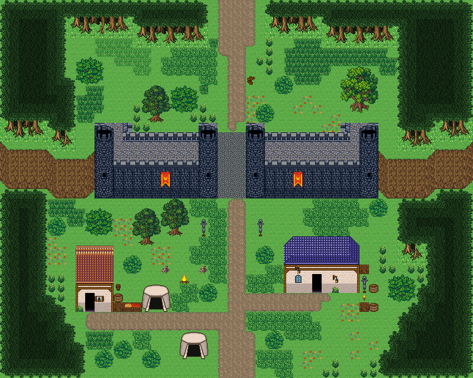

# 잿빛 고개 국경 관문

두 나라를 가르는 고갯길의 관문 요새. 성벽 문 하나로만 넘어가고, 남쪽에 수비대 막사와 천막 야영지. 양쪽 절벽 사이 고갯길을 성벽이 가로막고 가운데 두 원탑이 지키는 문루 하나로만 넘어간다. 남쪽(우리 땅)에 수비대 막사·천막·모닥불·무기 거치대, 북쪽(국경 너머)으로 길이 이어진다. 50×40, tilesetId=forest_harmony. 통행 검사 시작 (24,35).



## 출구 — 어디와 맞닿나
- 출구0 남쪽 (24,39) → 왕도로 가는 필드 북쪽 출구
- 출구1 북쪽 (24,0) → 국경 너머 산길(필드) 남쪽 출구

## 지형
```json
{"cliffs":[{"points":[[0,15],[4,15],[6,16],[9,16]],"height":4,"left":"open","right":"open"},{"points":[[40,16],[44,16],[46,15],[49,15]],"height":4,"left":"open","right":"open"}],"stairs":[],"landmarks":[]}
```

## 집 (템플릿·역할·문)
```json
[{"template":7,"role":"수비대 막사","x":30,"y":25,"w":8,"h":6,"door":{"x":33,"y":30},"front":{"x":33,"y":31},"yard":"guard","yardSide":"right"},{"template":3,"role":"관문지기 집","x":8,"y":26,"w":4,"h":7,"door":{"x":9,"y":32},"front":{"x":9,"y":33},"yard":"storage","yardSide":"right"}]
```

## 소품 (주인·이유가 있는 것만 남겼다)
```json
[{"name":"천막","x":15,"y":30,"w":3,"h":3,"purpose":"수비병 천막"},{"name":"천막","x":19,"y":35,"w":3,"h":3,"purpose":"수비병 천막"},{"name":"모닥불","x":19,"y":29,"w":1,"h":1,"purpose":"야영 모닥불"},{"name":"통나무 더미","x":17,"y":28,"w":1,"h":1},{"name":"통나무 더미","x":21,"y":28,"w":1,"h":1},{"name":"무기 거치대","x":21,"y":23,"w":1,"h":2,"owner":"문루","purpose":"성문 앞 창걸이"},{"name":"무기 거치대","x":27,"y":23,"w":1,"h":2,"owner":"문루","purpose":"성문 앞 창걸이"},{"name":"나무 이정표","x":26,"y":8,"w":1,"h":1,"purpose":"국경 표지"},{"name":"나무 상자","x":38,"y":32,"w":1,"h":1},{"name":"술통","x":39,"y":32,"w":1,"h":1},{"name":"무기 거치대","x":38,"y":29,"w":1,"h":2,"owner":"outdoor-border-fortress-house-1","purpose":"경비"},{"name":"벽 횃불","x":38,"y":31,"w":1,"h":1,"owner":"outdoor-border-fortress-house-1","purpose":"경비"},{"name":"나무 상자","x":38,"y":28,"w":1,"h":1,"owner":"outdoor-border-fortress-house-1","purpose":"경비"},{"name":"술통","x":39,"y":30,"w":1,"h":1,"owner":"outdoor-border-fortress-house-1","purpose":"경비"},{"name":"나무 상자","x":12,"y":32,"w":1,"h":1,"owner":"outdoor-border-fortress-house-2","purpose":"창고"},{"name":"술통","x":12,"y":31,"w":1,"h":1,"owner":"outdoor-border-fortress-house-2","purpose":"창고"},{"name":"작은 오크통","x":12,"y":30,"w":1,"h":1,"owner":"outdoor-border-fortress-house-2","purpose":"창고"},{"name":"과일 상자","x":13,"y":32,"w":2,"h":1,"owner":"outdoor-border-fortress-house-2","purpose":"창고"}]
```

## 포장·다리·부두·덩이
```json
[{"name":"국경 성벽 · 왕궁이 있는 이중 성벽 도시의 남벽","kind":"piece","x":10,"y":13,"w":30,"h":8},{"name":"관문 문루","kind":"piece","x":21,"y":13,"w":7,"h":8},{"name":"파랑 석벽 rect-wide 집","kind":"house","x":30,"y":25,"w":8,"h":6},{"name":"왕궁 도시 · 주황 박공 회벽집 4×7 ②","kind":"house","x":8,"y":26,"w":4,"h":7},{"name":"나무 · small-bush","kind":"vegetation","x":39,"y":21,"w":2,"h":2},{"name":"나무 · big-oak","kind":"vegetation","x":36,"y":7,"w":4,"h":5},{"name":"나무 · round-bush","kind":"vegetation","x":8,"y":6,"w":3,"h":3},{"name":"나무 · tree","kind":"vegetation","x":17,"y":21,"w":3,"h":4},{"name":"나무 · tree","kind":"vegetation","x":14,"y":22,"w":3,"h":4},{"name":"나무 · tree","kind":"vegetation","x":15,"y":9,"w":3,"h":4},{"name":"나무 · round-bush","kind":"vegetation","x":18,"y":9,"w":3,"h":3},{"name":"나무 · small-bush","kind":"vegetation","x":5,"y":23,"w":2,"h":2},{"name":"나무 · round-bush","kind":"vegetation","x":9,"y":22,"w":3,"h":3},{"name":"나무 · small-bush","kind":"vegetation","x":28,"y":35,"w":2,"h":2},{"name":"나무 · small-bush","kind":"vegetation","x":12,"y":36,"w":2,"h":2},{"name":"나무 · small-bush","kind":"vegetation","x":10,"y":37,"w":2,"h":2},{"name":"나무 · small-bush","kind":"vegetation","x":15,"y":37,"w":2,"h":2},{"name":"나무 · small-bush","kind":"vegetation","x":21,"y":30,"w":2,"h":2},{"name":"나무 · small-bush","kind":"vegetation","x":13,"y":27,"w":2,"h":2},{"name":"나무 · small-bush","kind":"vegetation","x":27,"y":11,"w":2,"h":2},{"name":"나무 · small-bush","kind":"vegetation","x":27,"y":26,"w":2,"h":2},{"name":"나무 · round-bush","kind":"vegetation","x":41,"y":29,"w":3,"h":3},{"name":"나무 · small-bush","kind":"vegetation","x":29,"y":8,"w":2,"h":2}]
```


## 채우기 규칙 (빈칸 게이트: 마을·장면 한 화면 17×13 에 맨땅 40% 이하·가장 큰 빈 네모 4칸 이하, 필드 50%·5칸)
맨땅(plain)으로 세는 칸: 잔디 240·잔디 질감 1140~1147, 포장 몸통 포석 190·석판 307·자갈 310·흙 421·모래 424·눈 67. 빈칸은 **자연 덩이로 먼저** 줄이고, 생활 소품은 주인이 있을 때만 둔다.
- 나무 덩이: 나무 키트(활엽수 978~980/1008~1010·1038~1040/1068~1070 3×4, 둥근 덤불 983~985/1013~1015/1043~1045 3×3, 작은 덤불 1073/1074/1103/1104 2×2)를 어깨를 붙여 3~7그루씩. 줄·바둑판으로 세우지 않는다.
- 꽃: 들꽃 348 을 **3~5칸 묶음**(2×2 속 + 한두 칸)이나 화단 키트(꽃 화단·화분)로만. 한 칸씩 흩은 「색종이 밭」 금지.
- 덤불 289 묶음·작은 덤불 2×2, 바위 537·29 는 3~6칸 무리로 절벽 발치·물가·숲 가장자리에만. 한 줄(가로·세로 3칸 이상 일렬) 금지.
- 키큰 풀: E builtin_tall_grass(243~335, 숲 수관 1칸 안)·F builtin_tall_grass_light(1124~1126/1154~1156/1184~1186, 외톨이 1127, 속 1157, 트인 곳)·G builtin_tall_grass_short(1128~1130/1158~1160/1188~1190, 외톨이 1131, 속 1161, 집·길 3칸 안). 덩이마다 한 종류, 2×2 이상, variantMap 으로 이웃에 맞춰 고른다(scripts/content/lib/tall-grass.mjs arrangeTallGrass).
- 금지 재료: 짙은 수풀 builtin_undergrowth(9·11·39~41·69~71·99~101, 검은 초록 구불이), 어두운 덤불 986~988·1016~1018·1046~1048(구덩이로 보임), 마른 가지 740·바위·뼈 383·부서진 울타리 410 을 고르게 흩뿌리기(절벽·폐허 벽·물가 곁 1~3곳에 몰아 둔다).
- 주인 없는 소품 금지: 벤치·통나무·상자·항아리·허수아비·표지판은 2칸 안에 이유(집 문·가게·밭·우물·부두·작업장·길)가 있어야 한다. 없으면 두지 말고 뺀다.

## 검사
```json
{"reachable":795,"emptiness":{"maxSq":4,"screen":0.335,"at":[28,21],"screenAt":[20,4]}}
```

전체 두 레이어는 「잿빛 고개 국경 관문 · 0행부터 전체 배열」 문서가 정답이다.
