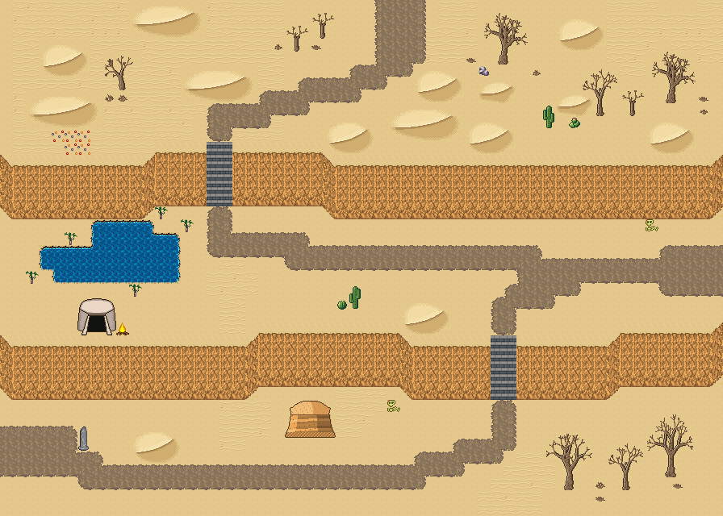

# 금빛 모래언덕

모래언덕 둔덕 두 줄과 작은 샘의 사막 필드. 사구와 모래 물결 사이로 대상 길이 이어진다. 사암 둔덕 두 줄이 층을 이루고 돌계단으로 오르내린다. 아랫단에 야자수 둘러선 작은 샘, 모래밭은 크고 작은 사구와 모래 물결이 덮고 사암 메사·선인장 무리·짐승 해골이 드문드문 있다. 서쪽에서 동쪽으로 대상 길이 난다. 56×40, tilesetId=forest_harmony_desert. 통행 검사 시작 (4,34).



## 출구 — 어디와 맞닿나
- 출구0 서쪽 (0,34) → 사막 오아시스 도시 쪽 길
- 출구1 동쪽 (55,20) → 다음 필드
- 출구2 북쪽 (30,0) → 오아시스 도시 남쪽 출구

## 지형
```json
{"cliffs":[{"points":[[0,12],[10,12],[12,11],[24,11],[26,12],[55,12]],"height":4,"left":"open","right":"open"},{"points":[[0,26],[18,26],[20,25],[30,25],[32,26],[46,26],[48,25],[55,25]],"height":4,"left":"open","right":"open"}],"stairs":[{"x":16,"y":11,"height":4},{"x":38,"y":26,"height":4}],"landmarks":[]}
```

## 집 (템플릿·역할·문)
```json
[]
```

## 소품 (주인·이유가 있는 것만 남겼다)
```json
[{"name":"해골","x":30,"y":31,"w":1,"h":1},{"name":"해골","x":50,"y":17,"w":1,"h":1},{"name":"돌 오벨리스크","x":6,"y":33,"w":1,"h":2,"purpose":"모래에 묻힌 옛 표석"},{"name":"천막","x":6,"y":23,"w":3,"h":3,"purpose":"나그네 천막"},{"name":"모닥불","x":9,"y":25,"w":1,"h":1}]
```

## 포장·다리·부두·덩이
```json
[]
```


## 잎 없는 나무 덩이 (lib/bare-trees.mjs arrangeBareGroves)
덩이마다 밑동 중심 foot, 나무 [그룹 id, 왼쪽 위 x, y], 밑동 옆 props [{tile, x, y}](바위 537·마른 덤불·선인장 769).
```json
[{"foot":[9,7],"trees":[["bare-trees:mid-3",8,3]],"props":[[2907,8,7],[2937,9,7]]},{"foot":[52,39],"trees":[["bare-trees:big-2",50,32],["bare-trees:mid-2",47,34]],"props":[[2909,52,37]]},{"foot":[39,5],"trees":[["bare-trees:big-3",37,0]],"props":[[537,37,5],[2909,36,4],[2908,41,5]]},{"foot":[44,37],"trees":[["bare-trees:big-1",42,33]],"props":[[2909,46,38],[2937,46,37]]},{"foot":[52,4],"trees":[["bare-trees:big-3",50,3],["bare-trees:small-2",48,6],["bare-trees:mid-2",45,5]],"props":[[2909,54,7],[2938,54,8]]},{"foot":[23,2],"trees":[["bare-trees:small-2",22,1],["bare-trees:small-2",24,0]],"props":[[2909,24,3],[2908,21,3]]}]
```

## 채우기 규칙 (빈칸 게이트: 마을·장면 한 화면 17×13 에 맨땅 40% 이하·가장 큰 빈 네모 4칸 이하, 필드 50%·5칸)
맨땅(plain)으로 세는 칸: 잔디 240·잔디 질감 1140~1147, 포장 몸통 포석 190·석판 307·자갈 310·흙 421·모래 424·눈 67. 빈칸은 **자연 덩이로 먼저** 줄이고, 생활 소품은 주인이 있을 때만 둔다.
- **나무를 거의 두지 않는다**(사용자 2026-09-25: 사막·화산은 나무 비중이 적어야 한다). 잎 달린 나무 도장(960~1123)·나무 키트·수관 덩이(굽이숲 2550~2596·수관 1564~1594)·덤불 289 를 쓰지 않는다. 나무 대신 낱개 바위·덤불을 흩뿌리지도 않는다.
- 나무는 잎 없는 나무(2880~3029, 타일 그룹 bare-trees:big-1…3·mid-1…3·small-1…3·shrub-1…5)를 **덩이로만** 세운다: 큰/중간 한 그루 + 곁나무 0~2 + 밑동 옆 마른 덤불(shrub), 바위 537 은 덩이 열에 셋 정도만(선인장은 덩이에 붙이지 않는다). 덩이 사이는 맵 가장자리 띠 8칸·안쪽 13칸, 집·길·문·계단·다리 2칸 밖, 물·절벽·다른 물건 1칸 밖. 같은 밑동 줄에 세 그루 넘게 늘어세우지 않는다(울타리처럼 보인다). 도우미: scripts/content/lib/bare-trees.mjs arrangeBareGroves(사막 물가 야자 770 은 plantPalmGroves). 이 맵들은 채우기가 남긴 1×2 자리를 덩이 후보로 주었다.
- **빈칸은 땅으로 메운다**(개정6, 사용자 2026-09-25: 「돌·선인장·풀이 너무 많다」, 「화산은 균열·용암, 모래는 사구」). 낱개 바위 537·29 무리·선인장 769 무리·키큰 풀로 메우지 않는다. 기후 지형(3030~, 같은 타일셋의 「사막 마을」 분류 문서 「기후 지형」 절)을 깐다: 사구(climate-terrain:dune-*, 3×2·4×3·6×3; 필드는 사구 3~6개를 한두 칸 띄운 사구 벌판, 바닥은 모래 물결)·모래 물결 3300~3303 덩이·갈라진 땅(desert_cracked_earth_47, 물 6칸 밖)·사암 메사 1~2(가장자리 띠)·외딴 곳 뼈·묻힌 기둥 한 곳·선인장 무리(큰 선인장 1 + 작은 선인장 1~2) 두세 곳. 들꽃은 물가 7칸 안에만 묶음으로. 길·포장·문 앞·집 한 칸 둘레에는 깔지 않고, 통행 불가 조각은 물·절벽·길에서 한 칸 띄우며 문·출구로 가는 길을 끊으면 되돌린다. 도우미: scripts/content/lib/outdoor-kit.mjs `OutdoorMap.climateGround`(lib/climate-terrain.mjs dressDesertGround)
- 꽃: 들꽃 348 을 **3~5칸 묶음**(2×2 속 + 한두 칸)이나 화단 키트(꽃 화단·화분)로만. 한 칸씩 흩은 「색종이 밭」 금지.
- 덤불 289 묶음·작은 덤불 2×2, 바위 537·29 는 3~6칸 무리로 절벽 발치·물가·숲 가장자리에만. 한 줄(가로·세로 3칸 이상 일렬) 금지.
- 키큰 풀 E/F/G 금지: 모래·눈·재·가을 시트에 깐 풀(재칠본 포함)은 초록 띠나 진흙 얼룩으로 읽힌다. 이 시트에는 풀 덩이를 깔지 않는다.
- 금지 재료: 짙은 수풀 builtin_undergrowth(9·11·39~41·69~71·99~101, 검은 초록 구불이), 어두운 덤불 986~988·1016~1018·1046~1048(구덩이로 보임), 마른 가지 740·바위·뼈 383·부서진 울타리 410 을 고르게 흩뿌리기(절벽·폐허 벽·물가 곁 1~3곳에 몰아 둔다).
- 주인 없는 소품 금지: 벤치·통나무·상자·항아리·허수아비·표지판은 2칸 안에 이유(집 문·가게·밭·우물·부두·작업장·길)가 있어야 한다. 없으면 두지 말고 뺀다.

## 검사
```json
{"reachable":1592,"emptiness":{"maxSq":4,"screen":0.462,"at":[20,21],"screenAt":[39,27]}}
```

전체 두 레이어는 「금빛 모래언덕 · 0행부터 전체 배열」 문서가 정답이다.
