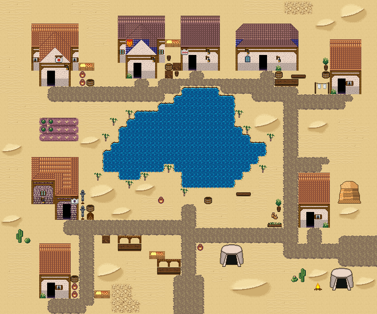

# 모래바람 오아시스 도시

사막 한가운데 오아시스를 둘러싼 도시. 물가 야자수 고리, 집 여섯과 천막 장터, 대상(隊商) 쉼터. 가운데 큰 오아시스 못을 야자수가 두르고, 그 둘레에 흙빛 지붕 집 여섯 채가 모여 있다. 남쪽 물가 장터에 노점·천막·과일 좌판, 동쪽에 대상 천막 쉼터. 남쪽과 동쪽 모랫길로 들어온다. 48×40, tilesetId=forest_harmony_desert. 통행 검사 시작 (23,35).



## 출구 — 어디와 맞닿나
- 출구0 남쪽 (23,39) → 사막 모래언덕 필드 북쪽 출구
- 출구1 동쪽 (47,31) → 대상 길(필드)

## 지형
```json
{"cliffs":[],"stairs":[],"landmarks":[]}
```

## 집 (템플릿·역할·문)
```json
[{"template":2,"role":"물지기 집","x":4,"y":3,"w":6,"h":8,"door":{"x":6,"y":10},"front":{"x":6,"y":11},"yard":"desert","yardSide":"right"},{"template":0,"role":"상인 집","x":15,"y":2,"w":6,"h":8,"door":{"x":17,"y":9},"front":{"x":17,"y":10},"yard":"storage","yardSide":"right"},{"template":7,"role":"대상 숙소","x":30,"y":3,"w":8,"h":6,"door":{"x":33,"y":8},"front":{"x":33,"y":9},"yard":"tavern","yardSide":"front"},{"template":3,"role":"집","x":42,"y":5,"w":4,"h":7,"door":{"x":43,"y":11},"front":{"x":43,"y":12},"yard":"laundry","yardSide":"left"},{"template":1,"role":"대장간","x":4,"y":20,"w":6,"h":8,"door":{"x":8,"y":27},"front":{"x":8,"y":28},"yard":"smith","yardSide":"right"},{"template":5,"role":"약초집","x":38,"y":22,"w":4,"h":7,"door":{"x":39,"y":28},"front":{"x":39,"y":29},"yard":"herbs","yardSide":"left"},{"template":6,"role":"물 상인 집","x":23,"y":2,"w":5,"h":7,"door":{"x":24,"y":8},"front":{"x":24,"y":9},"yard":"storage","yardSide":"left"},{"template":3,"role":"대추야자 농가","x":5,"y":31,"w":4,"h":7,"door":{"x":6,"y":37},"front":{"x":6,"y":38},"yard":"desert","yardSide":"right"}]
```

## 소품 (주인·이유가 있는 것만 남겼다)
```json
[{"name":"장터 노점","x":15,"y":30,"w":3,"h":2,"purpose":"오아시스 장터"},{"name":"과일 좌판","x":19,"y":32,"w":2,"h":1,"purpose":"대추야자 좌판"},{"name":"천막","x":28,"y":31,"w":3,"h":3,"purpose":"장사꾼 천막"},{"name":"천막","x":42,"y":34,"w":3,"h":3,"purpose":"대상 천막"},{"name":"모닥불","x":40,"y":36,"w":1,"h":1,"purpose":"대상 모닥불"},{"name":"나무통","x":26,"y":25,"w":1,"h":1,"owner":"오아시스 물가","purpose":"물 긷는 통"},{"name":"항아리","x":20,"y":25,"w":1,"h":1,"owner":"오아시스 물가","purpose":"물항아리"},{"name":"벤치","x":30,"y":24,"w":2,"h":1,"owner":"오아시스 물가","purpose":"물가 쉼터"},{"name":"장터 노점","x":20,"y":33,"w":3,"h":2,"owner":"장터","purpose":"오아시스 장터"},{"name":"항아리","x":25,"y":31,"w":1,"h":1,"owner":"장터","purpose":"장터 물항아리"},{"name":"나무 상자","x":13,"y":30,"w":1,"h":1,"owner":"장터","purpose":"장터 짐"},{"name":"항아리","x":10,"y":10,"w":1,"h":1,"owner":"outdoor-desert-oasis-city-house-1","purpose":"대추야자 손질"},{"name":"항아리","x":10,"y":9,"w":1,"h":1,"owner":"outdoor-desert-oasis-city-house-1","purpose":"대추야자 손질"},{"name":"과일 좌판","x":10,"y":8,"w":2,"h":1,"owner":"outdoor-desert-oasis-city-house-1","purpose":"대추야자 손질"},{"name":"나무통","x":11,"y":10,"w":1,"h":1,"owner":"outdoor-desert-oasis-city-house-1","purpose":"대추야자 손질"},{"name":"나무 상자","x":21,"y":9,"w":1,"h":1,"owner":"outdoor-desert-oasis-city-house-2","purpose":"창고"},{"name":"술통","x":21,"y":8,"w":1,"h":1,"owner":"outdoor-desert-oasis-city-house-2","purpose":"창고"},{"name":"작은 오크통","x":21,"y":7,"w":1,"h":1,"owner":"outdoor-desert-oasis-city-house-2","purpose":"창고"},{"name":"술통","x":35,"y":9,"w":1,"h":1,"owner":"outdoor-desert-oasis-city-house-3","purpose":"주막"},{"name":"벤치","x":37,"y":9,"w":2,"h":1,"owner":"outdoor-desert-oasis-city-house-3","purpose":"주막"},{"name":"가로 탁자","x":35,"y":10,"w":3,"h":1,"owner":"outdoor-desert-oasis-city-house-3","purpose":"주막"},{"name":"빨랫줄","x":40,"y":10,"w":2,"h":2,"owner":"outdoor-desert-oasis-city-house-4","purpose":"빨래 말리기"},{"name":"나무통","x":41,"y":9,"w":1,"h":1,"owner":"outdoor-desert-oasis-city-house-4","purpose":"빨래 말리기"},{"name":"화분","x":41,"y":7,"w":1,"h":2,"owner":"outdoor-desert-oasis-city-house-4","purpose":"빨래 말리기"},{"name":"무기 거치대","x":10,"y":26,"w":1,"h":2,"owner":"outdoor-desert-oasis-city-house-5","purpose":"대장일"},{"name":"무기 거치대","x":10,"y":24,"w":1,"h":2,"owner":"outdoor-desert-oasis-city-house-5","purpose":"대장일"},{"name":"장작","x":11,"y":27,"w":1,"h":1,"owner":"outdoor-desert-oasis-city-house-5","purpose":"대장일"},{"name":"나무통","x":11,"y":26,"w":1,"h":1,"owner":"outdoor-desert-oasis-city-house-5","purpose":"대장일"},{"name":"약초 화분","x":34,"y":28,"w":2,"h":1,"owner":"outdoor-desert-oasis-city-house-6","purpose":"약초 손질"},{"name":"씨앗 자루","x":34,"y":27,"w":2,"h":1,"owner":"outdoor-desert-oasis-city-house-6","purpose":"약초 손질"},{"name":"화분","x":35,"y":25,"w":1,"h":2,"owner":"outdoor-desert-oasis-city-house-6","purpose":"약초 손질"},{"name":"나무 상자","x":22,"y":8,"w":1,"h":1,"owner":"outdoor-desert-oasis-city-house-7","purpose":"창고"},{"name":"작은 오크통","x":22,"y":9,"w":1,"h":1,"owner":"outdoor-desert-oasis-city-house-7","purpose":"창고"},{"name":"과일 상자","x":21,"y":5,"w":2,"h":1,"owner":"outdoor-desert-oasis-city-house-7","purpose":"창고"},{"name":"항아리","x":9,"y":37,"w":1,"h":1,"owner":"outdoor-desert-oasis-city-house-8","purpose":"대추야자 손질"},{"name":"항아리","x":9,"y":36,"w":1,"h":1,"owner":"outdoor-desert-oasis-city-house-8","purpose":"대추야자 손질"},{"name":"과일 좌판","x":12,"y":37,"w":2,"h":1,"owner":"outdoor-desert-oasis-city-house-8","purpose":"대추야자 손질"},{"name":"나무통","x":9,"y":35,"w":1,"h":1,"owner":"outdoor-desert-oasis-city-house-8","purpose":"대추야자 손질"}]
```

## 포장·다리·부두·덩이
```json
[{"name":"왕궁 도시 · 주황 박공 회벽집 6×8","kind":"house","x":4,"y":3,"w":6,"h":8},{"name":"왕궁 도시 · 파랑 박공 회벽집 6×8 ②","kind":"house","x":15,"y":2,"w":6,"h":8},{"name":"파랑 석벽 rect-wide 집","kind":"house","x":30,"y":3,"w":8,"h":6},{"name":"왕궁 도시 · 주황 박공 회벽집 4×7 ②","kind":"house","x":42,"y":5,"w":4,"h":7},{"name":"오렌지 회벽 l-mirror 집","kind":"house","x":4,"y":20,"w":6,"h":8},{"name":"왕궁 도시 · 주황 박공 회벽집 4×7 ②","kind":"house","x":38,"y":22,"w":4,"h":7},{"name":"왕궁 도시 · 파랑 회벽집 5×7","kind":"house","x":23,"y":2,"w":5,"h":7},{"name":"왕궁 도시 · 주황 박공 회벽집 4×7 ②","kind":"house","x":5,"y":31,"w":4,"h":7},{"name":"오아시스 물가 밭","kind":"paving","x":5,"y":15,"w":5,"h":3,"group":"farm"}]
```


## 채우기 규칙 (빈칸 게이트: 마을·장면 한 화면 17×13 에 맨땅 40% 이하·가장 큰 빈 네모 4칸 이하, 필드 50%·5칸)
맨땅(plain)으로 세는 칸: 잔디 240·잔디 질감 1140~1147, 포장 몸통 포석 190·석판 307·자갈 310·흙 421·모래 424·눈 67. 빈칸은 **자연 덩이로 먼저** 줄이고, 생활 소품은 주인이 있을 때만 둔다.
- **나무를 거의 두지 않는다**(사용자 2026-09-25: 사막·화산은 나무 비중이 적어야 한다). 잎 달린 나무 도장(960~1123)·나무 키트·수관 덩이(굽이숲 2550~2596·수관 1564~1594)·덤불 289 를 쓰지 않는다. 나무 대신 낱개 바위·덤불을 흩뿌리지도 않는다.
- 나무는 잎 없는 나무(2880~3029, 타일 그룹 bare-trees:big-1…3·mid-1…3·small-1…3·shrub-1…5)를 **덩이로만** 세운다: 큰/중간 한 그루 + 곁나무 0~2 + 밑동 옆 마른 덤불(shrub), 바위 537 은 덩이 열에 셋 정도만(선인장은 덩이에 붙이지 않는다). 덩이 사이는 맵 가장자리 띠 8칸·안쪽 13칸, 집·길·문·계단·다리 2칸 밖, 물·절벽·다른 물건 1칸 밖. 같은 밑동 줄에 세 그루 넘게 늘어세우지 않는다(울타리처럼 보인다). 도우미: scripts/content/lib/bare-trees.mjs arrangeBareGroves(사막 물가 야자 770 은 plantPalmGroves). 이 맵들은 채우기가 남긴 1×2 자리를 덩이 후보로 주었다.
- **빈칸은 땅으로 메운다**(개정6, 사용자 2026-09-25: 「돌·선인장·풀이 너무 많다」, 「화산은 균열·용암, 모래는 사구」). 낱개 바위 537·29 무리·선인장 769 무리·키큰 풀로 메우지 않는다. 기후 지형(3030~, 같은 타일셋의 「사막 마을」 분류 문서 「기후 지형」 절)을 깐다: 사구(climate-terrain:dune-*, 3×2·4×3·6×3; 필드는 사구 3~6개를 한두 칸 띄운 사구 벌판, 바닥은 모래 물결)·모래 물결 3300~3303 덩이·갈라진 땅(desert_cracked_earth_47, 물 6칸 밖)·사암 메사 1~2(가장자리 띠)·외딴 곳 뼈·묻힌 기둥 한 곳·선인장 무리(큰 선인장 1 + 작은 선인장 1~2) 두세 곳. 들꽃은 물가 7칸 안에만 묶음으로. 길·포장·문 앞·집 한 칸 둘레에는 깔지 않고, 통행 불가 조각은 물·절벽·길에서 한 칸 띄우며 문·출구로 가는 길을 끊으면 되돌린다. 도우미: scripts/content/lib/outdoor-kit.mjs `OutdoorMap.climateGround`(lib/climate-terrain.mjs dressDesertGround)
- 꽃: 들꽃 348 을 **3~5칸 묶음**(2×2 속 + 한두 칸)이나 화단 키트(꽃 화단·화분)로만. 한 칸씩 흩은 「색종이 밭」 금지.
- 덤불 289 묶음·작은 덤불 2×2, 바위 537·29 는 3~6칸 무리로 절벽 발치·물가·숲 가장자리에만. 한 줄(가로·세로 3칸 이상 일렬) 금지.
- 키큰 풀 E/F/G 금지: 모래·눈·재·가을 시트에 깐 풀(재칠본 포함)은 초록 띠나 진흙 얼룩으로 읽힌다. 이 시트에는 풀 덩이를 깔지 않는다.
- 금지 재료: 짙은 수풀 builtin_undergrowth(9·11·39~41·69~71·99~101, 검은 초록 구불이), 어두운 덤불 986~988·1016~1018·1046~1048(구덩이로 보임), 마른 가지 740·바위·뼈 383·부서진 울타리 410 을 고르게 흩뿌리기(절벽·폐허 벽·물가 곁 1~3곳에 몰아 둔다).
- 주인 없는 소품 금지: 벤치·통나무·상자·항아리·허수아비·표지판은 2칸 안에 이유(집 문·가게·밭·우물·부두·작업장·길)가 있어야 한다. 없으면 두지 말고 뺀다.

## 검사
```json
{"reachable":1327,"emptiness":{"maxSq":3,"screen":0.362,"at":[4,0],"screenAt":[0,0]}}
```

전체 두 레이어는 「모래바람 오아시스 도시 · 0행부터 전체 배열」 문서가 정답이다.
