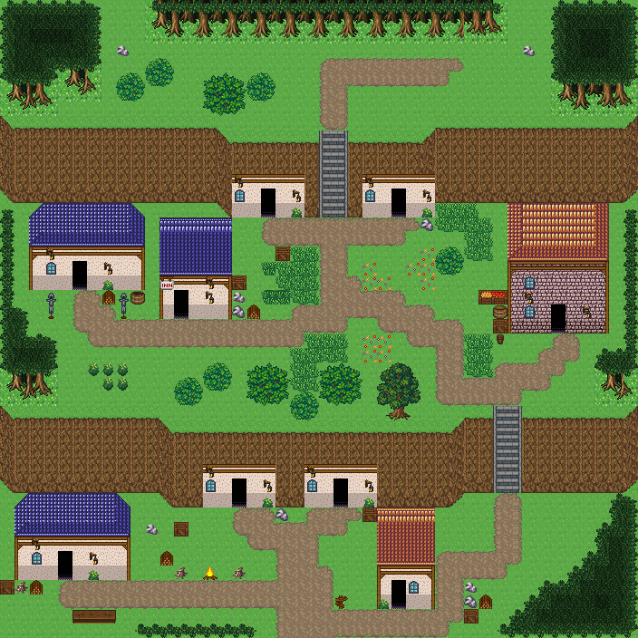

# 쇠망치 광산 마을

절벽 밑에 붙여 지은 돌집과 절벽을 파고든 문 달린 절벽 집의 광산 마을. 두 층 절벽을 돌계단으로 오르내리고 집마다 광석·대장일·창고 마당. 두 층 절벽 밑동에 돌집들이 절벽에 등을 붙이고 서 있고, 절벽 밑동을 파고든 절벽 집 넷이 문을 절벽 발치로 내고 있다. 돌계단 둘로 오르내리며 집 앞 마당마다 광석 더미·무기 거치대·장작·상자가 있다. 아랫단 모닥불 광장, 남쪽으로 들어온다. 44×44, tilesetId=forest_harmony. 통행 검사 시작 (20,39).



## 출구 — 어디와 맞닿나
- 출구0 남쪽 (20,43) → 산길·협곡 필드 북쪽 출구

## 지형
```json
{"cliffs":[{"points":[[0,8],[14,8],[16,9],[28,9],[30,8],[43,8]],"height":5,"left":"open","right":"open"},{"points":[[0,28],[10,28],[12,29],[30,29],[32,28],[43,28]],"height":5,"left":"open","right":"open"}],"stairs":[{"x":22,"y":9,"height":5},{"x":34,"y":28,"height":5}],"landmarks":[]}
```

## 집 (템플릿·역할·문)
```json
[{"template":7,"role":"절벽 광부 집","x":16,"y":12,"w":5,"h":3,"door":{"x":18,"y":14},"front":{"x":18,"y":15},"yard":null},{"template":7,"role":"갱도 관리소","x":25,"y":12,"w":5,"h":3,"door":{"x":27,"y":14},"front":{"x":27,"y":15},"yard":null},{"template":7,"role":"절벽 광석 창고","x":14,"y":32,"w":5,"h":3,"door":{"x":16,"y":34},"front":{"x":16,"y":35},"yard":null},{"template":7,"role":"절벽 광부 집","x":21,"y":32,"w":5,"h":3,"door":{"x":23,"y":34},"front":{"x":23,"y":35},"yard":null},{"template":7,"role":"대장장이 돌집","x":2,"y":14,"w":8,"h":6,"door":{"x":5,"y":19},"front":{"x":5,"y":20},"yard":"smith","yardSide":"front"},{"template":6,"role":"광부 돌집","x":11,"y":15,"w":5,"h":7,"door":{"x":12,"y":21},"front":{"x":12,"y":22},"yard":"mine","yardSide":"right"},{"template":4,"role":"광석 창고","x":35,"y":14,"w":7,"h":9,"door":{"x":38,"y":22},"front":{"x":38,"y":23},"yard":"storage","yardSide":"left"},{"template":7,"role":"갱목 손질집","x":1,"y":34,"w":8,"h":6,"door":{"x":4,"y":39},"front":{"x":4,"y":40},"yard":"woodwork","yardSide":"front"},{"template":3,"role":"광부 돌집","x":26,"y":35,"w":4,"h":7,"door":{"x":27,"y":41},"front":{"x":27,"y":42},"yard":"mine","yardSide":"right"}]
```

## 소품 (주인·이유가 있는 것만 남겼다)
```json
[{"name":"모닥불","x":14,"y":39,"w":1,"h":1,"owner":"광장","purpose":"광장 모닥불"},{"name":"통나무 더미","x":12,"y":39,"w":1,"h":1,"owner":"광장","purpose":"모닥불 둘레 통나무"},{"name":"통나무 더미","x":16,"y":39,"w":1,"h":1,"owner":"광장","purpose":"모닥불 둘레 통나무"},{"name":"나무 이정표","x":23,"y":41,"w":1,"h":1},{"name":"나무 상자","x":19,"y":17,"w":1,"h":1,"owner":"절벽 광부 집","purpose":"갱도에서 나온 광석 상자"},{"name":"돌 무더기","x":29,"y":15,"w":1,"h":1,"purpose":"캐낸 광석"},{"name":"돌 무더기","x":19,"y":35,"w":1,"h":1,"purpose":"캐낸 광석"},{"name":"나무 상자","x":25,"y":35,"w":1,"h":1},{"name":"회백색 바위 더미","x":8,"y":3,"w":1,"h":1},{"name":"회백색 바위 더미","x":36,"y":3,"w":1,"h":1},{"name":"회백색 바위 더미","x":10,"y":36,"w":1,"h":1,"owner":"절벽 광석 창고","purpose":"갱도에서 나온 돌"},{"name":"나무 상자","x":12,"y":36,"w":1,"h":1,"owner":"절벽 광석 창고","purpose":"광석 상자"},{"name":"장작 더미","x":11,"y":38,"w":1,"h":1,"owner":"갱목 손질집","purpose":"갱목 장작"},{"name":"무기 거치대","x":8,"y":20,"w":1,"h":2,"owner":"outdoor-dwarf-mine-house-5","purpose":"대장일"},{"name":"무기 거치대","x":3,"y":20,"w":1,"h":2,"owner":"outdoor-dwarf-mine-house-5","purpose":"대장일"},{"name":"장작","x":7,"y":20,"w":1,"h":1,"owner":"outdoor-dwarf-mine-house-5","purpose":"대장일"},{"name":"나무통","x":9,"y":20,"w":1,"h":1,"owner":"outdoor-dwarf-mine-house-5","purpose":"대장일"},{"name":"돌 무더기","x":16,"y":21,"w":1,"h":1,"owner":"outdoor-dwarf-mine-house-6","purpose":"광석 캐기"},{"name":"회백색 바위 더미","x":16,"y":20,"w":1,"h":1,"owner":"outdoor-dwarf-mine-house-6","purpose":"광석 캐기"},{"name":"나무 상자","x":16,"y":19,"w":1,"h":1,"owner":"outdoor-dwarf-mine-house-6","purpose":"광석 캐기"},{"name":"장작","x":17,"y":21,"w":1,"h":1,"owner":"outdoor-dwarf-mine-house-6","purpose":"광석 캐기"},{"name":"나무 상자","x":34,"y":22,"w":1,"h":1,"owner":"outdoor-dwarf-mine-house-7","purpose":"창고"},{"name":"술통","x":34,"y":21,"w":1,"h":1,"owner":"outdoor-dwarf-mine-house-7","purpose":"창고"},{"name":"작은 오크통","x":34,"y":23,"w":1,"h":1,"owner":"outdoor-dwarf-mine-house-7","purpose":"창고"},{"name":"과일 상자","x":33,"y":20,"w":2,"h":1,"owner":"outdoor-dwarf-mine-house-7","purpose":"창고"},{"name":"장작 더미","x":2,"y":40,"w":1,"h":1,"owner":"outdoor-dwarf-mine-house-8","purpose":"목공"},{"name":"통나무 더미","x":1,"y":40,"w":1,"h":1,"owner":"outdoor-dwarf-mine-house-8","purpose":"목공"},{"name":"나무 상자","x":0,"y":40,"w":1,"h":1,"owner":"outdoor-dwarf-mine-house-8","purpose":"목공"},{"name":"가로 탁자","x":5,"y":42,"w":3,"h":1,"owner":"outdoor-dwarf-mine-house-8","purpose":"목공"},{"name":"돌 무더기","x":32,"y":41,"w":1,"h":1,"owner":"outdoor-dwarf-mine-house-9","purpose":"광석 캐기"},{"name":"회백색 바위 더미","x":32,"y":40,"w":1,"h":1,"owner":"outdoor-dwarf-mine-house-9","purpose":"광석 캐기"},{"name":"나무 상자","x":32,"y":42,"w":1,"h":1,"owner":"outdoor-dwarf-mine-house-9","purpose":"광석 캐기"},{"name":"장작","x":33,"y":41,"w":1,"h":1,"owner":"outdoor-dwarf-mine-house-9","purpose":"광석 캐기"}]
```

## 포장·다리·부두·덩이
```json
[{"name":"파랑 석벽 rect-wide 집","kind":"house","x":2,"y":14,"w":8,"h":6},{"name":"왕궁 도시 · 파랑 회벽집 5×7","kind":"house","x":11,"y":15,"w":5,"h":7},{"name":"오렌지 회벽 2층 rect-2f 집","kind":"house","x":35,"y":14,"w":7,"h":9},{"name":"파랑 석벽 rect-wide 집","kind":"house","x":1,"y":34,"w":8,"h":6},{"name":"왕궁 도시 · 주황 박공 회벽집 4×7 ②","kind":"house","x":26,"y":35,"w":4,"h":7},{"name":"나무 · small-bush","kind":"vegetation","x":17,"y":5,"w":2,"h":2},{"name":"나무 · round-bush","kind":"vegetation","x":14,"y":5,"w":3,"h":3},{"name":"나무 · round-bush","kind":"vegetation","x":22,"y":25,"w":3,"h":3},{"name":"나무 · small-bush","kind":"vegetation","x":20,"y":27,"w":2,"h":2},{"name":"나무 · round-bush","kind":"vegetation","x":17,"y":25,"w":3,"h":3},{"name":"나무 · small-bush","kind":"vegetation","x":10,"y":4,"w":2,"h":2},{"name":"나무 · small-bush","kind":"vegetation","x":8,"y":5,"w":2,"h":2},{"name":"나무 · small-bush","kind":"vegetation","x":30,"y":17,"w":2,"h":2},{"name":"나무 · small-bush","kind":"vegetation","x":12,"y":26,"w":2,"h":2},{"name":"나무 · small-bush","kind":"vegetation","x":14,"y":25,"w":2,"h":2},{"name":"나무 · tree","kind":"vegetation","x":26,"y":25,"w":3,"h":4}]
```


## 채우기 규칙 (빈칸 게이트: 마을·장면 한 화면 17×13 에 맨땅 40% 이하·가장 큰 빈 네모 4칸 이하, 필드 50%·5칸)
맨땅(plain)으로 세는 칸: 잔디 240·잔디 질감 1140~1147, 포장 몸통 포석 190·석판 307·자갈 310·흙 421·모래 424·눈 67. 빈칸은 **자연 덩이로 먼저** 줄이고, 생활 소품은 주인이 있을 때만 둔다.
- 나무 덩이: 나무 키트(활엽수 978~980/1008~1010·1038~1040/1068~1070 3×4, 둥근 덤불 983~985/1013~1015/1043~1045 3×3, 작은 덤불 1073/1074/1103/1104 2×2)를 어깨를 붙여 3~7그루씩. 줄·바둑판으로 세우지 않는다.
- 꽃: 들꽃 348 을 **3~5칸 묶음**(2×2 속 + 한두 칸)이나 화단 키트(꽃 화단·화분)로만. 한 칸씩 흩은 「색종이 밭」 금지.
- 덤불 289 묶음·작은 덤불 2×2, 바위 537·29 는 3~6칸 무리로 절벽 발치·물가·숲 가장자리에만. 한 줄(가로·세로 3칸 이상 일렬) 금지.
- 키큰 풀: E builtin_tall_grass(243~335, 숲 수관 1칸 안)·F builtin_tall_grass_light(1124~1126/1154~1156/1184~1186, 외톨이 1127, 속 1157, 트인 곳)·G builtin_tall_grass_short(1128~1130/1158~1160/1188~1190, 외톨이 1131, 속 1161, 집·길 3칸 안). 덩이마다 한 종류, 2×2 이상, variantMap 으로 이웃에 맞춰 고른다(scripts/content/lib/tall-grass.mjs arrangeTallGrass).
- 금지 재료: 짙은 수풀 builtin_undergrowth(9·11·39~41·69~71·99~101, 검은 초록 구불이), 어두운 덤불 986~988·1016~1018·1046~1048(구덩이로 보임), 마른 가지 740·바위·뼈 383·부서진 울타리 410 을 고르게 흩뿌리기(절벽·폐허 벽·물가 곁 1~3곳에 몰아 둔다).
- 주인 없는 소품 금지: 벤치·통나무·상자·항아리·허수아비·표지판은 2칸 안에 이유(집 문·가게·밭·우물·부두·작업장·길)가 있어야 한다. 없으면 두지 말고 뺀다.

## 검사
```json
{"reachable":811,"emptiness":{"maxSq":4,"screen":0.339,"at":[32,3],"screenAt":[20,0]}}
```

전체 두 레이어는 「쇠망치 광산 마을 · 0행부터 전체 배열」 문서가 정답이다.
