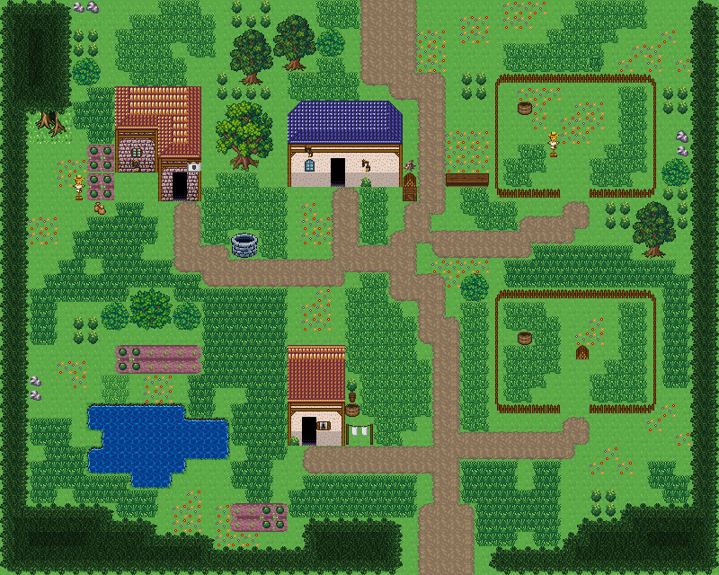

# 들녘 농장과 목장

마을 밖 농가 한 집. 농가·헛간·일꾼 집 셋, 울타리 친 목장 둘, 연못가 채소밭과 허수아비, 우물 마당. 들판 가운데 농가와 헛간이 마당을 끼고 마주 서고 마당에 우물이 있다. 동쪽에 울타리 친 목장 둘(문이 하나씩), 남서쪽 연못가에 채소밭과 허수아비, 헛간 옆에 장작·통나무·짐 상자가 쌓였다. 북쪽 흙길이 마을로, 남쪽 흙길이 들판으로 이어진다. 50×40, tilesetId=forest_harmony. 통행 검사 시작 (26,4).



## 출구 — 어디와 맞닿나
- 출구0 북쪽 (26,0) → 마을 남쪽 길
- 출구1 남쪽 (30,39) → 들판(필드) 북쪽 출구

## 지형
```json
{"cliffs":[],"stairs":[],"landmarks":[]}
```

## 집 (템플릿·역할·문)
```json
[{"template":1,"role":"농가","x":8,"y":6,"w":6,"h":8,"door":{"x":12,"y":13},"front":{"x":12,"y":14},"yard":"farm","yardSide":"left"},{"template":7,"role":"헛간","x":20,"y":7,"w":8,"h":6,"door":{"x":23,"y":12},"front":{"x":23,"y":13},"yard":"woodwork","yardSide":"right"},{"template":3,"role":"일꾼 집","x":20,"y":24,"w":4,"h":7,"door":{"x":21,"y":30},"front":{"x":21,"y":31},"yard":"laundry","yardSide":"right"}]
```

## 소품 (주인·이유가 있는 것만 남겼다)
```json
[{"name":"낮은 돌 우물","x":16,"y":16,"w":2,"h":2,"purpose":"농가 마당 우물"},{"name":"허수아비","x":38,"y":9,"w":1,"h":2,"owner":"목장","purpose":"목장 허수아비"},{"name":"나무통","x":36,"y":7,"w":1,"h":1,"owner":"목장","purpose":"여물통"},{"name":"나무통","x":36,"y":23,"w":1,"h":1,"owner":"양 목장","purpose":"여물통"},{"name":"장작 더미","x":40,"y":24,"w":1,"h":1,"owner":"양 목장","purpose":"목장 장작"},{"name":"채소밭","x":6,"y":12,"w":2,"h":2,"owner":"outdoor-farm-ranch-house-1","purpose":"농사"},{"name":"채소밭","x":6,"y":10,"w":2,"h":2,"owner":"outdoor-farm-ranch-house-1","purpose":"농사"},{"name":"허수아비","x":5,"y":12,"w":1,"h":2,"owner":"outdoor-farm-ranch-house-1","purpose":"농사"},{"name":"씨앗 자루","x":6,"y":14,"w":2,"h":1,"owner":"outdoor-farm-ranch-house-1","purpose":"농사"},{"name":"장작 더미","x":28,"y":12,"w":1,"h":1,"owner":"outdoor-farm-ranch-house-2","purpose":"목공"},{"name":"통나무 더미","x":28,"y":11,"w":1,"h":1,"owner":"outdoor-farm-ranch-house-2","purpose":"목공"},{"name":"나무 상자","x":28,"y":13,"w":1,"h":1,"owner":"outdoor-farm-ranch-house-2","purpose":"목공"},{"name":"가로 탁자","x":31,"y":12,"w":3,"h":1,"owner":"outdoor-farm-ranch-house-2","purpose":"목공"},{"name":"빨랫줄","x":24,"y":29,"w":2,"h":2,"owner":"outdoor-farm-ranch-house-3","purpose":"빨래 말리기"},{"name":"나무통","x":24,"y":28,"w":1,"h":1,"owner":"outdoor-farm-ranch-house-3","purpose":"빨래 말리기"},{"name":"화분","x":24,"y":26,"w":1,"h":2,"owner":"outdoor-farm-ranch-house-3","purpose":"빨래 말리기"}]
```

## 포장·다리·부두·덩이
```json
[{"name":"오렌지 회벽 l-mirror 집","kind":"house","x":8,"y":6,"w":6,"h":8},{"name":"파랑 석벽 rect-wide 집","kind":"house","x":20,"y":7,"w":8,"h":6},{"name":"왕궁 도시 · 주황 박공 회벽집 4×7 ②","kind":"house","x":20,"y":24,"w":4,"h":7},{"name":"목장 울타리","kind":"fence","x":34,"y":5,"w":12,"h":9},{"name":"양 목장 울타리","kind":"fence","x":34,"y":20,"w":12,"h":9},{"name":"연못가 채소밭","kind":"paving","x":8,"y":24,"w":6,"h":2,"group":"farm"},{"name":"연못가 채소밭","kind":"paving","x":16,"y":35,"w":4,"h":2,"group":"farm"},{"name":"나무 · small-bush","kind":"vegetation","x":5,"y":4,"w":2,"h":2},{"name":"나무 · tree","kind":"vegetation","x":44,"y":14,"w":3,"h":4},{"name":"나무 · small-bush","kind":"vegetation","x":46,"y":11,"w":2,"h":2},{"name":"나무 · round-bush","kind":"vegetation","x":9,"y":20,"w":3,"h":3},{"name":"나무 · small-bush","kind":"vegetation","x":7,"y":21,"w":2,"h":2},{"name":"나무 · small-bush","kind":"vegetation","x":12,"y":21,"w":2,"h":2},{"name":"나무 · tree","kind":"vegetation","x":16,"y":2,"w":3,"h":4},{"name":"나무 · tree","kind":"vegetation","x":19,"y":1,"w":3,"h":4},{"name":"나무 · big-oak","kind":"vegetation","x":15,"y":7,"w":4,"h":5},{"name":"나무 · small-bush","kind":"vegetation","x":32,"y":19,"w":2,"h":2},{"name":"나무 · small-bush","kind":"vegetation","x":22,"y":2,"w":2,"h":2}]
```


## 채우기 규칙 (빈칸 게이트: 마을·장면 한 화면 17×13 에 맨땅 40% 이하·가장 큰 빈 네모 4칸 이하, 필드 50%·5칸)
맨땅(plain)으로 세는 칸: 잔디 240·잔디 질감 1140~1147, 포장 몸통 포석 190·석판 307·자갈 310·흙 421·모래 424·눈 67. 빈칸은 **자연 덩이로 먼저** 줄이고, 생활 소품은 주인이 있을 때만 둔다.
- 나무 덩이: 나무 키트(활엽수 978~980/1008~1010·1038~1040/1068~1070 3×4, 둥근 덤불 983~985/1013~1015/1043~1045 3×3, 작은 덤불 1073/1074/1103/1104 2×2)를 어깨를 붙여 3~7그루씩. 줄·바둑판으로 세우지 않는다.
- 꽃: 들꽃 348 을 **3~5칸 묶음**(2×2 속 + 한두 칸)이나 화단 키트(꽃 화단·화분)로만. 한 칸씩 흩은 「색종이 밭」 금지.
- 덤불 289 묶음·작은 덤불 2×2, 바위 537·29 는 3~6칸 무리로 절벽 발치·물가·숲 가장자리에만. 한 줄(가로·세로 3칸 이상 일렬) 금지.
- 키큰 풀: E builtin_tall_grass(243~335, 숲 수관 1칸 안)·F builtin_tall_grass_light(1124~1126/1154~1156/1184~1186, 외톨이 1127, 속 1157, 트인 곳)·G builtin_tall_grass_short(1128~1130/1158~1160/1188~1190, 외톨이 1131, 속 1161, 집·길 3칸 안). 덩이마다 한 종류, 2×2 이상, variantMap 으로 이웃에 맞춰 고른다(scripts/content/lib/tall-grass.mjs arrangeTallGrass).
- 금지 재료: 짙은 수풀 builtin_undergrowth(9·11·39~41·69~71·99~101, 검은 초록 구불이), 어두운 덤불 986~988·1016~1018·1046~1048(구덩이로 보임), 마른 가지 740·바위·뼈 383·부서진 울타리 410 을 고르게 흩뿌리기(절벽·폐허 벽·물가 곁 1~3곳에 몰아 둔다).
- 주인 없는 소품 금지: 벤치·통나무·상자·항아리·허수아비·표지판은 2칸 안에 이유(집 문·가게·밭·우물·부두·작업장·길)가 있어야 한다. 없으면 두지 말고 뺀다.

## 검사
```json
{"reachable":1280,"emptiness":{"maxSq":2,"screen":0.339,"at":[7,0],"screenAt":[28,0]}}
```

전체 두 레이어는 「들녘 농장과 목장 · 0행부터 전체 배열」 문서가 정답이다.
