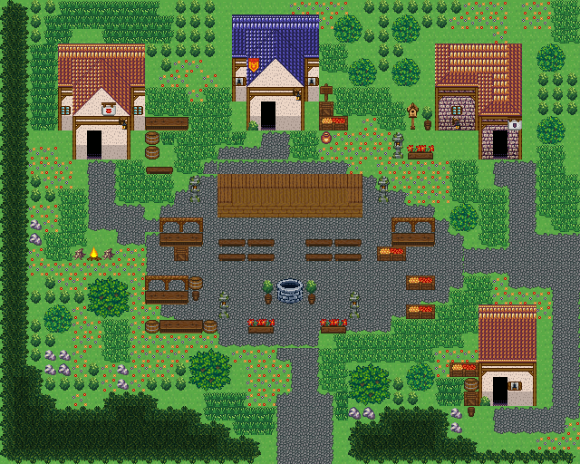

# 별빛 축제 광장

마을 축제 장면. 광장 북쪽 나무 무대와 관람 벤치, 우물 분수, 양옆 노점 줄 사이 산책길, 잔칫상과 모닥불. 집 네 채가 둘러싼 돌 광장에 축제가 열렸다. 북쪽에 등불 둘을 세운 나무 무대가 있고 그 앞에 관람 벤치 두 줄, 가운데 우물 분수가 있다. 광장 서쪽과 동쪽 가장자리를 따라 노점이 줄지어 서고 그 사이가 산책길이다. 남쪽 입구 양옆에 꽃 화단, 주막 앞에 잔칫상과 술통, 서쪽 잔디에 큰 모닥불이 있다. 남쪽과 동쪽 길로 들어온다. 40×32, tilesetId=forest_harmony. 통행 검사 시작 (20,27).



## 출구 — 어디와 맞닿나
- 출구0 남쪽 (20,31) → 마을 남쪽 길
- 출구1 동쪽 (39,17) → 필드 서쪽 출구

## 지형
```json
{"cliffs":[],"stairs":[],"landmarks":[]}
```

## 집 (템플릿·역할·문)
```json
[{"template":2,"role":"주막","x":4,"y":3,"w":6,"h":8,"door":{"x":6,"y":10},"front":{"x":6,"y":11},"yard":"tavern","yardSide":"right"},{"template":0,"role":"잡화점","x":16,"y":1,"w":6,"h":8,"door":{"x":18,"y":8},"front":{"x":18,"y":9},"yard":"shop","yardSide":"right"},{"template":1,"role":"집","x":30,"y":3,"w":6,"h":8,"door":{"x":34,"y":10},"front":{"x":34,"y":11},"yard":"garden","yardSide":"left"},{"template":3,"role":"빵집","x":33,"y":21,"w":4,"h":7,"door":{"x":34,"y":27},"front":{"x":34,"y":28},"yard":"storage","yardSide":"left"}]
```

## 소품 (주인·이유가 있는 것만 남겼다)
```json
[{"name":"돌등","x":13,"y":12,"w":1,"h":2,"purpose":"무대 등불"},{"name":"돌등","x":26,"y":12,"w":1,"h":2,"purpose":"무대 등불"},{"name":"낮은 돌 우물","x":19,"y":19,"w":2,"h":2,"purpose":"광장 분수 우물"},{"name":"벤치","x":15,"y":16,"w":2,"h":1,"purpose":"무대 관람석"},{"name":"벤치","x":17,"y":16,"w":2,"h":1,"purpose":"무대 관람석"},{"name":"벤치","x":21,"y":16,"w":2,"h":1,"purpose":"무대 관람석"},{"name":"벤치","x":23,"y":16,"w":2,"h":1,"purpose":"무대 관람석"},{"name":"벤치","x":15,"y":17,"w":2,"h":1,"purpose":"무대 관람석"},{"name":"벤치","x":17,"y":17,"w":2,"h":1,"purpose":"무대 관람석"},{"name":"벤치","x":21,"y":17,"w":2,"h":1,"purpose":"무대 관람석"},{"name":"벤치","x":23,"y":17,"w":2,"h":1,"purpose":"무대 관람석"},{"name":"장터 노점","x":11,"y":15,"w":3,"h":2,"purpose":"축제 노점"},{"name":"장터 노점","x":10,"y":19,"w":3,"h":2,"purpose":"축제 노점"},{"name":"장터 노점","x":27,"y":15,"w":3,"h":2,"purpose":"축제 노점"},{"name":"과일 좌판","x":28,"y":19,"w":2,"h":1,"purpose":"과일 노점"},{"name":"과일 좌판","x":28,"y":21,"w":2,"h":1,"purpose":"과일 노점"},{"name":"술통","x":13,"y":19,"w":1,"h":1,"purpose":"노점 술통"},{"name":"작은 오크통","x":13,"y":20,"w":1,"h":1,"purpose":"노점 술통"},{"name":"꽃 화단","x":17,"y":21,"w":2,"h":2,"purpose":"입구 화단"},{"name":"꽃 화단","x":22,"y":21,"w":2,"h":2,"purpose":"입구 화단"},{"name":"화분","x":18,"y":19,"w":1,"h":2,"owner":"축제","purpose":"우물가 화분"},{"name":"화분","x":21,"y":19,"w":1,"h":2,"owner":"축제","purpose":"우물가 화분"},{"name":"돌등","x":15,"y":20,"w":1,"h":2,"owner":"축제","purpose":"산책길 등불"},{"name":"돌등","x":24,"y":20,"w":1,"h":2,"owner":"축제","purpose":"산책길 등불"},{"name":"과일 상자","x":26,"y":17,"w":2,"h":1,"owner":"축제","purpose":"노점 짐"},{"name":"나무 상자","x":12,"y":17,"w":1,"h":1,"owner":"축제","purpose":"노점 짐"},{"name":"가로 탁자","x":11,"y":22,"w":3,"h":1,"purpose":"잔칫상"},{"name":"술통","x":10,"y":22,"w":1,"h":1},{"name":"술통","x":14,"y":22,"w":1,"h":1},{"name":"모닥불","x":6,"y":17,"w":1,"h":1,"owner":"축제","purpose":"축제 모닥불"},{"name":"통나무 더미","x":5,"y":17,"w":1,"h":1,"owner":"축제","purpose":"모닥불 장작"},{"name":"통나무 더미","x":7,"y":17,"w":1,"h":1,"owner":"축제","purpose":"모닥불 장작"},{"name":"술통","x":10,"y":10,"w":1,"h":1,"owner":"outdoor-festival-plaza-house-1","purpose":"주막"},{"name":"술통","x":10,"y":9,"w":1,"h":1,"owner":"outdoor-festival-plaza-house-1","purpose":"주막"},{"name":"벤치","x":10,"y":11,"w":2,"h":1,"owner":"outdoor-festival-plaza-house-1","purpose":"주막"},{"name":"가로 탁자","x":10,"y":8,"w":3,"h":1,"owner":"outdoor-festival-plaza-house-1","purpose":"주막"},{"name":"과일 좌판","x":22,"y":8,"w":2,"h":1,"owner":"outdoor-festival-plaza-house-2","purpose":"가게"},{"name":"나무 상자","x":22,"y":7,"w":1,"h":1,"owner":"outdoor-festival-plaza-house-2","purpose":"가게"},{"name":"항아리","x":22,"y":9,"w":1,"h":1,"owner":"outdoor-festival-plaza-house-2","purpose":"가게"},{"name":"표지판","x":22,"y":5,"w":1,"h":2,"owner":"outdoor-festival-plaza-house-2","purpose":"가게"},{"name":"꽃 화단","x":28,"y":9,"w":2,"h":2,"owner":"outdoor-festival-plaza-house-3","purpose":"꽃 가꾸기"},{"name":"화분","x":29,"y":7,"w":1,"h":2,"owner":"outdoor-festival-plaza-house-3","purpose":"꽃 가꾸기"},{"name":"새집","x":28,"y":7,"w":1,"h":2,"owner":"outdoor-festival-plaza-house-3","purpose":"꽃 가꾸기"},{"name":"돌등","x":27,"y":9,"w":1,"h":2,"owner":"outdoor-festival-plaza-house-3","purpose":"꽃 가꾸기"},{"name":"나무 상자","x":32,"y":27,"w":1,"h":1,"owner":"outdoor-festival-plaza-house-4","purpose":"창고"},{"name":"술통","x":32,"y":26,"w":1,"h":1,"owner":"outdoor-festival-plaza-house-4","purpose":"창고"},{"name":"작은 오크통","x":32,"y":28,"w":1,"h":1,"owner":"outdoor-festival-plaza-house-4","purpose":"창고"},{"name":"과일 상자","x":31,"y":25,"w":2,"h":1,"owner":"outdoor-festival-plaza-house-4","purpose":"창고"}]
```

## 포장·다리·부두·덩이
```json
[{"name":"축제 광장","kind":"paving","group":"builtin_cobble"},{"name":"축제 무대","kind":"stage","x":15,"y":12,"w":10,"h":3},{"name":"왕궁 도시 · 주황 박공 회벽집 6×8","kind":"house","x":4,"y":3,"w":6,"h":8},{"name":"왕궁 도시 · 파랑 박공 회벽집 6×8 ②","kind":"house","x":16,"y":1,"w":6,"h":8},{"name":"오렌지 회벽 l-mirror 집","kind":"house","x":30,"y":3,"w":6,"h":8},{"name":"왕궁 도시 · 주황 박공 회벽집 4×7 ②","kind":"house","x":33,"y":21,"w":4,"h":7},{"name":"나무 · round-bush","kind":"vegetation","x":13,"y":24,"w":3,"h":3},{"name":"나무 · round-bush","kind":"vegetation","x":24,"y":25,"w":3,"h":3},{"name":"나무 · small-bush","kind":"vegetation","x":3,"y":21,"w":2,"h":2},{"name":"나무 · small-bush","kind":"vegetation","x":24,"y":4,"w":2,"h":2},{"name":"나무 · small-bush","kind":"vegetation","x":28,"y":25,"w":2,"h":2},{"name":"나무 · round-bush","kind":"vegetation","x":6,"y":19,"w":3,"h":3},{"name":"나무 · small-bush","kind":"vegetation","x":37,"y":8,"w":2,"h":2},{"name":"나무 · small-bush","kind":"vegetation","x":27,"y":4,"w":2,"h":2},{"name":"나무 · small-bush","kind":"vegetation","x":37,"y":3,"w":2,"h":2},{"name":"나무 · small-bush","kind":"vegetation","x":23,"y":1,"w":2,"h":2},{"name":"나무 · small-bush","kind":"vegetation","x":27,"y":1,"w":2,"h":2},{"name":"나무 · small-bush","kind":"vegetation","x":31,"y":14,"w":2,"h":2}]
```


## 채우기 규칙 (빈칸 게이트: 마을·장면 한 화면 17×13 에 맨땅 40% 이하·가장 큰 빈 네모 4칸 이하, 필드 50%·5칸)
맨땅(plain)으로 세는 칸: 잔디 240·잔디 질감 1140~1147, 포장 몸통 포석 190·석판 307·자갈 310·흙 421·모래 424·눈 67. 빈칸은 **자연 덩이로 먼저** 줄이고, 생활 소품은 주인이 있을 때만 둔다.
- 나무 덩이: 나무 키트(활엽수 978~980/1008~1010·1038~1040/1068~1070 3×4, 둥근 덤불 983~985/1013~1015/1043~1045 3×3, 작은 덤불 1073/1074/1103/1104 2×2)를 어깨를 붙여 3~7그루씩. 줄·바둑판으로 세우지 않는다.
- 꽃: 들꽃 348 을 **3~5칸 묶음**(2×2 속 + 한두 칸)이나 화단 키트(꽃 화단·화분)로만. 한 칸씩 흩은 「색종이 밭」 금지.
- 덤불 289 묶음·작은 덤불 2×2, 바위 537·29 는 3~6칸 무리로 절벽 발치·물가·숲 가장자리에만. 한 줄(가로·세로 3칸 이상 일렬) 금지.
- 키큰 풀: E builtin_tall_grass(243~335, 숲 수관 1칸 안)·F builtin_tall_grass_light(1124~1126/1154~1156/1184~1186, 외톨이 1127, 속 1157, 트인 곳)·G builtin_tall_grass_short(1128~1130/1158~1160/1188~1190, 외톨이 1131, 속 1161, 집·길 3칸 안). 덩이마다 한 종류, 2×2 이상, variantMap 으로 이웃에 맞춰 고른다(scripts/content/lib/tall-grass.mjs arrangeTallGrass).
- 금지 재료: 짙은 수풀 builtin_undergrowth(9·11·39~41·69~71·99~101, 검은 초록 구불이), 어두운 덤불 986~988·1016~1018·1046~1048(구덩이로 보임), 마른 가지 740·바위·뼈 383·부서진 울타리 410 을 고르게 흩뿌리기(절벽·폐허 벽·물가 곁 1~3곳에 몰아 둔다).
- 주인 없는 소품 금지: 벤치·통나무·상자·항아리·허수아비·표지판은 2칸 안에 이유(집 문·가게·밭·우물·부두·작업장·길)가 있어야 한다. 없으면 두지 말고 뺀다.

## 검사
```json
{"reachable":703,"emptiness":{"maxSq":3,"screen":0.344,"at":[25,18],"screenAt":[12,12]}}
```

전체 두 레이어는 「별빛 축제 광장 · 0행부터 전체 배열」 문서가 정답이다.
