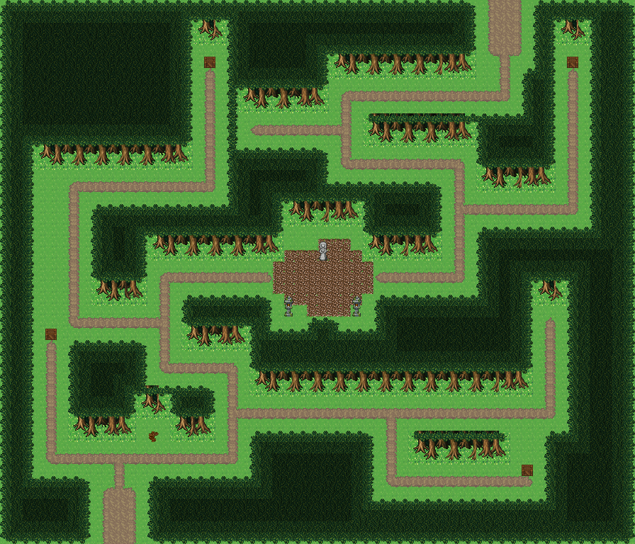

# 미혹의 숲 미로

초반 던전 대신 쓰는 숲 미로. 짙은 숲 사이 오솔길이 갈라지고 막다른 길마다 상자, 한가운데 빈터에 이끼 낀 석상. 남쪽 숲 어귀에서 들어가면 짙은 숲 사이로 흙 오솔길이 여러 갈래로 갈라진다. 막다른 길 넷에 나무 상자가 있고, 미로 한가운데 둥근 빈터에 이끼 낀 요정 석상과 돌등 둘이 선다. 제대로 된 길은 빈터를 지나 북쪽 출구로 빠진다. 길 밖은 모두 숲이라 가로질러 갈 수 없다. 56×48, tilesetId=forest_harmony. 통행 검사 시작 (10,43).



## 출구 — 어디와 맞닿나
- 출구0 남쪽 (10,47) → 숲 어귀 필드 북쪽 출구
- 출구1 북쪽 (44,0) → 요정 샘 신성한 숲 남쪽 입구

## 지형
```json
{"cliffs":[],"stairs":[],"landmarks":[]}
```

## 집 (템플릿·역할·문)
```json
[]
```

## 소품 (주인·이유가 있는 것만 남겼다)
```json
[{"name":"돌 석상","x":28,"y":21,"w":1,"h":2,"owner":"숲 속 빈터","purpose":"이끼 낀 요정 석상"},{"name":"돌등","x":25,"y":26,"w":1,"h":2,"owner":"숲 속 빈터","purpose":"빈터 등불"},{"name":"돌등","x":31,"y":26,"w":1,"h":2,"owner":"숲 속 빈터","purpose":"빈터 등불"},{"name":"나무 상자","x":4,"y":29,"w":1,"h":1,"owner":"미로","purpose":"막다른 길 보물 상자"},{"name":"나무 상자","x":46,"y":41,"w":1,"h":1,"owner":"미로","purpose":"막다른 길 보물 상자"},{"name":"나무 상자","x":18,"y":5,"w":1,"h":1,"owner":"미로","purpose":"막다른 길 보물 상자"},{"name":"나무 상자","x":50,"y":5,"w":1,"h":1,"owner":"미로","purpose":"막다른 길 보물 상자"},{"name":"나무 이정표","x":13,"y":38,"w":1,"h":1,"owner":"미로","purpose":"헷갈리는 표지"}]
```

## 포장·다리·부두·덩이
```json
[{"name":"숲 속 빈터","kind":"paving","group":"builtin_dirt_road"}]
```


## 채우기 규칙 (빈칸 게이트: 마을·장면 한 화면 17×13 에 맨땅 40% 이하·가장 큰 빈 네모 4칸 이하, 필드 50%·5칸)
맨땅(plain)으로 세는 칸: 잔디 240·잔디 질감 1140~1147, 포장 몸통 포석 190·석판 307·자갈 310·흙 421·모래 424·눈 67. 빈칸은 **자연 덩이로 먼저** 줄이고, 생활 소품은 주인이 있을 때만 둔다.
- 나무 덩이: 나무 키트(활엽수 978~980/1008~1010·1038~1040/1068~1070 3×4, 둥근 덤불 983~985/1013~1015/1043~1045 3×3, 작은 덤불 1073/1074/1103/1104 2×2)를 어깨를 붙여 3~7그루씩. 줄·바둑판으로 세우지 않는다.
- 꽃: 들꽃 348 을 **3~5칸 묶음**(2×2 속 + 한두 칸)이나 화단 키트(꽃 화단·화분)로만. 한 칸씩 흩은 「색종이 밭」 금지.
- 덤불 289 묶음·작은 덤불 2×2, 바위 537·29 는 3~6칸 무리로 절벽 발치·물가·숲 가장자리에만. 한 줄(가로·세로 3칸 이상 일렬) 금지.
- 키큰 풀: E builtin_tall_grass(243~335, 숲 수관 1칸 안)·F builtin_tall_grass_light(1124~1126/1154~1156/1184~1186, 외톨이 1127, 속 1157, 트인 곳)·G builtin_tall_grass_short(1128~1130/1158~1160/1188~1190, 외톨이 1131, 속 1161, 집·길 3칸 안). 덩이마다 한 종류, 2×2 이상, variantMap 으로 이웃에 맞춰 고른다(scripts/content/lib/tall-grass.mjs arrangeTallGrass).
- 금지 재료: 짙은 수풀 builtin_undergrowth(9·11·39~41·69~71·99~101, 검은 초록 구불이), 어두운 덤불 986~988·1016~1018·1046~1048(구덩이로 보임), 마른 가지 740·바위·뼈 383·부서진 울타리 410 을 고르게 흩뿌리기(절벽·폐허 벽·물가 곁 1~3곳에 몰아 둔다).
- 주인 없는 소품 금지: 벤치·통나무·상자·항아리·허수아비·표지판은 2칸 안에 이유(집 문·가게·밭·우물·부두·작업장·길)가 있어야 한다. 없으면 두지 말고 뺀다.

## 검사
```json
{"reachable":875,"emptiness":{"maxSq":3,"screen":0.362,"at":[3,15],"screenAt":[32,32]}}
```

전체 두 레이어는 「미혹의 숲 미로 · 0행부터 전체 배열」 문서가 정답이다.
