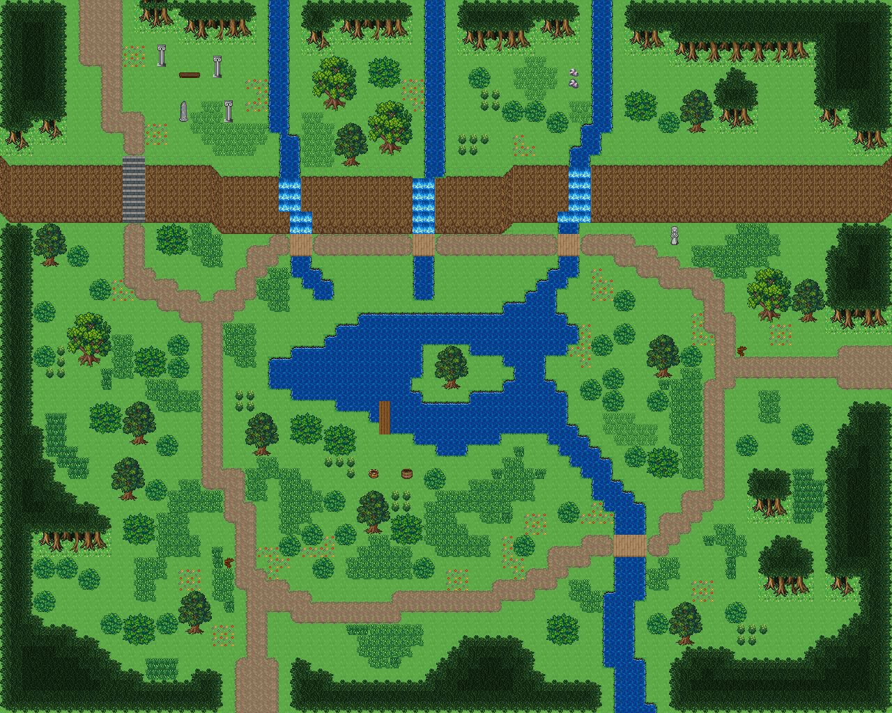

# 세폭포 대계곡

넓은 탐험 필드. 북쪽 긴 절벽을 세 줄기 폭포가 넘어 가운데 섬 호수로 모이고, 호수 둘레를 나무다리 넷의 순환로가 돈다. 절벽 위 고지대 입석 쉼터와 굽이치는 하류. 북쪽 고지대 끝을 긴 절벽이 가로지르고 세 줄기 개울이 폭포로 떨어져 가운데 섬 호수에 모인다. 호수 물은 남동쪽으로 굽이쳐 흘러 나간다. 남쪽 숲길로 들어오면 호수 서쪽을 따라 올라가 절벽 발치에서 나무다리 셋으로 개울을 건너고, 동쪽 기슭을 내려와 하류 나무다리를 건너 제자리로 돌아오는 순환로가 난다. 서쪽 돌계단으로 고지대에 오르면 입석이 둘러선 쉼터와 북쪽 고갯길이 있다. 호수 남쪽 물가에 낚시 선착장, 섬에는 외딴 나무. 80×64, tilesetId=forest_harmony. 통행 검사 시작 (22,59).



## 출구 — 어디와 맞닿나
- 출구0 남쪽 (22,63) → 남쪽 숲길(필드) 북쪽 출구
- 출구1 북쪽 (8,0) → 고갯길 필드 남쪽 출구
- 출구2 동쪽 (79,32) → 동쪽 들판 서쪽 출구

## 지형
```json
{"cliffs":[{"points":[[0,14],[18,14],[20,15],[44,15],[46,14],[79,14]],"height":5,"left":"open","right":"open"}],"stairs":[{"x":11,"y":14,"height":5}],"falls":[{"x":25,"y":15,"height":5,"tile":2700},{"x":26,"y":15,"height":5,"tile":2700},{"x":38,"y":15,"height":5,"tile":2700},{"x":39,"y":15,"height":5,"tile":2700},{"x":37,"y":15,"height":5,"tile":2700},{"x":51,"y":14,"height":5,"tile":2700},{"x":52,"y":14,"height":5,"tile":2700}],"landmarks":[]}
```

## 집 (템플릿·역할·문)
```json
[]
```

## 소품 (주인·이유가 있는 것만 남겼다)
```json
[{"name":"흰 돌기둥","x":14,"y":4,"w":1,"h":2,"owner":"입석 쉼터","purpose":"쉼터 입석"},{"name":"흰 돌기둥","x":19,"y":5,"w":1,"h":2,"owner":"입석 쉼터","purpose":"쉼터 입석"},{"name":"돌 오벨리스크","x":16,"y":9,"w":1,"h":2,"owner":"입석 쉼터","purpose":"쉼터 입석"},{"name":"흰 돌기둥","x":20,"y":9,"w":1,"h":2,"owner":"입석 쉼터","purpose":"쉼터 입석"},{"name":"벤치","x":16,"y":6,"w":2,"h":1,"owner":"입석 쉼터","purpose":"입석 쉼터 벤치"},{"name":"돌 석상","x":60,"y":20,"w":1,"h":2,"purpose":"폭포를 보는 석상"},{"name":"나무 이정표","x":20,"y":50,"w":1,"h":1,"purpose":"순환로 갈림길 표지"},{"name":"나무 이정표","x":66,"y":31,"w":1,"h":1,"purpose":"동쪽 갈림길 표지"},{"name":"낚시 바구니","x":33,"y":42,"w":1,"h":1,"owner":"선착장","purpose":"선착장 낚시꾼 자리"},{"name":"나무통","x":36,"y":42,"w":1,"h":1,"owner":"선착장","purpose":"미끼 통"}]
```

## 포장·다리·부두·덩이
```json
[{"name":"나무다리","kind":"bridge","x":26,"y":21,"w":2,"h":2},{"name":"나무다리","kind":"bridge","x":37,"y":21,"w":2,"h":2},{"name":"나무다리","kind":"bridge","x":50,"y":21,"w":2,"h":2},{"name":"나무다리","kind":"bridge","x":55,"y":48,"w":3,"h":2},{"name":"호수 섬의 외딴 나무","kind":"piece","x":39,"y":31,"w":3,"h":4},{"name":"선착장","kind":"dock","x":34,"y":36,"w":1,"h":3},{"name":"나무 · small-bush","kind":"vegetation","x":65,"y":54,"w":2,"h":2},{"name":"나무 · small-bush","kind":"vegetation","x":42,"y":6,"w":2,"h":2},{"name":"나무 · big-oak","kind":"vegetation","x":28,"y":5,"w":4,"h":5},{"name":"나무 · small-bush","kind":"vegetation","x":3,"y":31,"w":2,"h":2},{"name":"나무 · small-bush","kind":"vegetation","x":3,"y":27,"w":2,"h":2},{"name":"나무 · small-bush","kind":"vegetation","x":3,"y":53,"w":2,"h":2},{"name":"나무 · round-bush","kind":"vegetation","x":11,"y":46,"w":3,"h":3},{"name":"나무 · small-bush","kind":"vegetation","x":53,"y":30,"w":2,"h":2},{"name":"나무 · small-bush","kind":"vegetation","x":55,"y":29,"w":2,"h":2},{"name":"나무 · tree","kind":"vegetation","x":11,"y":36,"w":3,"h":4},{"name":"나무 · round-bush","kind":"vegetation","x":8,"y":36,"w":3,"h":3},{"name":"나무 · small-bush","kind":"vegetation","x":14,"y":39,"w":2,"h":2},{"name":"나무 · round-bush","kind":"vegetation","x":12,"y":31,"w":3,"h":3},{"name":"나무 · small-bush","kind":"vegetation","x":15,"y":32,"w":2,"h":2},{"name":"나무 · tree","kind":"vegetation","x":58,"y":30,"w":3,"h":4},{"name":"나무 · small-bush","kind":"vegetation","x":61,"y":31,"w":2,"h":2},{"name":"나무 · small-bush","kind":"vegetation","x":47,"y":9,"w":2,"h":2},{"name":"나무 · small-bush","kind":"vegetation","x":45,"y":9,"w":2,"h":2},{"name":"나무 · small-bush","kind":"vegetation","x":49,"y":10,"w":2,"h":2},{"name":"나무 · tree","kind":"vegetation","x":61,"y":8,"w":3,"h":4},{"name":"나무 · small-bush","kind":"vegetation","x":59,"y":10,"w":2,"h":2},{"name":"나무 · round-bush","kind":"vegetation","x":56,"y":8,"w":3,"h":3},{"name":"나무 · big-oak","kind":"vegetation","x":67,"y":24,"w":4,"h":5},{"name":"나무 · tree","kind":"vegetation","x":71,"y":25,"w":3,"h":4},{"name":"나무 · round-bush","kind":"vegetation","x":58,"y":40,"w":3,"h":3},{"name":"나무 · small-bush","kind":"vegetation","x":56,"y":40,"w":2,"h":2},{"name":"나무 · tree","kind":"vegetation","x":3,"y":20,"w":3,"h":4},{"name":"나무 · small-bush","kind":"vegetation","x":6,"y":22,"w":2,"h":2},{"name":"나무 · big-oak","kind":"vegetation","x":6,"y":28,"w":4,"h":5},{"name":"나무 · tree","kind":"vegetation","x":60,"y":54,"w":3,"h":4},{"name":"나무 · small-bush","kind":"vegetation","x":58,"y":55,"w":2,"h":2},{"name":"나무 · small-bush","kind":"vegetation","x":14,"y":55,"w":2,"h":2},{"name":"나무 · round-bush","kind":"vegetation","x":11,"y":55,"w":3,"h":3},{"name":"나무 · tree","kind":"vegetation","x":16,"y":53,"w":3,"h":4},{"name":"나무 · small-bush","kind":"vegetation","x":9,"y":55,"w":2,"h":2},{"name":"나무 · round-bush","kind":"vegetation","x":33,"y":5,"w":3,"h":3},{"name":"나무 · big-oak","kind":"vegetation","x":33,"y":9,"w":4,"h":5},{"name":"나무 · tree","kind":"vegetation","x":30,"y":11,"w":3,"h":4},{"name":"나무 · small-bush","kind":"vegetation","x":52,"y":34,"w":2,"h":2},{"name":"나무 · small-bush","kind":"vegetation","x":54,"y":35,"w":2,"h":2},{"name":"나무 · small-bush","kind":"vegetation","x":54,"y":33,"w":2,"h":2},{"name":"나무 · small-bush","kind":"vegetation","x":58,"y":35,"w":2,"h":2},{"name":"나무 · tree","kind":"vegetation","x":22,"y":37,"w":3,"h":4},{"name":"나무 · round-bush","kind":"vegetation","x":26,"y":37,"w":3,"h":3},{"name":"나무 · round-bush","kind":"vegetation","x":29,"y":38,"w":3,"h":3},{"name":"나무 · small-bush","kind":"vegetation","x":30,"y":47,"w":2,"h":2},{"name":"나무 · tree","kind":"vegetation","x":32,"y":44,"w":3,"h":4},{"name":"나무 · round-bush","kind":"vegetation","x":35,"y":46,"w":3,"h":3},{"name":"나무 · small-bush","kind":"vegetation","x":13,"y":43,"w":2,"h":2},{"name":"나무 · tree","kind":"vegetation","x":10,"y":41,"w":3,"h":4},{"name":"나무 · small-bush","kind":"vegetation","x":27,"y":47,"w":2,"h":2},{"name":"나무 · small-bush","kind":"vegetation","x":25,"y":48,"w":2,"h":2},{"name":"나무 · round-bush","kind":"vegetation","x":49,"y":55,"w":3,"h":3},{"name":"나무 · small-bush","kind":"vegetation","x":28,"y":50,"w":2,"h":2},{"name":"나무 · small-bush","kind":"vegetation","x":37,"y":50,"w":2,"h":2},{"name":"나무 · small-bush","kind":"vegetation","x":29,"y":44,"w":2,"h":2},{"name":"나무 · small-bush","kind":"vegetation","x":50,"y":45,"w":2,"h":2},{"name":"나무 · small-bush","kind":"vegetation","x":46,"y":48,"w":2,"h":2},{"name":"나무 · small-bush","kind":"vegetation","x":38,"y":42,"w":2,"h":2},{"name":"나무 · small-bush","kind":"vegetation","x":8,"y":25,"w":2,"h":2},{"name":"나무 · small-bush","kind":"vegetation","x":71,"y":38,"w":2,"h":2},{"name":"나무 · small-bush","kind":"vegetation","x":15,"y":30,"w":2,"h":2},{"name":"나무 · round-bush","kind":"vegetation","x":14,"y":20,"w":3,"h":3},{"name":"나무 · small-bush","kind":"vegetation","x":55,"y":26,"w":2,"h":2},{"name":"나무 · small-bush","kind":"vegetation","x":5,"y":50,"w":2,"h":2},{"name":"나무 · small-bush","kind":"vegetation","x":7,"y":51,"w":2,"h":2},{"name":"나무 · small-bush","kind":"vegetation","x":3,"y":50,"w":2,"h":2},{"name":"나무 · small-bush","kind":"vegetation","x":66,"y":39,"w":2,"h":2}]
```


## 채우기 규칙 (빈칸 게이트: 마을·장면 한 화면 17×13 에 맨땅 40% 이하·가장 큰 빈 네모 4칸 이하, 필드 50%·5칸)
맨땅(plain)으로 세는 칸: 잔디 240·잔디 질감 1140~1147, 포장 몸통 포석 190·석판 307·자갈 310·흙 421·모래 424·눈 67. 빈칸은 **자연 덩이로 먼저** 줄이고, 생활 소품은 주인이 있을 때만 둔다.
- 나무 덩이: 나무 키트(활엽수 978~980/1008~1010·1038~1040/1068~1070 3×4, 둥근 덤불 983~985/1013~1015/1043~1045 3×3, 작은 덤불 1073/1074/1103/1104 2×2)를 어깨를 붙여 3~7그루씩. 줄·바둑판으로 세우지 않는다.
- 꽃: 들꽃 348 을 **3~5칸 묶음**(2×2 속 + 한두 칸)이나 화단 키트(꽃 화단·화분)로만. 한 칸씩 흩은 「색종이 밭」 금지.
- 덤불 289 묶음·작은 덤불 2×2, 바위 537·29 는 3~6칸 무리로 절벽 발치·물가·숲 가장자리에만. 한 줄(가로·세로 3칸 이상 일렬) 금지.
- 키큰 풀: E builtin_tall_grass(243~335, 숲 수관 1칸 안)·F builtin_tall_grass_light(1124~1126/1154~1156/1184~1186, 외톨이 1127, 속 1157, 트인 곳)·G builtin_tall_grass_short(1128~1130/1158~1160/1188~1190, 외톨이 1131, 속 1161, 집·길 3칸 안). 덩이마다 한 종류, 2×2 이상, variantMap 으로 이웃에 맞춰 고른다(scripts/content/lib/tall-grass.mjs arrangeTallGrass).
- 금지 재료: 짙은 수풀 builtin_undergrowth(9·11·39~41·69~71·99~101, 검은 초록 구불이), 어두운 덤불 986~988·1016~1018·1046~1048(구덩이로 보임), 마른 가지 740·바위·뼈 383·부서진 울타리 410 을 고르게 흩뿌리기(절벽·폐허 벽·물가 곁 1~3곳에 몰아 둔다).
- 주인 없는 소품 금지: 벤치·통나무·상자·항아리·허수아비·표지판은 2칸 안에 이유(집 문·가게·밭·우물·부두·작업장·길)가 있어야 한다. 없으면 두지 말고 뺀다.

## 검사
```json
{"reachable":2307,"emptiness":{"maxSq":5,"screen":0.439,"at":[68,6],"screenAt":[8,4]}}
```

전체 두 레이어는 「세폭포 대계곡 · 0행부터 전체 배열」 문서가 정답이다.
