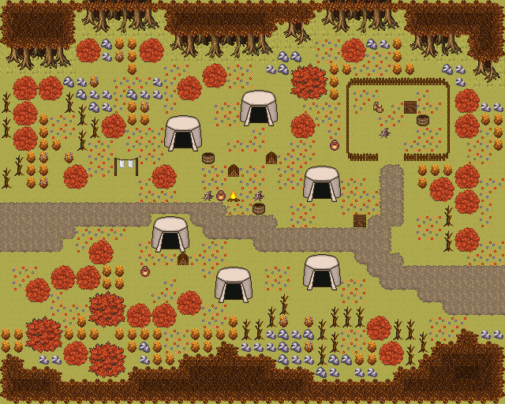

# 바람초원 유목민 천막촌

금빛 초원의 유목민 천막 야영지. 큰 모닥불 둘레 천막 여섯, 울타리 친 가축 우리와 빨래·장작 살림. 금빛 풀 초원 한가운데 큰 모닥불을 천막 여섯이 둥글게 둘러싼다. 동쪽에 울타리 친 가축 우리, 천막 사이에 빨랫줄·장작·물통, 초원엔 키 큰 풀과 덤불이 흩어져 있다. 서쪽과 동쪽으로 초원 길이 난다. 40×32, tilesetId=forest_harmony_autumn. 통행 검사 시작 (4,17).



## 출구 — 어디와 맞닿나
- 출구0 서쪽 (0,17) → 초원 필드 동쪽 출구
- 출구1 동쪽 (39,22) → 초원 필드 서쪽 출구

## 지형
```json
{"cliffs":[],"stairs":[],"landmarks":[]}
```

## 집 (템플릿·역할·문)
```json
[]
```

## 소품 (주인·이유가 있는 것만 남겼다)
```json
[{"name":"모닥불","x":18,"y":15,"w":1,"h":1,"owner":"야영지","purpose":"야영지 큰 모닥불"},{"name":"천막","x":13,"y":9,"w":3,"h":3,"owner":"야영지","purpose":"유목민 천막"},{"name":"천막","x":19,"y":7,"w":3,"h":3,"owner":"야영지","purpose":"유목민 천막"},{"name":"천막","x":24,"y":13,"w":3,"h":3,"owner":"야영지","purpose":"유목민 천막"},{"name":"천막","x":12,"y":17,"w":3,"h":3,"owner":"야영지","purpose":"유목민 천막"},{"name":"천막","x":17,"y":21,"w":3,"h":3,"owner":"야영지","purpose":"유목민 천막"},{"name":"천막","x":24,"y":20,"w":3,"h":3,"owner":"야영지","purpose":"유목민 천막"},{"name":"빨랫줄","x":9,"y":12,"w":2,"h":2,"owner":"천막","purpose":"가죽 말리기"},{"name":"장작 더미","x":21,"y":12,"w":1,"h":1,"owner":"야영지","purpose":"모닥불 장작"},{"name":"통나무 더미","x":16,"y":15,"w":1,"h":1,"owner":"야영지","purpose":"모닥불 둘레 앉을 통나무"},{"name":"통나무 더미","x":20,"y":15,"w":1,"h":1,"owner":"야영지","purpose":"모닥불 둘레 앉을 통나무"},{"name":"나무통","x":16,"y":12,"w":1,"h":1,"owner":"천막","purpose":"물통"},{"name":"항아리","x":11,"y":21,"w":1,"h":1,"owner":"천막","purpose":"젖 항아리"},{"name":"나무 상자","x":28,"y":17,"w":1,"h":1,"owner":"가축 우리","purpose":"짐 상자"},{"name":"씨앗 자루","x":29,"y":8,"w":2,"h":1,"owner":"가축 우리","purpose":"여물 자루"},{"name":"나무통","x":33,"y":9,"w":1,"h":1,"owner":"가축 우리","purpose":"구유"},{"name":"장작 더미","x":14,"y":20,"w":1,"h":1,"owner":"천막","purpose":"천막 장작"},{"name":"항아리","x":26,"y":11,"w":1,"h":1,"owner":"천막","purpose":"물항아리"},{"name":"항아리","x":17,"y":15,"w":1,"h":1,"owner":"야영지","purpose":"모닥불 곁 물항아리"},{"name":"나무통","x":20,"y":16,"w":1,"h":1,"owner":"야영지","purpose":"모닥불 곁 물통"},{"name":"장작","x":18,"y":13,"w":1,"h":1,"owner":"야영지","purpose":"모닥불 장작"},{"name":"통나무 더미","x":30,"y":10,"w":1,"h":1,"owner":"가축 우리","purpose":"여물 통나무"},{"name":"나무 상자","x":32,"y":8,"w":1,"h":1,"owner":"가축 우리","purpose":"여물 상자"}]
```

## 포장·다리·부두·덩이
```json
[{"name":"가축 우리","kind":"fence","x":27,"y":6,"w":9,"h":7},{"name":"나무 · round-bush","kind":"vegetation","x":2,"y":25,"w":3,"h":3},{"name":"나무 · round-bush","kind":"vegetation","x":7,"y":27,"w":3,"h":3},{"name":"나무 · round-bush","kind":"vegetation","x":7,"y":23,"w":3,"h":3},{"name":"나무 · small-bush","kind":"vegetation","x":10,"y":24,"w":2,"h":2},{"name":"나무 · round-bush","kind":"vegetation","x":23,"y":5,"w":3,"h":3},{"name":"나무 · small-bush","kind":"vegetation","x":8,"y":9,"w":2,"h":2},{"name":"나무 · small-bush","kind":"vegetation","x":36,"y":13,"w":2,"h":2},{"name":"나무 · small-bush","kind":"vegetation","x":34,"y":14,"w":2,"h":2},{"name":"나무 · small-bush","kind":"vegetation","x":36,"y":18,"w":2,"h":2},{"name":"나무 · small-bush","kind":"vegetation","x":7,"y":19,"w":2,"h":2},{"name":"나무 · small-bush","kind":"vegetation","x":2,"y":22,"w":2,"h":2},{"name":"나무 · small-bush","kind":"vegetation","x":4,"y":21,"w":2,"h":2},{"name":"나무 · small-bush","kind":"vegetation","x":14,"y":23,"w":2,"h":2},{"name":"나무 · small-bush","kind":"vegetation","x":14,"y":6,"w":2,"h":2},{"name":"나무 · small-bush","kind":"vegetation","x":16,"y":5,"w":2,"h":2},{"name":"나무 · small-bush","kind":"vegetation","x":1,"y":6,"w":2,"h":2},{"name":"나무 · small-bush","kind":"vegetation","x":3,"y":6,"w":2,"h":2},{"name":"나무 · small-bush","kind":"vegetation","x":23,"y":9,"w":2,"h":2},{"name":"나무 · small-bush","kind":"vegetation","x":12,"y":13,"w":2,"h":2},{"name":"나무 · small-bush","kind":"vegetation","x":6,"y":3,"w":2,"h":2},{"name":"나무 · small-bush","kind":"vegetation","x":11,"y":3,"w":2,"h":2},{"name":"나무 · small-bush","kind":"vegetation","x":27,"y":3,"w":2,"h":2},{"name":"나무 · small-bush","kind":"vegetation","x":36,"y":7,"w":2,"h":2},{"name":"나무 · small-bush","kind":"vegetation","x":36,"y":15,"w":2,"h":2},{"name":"나무 · small-bush","kind":"vegetation","x":30,"y":27,"w":2,"h":2},{"name":"나무 · small-bush","kind":"vegetation","x":1,"y":8,"w":2,"h":2},{"name":"나무 · small-bush","kind":"vegetation","x":5,"y":27,"w":2,"h":2},{"name":"나무 · small-bush","kind":"vegetation","x":6,"y":21,"w":2,"h":2},{"name":"나무 · small-bush","kind":"vegetation","x":5,"y":13,"w":2,"h":2},{"name":"나무 · small-bush","kind":"vegetation","x":29,"y":25,"w":2,"h":2},{"name":"나무 · small-bush","kind":"vegetation","x":36,"y":9,"w":2,"h":2},{"name":"나무 · small-bush","kind":"vegetation","x":1,"y":10,"w":2,"h":2},{"name":"나무 · small-bush","kind":"vegetation","x":12,"y":24,"w":2,"h":2}]
```


## 채우기 규칙 (빈칸 게이트: 마을·장면 한 화면 17×13 에 맨땅 40% 이하·가장 큰 빈 네모 4칸 이하, 필드 50%·5칸)
맨땅(plain)으로 세는 칸: 잔디 240·잔디 질감 1140~1147, 포장 몸통 포석 190·석판 307·자갈 310·흙 421·모래 424·눈 67. 빈칸은 **자연 덩이로 먼저** 줄이고, 생활 소품은 주인이 있을 때만 둔다.
- 나무 덩이: 나무 키트(활엽수 978~980/1008~1010·1038~1040/1068~1070 3×4, 둥근 덤불 983~985/1013~1015/1043~1045 3×3, 작은 덤불 1073/1074/1103/1104 2×2)를 어깨를 붙여 3~7그루씩. 줄·바둑판으로 세우지 않는다.
- 꽃: 들꽃 348 을 **3~5칸 묶음**(2×2 속 + 한두 칸)이나 화단 키트(꽃 화단·화분)로만. 한 칸씩 흩은 「색종이 밭」 금지.
- 덤불 289 묶음·작은 덤불 2×2, 바위 537·29 는 3~6칸 무리로 절벽 발치·물가·숲 가장자리에만. 한 줄(가로·세로 3칸 이상 일렬) 금지.
- 키큰 풀 E/F/G 금지: 모래·눈·재·가을 시트에 깐 풀(재칠본 포함)은 초록 띠나 진흙 얼룩으로 읽힌다. 이 시트에는 풀 덩이를 깔지 않는다.
- 금지 재료: 짙은 수풀 builtin_undergrowth(9·11·39~41·69~71·99~101, 검은 초록 구불이), 어두운 덤불 986~988·1016~1018·1046~1048(구덩이로 보임), 마른 가지 740·바위·뼈 383·부서진 울타리 410 을 고르게 흩뿌리기(절벽·폐허 벽·물가 곁 1~3곳에 몰아 둔다).
- 주인 없는 소품 금지: 벤치·통나무·상자·항아리·허수아비·표지판은 2칸 안에 이유(집 문·가게·밭·우물·부두·작업장·길)가 있어야 한다. 없으면 두지 말고 뺀다.

## 검사
```json
{"reachable":522,"emptiness":{"maxSq":2,"screen":0.339,"at":[28,9],"screenAt":[20,12]}}
```

전체 두 레이어는 「바람초원 유목민 천막촌 · 0행부터 전체 배열」 문서가 정답이다.
