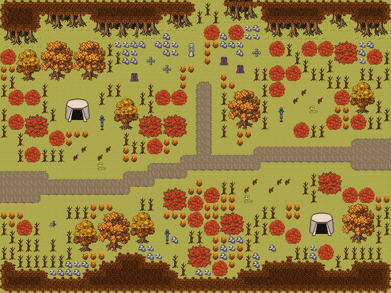

# 잿빛 들 옛 전쟁터

옛 전쟁이 끝난 들판. 부서진 방책·버려진 천막·꽂힌 무기와 해골, 전사자 묘와 추모비. 시든 금빛 들판에 옛 전쟁의 흔적이 남았다. 무너진 나무 방책 줄, 버려진 천막과 무기 거치대, 해골과 돌무더기가 흩어지고, 북쪽 언덕 발치에 전사자 묘와 추모 석상이 있다. 서쪽에서 동쪽으로 옛 행군로가 지난다. 48×36, tilesetId=forest_harmony_autumn. 통행 검사 시작 (4,22).



## 출구 — 어디와 맞닿나
- 출구0 서쪽 (0,22) → 필드 동쪽 출구
- 출구1 동쪽 (47,18) → 무너진 옛 도읍 서쪽 출구

## 지형
```json
{"cliffs":[],"stairs":[],"landmarks":[]}
```

## 집 (템플릿·역할·문)
```json
[]
```

## 소품 (주인·이유가 있는 것만 남겼다)
```json
[{"name":"돌 석상","x":23,"y":5,"w":1,"h":2,"purpose":"전사자 추모상"},{"name":"돌 십자가","x":18,"y":7,"w":1,"h":1},{"name":"돌 십자가","x":20,"y":8,"w":1,"h":1},{"name":"묘비","x":27,"y":7,"w":1,"h":1},{"name":"묘비","x":29,"y":8,"w":1,"h":1},{"name":"돌 십자가","x":31,"y":6,"w":1,"h":1},{"name":"묘비","x":16,"y":9,"w":1,"h":1},{"name":"천막","x":8,"y":12,"w":3,"h":3,"purpose":"버려진 천막"},{"name":"천막","x":38,"y":26,"w":3,"h":3,"purpose":"버려진 천막"},{"name":"무기 거치대","x":12,"y":14,"w":1,"h":2,"owner":"서쪽 진지","purpose":"버려진 무기"},{"name":"무기 거치대","x":34,"y":13,"w":1,"h":2,"owner":"북쪽 진지","purpose":"버려진 무기"},{"name":"무기 거치대","x":20,"y":28,"w":1,"h":2,"owner":"남쪽 진지","purpose":"버려진 무기"},{"name":"해골","x":12,"y":20,"w":1,"h":1,"owner":"서쪽 방책","purpose":"무너진 방책 앞 해골"},{"name":"해골","x":30,"y":24,"w":1,"h":1,"owner":"동쪽 방책","purpose":"무너진 방책 앞 해골"},{"name":"해골","x":38,"y":13,"w":1,"h":1,"owner":"북쪽 방책","purpose":"무너진 방책 앞 해골"},{"name":"돌 무더기","x":21,"y":29,"w":1,"h":1,"owner":"남쪽 진지","purpose":"무기 거치대 곁 돌무더기"},{"name":"돌 무더기","x":33,"y":30,"w":1,"h":1,"owner":"동쪽 방책","purpose":"무너진 참호"},{"name":"통나무 더미","x":6,"y":27,"w":1,"h":1,"owner":"서쪽 진지","purpose":"방책 통나무"},{"name":"부서진 울타리","x":9,"y":19,"w":1,"h":1,"owner":"옛 방책","purpose":"무너진 나무 방책"},{"name":"부서진 울타리","x":10,"y":18,"w":1,"h":1,"owner":"옛 방책","purpose":"무너진 나무 방책"},{"name":"부서진 울타리","x":12,"y":19,"w":1,"h":1,"owner":"옛 방책","purpose":"무너진 나무 방책"},{"name":"부서진 울타리","x":13,"y":18,"w":1,"h":1,"owner":"옛 방책","purpose":"무너진 나무 방책"},{"name":"부서진 울타리","x":30,"y":23,"w":1,"h":1,"owner":"옛 방책","purpose":"무너진 나무 방책"},{"name":"부서진 울타리","x":31,"y":22,"w":1,"h":1,"owner":"옛 방책","purpose":"무너진 나무 방책"},{"name":"부서진 울타리","x":33,"y":23,"w":1,"h":1,"owner":"옛 방책","purpose":"무너진 나무 방책"},{"name":"부서진 울타리","x":34,"y":22,"w":1,"h":1,"owner":"옛 방책","purpose":"무너진 나무 방책"},{"name":"부서진 울타리","x":35,"y":22,"w":1,"h":1,"owner":"옛 방책","purpose":"무너진 나무 방책"},{"name":"부서진 울타리","x":36,"y":12,"w":1,"h":1,"owner":"옛 방책","purpose":"무너진 나무 방책"},{"name":"부서진 울타리","x":37,"y":11,"w":1,"h":1,"owner":"옛 방책","purpose":"무너진 나무 방책"},{"name":"부서진 울타리","x":39,"y":12,"w":1,"h":1,"owner":"옛 방책","purpose":"무너진 나무 방책"}]
```

## 포장·다리·부두·덩이
```json
[{"name":"나무 · small-bush","kind":"vegetation","x":28,"y":3,"w":2,"h":2},{"name":"나무 · small-bush","kind":"vegetation","x":39,"y":30,"w":2,"h":2},{"name":"나무 · tree","kind":"vegetation","x":14,"y":12,"w":3,"h":4},{"name":"나무 · round-bush","kind":"vegetation","x":17,"y":14,"w":3,"h":3},{"name":"나무 · round-bush","kind":"vegetation","x":20,"y":14,"w":3,"h":3},{"name":"나무 · small-bush","kind":"vegetation","x":39,"y":5,"w":2,"h":2},{"name":"나무 · small-bush","kind":"vegetation","x":37,"y":5,"w":2,"h":2},{"name":"나무 · round-bush","kind":"vegetation","x":41,"y":5,"w":3,"h":3},{"name":"나무 · tree","kind":"vegetation","x":2,"y":6,"w":3,"h":4},{"name":"나무 · big-oak","kind":"vegetation","x":5,"y":5,"w":4,"h":5},{"name":"나무 · big-oak","kind":"vegetation","x":9,"y":5,"w":4,"h":5},{"name":"나무 · tree","kind":"vegetation","x":43,"y":10,"w":3,"h":4},{"name":"나무 · small-bush","kind":"vegetation","x":41,"y":11,"w":2,"h":2},{"name":"나무 · big-oak","kind":"vegetation","x":28,"y":11,"w":4,"h":5},{"name":"나무 · round-bush","kind":"vegetation","x":3,"y":14,"w":3,"h":3},{"name":"나무 · small-bush","kind":"vegetation","x":6,"y":16,"w":2,"h":2},{"name":"나무 · small-bush","kind":"vegetation","x":1,"y":14,"w":2,"h":2},{"name":"나무 · round-bush","kind":"vegetation","x":27,"y":26,"w":3,"h":3},{"name":"나무 · small-bush","kind":"vegetation","x":25,"y":27,"w":2,"h":2},{"name":"나무 · big-oak","kind":"vegetation","x":42,"y":25,"w":4,"h":5},{"name":"나무 · tree","kind":"vegetation","x":9,"y":27,"w":3,"h":4},{"name":"나무 · big-oak","kind":"vegetation","x":12,"y":26,"w":4,"h":5},{"name":"나무 · tree","kind":"vegetation","x":16,"y":26,"w":3,"h":4},{"name":"나무 · round-bush","kind":"vegetation","x":39,"y":21,"w":3,"h":3},{"name":"나무 · round-bush","kind":"vegetation","x":20,"y":23,"w":3,"h":3},{"name":"나무 · small-bush","kind":"vegetation","x":23,"y":24,"w":2,"h":2},{"name":"나무 · small-bush","kind":"vegetation","x":25,"y":23,"w":2,"h":2},{"name":"나무 · small-bush","kind":"vegetation","x":35,"y":28,"w":2,"h":2},{"name":"나무 · small-bush","kind":"vegetation","x":33,"y":27,"w":2,"h":2},{"name":"나무 · small-bush","kind":"vegetation","x":2,"y":27,"w":2,"h":2},{"name":"나무 · small-bush","kind":"vegetation","x":33,"y":8,"w":2,"h":2},{"name":"나무 · small-bush","kind":"vegetation","x":35,"y":8,"w":2,"h":2},{"name":"나무 · small-bush","kind":"vegetation","x":3,"y":18,"w":2,"h":2},{"name":"나무 · small-bush","kind":"vegetation","x":21,"y":11,"w":2,"h":2},{"name":"나무 · small-bush","kind":"vegetation","x":40,"y":14,"w":2,"h":2},{"name":"나무 · small-bush","kind":"vegetation","x":1,"y":11,"w":2,"h":2},{"name":"나무 · small-bush","kind":"vegetation","x":3,"y":11,"w":2,"h":2},{"name":"나무 · small-bush","kind":"vegetation","x":25,"y":3,"w":2,"h":2},{"name":"나무 · small-bush","kind":"vegetation","x":33,"y":5,"w":2,"h":2},{"name":"나무 · round-bush","kind":"vegetation","x":23,"y":30,"w":3,"h":3},{"name":"나무 · small-bush","kind":"vegetation","x":26,"y":32,"w":2,"h":2},{"name":"나무 · small-bush","kind":"vegetation","x":45,"y":6,"w":2,"h":2},{"name":"나무 · small-bush","kind":"vegetation","x":19,"y":11,"w":2,"h":2},{"name":"나무 · small-bush","kind":"vegetation","x":18,"y":17,"w":2,"h":2},{"name":"나무 · small-bush","kind":"vegetation","x":44,"y":23,"w":2,"h":2},{"name":"나무 · small-bush","kind":"vegetation","x":23,"y":26,"w":2,"h":2},{"name":"나무 · small-bush","kind":"vegetation","x":36,"y":15,"w":2,"h":2},{"name":"나무 · small-bush","kind":"vegetation","x":43,"y":14,"w":2,"h":2},{"name":"나무 · small-bush","kind":"vegetation","x":42,"y":23,"w":2,"h":2},{"name":"나무 · small-bush","kind":"vegetation","x":0,"y":6,"w":2,"h":2},{"name":"나무 · small-bush","kind":"vegetation","x":33,"y":10,"w":2,"h":2}]
```


## 채우기 규칙 (빈칸 게이트: 마을·장면 한 화면 17×13 에 맨땅 40% 이하·가장 큰 빈 네모 4칸 이하, 필드 50%·5칸)
맨땅(plain)으로 세는 칸: 잔디 240·잔디 질감 1140~1147, 포장 몸통 포석 190·석판 307·자갈 310·흙 421·모래 424·눈 67. 빈칸은 **자연 덩이로 먼저** 줄이고, 생활 소품은 주인이 있을 때만 둔다.
- 나무 덩이: 나무 키트(활엽수 978~980/1008~1010·1038~1040/1068~1070 3×4, 둥근 덤불 983~985/1013~1015/1043~1045 3×3, 작은 덤불 1073/1074/1103/1104 2×2)를 어깨를 붙여 3~7그루씩. 줄·바둑판으로 세우지 않는다.
- 꽃: 들꽃 348 을 **3~5칸 묶음**(2×2 속 + 한두 칸)이나 화단 키트(꽃 화단·화분)로만. 한 칸씩 흩은 「색종이 밭」 금지.
- 덤불 289 묶음·작은 덤불 2×2, 바위 537·29 는 3~6칸 무리로 절벽 발치·물가·숲 가장자리에만. 한 줄(가로·세로 3칸 이상 일렬) 금지.
- 키큰 풀 E/F/G 금지: 모래·눈·재·가을 시트에 깐 풀(재칠본 포함)은 초록 띠나 진흙 얼룩으로 읽힌다. 이 시트에는 풀 덩이를 깔지 않는다.
- 금지 재료: 짙은 수풀 builtin_undergrowth(9·11·39~41·69~71·99~101, 검은 초록 구불이), 어두운 덤불 986~988·1016~1018·1046~1048(구덩이로 보임), 마른 가지 740·바위·뼈 383·부서진 울타리 410 을 고르게 흩뿌리기(절벽·폐허 벽·물가 곁 1~3곳에 몰아 둔다).
- 주인 없는 소품 금지: 벤치·통나무·상자·항아리·허수아비·표지판은 2칸 안에 이유(집 문·가게·밭·우물·부두·작업장·길)가 있어야 한다. 없으면 두지 말고 뺀다.

## 검사
```json
{"reachable":704,"emptiness":{"maxSq":3,"screen":0.462,"at":[33,15],"screenAt":[8,8]}}
```

전체 두 레이어는 「잿빛 들 옛 전쟁터 · 0행부터 전체 배열」 문서가 정답이다.
