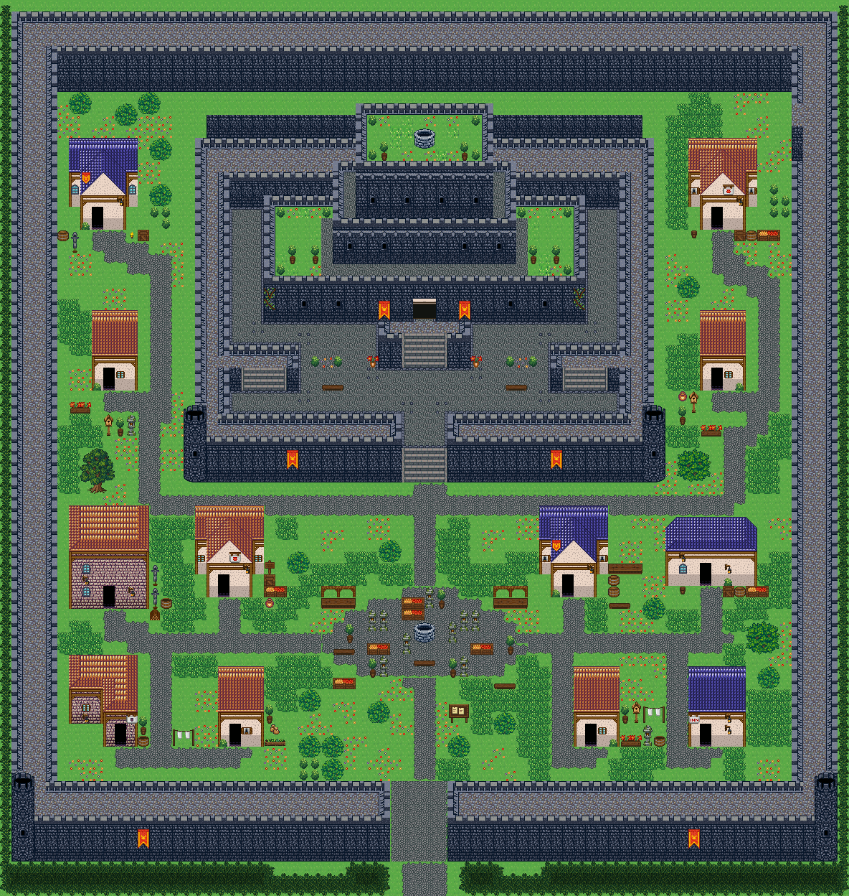

# 왕도 은빛 성곽

왕이 사는 성과 그 아래 성곽 도시. 남문 → 광장 → 궁 정문으로 이어지는 큰길, 광장 둘레 가게와 집 열 채. 사방을 두른 두 겹 성벽 안 맨 윗단에 층층 궁이 서고, 남문에서 올라온 돌길 큰길이 분수 우물 광장을 지나 궁 정문 계단에 닿는다. 광장 둘레에 가게·대장간·주막, 궁 양옆과 아랫마을에 집들이 붙어 있다. 궁 안뜰은 화단·화분·등불·분수를 들인 정원이다. 74×78, tilesetId=forest_harmony. 통행 검사 시작 (36,73).



## 출구 — 어디와 맞닿나
- 출구0 남쪽 (36,77) → 왕도 앞 들판(필드) 북쪽 출구

## 지형
```json
{"cliffs":[],"stairs":[],"landmarks":[{"id":"outdoor-royal-capital-castle-1","kind":"castle","label":"작은 성","x":16,"y":9,"w":42,"h":33,"doors":[{"x":36,"y":41},{"x":37,"y":41}]}]}
```

## 집 (템플릿·역할·문)
```json
[{"template":4,"role":"대장간","x":6,"y":44,"w":7,"h":9,"door":{"x":9,"y":52},"front":{"x":9,"y":53},"yard":"smith","yardSide":"right"},{"template":2,"role":"잡화점","x":17,"y":44,"w":6,"h":8,"door":{"x":19,"y":51},"front":{"x":19,"y":52},"yard":"shop","yardSide":"right"},{"template":0,"role":"주막","x":47,"y":44,"w":6,"h":8,"door":{"x":49,"y":51},"front":{"x":49,"y":52},"yard":"tavern","yardSide":"right"},{"template":7,"role":"창고","x":58,"y":45,"w":8,"h":6,"door":{"x":61,"y":50},"front":{"x":61,"y":51},"yard":"storage","yardSide":"front"},{"template":1,"role":"집","x":6,"y":57,"w":6,"h":8,"door":{"x":10,"y":64},"front":{"x":10,"y":65},"yard":"laundry","yardSide":"right"},{"template":3,"role":"약초집","x":19,"y":58,"w":4,"h":7,"door":{"x":20,"y":64},"front":{"x":20,"y":65},"yard":"herbs","yardSide":"right"},{"template":5,"role":"집","x":50,"y":58,"w":4,"h":7,"door":{"x":51,"y":64},"front":{"x":51,"y":65},"yard":"garden","yardSide":"right"},{"template":6,"role":"집","x":60,"y":58,"w":5,"h":7,"door":{"x":61,"y":64},"front":{"x":61,"y":65},"yard":"laundry","yardSide":"left"},{"template":0,"role":"근위대 막사","x":6,"y":12,"w":6,"h":8,"door":{"x":8,"y":19},"front":{"x":8,"y":20},"yard":"guard","yardSide":"front"},{"template":3,"role":"집","x":8,"y":27,"w":4,"h":7,"door":{"x":9,"y":33},"front":{"x":9,"y":34},"yard":"garden","yardSide":"front"},{"template":2,"role":"궁정 마구간지기 집","x":60,"y":12,"w":6,"h":8,"door":{"x":62,"y":19},"front":{"x":62,"y":20},"yard":"storage","yardSide":"front"},{"template":5,"role":"집","x":61,"y":27,"w":4,"h":7,"door":{"x":62,"y":33},"front":{"x":62,"y":34},"yard":"bees","yardSide":"front"}]
```

## 소품 (주인·이유가 있는 것만 남겼다)
```json
[{"name":"낮은 돌 우물","x":36,"y":54,"w":2,"h":2,"purpose":"광장 한가운데 분수 우물"},{"name":"돌등","x":33,"y":53,"w":1,"h":2,"purpose":"광장 가로등"},{"name":"돌등","x":40,"y":53,"w":1,"h":2,"purpose":"광장 가로등"},{"name":"돌등","x":33,"y":57,"w":1,"h":2,"purpose":"광장 가로등"},{"name":"돌등","x":40,"y":57,"w":1,"h":2,"purpose":"광장 가로등"},{"name":"장터 노점","x":28,"y":51,"w":3,"h":2,"purpose":"광장 노점"},{"name":"장터 노점","x":43,"y":51,"w":3,"h":2,"purpose":"광장 노점"},{"name":"과일 좌판","x":29,"y":59,"w":2,"h":1,"purpose":"광장 좌판"},{"name":"벤치","x":43,"y":59,"w":2,"h":1,"purpose":"광장 쉼터"},{"name":"게시판","x":39,"y":61,"w":2,"h":2,"purpose":"왕실 포고문"},{"name":"무기 거치대","x":13,"y":51,"w":1,"h":2,"owner":"outdoor-royal-capital-house-1","purpose":"대장일"},{"name":"무기 거치대","x":13,"y":49,"w":1,"h":2,"owner":"outdoor-royal-capital-house-1","purpose":"대장일"},{"name":"장작","x":13,"y":53,"w":1,"h":1,"owner":"outdoor-royal-capital-house-1","purpose":"대장일"},{"name":"나무통","x":14,"y":52,"w":1,"h":1,"owner":"outdoor-royal-capital-house-1","purpose":"대장일"},{"name":"과일 좌판","x":23,"y":51,"w":2,"h":1,"owner":"outdoor-royal-capital-house-2","purpose":"가게"},{"name":"나무 상자","x":23,"y":50,"w":1,"h":1,"owner":"outdoor-royal-capital-house-2","purpose":"가게"},{"name":"항아리","x":23,"y":52,"w":1,"h":1,"owner":"outdoor-royal-capital-house-2","purpose":"가게"},{"name":"표지판","x":23,"y":48,"w":1,"h":2,"owner":"outdoor-royal-capital-house-2","purpose":"가게"},{"name":"술통","x":53,"y":51,"w":1,"h":1,"owner":"outdoor-royal-capital-house-3","purpose":"주막"},{"name":"술통","x":53,"y":50,"w":1,"h":1,"owner":"outdoor-royal-capital-house-3","purpose":"주막"},{"name":"벤치","x":53,"y":52,"w":2,"h":1,"owner":"outdoor-royal-capital-house-3","purpose":"주막"},{"name":"가로 탁자","x":53,"y":49,"w":3,"h":1,"owner":"outdoor-royal-capital-house-3","purpose":"주막"},{"name":"나무 상자","x":63,"y":51,"w":1,"h":1,"owner":"outdoor-royal-capital-house-4","purpose":"창고"},{"name":"술통","x":64,"y":51,"w":1,"h":1,"owner":"outdoor-royal-capital-house-4","purpose":"창고"},{"name":"작은 오크통","x":59,"y":51,"w":1,"h":1,"owner":"outdoor-royal-capital-house-4","purpose":"창고"},{"name":"과일 상자","x":65,"y":51,"w":2,"h":1,"owner":"outdoor-royal-capital-house-4","purpose":"창고"},{"name":"빨랫줄","x":15,"y":63,"w":2,"h":2,"owner":"outdoor-royal-capital-house-5","purpose":"빨래 말리기"},{"name":"나무통","x":12,"y":64,"w":1,"h":1,"owner":"outdoor-royal-capital-house-5","purpose":"빨래 말리기"},{"name":"화분","x":12,"y":62,"w":1,"h":2,"owner":"outdoor-royal-capital-house-5","purpose":"빨래 말리기"},{"name":"약초 화분","x":23,"y":64,"w":2,"h":1,"owner":"outdoor-royal-capital-house-6","purpose":"약초 손질"},{"name":"씨앗 자루","x":23,"y":63,"w":2,"h":1,"owner":"outdoor-royal-capital-house-6","purpose":"약초 손질"},{"name":"화분","x":23,"y":61,"w":1,"h":2,"owner":"outdoor-royal-capital-house-6","purpose":"약초 손질"},{"name":"꽃 화단","x":54,"y":63,"w":2,"h":2,"owner":"outdoor-royal-capital-house-7","purpose":"꽃 가꾸기"},{"name":"화분","x":54,"y":61,"w":1,"h":2,"owner":"outdoor-royal-capital-house-7","purpose":"꽃 가꾸기"},{"name":"새집","x":55,"y":61,"w":1,"h":2,"owner":"outdoor-royal-capital-house-7","purpose":"꽃 가꾸기"},{"name":"돌등","x":56,"y":63,"w":1,"h":2,"owner":"outdoor-royal-capital-house-7","purpose":"꽃 가꾸기"},{"name":"빨랫줄","x":56,"y":61,"w":2,"h":2,"owner":"outdoor-royal-capital-house-8","purpose":"빨래 말리기"},{"name":"나무통","x":57,"y":64,"w":1,"h":1,"owner":"outdoor-royal-capital-house-8","purpose":"빨래 말리기"},{"name":"무기 거치대","x":6,"y":20,"w":1,"h":2,"owner":"outdoor-royal-capital-house-9","purpose":"경비"},{"name":"벽 횃불","x":11,"y":20,"w":1,"h":1,"owner":"outdoor-royal-capital-house-9","purpose":"경비"},{"name":"나무 상자","x":12,"y":20,"w":1,"h":1,"owner":"outdoor-royal-capital-house-9","purpose":"경비"},{"name":"술통","x":5,"y":20,"w":1,"h":1,"owner":"outdoor-royal-capital-house-9","purpose":"경비"},{"name":"꽃 화단","x":6,"y":34,"w":2,"h":2,"owner":"outdoor-royal-capital-house-10","purpose":"꽃 가꾸기"},{"name":"화분","x":10,"y":36,"w":1,"h":2,"owner":"outdoor-royal-capital-house-10","purpose":"꽃 가꾸기"},{"name":"새집","x":9,"y":36,"w":1,"h":2,"owner":"outdoor-royal-capital-house-10","purpose":"꽃 가꾸기"},{"name":"돌등","x":11,"y":36,"w":1,"h":2,"owner":"outdoor-royal-capital-house-10","purpose":"꽃 가꾸기"},{"name":"나무 상자","x":64,"y":20,"w":1,"h":1,"owner":"outdoor-royal-capital-house-11","purpose":"창고"},{"name":"술통","x":65,"y":20,"w":1,"h":1,"owner":"outdoor-royal-capital-house-11","purpose":"창고"},{"name":"작은 오크통","x":60,"y":20,"w":1,"h":1,"owner":"outdoor-royal-capital-house-11","purpose":"창고"},{"name":"과일 상자","x":66,"y":20,"w":2,"h":1,"owner":"outdoor-royal-capital-house-11","purpose":"창고"},{"name":"새집","x":60,"y":34,"w":1,"h":2,"owner":"outdoor-royal-capital-house-12","purpose":"벌치기"},{"name":"꽃 화단","x":61,"y":36,"w":2,"h":2,"owner":"outdoor-royal-capital-house-12","purpose":"벌치기"},{"name":"항아리","x":59,"y":34,"w":1,"h":1,"owner":"outdoor-royal-capital-house-12","purpose":"벌치기"},{"name":"화분","x":59,"y":35,"w":1,"h":2,"owner":"outdoor-royal-capital-house-12","purpose":"벌치기"},{"name":"화분","x":30,"y":54,"w":1,"h":2,"purpose":"광장 나누기"},{"name":"화분","x":44,"y":55,"w":1,"h":2,"purpose":"광장 나누기"},{"name":"과일 좌판","x":32,"y":56,"w":2,"h":1,"purpose":"광장 나누기"},{"name":"돌등","x":35,"y":55,"w":1,"h":2,"purpose":"광장 나누기"},{"name":"돌등","x":32,"y":53,"w":1,"h":2,"purpose":"광장 나누기"},{"name":"돌등","x":39,"y":54,"w":1,"h":2,"purpose":"광장 나누기"},{"name":"과일 좌판","x":35,"y":53,"w":2,"h":1,"purpose":"광장 나누기"},{"name":"벤치","x":29,"y":56,"w":2,"h":1,"purpose":"광장 나누기"},{"name":"화분","x":32,"y":57,"w":1,"h":2,"purpose":"광장 나누기"},{"name":"과일 좌판","x":41,"y":56,"w":2,"h":1,"purpose":"광장 나누기"},{"name":"벤치","x":36,"y":57,"w":2,"h":1,"purpose":"광장 나누기"},{"name":"과일 좌판","x":35,"y":52,"w":2,"h":1,"purpose":"광장 나누기"},{"name":"화분","x":39,"y":57,"w":1,"h":2,"purpose":"광장 나누기"},{"name":"돌등","x":37,"y":51,"w":1,"h":2,"purpose":"광장 나누기"},{"name":"화분","x":38,"y":51,"w":1,"h":2,"purpose":"광장 나누기"},{"name":"돌등","x":41,"y":53,"w":1,"h":2,"purpose":"광장 나누기"}]
```

## 포장·다리·부두·덩이
```json
[{"name":"성곽 · 왕궁이 있는 이중 성벽 도시에서 자른 성벽 고리와 남문","kind":"piece","x":1,"y":1,"w":72,"h":74},{"name":"작은 성","kind":"landmark","x":16,"y":9,"w":42,"h":33},{"name":"분수 광장","kind":"paving","group":"builtin_cobble"},{"name":"오렌지 회벽 2층 rect-2f 집","kind":"house","x":6,"y":44,"w":7,"h":9},{"name":"왕궁 도시 · 주황 박공 회벽집 6×8","kind":"house","x":17,"y":44,"w":6,"h":8},{"name":"왕궁 도시 · 파랑 박공 회벽집 6×8 ②","kind":"house","x":47,"y":44,"w":6,"h":8},{"name":"파랑 석벽 rect-wide 집","kind":"house","x":58,"y":45,"w":8,"h":6},{"name":"오렌지 회벽 l-mirror 집","kind":"house","x":6,"y":57,"w":6,"h":8},{"name":"왕궁 도시 · 주황 박공 회벽집 4×7 ②","kind":"house","x":19,"y":58,"w":4,"h":7},{"name":"왕궁 도시 · 주황 박공 회벽집 4×7 ②","kind":"house","x":50,"y":58,"w":4,"h":7},{"name":"왕궁 도시 · 파랑 회벽집 5×7","kind":"house","x":60,"y":58,"w":5,"h":7},{"name":"왕궁 도시 · 파랑 박공 회벽집 6×8 ②","kind":"house","x":6,"y":12,"w":6,"h":8},{"name":"왕궁 도시 · 주황 박공 회벽집 4×7 ②","kind":"house","x":8,"y":27,"w":4,"h":7},{"name":"왕궁 도시 · 주황 박공 회벽집 6×8","kind":"house","x":60,"y":12,"w":6,"h":8},{"name":"왕궁 도시 · 주황 박공 회벽집 4×7 ②","kind":"house","x":61,"y":27,"w":4,"h":7},{"name":"나무 · round-bush","kind":"vegetation","x":65,"y":54,"w":3,"h":3},{"name":"나무 · small-bush","kind":"vegetation","x":56,"y":52,"w":2,"h":2},{"name":"나무 · small-bush","kind":"vegetation","x":66,"y":58,"w":2,"h":2},{"name":"나무 · small-bush","kind":"vegetation","x":25,"y":48,"w":2,"h":2},{"name":"나무 · tree","kind":"vegetation","x":7,"y":39,"w":3,"h":4},{"name":"나무 · small-bush","kind":"vegetation","x":33,"y":47,"w":2,"h":2},{"name":"나무 · small-bush","kind":"vegetation","x":12,"y":8,"w":2,"h":2},{"name":"나무 · small-bush","kind":"vegetation","x":10,"y":9,"w":2,"h":2},{"name":"나무 · small-bush","kind":"vegetation","x":13,"y":12,"w":2,"h":2},{"name":"나무 · small-bush","kind":"vegetation","x":13,"y":16,"w":2,"h":2},{"name":"나무 · small-bush","kind":"vegetation","x":59,"y":24,"w":2,"h":2},{"name":"나무 · round-bush","kind":"vegetation","x":59,"y":39,"w":3,"h":3},{"name":"나무 · small-bush","kind":"vegetation","x":26,"y":60,"w":2,"h":2},{"name":"나무 · small-bush","kind":"vegetation","x":32,"y":61,"w":2,"h":2},{"name":"나무 · small-bush","kind":"vegetation","x":43,"y":62,"w":2,"h":2},{"name":"나무 · small-bush","kind":"vegetation","x":26,"y":64,"w":2,"h":2},{"name":"나무 · small-bush","kind":"vegetation","x":28,"y":64,"w":2,"h":2},{"name":"나무 · small-bush","kind":"vegetation","x":39,"y":64,"w":2,"h":2},{"name":"나무 · small-bush","kind":"vegetation","x":6,"y":8,"w":2,"h":2},{"name":"나무 · small-bush","kind":"vegetation","x":28,"y":66,"w":2,"h":2}]
```


## 채우기 규칙 (빈칸 게이트: 마을·장면 한 화면 17×13 에 맨땅 40% 이하·가장 큰 빈 네모 4칸 이하, 필드 50%·5칸)
맨땅(plain)으로 세는 칸: 잔디 240·잔디 질감 1140~1147, 포장 몸통 포석 190·석판 307·자갈 310·흙 421·모래 424·눈 67. 빈칸은 **자연 덩이로 먼저** 줄이고, 생활 소품은 주인이 있을 때만 둔다.
- 나무 덩이: 나무 키트(활엽수 978~980/1008~1010·1038~1040/1068~1070 3×4, 둥근 덤불 983~985/1013~1015/1043~1045 3×3, 작은 덤불 1073/1074/1103/1104 2×2)를 어깨를 붙여 3~7그루씩. 줄·바둑판으로 세우지 않는다.
- 꽃: 들꽃 348 을 **3~5칸 묶음**(2×2 속 + 한두 칸)이나 화단 키트(꽃 화단·화분)로만. 한 칸씩 흩은 「색종이 밭」 금지.
- 덤불 289 묶음·작은 덤불 2×2, 바위 537·29 는 3~6칸 무리로 절벽 발치·물가·숲 가장자리에만. 한 줄(가로·세로 3칸 이상 일렬) 금지.
- 키큰 풀: E builtin_tall_grass(243~335, 숲 수관 1칸 안)·F builtin_tall_grass_light(1124~1126/1154~1156/1184~1186, 외톨이 1127, 속 1157, 트인 곳)·G builtin_tall_grass_short(1128~1130/1158~1160/1188~1190, 외톨이 1131, 속 1161, 집·길 3칸 안). 덩이마다 한 종류, 2×2 이상, variantMap 으로 이웃에 맞춰 고른다(scripts/content/lib/tall-grass.mjs arrangeTallGrass).
- 금지 재료: 짙은 수풀 builtin_undergrowth(9·11·39~41·69~71·99~101, 검은 초록 구불이), 어두운 덤불 986~988·1016~1018·1046~1048(구덩이로 보임), 마른 가지 740·바위·뼈 383·부서진 울타리 410 을 고르게 흩뿌리기(절벽·폐허 벽·물가 곁 1~3곳에 몰아 둔다).
- 주인 없는 소품 금지: 벤치·통나무·상자·항아리·허수아비·표지판은 2칸 안에 이유(집 문·가게·밭·우물·부두·작업장·길)가 있어야 한다. 없으면 두지 말고 뺀다.

## 검사
```json
{"reachable":1877,"emptiness":{"maxSq":3,"screen":0.339,"at":[15,8],"screenAt":[12,8]}}
```

전체 두 레이어는 「왕도 은빛 성곽 · 0행부터 전체 배열」 문서가 정답이다.
