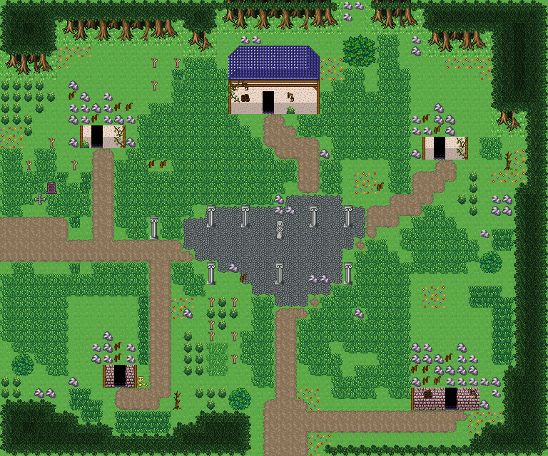

# 무너진 옛 도읍

버려진 옛 도시의 폐허. 금 간 돌 광장과 쓰러진 기둥, 폐가 다섯, 무너진 울타리와 우거진 풀. 사람이 떠난 옛 도읍. 한가운데 돌 광장에 석상과 기둥이 남았고 둘레에 덩굴 덮인 폐가 다섯 채가 선다. 무너진 울타리·돌무더기 사이로 풀과 마른나무가 자랐다. 남쪽과 서쪽에서 옛길이 들어온다. 48×40, tilesetId=forest_harmony. 통행 검사 시작 (24,35).



## 출구 — 어디와 맞닿나
- 출구0 남쪽 (24,39) → 폐허로 가는 필드 북쪽 출구
- 출구1 서쪽 (0,20) → 옛 전쟁터 동쪽 출구

## 지형
```json
{"cliffs":[],"stairs":[],"landmarks":[]}
```

## 집 (템플릿·역할·문)
```json
[{"template":0,"role":"무너진 집","x":6,"y":5,"w":6,"h":8,"door":{"x":8,"y":12},"front":{"x":8,"y":13},"yard":null,"yardSide":null},{"template":2,"role":"무너진 집","x":36,"y":6,"w":6,"h":8,"door":{"x":38,"y":13},"front":{"x":38,"y":14},"yard":null,"yardSide":null},{"template":1,"role":"무너진 집","x":6,"y":26,"w":6,"h":8,"door":{"x":10,"y":33},"front":{"x":10,"y":34},"yard":null,"yardSide":null},{"template":4,"role":"무너진 집","x":36,"y":27,"w":7,"h":9,"door":{"x":39,"y":35},"front":{"x":39,"y":36},"yard":null,"yardSide":null},{"template":7,"role":"반쯤 무너진 관청","x":20,"y":4,"w":8,"h":6,"door":{"x":23,"y":9},"front":{"x":23,"y":10},"yard":null,"yardSide":null}]
```

## 소품 (주인·이유가 있는 것만 남겼다)
```json
[{"name":"돌 석상","x":24,"y":19,"w":1,"h":2,"purpose":"옛 왕의 석상"},{"name":"흰 돌기둥","x":18,"y":18,"w":1,"h":2,"purpose":"무너진 회랑 기둥"},{"name":"흰 돌기둥","x":21,"y":18,"w":1,"h":2,"purpose":"무너진 회랑 기둥"},{"name":"흰 돌기둥","x":27,"y":18,"w":1,"h":2,"purpose":"무너진 회랑 기둥"},{"name":"흰 돌기둥","x":30,"y":18,"w":1,"h":2,"purpose":"무너진 회랑 기둥"},{"name":"흰 돌기둥","x":18,"y":23,"w":1,"h":2,"purpose":"무너진 회랑 기둥"},{"name":"흰 돌기둥","x":24,"y":23,"w":1,"h":2,"purpose":"무너진 회랑 기둥"},{"name":"흰 돌기둥","x":30,"y":23,"w":1,"h":2,"purpose":"무너진 회랑 기둥"},{"name":"돌 무더기","x":24,"y":18,"w":1,"h":1,"owner":"회랑","purpose":"쓰러진 기둥 잔해"},{"name":"회백색 바위 더미","x":25,"y":18,"w":1,"h":1,"owner":"회랑","purpose":"쓰러진 기둥 잔해"},{"name":"돌 무더기","x":24,"y":17,"w":1,"h":1,"owner":"회랑","purpose":"쓰러진 기둥 잔해"},{"name":"부서진 울타리","x":21,"y":24,"w":1,"h":1,"owner":"회랑","purpose":"쓰러진 기둥 잔해"},{"name":"돌 무더기","x":20,"y":23,"w":1,"h":1,"owner":"회랑","purpose":"쓰러진 기둥 잔해"},{"name":"회백색 바위 더미","x":27,"y":24,"w":1,"h":1,"owner":"회랑","purpose":"쓰러진 기둥 잔해"},{"name":"돌 무더기","x":28,"y":24,"w":1,"h":1,"owner":"회랑","purpose":"쓰러진 기둥 잔해"},{"name":"부서진 울타리","x":13,"y":14,"w":1,"h":1},{"name":"부서진 울타리","x":14,"y":14,"w":1,"h":1},{"name":"부서진 울타리","x":33,"y":16,"w":1,"h":1},{"name":"돌 무더기","x":16,"y":27,"w":1,"h":1},{"name":"돌 무더기","x":31,"y":27,"w":1,"h":1},{"name":"해골","x":12,"y":33,"w":1,"h":1},{"name":"돌 무더기","x":28,"y":13,"w":1,"h":1},{"name":"회백색 바위 더미","x":42,"y":20,"w":1,"h":1},{"name":"묘비","x":4,"y":16,"w":1,"h":1},{"name":"돌 십자가","x":3,"y":17,"w":1,"h":1},{"name":"마른나무","x":44,"y":13,"w":1,"h":2},{"name":"마른나무","x":15,"y":34,"w":1,"h":2},{"name":"흰 돌기둥","x":13,"y":19,"w":1,"h":2}]
```

## 포장·다리·부두·덩이
```json
[{"name":"금 간 돌 광장","kind":"paving","group":"builtin_cobble"},{"name":"폐가 · 왕궁 도시 · 파랑 박공 회벽집 6×8 ②","kind":"house","x":6,"y":5,"w":6,"h":8},{"name":"무너진 집","kind":"piece","x":6,"y":5,"w":6,"h":8},{"name":"폐가 · 왕궁 도시 · 주황 박공 회벽집 6×8","kind":"house","x":36,"y":6,"w":6,"h":8},{"name":"무너진 집","kind":"piece","x":36,"y":6,"w":6,"h":8},{"name":"폐가 · 오렌지 회벽 l-mirror 집","kind":"house","x":6,"y":26,"w":6,"h":8},{"name":"무너진 집","kind":"piece","x":6,"y":26,"w":6,"h":8},{"name":"폐가 · 오렌지 회벽 2층 rect-2f 집","kind":"house","x":36,"y":27,"w":7,"h":9},{"name":"무너진 집","kind":"piece","x":36,"y":27,"w":7,"h":9},{"name":"폐가 · 파랑 석벽 rect-wide 집","kind":"house","x":20,"y":4,"w":8,"h":6},{"name":"나무 · round-bush","kind":"vegetation","x":30,"y":3,"w":3,"h":3},{"name":"나무 · small-bush","kind":"vegetation","x":20,"y":34,"w":2,"h":2},{"name":"나무 · small-bush","kind":"vegetation","x":42,"y":22,"w":2,"h":2},{"name":"나무 · small-bush","kind":"vegetation","x":1,"y":31,"w":2,"h":2}]
```


## 채우기 규칙 (빈칸 게이트: 마을·장면 한 화면 17×13 에 맨땅 40% 이하·가장 큰 빈 네모 4칸 이하, 필드 50%·5칸)
맨땅(plain)으로 세는 칸: 잔디 240·잔디 질감 1140~1147, 포장 몸통 포석 190·석판 307·자갈 310·흙 421·모래 424·눈 67. 빈칸은 **자연 덩이로 먼저** 줄이고, 생활 소품은 주인이 있을 때만 둔다.
- 나무 덩이: 나무 키트(활엽수 978~980/1008~1010·1038~1040/1068~1070 3×4, 둥근 덤불 983~985/1013~1015/1043~1045 3×3, 작은 덤불 1073/1074/1103/1104 2×2)를 어깨를 붙여 3~7그루씩. 줄·바둑판으로 세우지 않는다.
- 꽃: 들꽃 348 을 **3~5칸 묶음**(2×2 속 + 한두 칸)이나 화단 키트(꽃 화단·화분)로만. 한 칸씩 흩은 「색종이 밭」 금지.
- 덤불 289 묶음·작은 덤불 2×2, 바위 537·29 는 3~6칸 무리로 절벽 발치·물가·숲 가장자리에만. 한 줄(가로·세로 3칸 이상 일렬) 금지.
- 키큰 풀: E builtin_tall_grass(243~335, 숲 수관 1칸 안)·F builtin_tall_grass_light(1124~1126/1154~1156/1184~1186, 외톨이 1127, 속 1157, 트인 곳)·G builtin_tall_grass_short(1128~1130/1158~1160/1188~1190, 외톨이 1131, 속 1161, 집·길 3칸 안). 덩이마다 한 종류, 2×2 이상, variantMap 으로 이웃에 맞춰 고른다(scripts/content/lib/tall-grass.mjs arrangeTallGrass).
- 금지 재료: 짙은 수풀 builtin_undergrowth(9·11·39~41·69~71·99~101, 검은 초록 구불이), 어두운 덤불 986~988·1016~1018·1046~1048(구덩이로 보임), 마른 가지 740·바위·뼈 383·부서진 울타리 410 을 고르게 흩뿌리기(절벽·폐허 벽·물가 곁 1~3곳에 몰아 둔다).
- 주인 없는 소품 금지: 벤치·통나무·상자·항아리·허수아비·표지판은 2칸 안에 이유(집 문·가게·밭·우물·부두·작업장·길)가 있어야 한다. 없으면 두지 말고 뺀다.

## 검사
```json
{"reachable":1225,"emptiness":{"maxSq":4,"screen":0.335,"at":[8,4],"screenAt":[16,16]}}
```

전체 두 레이어는 「무너진 옛 도읍 · 0행부터 전체 배열」 문서가 정답이다.
