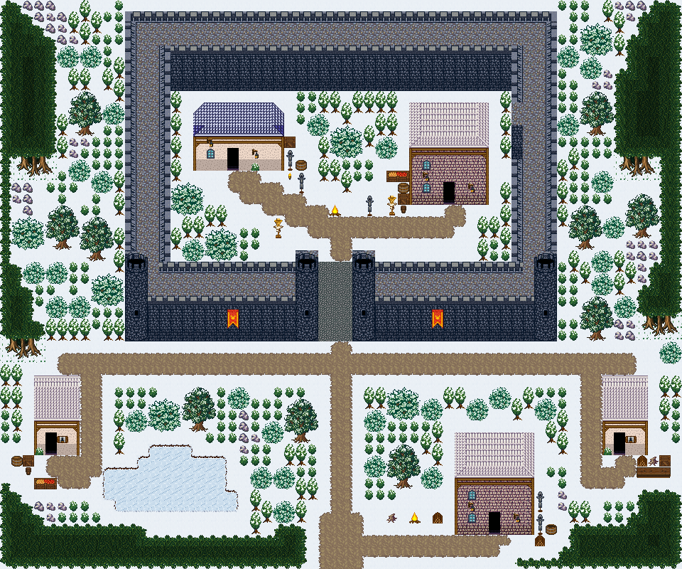

# 서리성 설원 요새

눈 덮인 북방 요새. 두 원탑 문루를 둔 네모 성채 안에 병영과 지휘관 관사, 성 밖 얼어붙은 연못과 대장간·파수꾼 집. 눈밭 윗단에 네모난 성벽 성채가 서고 남쪽 성문 양옆을 원탑 둘이 지킨다. 성 안 마당에는 병영과 지휘관 관사가 마주 보고, 마당 한가운데 모닥불과 창걸이 훈련장이 있다. 성문에서 눈길이 남쪽으로 뻗고, 성 아래 얼어붙은 연못(걸어서 건넘) 곁에 대장간·파수꾼 집 둘, 바깥은 눈 덮인 숲이다. 60×50, tilesetId=forest_harmony_snow. 통행 검사 시작 (29,45).



## 출구 — 어디와 맞닿나
- 출구0 남쪽 (29,49) → 설원 빙하 필드 북쪽 출구

## 지형
```json
{"cliffs":[],"stairs":[],"landmarks":[]}
```

## 집 (템플릿·역할·문)
```json
[{"template":7,"role":"병영","x":17,"y":9,"w":8,"h":6,"door":{"x":20,"y":14},"front":{"x":20,"y":15},"yard":"guard","yardSide":"right"},{"template":4,"role":"지휘관 관사","x":36,"y":9,"w":7,"h":9,"door":{"x":39,"y":17},"front":{"x":39,"y":18},"yard":"storage","yardSide":"left"},{"template":4,"role":"대장간","x":40,"y":38,"w":7,"h":9,"door":{"x":43,"y":46},"front":{"x":43,"y":47},"yard":"smith","yardSide":"right"},{"template":3,"role":"파수꾼 집","x":3,"y":33,"w":4,"h":7,"door":{"x":4,"y":39},"front":{"x":4,"y":40},"yard":"storage","yardSide":"front"},{"template":3,"role":"마구간지기 집","x":53,"y":33,"w":4,"h":7,"door":{"x":54,"y":39},"front":{"x":54,"y":40},"yard":"woodwork","yardSide":"front"}]
```

## 소품 (주인·이유가 있는 것만 남겼다)
```json
[{"name":"모닥불","x":29,"y":18,"w":1,"h":1,"owner":"성 마당","purpose":"성 마당 모닥불"},{"name":"무기 거치대","x":26,"y":15,"w":1,"h":2,"owner":"성 마당","purpose":"훈련장 창걸이"},{"name":"무기 거치대","x":32,"y":17,"w":1,"h":2,"owner":"성 마당","purpose":"훈련장 창걸이"},{"name":"허수아비","x":24,"y":19,"w":1,"h":2,"owner":"성 마당","purpose":"훈련용 허수아비"},{"name":"허수아비","x":34,"y":17,"w":1,"h":2,"owner":"성 마당","purpose":"훈련용 허수아비"},{"name":"모닥불","x":36,"y":45,"w":1,"h":1,"owner":"파수꾼 집","purpose":"보초 모닥불"},{"name":"통나무 더미","x":34,"y":45,"w":1,"h":1,"owner":"파수꾼 집","purpose":"모닥불 통나무"},{"name":"장작 더미","x":38,"y":45,"w":1,"h":1,"owner":"파수꾼 집","purpose":"모닥불 장작"},{"name":"무기 거치대","x":25,"y":13,"w":1,"h":2,"owner":"outdoor-snow-fortress-house-1","purpose":"경비"},{"name":"벽 횃불","x":25,"y":15,"w":1,"h":1,"owner":"outdoor-snow-fortress-house-1","purpose":"경비"},{"name":"나무 상자","x":25,"y":12,"w":1,"h":1,"owner":"outdoor-snow-fortress-house-1","purpose":"경비"},{"name":"술통","x":26,"y":14,"w":1,"h":1,"owner":"outdoor-snow-fortress-house-1","purpose":"경비"},{"name":"나무 상자","x":35,"y":17,"w":1,"h":1,"owner":"outdoor-snow-fortress-house-2","purpose":"창고"},{"name":"술통","x":35,"y":16,"w":1,"h":1,"owner":"outdoor-snow-fortress-house-2","purpose":"창고"},{"name":"작은 오크통","x":35,"y":18,"w":1,"h":1,"owner":"outdoor-snow-fortress-house-2","purpose":"창고"},{"name":"과일 상자","x":34,"y":15,"w":2,"h":1,"owner":"outdoor-snow-fortress-house-2","purpose":"창고"},{"name":"무기 거치대","x":47,"y":45,"w":1,"h":2,"owner":"outdoor-snow-fortress-house-3","purpose":"대장일"},{"name":"무기 거치대","x":47,"y":43,"w":1,"h":2,"owner":"outdoor-snow-fortress-house-3","purpose":"대장일"},{"name":"장작","x":47,"y":47,"w":1,"h":1,"owner":"outdoor-snow-fortress-house-3","purpose":"대장일"},{"name":"나무통","x":48,"y":46,"w":1,"h":1,"owner":"outdoor-snow-fortress-house-3","purpose":"대장일"},{"name":"나무 상자","x":2,"y":40,"w":1,"h":1,"owner":"outdoor-snow-fortress-house-4","purpose":"창고"},{"name":"술통","x":1,"y":40,"w":1,"h":1,"owner":"outdoor-snow-fortress-house-4","purpose":"창고"},{"name":"작은 오크통","x":2,"y":41,"w":1,"h":1,"owner":"outdoor-snow-fortress-house-4","purpose":"창고"},{"name":"과일 상자","x":3,"y":42,"w":2,"h":1,"owner":"outdoor-snow-fortress-house-4","purpose":"창고"},{"name":"장작 더미","x":56,"y":40,"w":1,"h":1,"owner":"outdoor-snow-fortress-house-5","purpose":"목공"},{"name":"통나무 더미","x":57,"y":40,"w":1,"h":1,"owner":"outdoor-snow-fortress-house-5","purpose":"목공"},{"name":"나무 상자","x":58,"y":40,"w":1,"h":1,"owner":"outdoor-snow-fortress-house-5","purpose":"목공"},{"name":"가로 탁자","x":56,"y":41,"w":3,"h":1,"owner":"outdoor-snow-fortress-house-5","purpose":"목공"}]
```

## 포장·다리·부두·덩이
```json
[{"name":"서리성 성벽 · 이중 성벽 도시의 성벽 고리를 줄여 자름","kind":"piece","x":11,"y":1,"w":38,"h":29},{"name":"서리성 문루","kind":"piece","x":26,"y":22,"w":7,"h":8},{"name":"파랑 석벽 rect-wide 집","kind":"house","x":17,"y":9,"w":8,"h":6},{"name":"오렌지 회벽 2층 rect-2f 집","kind":"house","x":36,"y":9,"w":7,"h":9},{"name":"오렌지 회벽 2층 rect-2f 집","kind":"house","x":40,"y":38,"w":7,"h":9},{"name":"왕궁 도시 · 주황 박공 회벽집 4×7 ②","kind":"house","x":3,"y":33,"w":4,"h":7},{"name":"왕궁 도시 · 주황 박공 회벽집 4×7 ②","kind":"house","x":53,"y":33,"w":4,"h":7},{"name":"나무 · tree","kind":"vegetation","x":51,"y":26,"w":3,"h":4},{"name":"나무 · small-bush","kind":"vegetation","x":4,"y":26,"w":2,"h":2},{"name":"나무 · small-bush","kind":"vegetation","x":52,"y":15,"w":2,"h":2},{"name":"나무 · tree","kind":"vegetation","x":4,"y":18,"w":3,"h":4},{"name":"나무 · round-bush","kind":"vegetation","x":1,"y":19,"w":3,"h":3},{"name":"나무 · tree","kind":"vegetation","x":7,"y":19,"w":3,"h":4},{"name":"나무 · tree","kind":"vegetation","x":25,"y":35,"w":3,"h":4},{"name":"나무 · small-bush","kind":"vegetation","x":23,"y":37,"w":2,"h":2},{"name":"나무 · small-bush","kind":"vegetation","x":37,"y":35,"w":2,"h":2},{"name":"나무 · round-bush","kind":"vegetation","x":34,"y":34,"w":3,"h":3},{"name":"나무 · small-bush","kind":"vegetation","x":32,"y":36,"w":2,"h":2},{"name":"나무 · tree","kind":"vegetation","x":55,"y":17,"w":3,"h":4},{"name":"나무 · small-bush","kind":"vegetation","x":53,"y":19,"w":2,"h":2},{"name":"나무 · tree","kind":"vegetation","x":50,"y":18,"w":3,"h":4},{"name":"나무 · round-bush","kind":"vegetation","x":29,"y":11,"w":3,"h":3},{"name":"나무 · small-bush","kind":"vegetation","x":32,"y":40,"w":2,"h":2},{"name":"나무 · tree","kind":"vegetation","x":34,"y":39,"w":3,"h":4},{"name":"나무 · small-bush","kind":"vegetation","x":37,"y":41,"w":2,"h":2},{"name":"나무 · small-bush","kind":"vegetation","x":24,"y":44,"w":2,"h":2},{"name":"나무 · small-bush","kind":"vegetation","x":7,"y":4,"w":2,"h":2},{"name":"나무 · small-bush","kind":"vegetation","x":5,"y":4,"w":2,"h":2},{"name":"나무 · small-bush","kind":"vegetation","x":49,"y":4,"w":2,"h":2},{"name":"나무 · small-bush","kind":"vegetation","x":51,"y":5,"w":2,"h":2},{"name":"나무 · round-bush","kind":"vegetation","x":51,"y":2,"w":3,"h":3},{"name":"나무 · tree","kind":"vegetation","x":6,"y":8,"w":3,"h":4},{"name":"나무 · small-bush","kind":"vegetation","x":9,"y":9,"w":2,"h":2},{"name":"나무 · small-bush","kind":"vegetation","x":8,"y":15,"w":2,"h":2},{"name":"나무 · small-bush","kind":"vegetation","x":6,"y":14,"w":2,"h":2},{"name":"나무 · small-bush","kind":"vegetation","x":16,"y":21,"w":2,"h":2},{"name":"나무 · round-bush","kind":"vegetation","x":18,"y":20,"w":3,"h":3},{"name":"나무 · small-bush","kind":"vegetation","x":11,"y":36,"w":2,"h":2},{"name":"나무 · round-bush","kind":"vegetation","x":13,"y":35,"w":3,"h":3},{"name":"나무 · tree","kind":"vegetation","x":16,"y":34,"w":3,"h":4},{"name":"나무 · tree","kind":"vegetation","x":51,"y":8,"w":3,"h":4},{"name":"나무 · small-bush","kind":"vegetation","x":49,"y":10,"w":2,"h":2},{"name":"나무 · round-bush","kind":"vegetation","x":15,"y":16,"w":3,"h":3},{"name":"나무 · round-bush","kind":"vegetation","x":8,"y":24,"w":3,"h":3},{"name":"나무 · small-bush","kind":"vegetation","x":41,"y":35,"w":2,"h":2},{"name":"나무 · small-bush","kind":"vegetation","x":43,"y":34,"w":2,"h":2},{"name":"나무 · small-bush","kind":"vegetation","x":47,"y":35,"w":2,"h":2},{"name":"나무 · small-bush","kind":"vegetation","x":22,"y":41,"w":2,"h":2},{"name":"나무 · small-bush","kind":"vegetation","x":24,"y":41,"w":2,"h":2},{"name":"나무 · small-bush","kind":"vegetation","x":20,"y":34,"w":2,"h":2},{"name":"나무 · small-bush","kind":"vegetation","x":27,"y":10,"w":2,"h":2},{"name":"나무 · small-bush","kind":"vegetation","x":58,"y":30,"w":2,"h":2},{"name":"나무 · small-bush","kind":"vegetation","x":2,"y":23,"w":2,"h":2},{"name":"나무 · small-bush","kind":"vegetation","x":4,"y":23,"w":2,"h":2},{"name":"나무 · small-bush","kind":"vegetation","x":33,"y":12,"w":2,"h":2},{"name":"나무 · small-bush","kind":"vegetation","x":54,"y":26,"w":2,"h":2},{"name":"나무 · small-bush","kind":"vegetation","x":52,"y":24,"w":2,"h":2},{"name":"나무 · small-bush","kind":"vegetation","x":52,"y":22,"w":2,"h":2},{"name":"나무 · small-bush","kind":"vegetation","x":6,"y":26,"w":2,"h":2}]
```


## 채우기 규칙 (빈칸 게이트: 마을·장면 한 화면 17×13 에 맨땅 40% 이하·가장 큰 빈 네모 4칸 이하, 필드 50%·5칸)
맨땅(plain)으로 세는 칸: 잔디 240·잔디 질감 1140~1147, 포장 몸통 포석 190·석판 307·자갈 310·흙 421·모래 424·눈 67. 빈칸은 **자연 덩이로 먼저** 줄이고, 생활 소품은 주인이 있을 때만 둔다.
- 나무 덩이: 나무 키트(활엽수 978~980/1008~1010·1038~1040/1068~1070 3×4, 둥근 덤불 983~985/1013~1015/1043~1045 3×3, 작은 덤불 1073/1074/1103/1104 2×2)를 어깨를 붙여 3~7그루씩. 줄·바둑판으로 세우지 않는다. 설원은 침엽수 도장도 2~4그루 덩이로 쓴다.
- 꽃: 들꽃 348 을 **3~5칸 묶음**(2×2 속 + 한두 칸)이나 화단 키트(꽃 화단·화분)로만. 한 칸씩 흩은 「색종이 밭」 금지.
- 덤불 289 묶음·작은 덤불 2×2, 바위 537·29 는 3~6칸 무리로 절벽 발치·물가·숲 가장자리에만. 한 줄(가로·세로 3칸 이상 일렬) 금지.
- 키큰 풀 E/F/G 금지: 모래·눈·재·가을 시트에 깐 풀(재칠본 포함)은 초록 띠나 진흙 얼룩으로 읽힌다. 이 시트에는 풀 덩이를 깔지 않는다.
- 금지 재료: 짙은 수풀 builtin_undergrowth(9·11·39~41·69~71·99~101, 검은 초록 구불이), 어두운 덤불 986~988·1016~1018·1046~1048(구덩이로 보임), 마른 가지 740·바위·뼈 383·부서진 울타리 410 을 고르게 흩뿌리기(절벽·폐허 벽·물가 곁 1~3곳에 몰아 둔다).
- 주인 없는 소품 금지: 벤치·통나무·상자·항아리·허수아비·표지판은 2칸 안에 이유(집 문·가게·밭·우물·부두·작업장·길)가 있어야 한다. 없으면 두지 말고 뺀다.

## 검사
```json
{"reachable":906,"emptiness":{"maxSq":3,"screen":0.33,"at":[28,23],"screenAt":[32,37]}}
```

전체 두 레이어는 「서리성 설원 요새 · 0행부터 전체 배열」 문서가 정답이다.
