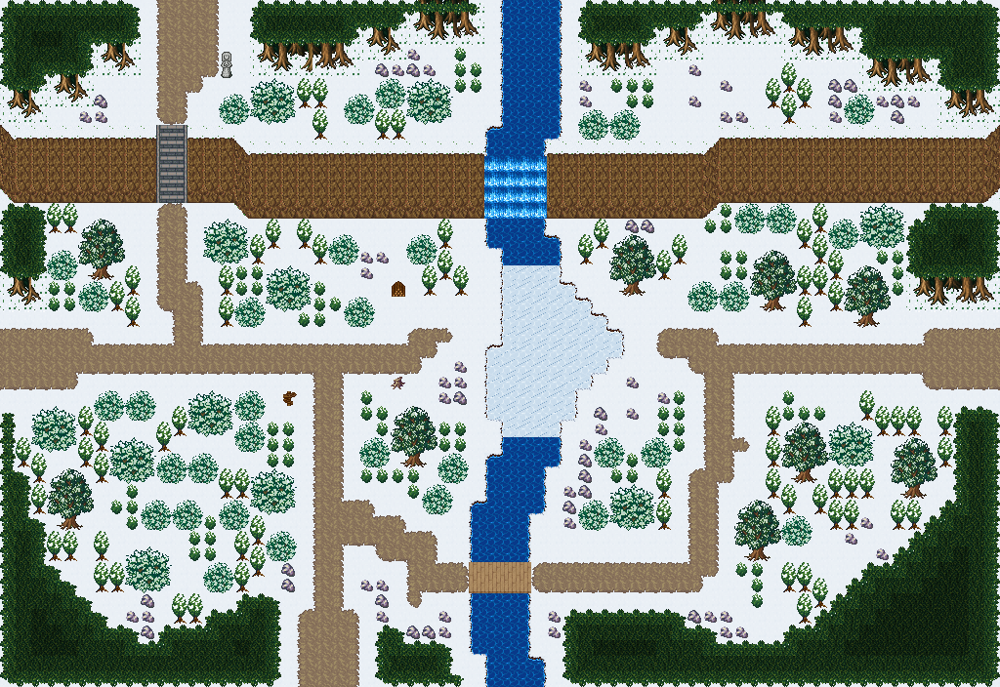

# 얼음강 나루 설원

눈 절벽에서 폭포로 떨어진 강이 설원을 세로로 가르는 필드. 강 가운데가 얼어붙어 걸어서 건너는 얼음 여울이 되고, 하류는 흐르는 물이라 나무다리로 건넌다. 북쪽 눈 절벽을 넘은 강물이 폭포로 떨어져 설원을 남북으로 가른다. 강 허리의 넓은 여울은 꽁꽁 얼어 걸어서 건너는 얼음 나루가 되고, 하류는 다시 흐르는 물이라 나무다리가 놓였다. 서쪽 눈길은 얼음 나루와 다리 두 갈래로 동쪽에 닿고, 서쪽 돌계단으로 절벽 윗단 산촌 길에 오른다. 얼음 나루 서쪽 기슭엔 쉼터 통나무와 장작 더미, 둘레엔 눈 덮인 침엽 숲. 64×44, tilesetId=forest_harmony_snow. 통행 검사 시작 (4,22).



## 출구 — 어디와 맞닿나
- 출구0 서쪽 (0,22) → 푸른 빙하 설원 동쪽 출구
- 출구1 북쪽 (11,0) → 솔바람 산촌 · 설원 남쪽 입구
- 출구2 동쪽 (63,22) → 다음 설원 필드
- 출구3 남쪽 (20,43) → 눈 덮인 두 단 고갯길 북쪽 출구

## 지형
```json
{"cliffs":[{"points":[[0,8],[14,8],[16,9],[44,9],[46,8],[63,8]],"height":4,"left":"open","right":"open"}],"stairs":[{"x":10,"y":8,"height":4}],"falls":[{"x":31,"y":9,"height":4,"tile":2700},{"x":32,"y":9,"height":4,"tile":2700},{"x":33,"y":9,"height":4,"tile":2700},{"x":34,"y":9,"height":4,"tile":2700}],"landmarks":[]}
```

## 집 (템플릿·역할·문)
```json
[]
```

## 소품 (주인·이유가 있는 것만 남겼다)
```json
[{"name":"나무 이정표","x":18,"y":25,"w":1,"h":1,"purpose":"갈림길 표지 · 얼음 나루 / 다리"},{"name":"돌 석상","x":14,"y":3,"w":1,"h":2,"purpose":"절벽 위 눈 수호상"},{"name":"통나무 더미","x":25,"y":24,"w":1,"h":1,"owner":"얼음 나루","purpose":"나루터 쉼터 통나무"},{"name":"장작 더미","x":25,"y":18,"w":1,"h":1,"owner":"얼음 나루","purpose":"나루터 모닥불 장작"}]
```

## 포장·다리·부두·덩이
```json
[{"name":"나무다리","kind":"bridge","x":30,"y":36,"w":4,"h":2},{"name":"나무 · round-bush","kind":"vegetation","x":8,"y":35,"w":3,"h":3},{"name":"나무 · round-bush","kind":"vegetation","x":2,"y":26,"w":3,"h":3},{"name":"나무 · tree","kind":"vegetation","x":3,"y":30,"w":3,"h":4},{"name":"나무 · small-bush","kind":"vegetation","x":13,"y":36,"w":2,"h":2},{"name":"나무 · round-bush","kind":"vegetation","x":7,"y":28,"w":3,"h":3},{"name":"나무 · small-bush","kind":"vegetation","x":10,"y":29,"w":2,"h":2},{"name":"나무 · small-bush","kind":"vegetation","x":12,"y":29,"w":2,"h":2},{"name":"나무 · small-bush","kind":"vegetation","x":46,"y":18,"w":2,"h":2},{"name":"나무 · tree","kind":"vegetation","x":48,"y":16,"w":3,"h":4},{"name":"나무 · small-bush","kind":"vegetation","x":44,"y":18,"w":2,"h":2},{"name":"나무 · tree","kind":"vegetation","x":50,"y":27,"w":3,"h":4},{"name":"나무 · round-bush","kind":"vegetation","x":53,"y":27,"w":3,"h":3},{"name":"나무 · round-bush","kind":"vegetation","x":17,"y":17,"w":3,"h":3},{"name":"나무 · small-bush","kind":"vegetation","x":15,"y":19,"w":2,"h":2},{"name":"나무 · small-bush","kind":"vegetation","x":38,"y":28,"w":2,"h":2},{"name":"나무 · tree","kind":"vegetation","x":5,"y":14,"w":3,"h":4},{"name":"나무 · small-bush","kind":"vegetation","x":3,"y":16,"w":2,"h":2},{"name":"나무 · small-bush","kind":"vegetation","x":53,"y":14,"w":2,"h":2},{"name":"나무 · round-bush","kind":"vegetation","x":55,"y":13,"w":3,"h":3},{"name":"나무 · tree","kind":"vegetation","x":25,"y":26,"w":3,"h":4},{"name":"나무 · small-bush","kind":"vegetation","x":23,"y":28,"w":2,"h":2},{"name":"나무 · small-bush","kind":"vegetation","x":28,"y":29,"w":2,"h":2},{"name":"나무 · tree","kind":"vegetation","x":47,"y":32,"w":3,"h":4},{"name":"나무 · small-bush","kind":"vegetation","x":50,"y":33,"w":2,"h":2},{"name":"나무 · tree","kind":"vegetation","x":39,"y":15,"w":3,"h":4},{"name":"나무 · tree","kind":"vegetation","x":54,"y":17,"w":3,"h":4},{"name":"나무 · round-bush","kind":"vegetation","x":16,"y":30,"w":3,"h":3},{"name":"나무 · small-bush","kind":"vegetation","x":14,"y":32,"w":2,"h":2},{"name":"나무 · round-bush","kind":"vegetation","x":39,"y":31,"w":3,"h":3},{"name":"나무 · small-bush","kind":"vegetation","x":37,"y":32,"w":2,"h":2},{"name":"나무 · round-bush","kind":"vegetation","x":12,"y":25,"w":3,"h":3},{"name":"나무 · small-bush","kind":"vegetation","x":15,"y":25,"w":2,"h":2},{"name":"나무 · small-bush","kind":"vegetation","x":15,"y":27,"w":2,"h":2},{"name":"나무 · small-bush","kind":"vegetation","x":17,"y":34,"w":2,"h":2},{"name":"나무 · small-bush","kind":"vegetation","x":41,"y":28,"w":2,"h":2},{"name":"나무 · small-bush","kind":"vegetation","x":6,"y":25,"w":2,"h":2},{"name":"나무 · small-bush","kind":"vegetation","x":8,"y":25,"w":2,"h":2},{"name":"나무 · small-bush","kind":"vegetation","x":26,"y":15,"w":2,"h":2},{"name":"나무 · tree","kind":"vegetation","x":57,"y":28,"w":3,"h":4},{"name":"나무 · small-bush","kind":"vegetation","x":22,"y":19,"w":2,"h":2},{"name":"나무 · small-bush","kind":"vegetation","x":11,"y":32,"w":2,"h":2},{"name":"나무 · small-bush","kind":"vegetation","x":9,"y":32,"w":2,"h":2},{"name":"나무 · round-bush","kind":"vegetation","x":26,"y":5,"w":3,"h":3},{"name":"나무 · small-bush","kind":"vegetation","x":24,"y":5,"w":2,"h":2},{"name":"나무 · small-bush","kind":"vegetation","x":22,"y":6,"w":2,"h":2},{"name":"나무 · small-bush","kind":"vegetation","x":49,"y":13,"w":2,"h":2},{"name":"나무 · small-bush","kind":"vegetation","x":47,"y":13,"w":2,"h":2},{"name":"나무 · round-bush","kind":"vegetation","x":13,"y":14,"w":3,"h":3},{"name":"나무 · small-bush","kind":"vegetation","x":39,"y":7,"w":2,"h":2},{"name":"나무 · small-bush","kind":"vegetation","x":37,"y":7,"w":2,"h":2},{"name":"나무 · small-bush","kind":"vegetation","x":5,"y":18,"w":2,"h":2},{"name":"나무 · small-bush","kind":"vegetation","x":54,"y":6,"w":2,"h":2},{"name":"나무 · small-bush","kind":"vegetation","x":27,"y":31,"w":2,"h":2},{"name":"나무 · small-bush","kind":"vegetation","x":14,"y":6,"w":2,"h":2},{"name":"나무 · round-bush","kind":"vegetation","x":16,"y":5,"w":3,"h":3},{"name":"나무 · small-bush","kind":"vegetation","x":21,"y":15,"w":2,"h":2}]
```


## 채우기 규칙 (빈칸 게이트: 마을·장면 한 화면 17×13 에 맨땅 40% 이하·가장 큰 빈 네모 4칸 이하, 필드 50%·5칸)
맨땅(plain)으로 세는 칸: 잔디 240·잔디 질감 1140~1147, 포장 몸통 포석 190·석판 307·자갈 310·흙 421·모래 424·눈 67. 빈칸은 **자연 덩이로 먼저** 줄이고, 생활 소품은 주인이 있을 때만 둔다.
- 나무 덩이: 나무 키트(활엽수 978~980/1008~1010·1038~1040/1068~1070 3×4, 둥근 덤불 983~985/1013~1015/1043~1045 3×3, 작은 덤불 1073/1074/1103/1104 2×2)를 어깨를 붙여 3~7그루씩. 줄·바둑판으로 세우지 않는다. 설원은 침엽수 도장도 2~4그루 덩이로 쓴다.
- **눈 쌓인 성벽**(개정6): 설원 시트의 성벽·성탑·문루 윗면은 눈 얹힌 사본으로 바꿔 깐다 — 흉벽 톱니 위 눈 3줄, 윗면 석판은 반쯤 눈 더미, 성벽 위 길(412·21)은 튀어나온 돌만 하얗게, 안쪽 벽면 51 은 **맨 윗줄에만** 눈 처마(두 줄 벽면의 아랫줄은 51 그대로), 성탑 머리 24·25 는 눈 모자. 원본→사본(여러 개면 칸 위치로 번갈아): 18→3630 19→3631 20→3632 21→3633/3645/3646 24→3634 25→3635 51→3636 78→3637 80→3638 108→3639 109→3640 110→3641 412→3642/3643/3644. 통행·레이어·밑칠은 원본과 같다. 도우미 scripts/content/lib/climate-terrain.mjs snowCastleTops(map, snowWalls).
- 꽃: 들꽃 348 을 **3~5칸 묶음**(2×2 속 + 한두 칸)이나 화단 키트(꽃 화단·화분)로만. 한 칸씩 흩은 「색종이 밭」 금지.
- 덤불 289 묶음·작은 덤불 2×2, 바위 537·29 는 3~6칸 무리로 절벽 발치·물가·숲 가장자리에만. 한 줄(가로·세로 3칸 이상 일렬) 금지.
- 키큰 풀 E/F/G 금지: 모래·눈·재·가을 시트에 깐 풀(재칠본 포함)은 초록 띠나 진흙 얼룩으로 읽힌다. 이 시트에는 풀 덩이를 깔지 않는다.
- 금지 재료: 짙은 수풀 builtin_undergrowth(9·11·39~41·69~71·99~101, 검은 초록 구불이), 어두운 덤불 986~988·1016~1018·1046~1048(구덩이로 보임), 마른 가지 740·바위·뼈 383·부서진 울타리 410 을 고르게 흩뿌리기(절벽·폐허 벽·물가 곁 1~3곳에 몰아 둔다).
- 주인 없는 소품 금지: 벤치·통나무·상자·항아리·허수아비·표지판은 2칸 안에 이유(집 문·가게·밭·우물·부두·작업장·길)가 있어야 한다. 없으면 두지 말고 뺀다.

## 검사
```json
{"reachable":1022,"emptiness":{"maxSq":3,"screen":0.43,"at":[7,5],"screenAt":[16,16]}}
```

전체 두 레이어는 「얼음강 나루 설원 · 0행부터 전체 배열」 문서가 정답이다.
