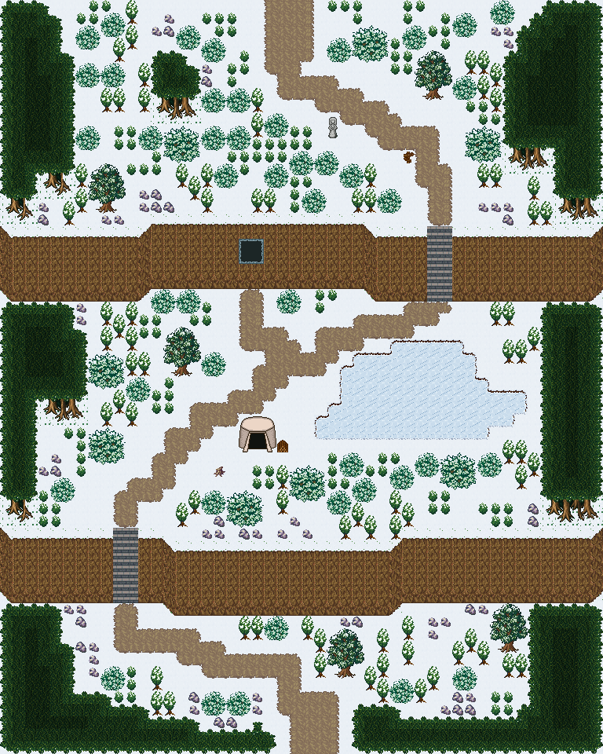

# 눈보라 빙벽 고갯길

눈 절벽 두 단을 계단으로 갈지자로 올라 북쪽 교구 마을에 닿는 고갯길. 가운뎃단에 얼어붙은 산정 호수와 사냥꾼 야영지, 윗단 빙벽에 얼음 동굴. 남쪽 기슭에서 눈 절벽 두 단을 돌계단 둘로 갈지자로 오른다. 가운뎃단 동쪽에 얼어붙은 산정 호수(걸어서 건넘)가 있고 호숫가에 사냥꾼 천막과 장작 더미가 붙어 있다. 윗단 빙벽 면엔 얼음 동굴 입구가 하나 뚫렸고, 고갯마루에서 북쪽으로 종탑 언덕 교구 가는 눈길이 난다. 양옆은 눈 덮인 침엽 숲. 48×60, tilesetId=forest_harmony_snow. 통행 검사 시작 (24,55).



## 출구 — 어디와 맞닿나
- 출구0 남쪽 (24,59) → 얼음강 나루 설원 북쪽 길(필드)
- 출구1 북쪽 (22,0) → 종탑 언덕 교구 · 설원 남쪽 입구

## 지형
```json
{"cliffs":[{"points":[[0,42],[12,42],[14,43],[30,43],[32,42],[47,42]],"height":5,"left":"open","right":"open"},{"points":[[0,18],[10,18],[12,17],[28,17],[30,18],[47,18]],"height":5,"left":"open","right":"open"}],"stairs":[{"x":9,"y":42,"height":5},{"x":34,"y":18,"height":5}],"landmarks":[]}
```

## 집 (템플릿·역할·문)
```json
[]
```

## 소품 (주인·이유가 있는 것만 남겼다)
```json
[{"name":"천막","x":19,"y":33,"w":3,"h":3,"purpose":"사냥꾼 천막"},{"name":"장작 더미","x":22,"y":35,"w":1,"h":1,"owner":"사냥꾼 야영지","purpose":"천막 장작"},{"name":"통나무 더미","x":17,"y":37,"w":1,"h":1,"owner":"사냥꾼 야영지","purpose":"천막 곁 통나무"},{"name":"나무 이정표","x":32,"y":12,"w":1,"h":1,"purpose":"고갯마루 표지"},{"name":"돌 석상","x":26,"y":9,"w":1,"h":2,"purpose":"고갯마루 수호석"}]
```

## 포장·다리·부두·덩이
```json
[{"name":"갱도 입구","kind":"shaft","x":19,"y":19,"w":2,"h":2},{"name":"나무 · small-bush","kind":"vegetation","x":31,"y":54,"w":2,"h":2},{"name":"나무 · small-bush","kind":"vegetation","x":36,"y":53,"w":2,"h":2},{"name":"나무 · tree","kind":"vegetation","x":39,"y":48,"w":3,"h":4},{"name":"나무 · small-bush","kind":"vegetation","x":6,"y":10,"w":2,"h":2},{"name":"나무 · tree","kind":"vegetation","x":7,"y":13,"w":3,"h":4},{"name":"나무 · small-bush","kind":"vegetation","x":8,"y":53,"w":2,"h":2},{"name":"나무 · small-bush","kind":"vegetation","x":23,"y":12,"w":2,"h":2},{"name":"나무 · small-bush","kind":"vegetation","x":25,"y":12,"w":2,"h":2},{"name":"나무 · small-bush","kind":"vegetation","x":27,"y":13,"w":2,"h":2},{"name":"나무 · small-bush","kind":"vegetation","x":21,"y":13,"w":2,"h":2},{"name":"나무 · tree","kind":"vegetation","x":33,"y":4,"w":3,"h":4},{"name":"나무 · small-bush","kind":"vegetation","x":36,"y":6,"w":2,"h":2},{"name":"나무 · small-bush","kind":"vegetation","x":12,"y":23,"w":2,"h":2},{"name":"나무 · small-bush","kind":"vegetation","x":14,"y":23,"w":2,"h":2},{"name":"나무 · round-bush","kind":"vegetation","x":7,"y":28,"w":3,"h":3},{"name":"나무 · small-bush","kind":"vegetation","x":10,"y":30,"w":2,"h":2},{"name":"나무 · round-bush","kind":"vegetation","x":13,"y":10,"w":3,"h":3},{"name":"나무 · small-bush","kind":"vegetation","x":16,"y":10,"w":2,"h":2},{"name":"나무 · small-bush","kind":"vegetation","x":18,"y":10,"w":2,"h":2},{"name":"나무 · small-bush","kind":"vegetation","x":11,"y":10,"w":2,"h":2},{"name":"나무 · round-bush","kind":"vegetation","x":23,"y":37,"w":3,"h":3},{"name":"나무 · small-bush","kind":"vegetation","x":26,"y":39,"w":2,"h":2},{"name":"나무 · small-bush","kind":"vegetation","x":28,"y":38,"w":2,"h":2},{"name":"나무 · small-bush","kind":"vegetation","x":33,"y":36,"w":2,"h":2},{"name":"나무 · small-bush","kind":"vegetation","x":31,"y":37,"w":2,"h":2},{"name":"나무 · round-bush","kind":"vegetation","x":35,"y":36,"w":3,"h":3},{"name":"나무 · small-bush","kind":"vegetation","x":8,"y":1,"w":2,"h":2},{"name":"나무 · small-bush","kind":"vegetation","x":6,"y":2,"w":2,"h":2},{"name":"나무 · round-bush","kind":"vegetation","x":28,"y":2,"w":3,"h":3},{"name":"나무 · small-bush","kind":"vegetation","x":26,"y":3,"w":2,"h":2},{"name":"나무 · small-bush","kind":"vegetation","x":6,"y":5,"w":2,"h":2},{"name":"나무 · small-bush","kind":"vegetation","x":8,"y":5,"w":2,"h":2},{"name":"나무 · tree","kind":"vegetation","x":13,"y":26,"w":3,"h":4},{"name":"나무 · small-bush","kind":"vegetation","x":16,"y":28,"w":2,"h":2},{"name":"나무 · small-bush","kind":"vegetation","x":4,"y":38,"w":2,"h":2},{"name":"나무 · tree","kind":"vegetation","x":26,"y":50,"w":3,"h":4},{"name":"나무 · small-bush","kind":"vegetation","x":17,"y":13,"w":2,"h":2},{"name":"나무 · small-bush","kind":"vegetation","x":24,"y":15,"w":2,"h":2},{"name":"나무 · small-bush","kind":"vegetation","x":30,"y":15,"w":2,"h":2},{"name":"나무 · small-bush","kind":"vegetation","x":16,"y":3,"w":2,"h":2},{"name":"나무 · small-bush","kind":"vegetation","x":14,"y":2,"w":2,"h":2},{"name":"나무 · small-bush","kind":"vegetation","x":16,"y":7,"w":2,"h":2},{"name":"나무 · small-bush","kind":"vegetation","x":18,"y":7,"w":2,"h":2},{"name":"나무 · round-bush","kind":"vegetation","x":37,"y":10,"w":3,"h":3},{"name":"나무 · round-bush","kind":"vegetation","x":7,"y":34,"w":3,"h":3},{"name":"나무 · small-bush","kind":"vegetation","x":21,"y":9,"w":2,"h":2},{"name":"나무 · round-bush","kind":"vegetation","x":18,"y":39,"w":3,"h":3},{"name":"나무 · small-bush","kind":"vegetation","x":16,"y":39,"w":2,"h":2},{"name":"나무 · small-bush","kind":"vegetation","x":36,"y":1,"w":2,"h":2},{"name":"나무 · small-bush","kind":"vegetation","x":22,"y":23,"w":2,"h":2},{"name":"나무 · small-bush","kind":"vegetation","x":18,"y":55,"w":2,"h":2},{"name":"나무 · small-bush","kind":"vegetation","x":16,"y":55,"w":2,"h":2},{"name":"나무 · small-bush","kind":"vegetation","x":27,"y":36,"w":2,"h":2},{"name":"나무 · small-bush","kind":"vegetation","x":21,"y":49,"w":2,"h":2},{"name":"나무 · small-bush","kind":"vegetation","x":38,"y":36,"w":2,"h":2},{"name":"나무 · small-bush","kind":"vegetation","x":39,"y":0,"w":2,"h":2},{"name":"나무 · small-bush","kind":"vegetation","x":32,"y":2,"w":2,"h":2}]
```


## 채우기 규칙 (빈칸 게이트: 마을·장면 한 화면 17×13 에 맨땅 40% 이하·가장 큰 빈 네모 4칸 이하, 필드 50%·5칸)
맨땅(plain)으로 세는 칸: 잔디 240·잔디 질감 1140~1147, 포장 몸통 포석 190·석판 307·자갈 310·흙 421·모래 424·눈 67. 빈칸은 **자연 덩이로 먼저** 줄이고, 생활 소품은 주인이 있을 때만 둔다.
- 나무 덩이: 나무 키트(활엽수 978~980/1008~1010·1038~1040/1068~1070 3×4, 둥근 덤불 983~985/1013~1015/1043~1045 3×3, 작은 덤불 1073/1074/1103/1104 2×2)를 어깨를 붙여 3~7그루씩. 줄·바둑판으로 세우지 않는다. 설원은 침엽수 도장도 2~4그루 덩이로 쓴다.
- **눈 쌓인 성벽**(개정6): 설원 시트의 성벽·성탑·문루 윗면은 눈 얹힌 사본으로 바꿔 깐다 — 흉벽 톱니 위 눈 3줄, 윗면 석판은 반쯤 눈 더미, 성벽 위 길(412·21)은 튀어나온 돌만 하얗게, 안쪽 벽면 51 은 **맨 윗줄에만** 눈 처마(두 줄 벽면의 아랫줄은 51 그대로), 성탑 머리 24·25 는 눈 모자. 원본→사본(여러 개면 칸 위치로 번갈아): 18→3630 19→3631 20→3632 21→3633/3645/3646 24→3634 25→3635 51→3636 78→3637 80→3638 108→3639 109→3640 110→3641 412→3642/3643/3644. 통행·레이어·밑칠은 원본과 같다. 도우미 scripts/content/lib/climate-terrain.mjs snowCastleTops(map, snowWalls).
- 꽃: 들꽃 348 을 **3~5칸 묶음**(2×2 속 + 한두 칸)이나 화단 키트(꽃 화단·화분)로만. 한 칸씩 흩은 「색종이 밭」 금지.
- 덤불 289 묶음·작은 덤불 2×2, 바위 537·29 는 3~6칸 무리로 절벽 발치·물가·숲 가장자리에만. 한 줄(가로·세로 3칸 이상 일렬) 금지.
- 키큰 풀 E/F/G 금지: 모래·눈·재·가을 시트에 깐 풀(재칠본 포함)은 초록 띠나 진흙 얼룩으로 읽힌다. 이 시트에는 풀 덩이를 깔지 않는다.
- 금지 재료: 짙은 수풀 builtin_undergrowth(9·11·39~41·69~71·99~101, 검은 초록 구불이), 어두운 덤불 986~988·1016~1018·1046~1048(구덩이로 보임), 마른 가지 740·바위·뼈 383·부서진 울타리 410 을 고르게 흩뿌리기(절벽·폐허 벽·물가 곁 1~3곳에 몰아 둔다).
- 주인 없는 소품 금지: 벤치·통나무·상자·항아리·허수아비·표지판은 2칸 안에 이유(집 문·가게·밭·우물·부두·작업장·길)가 있어야 한다. 없으면 두지 말고 뺀다.

## 검사
```json
{"reachable":949,"emptiness":{"maxSq":3,"screen":0.434,"at":[36,24],"screenAt":[12,24]}}
```

전체 두 레이어는 「눈보라 빙벽 고갯길 · 0행부터 전체 배열」 문서가 정답이다.
