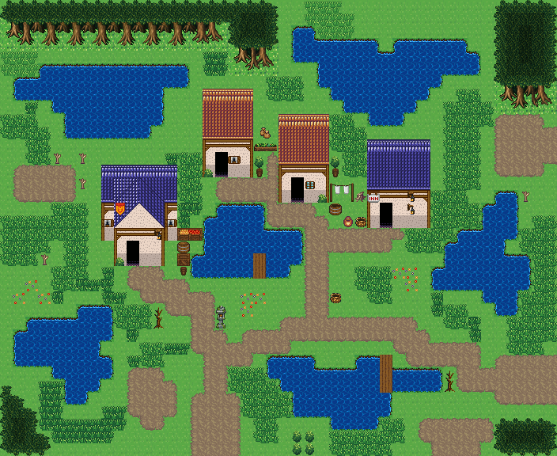

# 안개늪 마을

늪 사이 마른 둔덕에 붙어 사는 마을. 물웅덩이 사이 좁은 길, 갈대숲(키 큰 풀)과 마른나무, 약초·고기잡이 마당. 크고 작은 늪 웅덩이 여섯 사이 마른 둔덕에 집 네 채가 흩어져 있고, 좁은 흙길이 웅덩이 사이를 굽이친다. 물가마다 갈대숲이 우거지고 마른나무가 선다. 남쪽 둑길로 들어오고 동쪽으로 늪지 필드가 이어진다. 44×36, tilesetId=forest_harmony. 통행 검사 시작 (16,31).



## 출구 — 어디와 맞닿나
- 출구0 남쪽 (16,35) → 늪지 필드 북쪽 출구
- 출구1 동쪽 (43,29) → 늪지 필드 서쪽 출구

## 지형
```json
{"cliffs":[],"stairs":[],"landmarks":[]}
```

## 집 (템플릿·역할·문)
```json
[{"template":3,"role":"약초꾼 집","x":16,"y":7,"w":4,"h":7,"door":{"x":17,"y":13},"front":{"x":17,"y":14},"yard":"herbs","yardSide":"right"},{"template":6,"role":"어부 집","x":29,"y":11,"w":5,"h":7,"door":{"x":30,"y":17},"front":{"x":30,"y":18},"yard":"fishing","yardSide":"left"},{"template":5,"role":"집","x":22,"y":9,"w":4,"h":7,"door":{"x":23,"y":15},"front":{"x":23,"y":16},"yard":"laundry","yardSide":"right"},{"template":0,"role":"늪지기 집","x":8,"y":13,"w":6,"h":8,"door":{"x":10,"y":20},"front":{"x":10,"y":21},"yard":"storage","yardSide":"right"}]
```

## 소품 (주인·이유가 있는 것만 남겼다)
```json
[{"name":"마른나무","x":12,"y":24,"w":1,"h":2},{"name":"마른나무","x":35,"y":29,"w":1,"h":2},{"name":"마른 묘목","x":3,"y":20,"w":1,"h":1},{"name":"마른 묘목","x":41,"y":15,"w":1,"h":1},{"name":"낚시 바구니","x":26,"y":23,"w":1,"h":1,"owner":"부두","purpose":"낚시꾼 자리"},{"name":"돌등","x":17,"y":24,"w":1,"h":2},{"name":"약초 화분","x":20,"y":11,"w":2,"h":1,"owner":"outdoor-swamp-village-house-1","purpose":"약초 손질"},{"name":"씨앗 자루","x":20,"y":10,"w":2,"h":1,"owner":"outdoor-swamp-village-house-1","purpose":"약초 손질"},{"name":"화분","x":20,"y":12,"w":1,"h":2,"owner":"outdoor-swamp-village-house-1","purpose":"약초 손질"},{"name":"낚시 바구니","x":28,"y":17,"w":1,"h":1,"owner":"outdoor-swamp-village-house-2","purpose":"고기잡이"},{"name":"통나무 더미","x":28,"y":15,"w":1,"h":1,"owner":"outdoor-swamp-village-house-2","purpose":"고기잡이"},{"name":"항아리","x":27,"y":17,"w":1,"h":1,"owner":"outdoor-swamp-village-house-2","purpose":"고기잡이"},{"name":"빨랫줄","x":26,"y":14,"w":2,"h":2,"owner":"outdoor-swamp-village-house-3","purpose":"빨래 말리기"},{"name":"나무통","x":26,"y":16,"w":1,"h":1,"owner":"outdoor-swamp-village-house-3","purpose":"빨래 말리기"},{"name":"화분","x":26,"y":12,"w":1,"h":2,"owner":"outdoor-swamp-village-house-3","purpose":"빨래 말리기"},{"name":"나무 상자","x":14,"y":20,"w":1,"h":1,"owner":"outdoor-swamp-village-house-4","purpose":"창고"},{"name":"술통","x":14,"y":19,"w":1,"h":1,"owner":"outdoor-swamp-village-house-4","purpose":"창고"},{"name":"작은 오크통","x":14,"y":21,"w":1,"h":1,"owner":"outdoor-swamp-village-house-4","purpose":"창고"},{"name":"과일 상자","x":14,"y":18,"w":2,"h":1,"owner":"outdoor-swamp-village-house-4","purpose":"창고"}]
```

## 포장·다리·부두·덩이
```json
[{"name":"왕궁 도시 · 주황 박공 회벽집 4×7 ②","kind":"house","x":16,"y":7,"w":4,"h":7},{"name":"왕궁 도시 · 파랑 회벽집 5×7","kind":"house","x":29,"y":11,"w":5,"h":7},{"name":"왕궁 도시 · 주황 박공 회벽집 4×7 ②","kind":"house","x":22,"y":9,"w":4,"h":7},{"name":"왕궁 도시 · 파랑 박공 회벽집 6×8 ②","kind":"house","x":8,"y":13,"w":6,"h":8},{"name":"선착장","kind":"dock","x":20,"y":20,"w":1,"h":2},{"name":"선착장","kind":"dock","x":30,"y":28,"w":1,"h":3}]
```


## 채우기 규칙 (빈칸 게이트: 마을·장면 한 화면 17×13 에 맨땅 40% 이하·가장 큰 빈 네모 4칸 이하, 필드 50%·5칸)
맨땅(plain)으로 세는 칸: 잔디 240·잔디 질감 1140~1147, 포장 몸통 포석 190·석판 307·자갈 310·흙 421·모래 424·눈 67. 빈칸은 **자연 덩이로 먼저** 줄이고, 생활 소품은 주인이 있을 때만 둔다.
- 나무 덩이: 나무 키트(활엽수 978~980/1008~1010·1038~1040/1068~1070 3×4, 둥근 덤불 983~985/1013~1015/1043~1045 3×3, 작은 덤불 1073/1074/1103/1104 2×2)를 어깨를 붙여 3~7그루씩. 줄·바둑판으로 세우지 않는다.
- 꽃: 들꽃 348 을 **3~5칸 묶음**(2×2 속 + 한두 칸)이나 화단 키트(꽃 화단·화분)로만. 한 칸씩 흩은 「색종이 밭」 금지.
- 덤불 289 묶음·작은 덤불 2×2, 바위 537·29 는 3~6칸 무리로 절벽 발치·물가·숲 가장자리에만. 한 줄(가로·세로 3칸 이상 일렬) 금지.
- 키큰 풀: E builtin_tall_grass(243~335, 숲 수관 1칸 안)·F builtin_tall_grass_light(1124~1126/1154~1156/1184~1186, 외톨이 1127, 속 1157, 트인 곳)·G builtin_tall_grass_short(1128~1130/1158~1160/1188~1190, 외톨이 1131, 속 1161, 집·길 3칸 안). 덩이마다 한 종류, 2×2 이상, variantMap 으로 이웃에 맞춰 고른다(scripts/content/lib/tall-grass.mjs arrangeTallGrass).
- 금지 재료: 짙은 수풀 builtin_undergrowth(9·11·39~41·69~71·99~101, 검은 초록 구불이), 어두운 덤불 986~988·1016~1018·1046~1048(구덩이로 보임), 마른 가지 740·바위·뼈 383·부서진 울타리 410 을 고르게 흩뿌리기(절벽·폐허 벽·물가 곁 1~3곳에 몰아 둔다).
- 주인 없는 소품 금지: 벤치·통나무·상자·항아리·허수아비·표지판은 2칸 안에 이유(집 문·가게·밭·우물·부두·작업장·길)가 있어야 한다. 없으면 두지 말고 뺀다.

## 검사
```json
{"reachable":926,"emptiness":{"maxSq":3,"screen":0.344,"at":[28,0],"screenAt":[0,4]}}
```

전체 두 레이어는 「안개늪 마을 · 0행부터 전체 배열」 문서가 정답이다.
