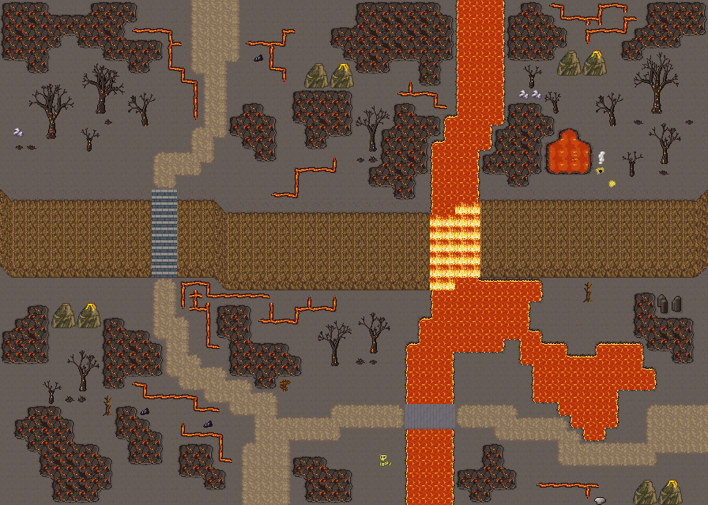

# 불꽃산 화산 지대

용암 강과 화산 봉우리의 화산 필드. 용암이 절벽을 폭포로 넘고 현무암 다리로 건넌다. 재 덮인 절벽 위 화산 봉우리들 사이에서 용암 강이 흘러나와 절벽을 용암 폭포로 넘는다. 아랫단 길은 현무암 다리로 용암 강을 건너고 돌계단으로 윗단에 오른다. 재 들판은 식은 용암 판과 가지 친 용암 균열로 덮이고, 분기공이 김을 뿜는 작은 용암 웅덩이와 현무암 기둥 한 무리가 있다. 화산 봉우리는 넷, 그을린 잎 없는 나무가 몇 덩이 서 있다. 56×40, tilesetId=forest_harmony_volcano. 통행 검사 시작 (20,35).



## 출구 — 어디와 맞닿나
- 출구0 남쪽 (20,39) → 화산 마을(잿빛 여울성) 쪽 필드
- 출구1 북쪽 (16,0) → 화산 정상(던전 입구)
- 출구2 동쪽 (55,33) → 다음 필드

## 지형
```json
{"cliffs":[{"points":[[0,15],[16,15],[18,16],[34,16],[36,15],[55,15]],"height":6,"left":"open","right":"open"}],"stairs":[{"x":12,"y":15,"height":6}],"falls":[{"x":36,"y":15,"height":6,"tile":2700},{"x":37,"y":15,"height":6,"tile":2700},{"x":34,"y":16,"height":6,"tile":2700},{"x":35,"y":16,"height":6,"tile":2700}],"landmarks":[]}
```

## 집 (템플릿·역할·문)
```json
[]
```

## 소품 (주인·이유가 있는 것만 남겼다)
```json
[{"name":"마른나무","x":8,"y":31,"w":1,"h":2},{"name":"마른나무","x":46,"y":22,"w":1,"h":2},{"name":"해골","x":30,"y":36,"w":1,"h":1},{"name":"나무 이정표","x":22,"y":30,"w":1,"h":1,"purpose":"화산 경고 표지"}]
```

## 포장·다리·부두·덩이
```json
[{"name":"나무다리","kind":"bridge","x":32,"y":32,"w":4,"h":2},{"name":"화산 봉우리","kind":"landform","x":24,"y":5,"w":4,"h":2},{"name":"화산 봉우리","kind":"landform","x":44,"y":4,"w":4,"h":2},{"name":"화산 봉우리","kind":"landform","x":4,"y":24,"w":4,"h":2},{"name":"화산 봉우리","kind":"landform","x":50,"y":38,"w":4,"h":2}]
```


## 잎 없는 나무 덩이 (lib/bare-trees.mjs arrangeBareGroves)
덩이마다 밑동 중심 foot, 나무 [그룹 id, 왼쪽 위 x, y], 밑동 옆 props [{tile, x, y}](바위 537·마른 덤불·선인장 769).
```json
[{"foot":[29,10],"trees":[["bare-trees:mid-2",28,8]],"props":[[2937,29,12],[2938,28,12]]},{"foot":[6,29],"trees":[["bare-trees:mid-1",5,27],["bare-trees:small-1",3,29]],"props":[[2937,5,31],[2907,6,31]]},{"foot":[4,10],"trees":[["bare-trees:big-1",2,6],["bare-trees:small-1",6,9]],"props":[[537,1,10],[2938,1,11],[2909,2,11]]},{"foot":[29,26],"trees":[["bare-trees:mid-1",28,24],["bare-trees:mid-2",25,25]],"props":[[2938,29,28],[2937,28,28]]},{"foot":[43,1],"trees":[["bare-trees:small-1",41,4],["bare-trees:small-3",43,6]],"props":[[537,41,7],[537,42,7]]},{"foot":[52,2],"trees":[["bare-trees:big-2",50,4],["bare-trees:mid-3",47,6]],"props":[[2938,54,9],[2909,50,9]]},{"foot":[8,2],"trees":[["bare-trees:big-3",6,4],["bare-trees:mid-3",10,6]],"props":[[2908,8,9]]},{"foot":[52,12],"trees":[["bare-trees:mid-1",51,9],["bare-trees:small-2",49,11]],"props":[[2909,52,13]]}]
```

## 채우기 규칙 (빈칸 게이트: 마을·장면 한 화면 17×13 에 맨땅 40% 이하·가장 큰 빈 네모 4칸 이하, 필드 50%·5칸)
맨땅(plain)으로 세는 칸: 잔디 240·잔디 질감 1140~1147, 포장 몸통 포석 190·석판 307·자갈 310·흙 421·모래 424·눈 67. 빈칸은 **자연 덩이로 먼저** 줄이고, 생활 소품은 주인이 있을 때만 둔다.
- **나무를 거의 두지 않는다**(사용자 2026-09-25: 사막·화산은 나무 비중이 적어야 한다). 잎 달린 나무 도장(960~1123)·나무 키트·수관 덩이(굽이숲 2550~2596·수관 1564~1594)·덤불 289 를 쓰지 않는다. 나무 대신 낱개 바위·덤불을 흩뿌리지도 않는다.
- 나무는 잎 없는 나무(2880~3029, 타일 그룹 bare-trees:big-1…3·mid-1…3·small-1…3·shrub-1…5)를 **덩이로만** 세운다: 큰/중간 한 그루 + 곁나무 0~2 + 밑동 옆 마른 덤불(shrub), 바위 537 은 덩이 열에 셋 정도만(선인장은 덩이에 붙이지 않는다). 덩이 사이는 맵 가장자리 띠 8칸·안쪽 13칸, 집·길·문·계단·다리 2칸 밖, 물·절벽·다른 물건 1칸 밖. 같은 밑동 줄에 세 그루 넘게 늘어세우지 않는다(울타리처럼 보인다). 도우미: scripts/content/lib/bare-trees.mjs arrangeBareGroves(사막 물가 야자 770 은 plantPalmGroves). 이 맵들은 채우기가 남긴 1×2 자리를 덩이 후보로 주었다.
- **빈칸은 땅으로 메운다**(개정6, 사용자 2026-09-25: 「돌·선인장·풀이 너무 많다」, 「화산은 균열·용암, 모래는 사구」). 낱개 바위 537·29 무리·선인장 769 무리·키큰 풀로 메우지 않는다. 기후 지형(3030~, 같은 타일셋의 「화산(재) 마을」 분류 문서 「기후 지형」 절)을 깐다: 식은 용암 판(오토타일 volcano_lava_plate_47, 2×2 덩이로 3×3 이상)·용암 균열(volcano_lava_crack, 1칸 폭 가지)·작은 용암 웅덩이 1~2(volcano_lava_pool_47, 4×4 이상, 곁에 분기공 3054/3084·유황)·현무암 기둥 한 무리(가장자리 띠), 흑요석·재 더미는 균열 곁에만. 화산 봉우리는 맵에 서너 쌍까지. 마른 가지 740 은 쓰지 않는다. 길·포장·문 앞·집 한 칸 둘레에는 깔지 않고, 통행 불가 조각은 물·절벽·길에서 한 칸 띄우며 문·출구로 가는 길을 끊으면 되돌린다. 도우미: scripts/content/lib/outdoor-kit.mjs `OutdoorMap.climateGround`(lib/climate-terrain.mjs dressVolcanoGround)
- 꽃: 들꽃 348 을 **3~5칸 묶음**(2×2 속 + 한두 칸)이나 화단 키트(꽃 화단·화분)로만. 한 칸씩 흩은 「색종이 밭」 금지.
- 덤불 289 묶음·작은 덤불 2×2, 바위 537·29 는 3~6칸 무리로 절벽 발치·물가·숲 가장자리에만. 한 줄(가로·세로 3칸 이상 일렬) 금지.
- 키큰 풀 E/F/G 금지: 모래·눈·재·가을 시트에 깐 풀(재칠본 포함)은 초록 띠나 진흙 얼룩으로 읽힌다. 이 시트에는 풀 덩이를 깔지 않는다.
- 금지 재료: 짙은 수풀 builtin_undergrowth(9·11·39~41·69~71·99~101, 검은 초록 구불이), 어두운 덤불 986~988·1016~1018·1046~1048(구덩이로 보임), 마른 가지 740·바위·뼈 383·부서진 울타리 410 을 고르게 흩뿌리기(절벽·폐허 벽·물가 곁 1~3곳에 몰아 둔다).
- 주인 없는 소품 금지: 벤치·통나무·상자·항아리·허수아비·표지판은 2칸 안에 이유(집 문·가게·밭·우물·부두·작업장·길)가 있어야 한다. 없으면 두지 말고 뺀다.

## 검사
```json
{"reachable":1344,"emptiness":{"maxSq":4,"screen":0.462,"at":[8,10],"screenAt":[0,4]}}
```

전체 두 레이어는 「불꽃산 화산 지대 · 0행부터 전체 배열」 문서가 정답이다.
