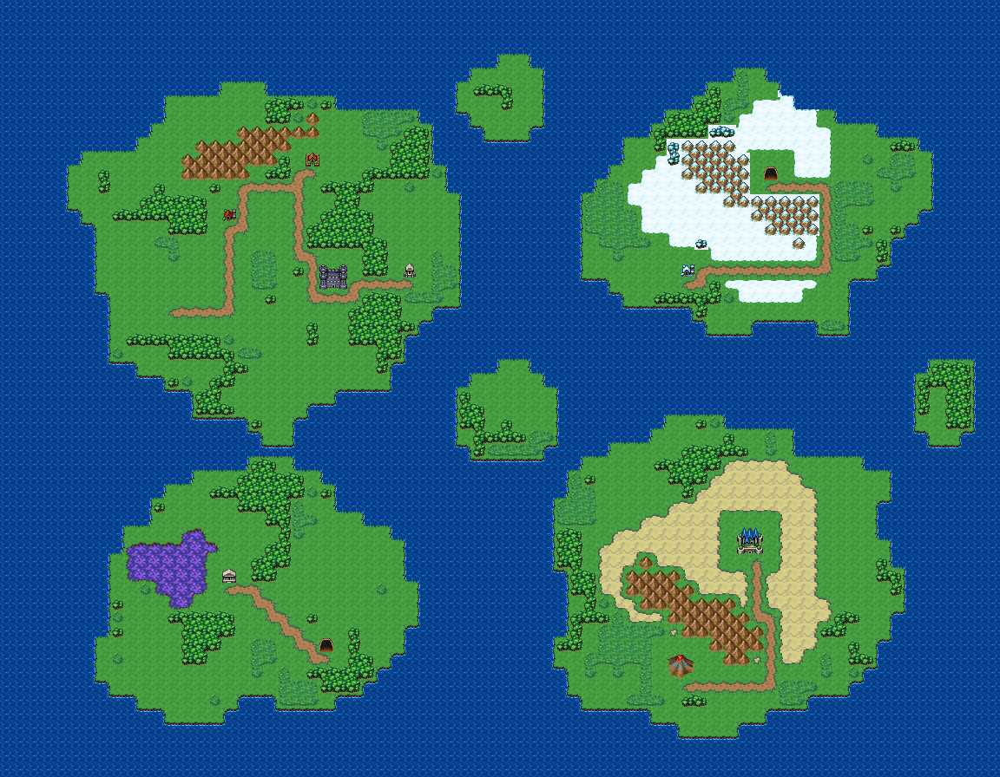

# 남쪽 바다 섬들 해도

두 번째 월드맵. 큰 섬 넷과 작은 섬들이 흩어진 바다. 섬마다 항구가 있고 배길로 건넌다 — 등대 곶·해적 소굴·늪 신전·용의 산·마왕성. 바다 위에 큰 섬 넷과 작은 섬 여럿이 흩어져 있다. 북서 초록 섬엔 항구 마을·농장·등대 곶과 숲 미로·투기장 도시, 북동 설산 섬엔 용의 산 정상, 남서 늪 섬엔 늪 신전과 해적 소굴, 남동 화산 섬엔 마왕성이 선다. 섬 안은 흙길로 잇고, 섬과 섬 사이는 항구에서 항구로 가는 배길이다. 72×56, tilesetId=oprn_world_keyed(easyrpg_chipset_world + transparentColor #ff678b).



## 장소 (아이콘 좌상단, 접근 칸 = 흙길이 닿는 칸, placeId = 야외 장소 맵 id)
```json
[{"id":"farm-ranch","name":"들녘 농장과 목장","placeId":"outdoor-farm-ranch","icon":"house","kind":"town","x":16,"y":15,"w":1,"h":1,"approach":[16,16],"island":0},{"id":"lighthouse-cape","name":"갈매기 곶 등대","placeId":"outdoor-lighthouse-cape","icon":"smalltower","kind":"town","x":29,"y":19,"w":1,"h":1,"approach":[29,20],"port":true,"island":0},{"id":"forest-maze","name":"미혹의 숲 미로","placeId":"outdoor-forest-maze","kind":"field","x":12,"y":21,"w":1,"h":1,"approach":[12,22],"island":0},{"id":"forest-camp","name":"숲 속 모닥불 야영지","placeId":"outdoor-forest-camp","icon":"hut","kind":"scene","x":22,"y":11,"w":1,"h":1,"approach":[22,12],"island":0},{"id":"arena-city","name":"투기장 도시","placeId":"dungeon-arena-floor","icon":"fortress","kind":"town","x":23,"y":19,"w":2,"h":2,"approach":[24,21],"island":0},{"id":"dragon-peak","name":"용의 산 정상","placeId":"outdoor-dragon-peak","icon":"cave","kind":"field","x":55,"y":12,"w":1,"h":1,"approach":[55,13],"island":2},{"id":"snow-harbor","name":"설산 섬 나루","placeId":"outdoor-snow-fortress","icon":"snowhouse","kind":"town","x":49,"y":19,"w":1,"h":1,"approach":[49,20],"port":true,"island":2},{"id":"swamp-temple","name":"늪 신전","placeId":"dungeon-swamp-temple","icon":"temple","kind":"sacred","x":16,"y":41,"w":1,"h":1,"approach":[16,42],"island":3},{"id":"pirate-cove","name":"해적 소굴","placeId":"dungeon-pirate-cove","icon":"cave","kind":"sacred","x":23,"y":46,"w":1,"h":1,"approach":[23,47],"port":true,"island":3},{"id":"demon-castle","name":"마왕성 · 재의 성채","placeId":"outdoor-demon-castle","icon":"castle","kind":"town","x":53,"y":38,"w":2,"h":2,"approach":[54,40],"island":1},{"id":"ash-landing","name":"잿빛 상륙지","placeId":"outdoor-volcano-lavafall-ridge","icon":"volcano","kind":"field","x":48,"y":47,"w":2,"h":2,"approach":[49,49],"port":true,"island":1}]
```

## 지형 비율 (칸 수)
```json
{"sea":2360,"plain":817,"grass":152,"forest":273,"snow":91,"mountain":61,"snowforest":5,"snowmountain":35,"road":90,"sand":121,"marsh":27}
```

## 검사
```json
{"id":"outdoor-world-archipelago","seed":7201,"reachable":1192,"places":11,"emptiness":{"maxSq":5,"screen":0.615,"at":[22,38],"screenAt":[8,16]}}
```

전체 두 레이어는 「남쪽 바다 섬들 해도 · 0행부터 전체 배열」 문서가 정답이다.
