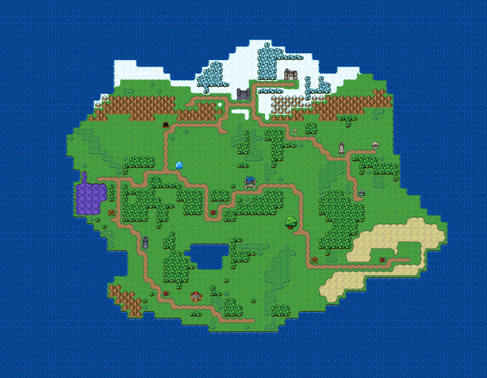

# 은빛 왕국 대륙 전도

대륙 전체 월드맵. 눈 덮인 북쪽, 왕도가 선 초록 가운데, 서쪽 늪과 남서 화산, 남동 사막과 바다 해안까지 모든 장소를 흙길로 잇는다. 바다에 둘러싸인 대륙 하나. 북쪽은 설원·눈 숲·설산에 서리성이 서고, 설원 경계의 두 산맥 사이 틈을 국경 관문이 지킨다. 가운데 초록 들판에 왕도 성과 축제 마을, 서쪽 늪지에 안개늪 마을, 남서 산맥 끝에 화산, 남동 사막에 오아시스 도시와 모래언덕, 남쪽 바닷가에 어촌과 해변 절벽이 있다. 장소마다 흙길이 이어진다. 72×56, tilesetId=oprn_world_keyed(easyrpg_chipset_world + transparentColor #ff678b).



## 장소 (아이콘 좌상단, 접근 칸 = 흙길이 닿는 칸, placeId = 야외 장소 맵 id)
```json
[{"id":"royal-capital","name":"왕도 은빛 성곽","placeId":"outdoor-royal-capital","icon":"castle","kind":"town","x":36,"y":26,"w":2,"h":2,"approach":[37,28]},{"id":"festival-plaza","name":"별빛 축제 광장","placeId":"outdoor-festival-plaza","icon":"house","kind":"scene","x":31,"y":31,"w":1,"h":1,"approach":[31,32]},{"id":"ending-meadow","name":"노을빛 엔딩 들판","placeId":"outdoor-ending-meadow","icon":"bigtree","kind":"scene","x":42,"y":32,"w":2,"h":2,"approach":[43,34]},{"id":"fairy-spring","name":"요정 샘 신성한 숲","placeId":"outdoor-fairy-spring","icon":"spring","kind":"sacred","x":26,"y":24,"w":1,"h":1,"approach":[26,25]},{"id":"great-valley","name":"세폭포 대계곡","placeId":"outdoor-great-valley","kind":"field","x":20,"y":26,"w":1,"h":1,"approach":[20,27]},{"id":"swamp-village","name":"안개늪 마을","placeId":"outdoor-swamp-village","icon":"hut","kind":"town","x":16,"y":31,"w":1,"h":1,"approach":[16,32]},{"id":"swamp-field","name":"검은물 늪지 필드","placeId":"outdoor-swamp-field","kind":"field","x":14,"y":25,"w":1,"h":1,"approach":[14,26]},{"id":"dwarf-mine","name":"쇠망치 광산 마을","placeId":"outdoor-dwarf-mine","icon":"cave","kind":"town","x":24,"y":18,"w":1,"h":1,"approach":[24,19]},{"id":"mountain-pass","name":"구름재 산길 협곡","placeId":"outdoor-mountain-pass","kind":"field","x":33,"y":18,"w":1,"h":1,"approach":[33,19]},{"id":"border-fortress","name":"국경 관문","placeId":"outdoor-border-fortress","icon":"fortress","kind":"town","x":35,"y":13,"w":2,"h":2,"approach":[36,15]},{"id":"snow-fortress","name":"서리성 설원 요새","placeId":"outdoor-snow-fortress","icon":"citadel","kind":"town","x":42,"y":10,"w":2,"h":2,"approach":[43,12]},{"id":"snow-glacier","name":"푸른 빙하 설원","placeId":"outdoor-snow-glacier","kind":"field","x":27,"y":14,"w":1,"h":1,"approach":[27,15]},{"id":"ruined-city","name":"무너진 옛 도읍","placeId":"outdoor-ruined-city","icon":"ruins","kind":"town","x":50,"y":21,"w":1,"h":2,"approach":[50,23]},{"id":"old-battlefield","name":"잿빛 들 옛 전쟁터","placeId":"outdoor-old-battlefield","icon":"bones","kind":"field","x":43,"y":19,"w":1,"h":1,"approach":[43,20]},{"id":"graveyard-hill","name":"까마귀 묘지 언덕","placeId":"outdoor-graveyard-hill","icon":"grave","kind":"sacred","x":53,"y":28,"w":1,"h":1,"approach":[53,29]},{"id":"sealed-altar","name":"봉인된 옛 제단","placeId":"outdoor-sealed-altar","icon":"temple","kind":"sacred","x":55,"y":21,"w":1,"h":1,"approach":[55,22]},{"id":"opening-overlook","name":"첫걸음 벼랑 전망대","placeId":"outdoor-opening-overlook","icon":"tower","kind":"scene","x":21,"y":35,"w":1,"h":2,"approach":[21,37]},{"id":"fishing-village","name":"갈매기 어촌","placeId":"outdoor-fishing-village","icon":"house","kind":"town","x":24,"y":43,"w":1,"h":1,"approach":[24,44]},{"id":"beach-cliffs","name":"야자 해변 해안 절벽","placeId":"outdoor-beach-cliffs","kind":"field","x":37,"y":46,"w":1,"h":1,"approach":[37,47]},{"id":"volcano-zone","name":"불꽃산 화산 지대","placeId":"outdoor-volcano-zone","icon":"volcano","kind":"field","x":28,"y":43,"w":2,"h":2,"approach":[29,45]},{"id":"nomad-camp","name":"바람초원 유목민 천막촌","placeId":"outdoor-nomad-camp","icon":"hut","kind":"town","x":46,"y":38,"w":1,"h":1,"approach":[46,39]},{"id":"desert-oasis-city","name":"모래바람 오아시스 도시","placeId":"outdoor-desert-oasis-city","icon":"house","kind":"town","x":56,"y":38,"w":1,"h":1,"approach":[56,39]},{"id":"desert-dunes","name":"금빛 모래언덕","placeId":"outdoor-desert-dunes","kind":"field","x":60,"y":37,"w":1,"h":1,"approach":[60,38]}]
```

## 지형 비율 (칸 수)
```json
{"sea":2368,"snow":107,"snowforest":50,"plain":681,"grass":121,"road":195,"mountain":114,"snowmountain":18,"forest":255,"marsh":25,"sand":98}
```

## 검사
```json
{"id":"outdoor-world-map","seed":7101,"reachable":1136,"places":23,"emptiness":{"maxSq":6,"screen":0.611,"at":[27,20],"screenAt":[30,32]}}
```

전체 두 레이어는 「은빛 왕국 대륙 전도 · 0행부터 전체 배열」 문서가 정답이다.
