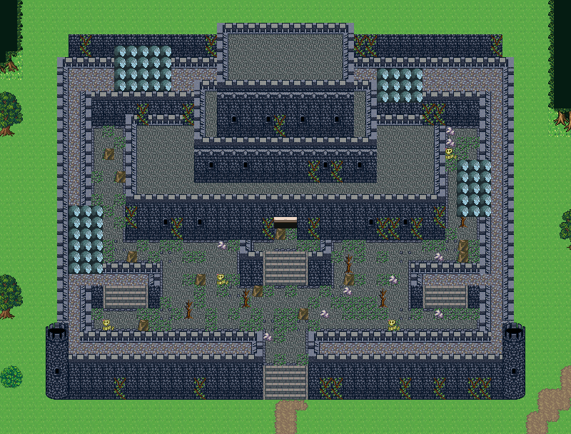
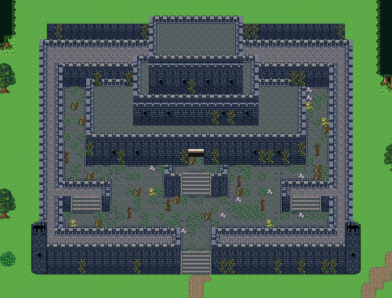

# 판타지 외관 — 상점가와 폐성

forest_harmony. 두 맵 모두 컨셉 마을 「여울성 나루」(ford-castle-town)를 잘라 와서 만들었다. 집·성·절벽·길 조립은 원본 그대로이고 간판·마당·장식만 바꾼다.

## 가게 간판
숲마을 칩셋에 원래 있던 벽걸이 간판 셋은 색 이름으로 잘못 붙어 있어 쓰이지 않았다. 무엇을 파는지로 라벨을 고쳤다:
```json
{
  "627": {
    "label": "무기점 간판 — 칼",
    "tags": [
      "무기점 간판",
      "sign",
      "상점",
      "칼",
      "무기"
    ],
    "description": "흰 판에 칼이 그려진 벽걸이 간판. 무기점 문 옆 벽면에 건다."
  },
  "628": {
    "label": "방어구점 간판 — 방패",
    "tags": [
      "방어구점 간판",
      "sign",
      "상점",
      "방패",
      "방어구"
    ],
    "description": "흰 판에 방패가 그려진 벽걸이 간판. 방어구점 문 옆 벽면에 건다."
  },
  "629": {
    "label": "도구점 간판 — 항아리",
    "tags": [
      "도구점 간판",
      "sign",
      "상점",
      "항아리",
      "도구"
    ],
    "description": "흰 판에 붉은 항아리가 그려진 벽걸이 간판. 도구점(약·잡화) 문 옆 벽면에 건다."
  }
}
```

간판은 집 앞면 벽의 문 옆 칸(문 위 칸 329 줄과 같은 행)에 upper로 건다. 여관·주점은 기존 657(INN)·658(PUB). 앞마당에 파는 물건을 하나 더 내놓으면(무기·방어구점 앞 갑옷 거치대 687/717) 멀리서도 읽힌다.

## 대장간 마당
대장간은 돌집 옆 노천 작업장이다. 숲마을 칩셋에 화덕·모루가 없어서 Tibo 소품을 이 맵의 타일셋 뒤쪽 칸(2730~)에 이식했다. 통행·우선순위는 Tibo 원본 칸을 따른다:
```json
[
  {
    "sourceChipset": "tex_tibo_interior_expanded",
    "sourceTile": 1001,
    "targetTile": 2730
  },
  {
    "sourceChipset": "tex_tibo_interior_expanded",
    "sourceTile": 1002,
    "targetTile": 2731
  },
  {
    "sourceChipset": "tex_tibo_interior_expanded",
    "sourceTile": 1031,
    "targetTile": 2732
  },
  {
    "sourceChipset": "tex_tibo_interior_expanded",
    "sourceTile": 1032,
    "targetTile": 2733
  },
  {
    "sourceChipset": "tex_tibo_interior_expanded",
    "sourceTile": 649,
    "targetTile": 2734
  },
  {
    "sourceChipset": "tex_tibo_interior_expanded",
    "sourceTile": 996,
    "targetTile": 2735
  },
  {
    "sourceChipset": "tex_tibo_interior_expanded",
    "sourceTile": 997,
    "targetTile": 2736
  },
  {
    "sourceChipset": "tex_tibo_interior_expanded",
    "sourceTile": 994,
    "targetTile": 2737
  },
  {
    "sourceChipset": "tex_tibo_interior_expanded",
    "sourceTile": 995,
    "targetTile": 2738
  },
  {
    "sourceChipset": "tex_tibo_interior_expanded",
    "sourceTile": 992,
    "targetTile": 2739
  },
  {
    "sourceChipset": "tex_tibo_interior_expanded",
    "sourceTile": 1803,
    "targetTile": 2740
  },
  {
    "sourceChipset": "tex_tibo_interior_expanded",
    "sourceTile": 1804,
    "targetTile": 2741
  },
  {
    "sourceChipset": "tex_tibo_interior_expanded",
    "sourceTile": 1833,
    "targetTile": 2742
  },
  {
    "sourceChipset": "tex_tibo_interior_expanded",
    "sourceTile": 1834,
    "targetTile": 2743
  },
  {
    "sourceChipset": "tex_tibo_interior_expanded",
    "sourceTile": 1863,
    "targetTile": 2744
  },
  {
    "sourceChipset": "tex_tibo_interior_expanded",
    "sourceTile": 1864,
    "targetTile": 2745
  }
]
```


## 폐성 — 벽을 뚫지 않는다
성벽·흉벽·탑은 여러 칸이 맞물린 조립이라 칸을 지우면 테두리 없는 구멍이 된다(아래 오류 그림). 폐성은 조립을 그대로 두고:
1. 깃발 179/209, 화분·벤치·등을 치운다.
2. 안뜰(276~278·306~308·336~338)의 3분의 1을 이끼 낀 돌바닥 732로 바꾼다.
3. 안뜰에 돌무더기 537/888/948·해골 383, 마른 나무 261/291(2행)을 흩는다.
4. 벽면(51 위·81 아래)에 덩굴 265/295를 겹친다.
원본과 같이 성 윗면과 안뜰은 통행 불가, 앞 계단만 걸을 수 있다(외관 사례).




## 검사
```bash
node scripts/content/author-rpg-places.mjs   # 저작 + 통행 검사(실패하면 멈춤)
```

```json
[
  {
    "id": "fantasy-shop-street",
    "entry": [
      30,
      14
    ],
    "targets": [
      [
        6,
        12
      ],
      [
        22,
        13
      ],
      [
        53,
        12
      ],
      [
        48,
        11
      ]
    ],
    "reachable": 615,
    "blocked": []
  },
  {
    "id": "fantasy-ruined-castle",
    "entry": [
      25,
      37
    ],
    "targets": [
      [
        25,
        33
      ]
    ],
    "reachable": 563,
    "blocked": []
  }
]
```

## 실제 구분
- 상점가 · 무기·도구점과 대장간 (fantasy-shop-street, 62×15): 여울성 나루 아랫단의 집 셋을 그대로 쓰고 간판·마당만 바꿨다. 무기·방어구점은 문 옆 칼 627·방패 628 간판과 앞마당 갑옷 거치대 687/717, 도구점은 항아리 간판 629, 돌집 대장간은 옆 노천 작업장(화덕·모루·담금질 물통·주괴·석탄·무기 거치대).
- 폐성 (fantasy-ruined-castle, 50×38): 여울성의 작은 성을 그대로 두고(두 겹 성벽·흉벽·탑 조립은 손대지 않음) 깃발·화분·벤치를 치운 뒤 안뜰에 이끼 돌바닥 732·돌무더기 537/888/948·해골 383·마른 나무 261/291, 벽면에 덩굴 265/295.
