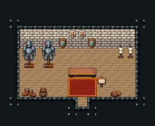

# 방어구점

석벽 집 실내. 왼쪽 갑옷 거치대 둘, 오른쪽 마네킹 둘, 벽에 방패, 앞쪽에 장화·배낭·가죽. 16×13, tilesetId=tibo_interior_expanded. 입구 (8,10), 상인·주인 자리 (8,6). 통행 검사 목표 [[8,8],[8,6]].



## 놓은 소품 (저작 순서)
tibo-kit은 tibo_interior_expanded의 structureKits id, tiles는 직접 놓은 번호 행렬이다. (x,y)는 왼쪽 위.
```json
[
  {
    "kind": "tibo-kit",
    "kitId": "tibo-library-221",
    "name": "방패 벽 장식",
    "x": 6,
    "y": 3,
    "w": 1,
    "h": 2
  },
  {
    "kind": "tibo-kit",
    "kitId": "tibo-library-221",
    "name": "방패 벽 장식",
    "x": 9,
    "y": 3,
    "w": 1,
    "h": 2
  },
  {
    "kind": "tiles",
    "layer": "upper",
    "x": 7,
    "y": 3,
    "w": 2,
    "h": 1,
    "rows": [
      [
        262,
        262
      ]
    ]
  },
  {
    "kind": "tibo-kit",
    "kitId": "tibo-medieval-armor-stand",
    "name": "갑옷 거치대",
    "x": 2,
    "y": 4,
    "w": 2,
    "h": 3
  },
  {
    "kind": "tibo-kit",
    "kitId": "tibo-medieval-armor-stand",
    "name": "갑옷 거치대",
    "x": 4,
    "y": 4,
    "w": 2,
    "h": 3
  },
  {
    "kind": "tibo-kit",
    "kitId": "tibo-library-111",
    "name": "재봉 마네킹",
    "x": 12,
    "y": 4,
    "w": 1,
    "h": 2
  },
  {
    "kind": "tibo-kit",
    "kitId": "tibo-library-111",
    "name": "재봉 마네킹",
    "x": 13,
    "y": 4,
    "w": 1,
    "h": 2
  },
  {
    "kind": "tiles",
    "layer": "upper",
    "x": 7,
    "y": 7,
    "w": 3,
    "h": 1,
    "rows": [
      [
        325,
        326,
        327
      ]
    ]
  },
  {
    "kind": "tibo-kit",
    "kitId": "tibo-library-200",
    "name": "여행 장화",
    "x": 2,
    "y": 9,
    "w": 2,
    "h": 1
  },
  {
    "kind": "tibo-kit",
    "kitId": "tibo-library-194",
    "name": "가죽 배낭",
    "x": 4,
    "y": 9,
    "w": 1,
    "h": 1
  },
  {
    "kind": "tibo-kit",
    "kitId": "tibo-library-119",
    "name": "가죽 두루마리",
    "x": 11,
    "y": 9,
    "w": 2,
    "h": 1
  },
  {
    "kind": "tibo-kit",
    "kitId": "tibo-library-129",
    "name": "가격 표지판",
    "x": 10,
    "y": 7,
    "w": 1,
    "h": 2
  }
]
```

전체 두 레이어는 다음 배열 문서가 정답이다.
