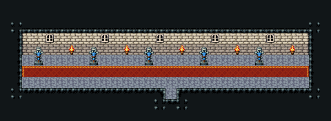

# 성 복도

석벽 복도. 창 54와 벽 횃불 24를 번갈아, 기사 석상 87/117을 한쪽 벽을 따라, 가운데 붉은 러너. 30×11, tilesetId=tibo_interior_expanded. 입구 (15,8). 통행 검사 목표 [[2,6],[27,6]].



## 놓은 소품 (저작 순서)
tibo-kit은 tibo_interior_expanded의 structureKits id, tiles는 직접 놓은 번호 행렬이다. (x,y)는 왼쪽 위.
```json
[
  {
    "kind": "tiles",
    "layer": "upper",
    "x": 3,
    "y": 4,
    "w": 1,
    "h": 2,
    "rows": [
      [
        87
      ],
      [
        117
      ]
    ]
  },
  {
    "kind": "tiles",
    "layer": "upper",
    "x": 8,
    "y": 4,
    "w": 1,
    "h": 2,
    "rows": [
      [
        87
      ],
      [
        117
      ]
    ]
  },
  {
    "kind": "tiles",
    "layer": "upper",
    "x": 13,
    "y": 4,
    "w": 1,
    "h": 2,
    "rows": [
      [
        87
      ],
      [
        117
      ]
    ]
  },
  {
    "kind": "tiles",
    "layer": "upper",
    "x": 18,
    "y": 4,
    "w": 1,
    "h": 2,
    "rows": [
      [
        87
      ],
      [
        117
      ]
    ]
  },
  {
    "kind": "tiles",
    "layer": "upper",
    "x": 23,
    "y": 4,
    "w": 1,
    "h": 2,
    "rows": [
      [
        87
      ],
      [
        117
      ]
    ]
  }
]
```

전체 두 레이어는 다음 배열 문서가 정답이다.
