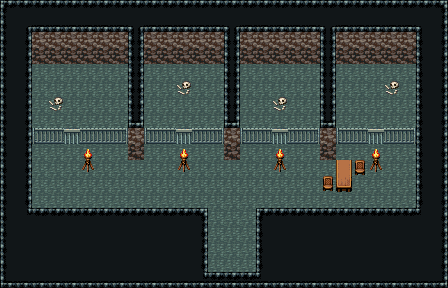

# 성 지하 감옥

던전 칩셋, 「무너진 납골당」과 같은 벽 조립. 감방 넷을 공허 기둥으로 나누고 쇠창살 234·235·236(가운데 205가 감방 문), 복도 횃불 263/293, 간수 탁자 324/354와 의자 327. 28×18, tilesetId=easyrpg_chipset_dungeon. 입구 (14,16). 통행 검사 목표 [[4,9],[11,9],[17,9],[23,9]].



## 놓은 소품 (저작 순서)
tibo-kit은 tibo_interior_expanded의 structureKits id, tiles는 직접 놓은 번호 행렬이다. (x,y)는 왼쪽 위.
```json
[
  {
    "kind": "tiles",
    "layer": "upper",
    "x": 5,
    "y": 9,
    "w": 1,
    "h": 2,
    "rows": [
      [
        263
      ],
      [
        293
      ]
    ]
  },
  {
    "kind": "tiles",
    "layer": "upper",
    "x": 11,
    "y": 9,
    "w": 1,
    "h": 2,
    "rows": [
      [
        263
      ],
      [
        293
      ]
    ]
  },
  {
    "kind": "tiles",
    "layer": "upper",
    "x": 17,
    "y": 9,
    "w": 1,
    "h": 2,
    "rows": [
      [
        263
      ],
      [
        293
      ]
    ]
  },
  {
    "kind": "tiles",
    "layer": "upper",
    "x": 23,
    "y": 9,
    "w": 1,
    "h": 2,
    "rows": [
      [
        263
      ],
      [
        293
      ]
    ]
  },
  {
    "kind": "tiles",
    "layer": "upper",
    "x": 21,
    "y": 10,
    "w": 1,
    "h": 2,
    "rows": [
      [
        324
      ],
      [
        354
      ]
    ]
  }
]
```

전체 두 레이어는 다음 배열 문서가 정답이다.
