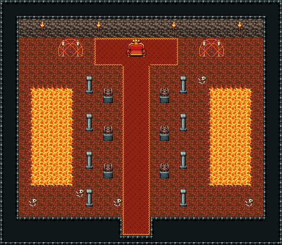

# 마왕성 왕좌의 방

던전 칩셋. 적암 바닥, 양옆 용암 못(용암 오토타일), 붉은 카펫 끝에 왕좌 447~479, 좌우 붉은 마법진 441~443/471~473(칩셋에 반쪽뿐), 가고일 146/176·기둥 446/476 두 줄, 벽 앞 화로 263/293, 해골 299. 30×26, tilesetId=easyrpg_chipset_dungeon. 입구 (14,24), 상인·주인 자리 (14,6). 통행 검사 목표 [[14,6],[8,21],[21,21]].



## 놓은 소품 (저작 순서)
tibo-kit은 tibo_interior_expanded의 structureKits id, tiles는 직접 놓은 번호 행렬이다. (x,y)는 왼쪽 위.
```json
[
  {
    "kind": "tiles",
    "layer": "upper",
    "x": 13,
    "y": 4,
    "w": 3,
    "h": 2,
    "rows": [
      [
        447,
        448,
        449
      ],
      [
        477,
        478,
        479
      ]
    ]
  },
  {
    "kind": "tiles",
    "layer": "upper",
    "x": 6,
    "y": 4,
    "w": 3,
    "h": 2,
    "rows": [
      [
        441,
        442,
        443
      ],
      [
        471,
        472,
        473
      ]
    ]
  },
  {
    "kind": "tiles",
    "layer": "upper",
    "x": 21,
    "y": 4,
    "w": 3,
    "h": 2,
    "rows": [
      [
        441,
        442,
        443
      ],
      [
        471,
        472,
        473
      ]
    ]
  },
  {
    "kind": "tiles",
    "layer": "upper",
    "x": 11,
    "y": 9,
    "w": 1,
    "h": 2,
    "rows": [
      [
        146
      ],
      [
        176
      ]
    ]
  },
  {
    "kind": "tiles",
    "layer": "upper",
    "x": 17,
    "y": 9,
    "w": 1,
    "h": 2,
    "rows": [
      [
        146
      ],
      [
        176
      ]
    ]
  },
  {
    "kind": "tiles",
    "layer": "upper",
    "x": 11,
    "y": 13,
    "w": 1,
    "h": 2,
    "rows": [
      [
        146
      ],
      [
        176
      ]
    ]
  },
  {
    "kind": "tiles",
    "layer": "upper",
    "x": 17,
    "y": 13,
    "w": 1,
    "h": 2,
    "rows": [
      [
        146
      ],
      [
        176
      ]
    ]
  },
  {
    "kind": "tiles",
    "layer": "upper",
    "x": 11,
    "y": 17,
    "w": 1,
    "h": 2,
    "rows": [
      [
        146
      ],
      [
        176
      ]
    ]
  },
  {
    "kind": "tiles",
    "layer": "upper",
    "x": 17,
    "y": 17,
    "w": 1,
    "h": 2,
    "rows": [
      [
        146
      ],
      [
        176
      ]
    ]
  },
  {
    "kind": "tiles",
    "layer": "upper",
    "x": 9,
    "y": 8,
    "w": 1,
    "h": 2,
    "rows": [
      [
        446
      ],
      [
        476
      ]
    ]
  },
  {
    "kind": "tiles",
    "layer": "upper",
    "x": 19,
    "y": 8,
    "w": 1,
    "h": 2,
    "rows": [
      [
        446
      ],
      [
        476
      ]
    ]
  },
  {
    "kind": "tiles",
    "layer": "upper",
    "x": 9,
    "y": 12,
    "w": 1,
    "h": 2,
    "rows": [
      [
        446
      ],
      [
        476
      ]
    ]
  },
  {
    "kind": "tiles",
    "layer": "upper",
    "x": 19,
    "y": 12,
    "w": 1,
    "h": 2,
    "rows": [
      [
        446
      ],
      [
        476
      ]
    ]
  },
  {
    "kind": "tiles",
    "layer": "upper",
    "x": 9,
    "y": 16,
    "w": 1,
    "h": 2,
    "rows": [
      [
        446
      ],
      [
        476
      ]
    ]
  },
  {
    "kind": "tiles",
    "layer": "upper",
    "x": 19,
    "y": 16,
    "w": 1,
    "h": 2,
    "rows": [
      [
        446
      ],
      [
        476
      ]
    ]
  },
  {
    "kind": "tiles",
    "layer": "upper",
    "x": 9,
    "y": 20,
    "w": 1,
    "h": 2,
    "rows": [
      [
        446
      ],
      [
        476
      ]
    ]
  },
  {
    "kind": "tiles",
    "layer": "upper",
    "x": 19,
    "y": 20,
    "w": 1,
    "h": 2,
    "rows": [
      [
        446
      ],
      [
        476
      ]
    ]
  },
  {
    "kind": "tiles",
    "layer": "upper",
    "x": 4,
    "y": 2,
    "w": 1,
    "h": 2,
    "rows": [
      [
        263
      ],
      [
        293
      ]
    ]
  },
  {
    "kind": "tiles",
    "layer": "upper",
    "x": 10,
    "y": 2,
    "w": 1,
    "h": 2,
    "rows": [
      [
        263
      ],
      [
        293
      ]
    ]
  },
  {
    "kind": "tiles",
    "layer": "upper",
    "x": 18,
    "y": 2,
    "w": 1,
    "h": 2,
    "rows": [
      [
        263
      ],
      [
        293
      ]
    ]
  },
  {
    "kind": "tiles",
    "layer": "upper",
    "x": 25,
    "y": 2,
    "w": 1,
    "h": 2,
    "rows": [
      [
        263
      ],
      [
        293
      ]
    ]
  }
]
```

전체 두 레이어는 다음 배열 문서가 정답이다.
