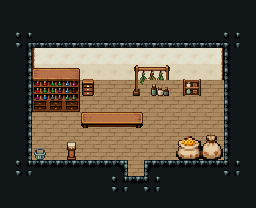

# 도구점

크림 벽 집 실내. 물약 진열장·약재 서랍장·약초 건조대·잡화 선반을 뒷벽에, 카운터 앞쪽에 식재료 자루·진열 받침. 16×13, tilesetId=tibo_interior_expanded. 입구 (8,10), 상인·주인 자리 (7,6). 통행 검사 목표 [[7,8],[7,6]].



## 놓은 소품 (저작 순서)
tibo-kit은 tibo_interior_expanded의 structureKits id, tiles는 직접 놓은 번호 행렬이다. (x,y)는 왼쪽 위.
```json
[
  {
    "kind": "tibo-kit",
    "kitId": "tibo-v4-2-0",
    "name": "물약 진열장",
    "x": 2,
    "y": 4,
    "w": 3,
    "h": 3
  },
  {
    "kind": "tibo-kit",
    "kitId": "tibo-library-145",
    "name": "약재 서랍장",
    "x": 5,
    "y": 4,
    "w": 1,
    "h": 2
  },
  {
    "kind": "tibo-kit",
    "kitId": "tibo-library-132",
    "name": "잡화 선반",
    "x": 11,
    "y": 4,
    "w": 2,
    "h": 2
  },
  {
    "kind": "tibo-kit",
    "kitId": "tibo-fantasy-herb-rack",
    "name": "약초 건조대",
    "x": 8,
    "y": 4,
    "w": 3,
    "h": 2
  },
  {
    "kind": "tiles",
    "layer": "upper",
    "x": 5,
    "y": 7,
    "w": 4,
    "h": 1,
    "rows": [
      [
        325,
        326,
        326,
        327
      ]
    ]
  },
  {
    "kind": "tibo-kit",
    "kitId": "tibo-fantasy-grain-sacks",
    "name": "식재료 자루",
    "x": 11,
    "y": 8,
    "w": 3,
    "h": 2
  },
  {
    "kind": "tibo-kit",
    "kitId": "tibo-library-130",
    "name": "장바구니",
    "x": 2,
    "y": 9,
    "w": 1,
    "h": 1
  },
  {
    "kind": "tibo-kit",
    "kitId": "tibo-library-126",
    "name": "상품 진열 받침",
    "x": 4,
    "y": 8,
    "w": 1,
    "h": 2
  },
  {
    "kind": "tibo-kit",
    "kitId": "tibo-library-148",
    "name": "약병 세 개",
    "x": 9,
    "y": 5,
    "w": 2,
    "h": 1
  }
]
```

전체 두 레이어는 다음 배열 문서가 정답이다.
