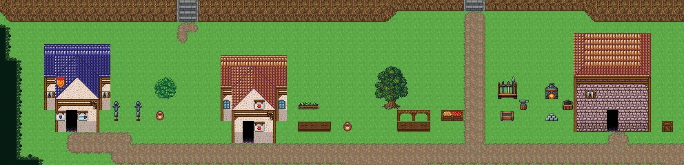

# 상점가 · 무기·도구점과 대장간

여울성 나루 아랫단의 집 셋을 그대로 쓰고 간판·마당만 바꿨다. 무기·방어구점은 문 옆 칼 627·방패 628 간판과 앞마당 갑옷 거치대 687/717, 도구점은 항아리 간판 629, 돌집 대장간은 옆 노천 작업장(화덕·모루·담금질 물통·주괴·석탄·무기 거치대). 62×15, tilesetId=forest_harmony. 입구 (30,14). 통행 검사 목표 [[6,12],[22,13],[53,12],[48,11]].



## 놓은 소품 (저작 순서)
tibo-kit은 tibo_interior_expanded의 structureKits id, tiles는 직접 놓은 번호 행렬이다. (x,y)는 왼쪽 위. 상점가의 tibo-kit은 이식 번호로 바뀌어 들어간다(외관 규칙 문서의 이식표).
```json
[
  {
    "kind": "tibo-kit",
    "kitId": "tibo-library-104",
    "name": "작은 대장간 화덕",
    "x": 49,
    "y": 7,
    "w": 2,
    "h": 2
  },
  {
    "kind": "tibo-kit",
    "kitId": "tibo-anvil",
    "name": "모루",
    "x": 47,
    "y": 9,
    "w": 1,
    "h": 1
  },
  {
    "kind": "tibo-kit",
    "kitId": "tibo-library-101",
    "name": "담금질 물통",
    "x": 45,
    "y": 10,
    "w": 2,
    "h": 1
  },
  {
    "kind": "tibo-kit",
    "kitId": "tibo-library-100",
    "name": "금속 주괴 더미",
    "x": 49,
    "y": 10,
    "w": 2,
    "h": 1
  },
  {
    "kind": "tibo-kit",
    "kitId": "tibo-library-098",
    "name": "석탄 통",
    "x": 51,
    "y": 9,
    "w": 1,
    "h": 1
  },
  {
    "kind": "tibo-kit",
    "kitId": "tibo-fantasy-weapon-rack",
    "name": "무기 거치대",
    "x": 45,
    "y": 6,
    "w": 2,
    "h": 3
  }
]
```

전체 두 레이어는 다음 배열 문서가 정답이다.
