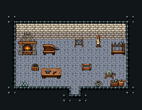

# 대장간

석벽·돌바닥 42. 벽난로 화덕 옆 풀무, 가운데 모루 작업대·담금질 물통·숫돌, 벽에 편자·앞치마·무기 거치대. 18×14, tilesetId=tibo_interior_expanded. 입구 (9,11), 상인·주인 자리 (7,7). 통행 검사 목표 [[7,7],[9,7]].



## 놓은 소품 (저작 순서)
tibo-kit은 tibo_interior_expanded의 structureKits id, tiles는 직접 놓은 번호 행렬이다. (x,y)는 왼쪽 위.
```json
[
  {
    "kind": "tibo-kit",
    "kitId": "tibo-medieval-stone-fireplace",
    "name": "장작 벽난로",
    "x": 2,
    "y": 4,
    "w": 3,
    "h": 3
  },
  {
    "kind": "tibo-kit",
    "kitId": "tibo-fantasy-bellows",
    "name": "풀무",
    "x": 5,
    "y": 5,
    "w": 3,
    "h": 2
  },
  {
    "kind": "tibo-kit",
    "kitId": "tibo-library-102",
    "name": "편자 걸이",
    "x": 9,
    "y": 4,
    "w": 2,
    "h": 2
  },
  {
    "kind": "tibo-kit",
    "kitId": "tibo-library-108",
    "name": "가죽 앞치마 걸이",
    "x": 12,
    "y": 4,
    "w": 1,
    "h": 2
  },
  {
    "kind": "tibo-kit",
    "kitId": "tibo-fantasy-weapon-rack",
    "name": "무기 거치대",
    "x": 14,
    "y": 4,
    "w": 2,
    "h": 3
  },
  {
    "kind": "tibo-kit",
    "kitId": "tibo-library-098",
    "name": "석탄 통",
    "x": 4,
    "y": 8,
    "w": 1,
    "h": 1
  },
  {
    "kind": "tibo-kit",
    "kitId": "tibo-fantasy-anvil-bench",
    "name": "모루 작업대",
    "x": 5,
    "y": 8,
    "w": 3,
    "h": 2
  },
  {
    "kind": "tibo-kit",
    "kitId": "tibo-library-101",
    "name": "담금질 물통",
    "x": 10,
    "y": 8,
    "w": 2,
    "h": 1
  },
  {
    "kind": "tibo-kit",
    "kitId": "tibo-grindstone",
    "name": "숫돌",
    "x": 13,
    "y": 8,
    "w": 2,
    "h": 2
  },
  {
    "kind": "tibo-kit",
    "kitId": "tibo-library-100",
    "name": "금속 주괴 더미",
    "x": 2,
    "y": 10,
    "w": 2,
    "h": 1
  },
  {
    "kind": "tibo-kit",
    "kitId": "tibo-library-106",
    "name": "고철 상자",
    "x": 14,
    "y": 10,
    "w": 1,
    "h": 1
  },
  {
    "kind": "tibo-kit",
    "kitId": "tibo-library-103",
    "name": "망치 놓인 그루터기",
    "x": 15,
    "y": 10,
    "w": 1,
    "h": 1
  },
  {
    "kind": "tibo-kit",
    "kitId": "tibo-library-105",
    "name": "쇠사슬 뭉치",
    "x": 12,
    "y": 10,
    "w": 1,
    "h": 1
  }
]
```

전체 두 레이어는 다음 배열 문서가 정답이다.
