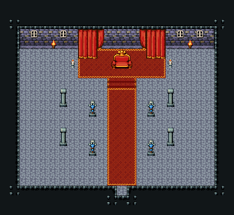

# 왕좌의 방

금벽돌 벽·돌바닥. 붉은 카펫 단(계단 465·466·467) 위 왕좌 447~449/477~479, 뒤에 커튼 142/143·172/173·202/203과 휘장 318/348·319/349, 기둥 89/119 두 줄과 기사 석상 87/117, 창 54·벽 횃불 24. 24×22, tilesetId=tibo_interior_expanded. 입구 (12,19), 상인·주인 자리 (12,7). 통행 검사 목표 [[12,7],[12,9]].



## 놓은 소품 (저작 순서)
tibo-kit은 tibo_interior_expanded의 structureKits id, tiles는 직접 놓은 번호 행렬이다. (x,y)는 왼쪽 위.
```json
[
  {
    "kind": "tiles",
    "layer": "lower",
    "x": 11,
    "y": 8,
    "w": 3,
    "h": 1,
    "rows": [
      [
        465,
        466,
        467
      ]
    ]
  },
  {
    "kind": "tiles",
    "layer": "upper",
    "x": 11,
    "y": 5,
    "w": 3,
    "h": 2,
    "rows": [
      [
        447,
        448,
        449
      ],
      [
        477,
        478,
        479
      ]
    ]
  },
  {
    "kind": "tiles",
    "layer": "upper",
    "x": 10,
    "y": 3,
    "w": 1,
    "h": 2,
    "rows": [
      [
        318
      ],
      [
        348
      ]
    ]
  },
  {
    "kind": "tiles",
    "layer": "upper",
    "x": 14,
    "y": 3,
    "w": 1,
    "h": 2,
    "rows": [
      [
        319
      ],
      [
        349
      ]
    ]
  },
  {
    "kind": "tiles",
    "layer": "upper",
    "x": 8,
    "y": 3,
    "w": 2,
    "h": 3,
    "rows": [
      [
        142,
        143
      ],
      [
        172,
        173
      ],
      [
        202,
        203
      ]
    ]
  },
  {
    "kind": "tiles",
    "layer": "upper",
    "x": 15,
    "y": 3,
    "w": 2,
    "h": 3,
    "rows": [
      [
        142,
        143
      ],
      [
        172,
        173
      ],
      [
        202,
        203
      ]
    ]
  },
  {
    "kind": "tiles",
    "layer": "upper",
    "x": 6,
    "y": 9,
    "w": 1,
    "h": 2,
    "rows": [
      [
        89
      ],
      [
        119
      ]
    ]
  },
  {
    "kind": "tiles",
    "layer": "upper",
    "x": 17,
    "y": 9,
    "w": 1,
    "h": 2,
    "rows": [
      [
        89
      ],
      [
        119
      ]
    ]
  },
  {
    "kind": "tiles",
    "layer": "upper",
    "x": 6,
    "y": 13,
    "w": 1,
    "h": 2,
    "rows": [
      [
        89
      ],
      [
        119
      ]
    ]
  },
  {
    "kind": "tiles",
    "layer": "upper",
    "x": 17,
    "y": 13,
    "w": 1,
    "h": 2,
    "rows": [
      [
        89
      ],
      [
        119
      ]
    ]
  },
  {
    "kind": "tiles",
    "layer": "upper",
    "x": 9,
    "y": 10,
    "w": 1,
    "h": 2,
    "rows": [
      [
        87
      ],
      [
        117
      ]
    ]
  },
  {
    "kind": "tiles",
    "layer": "upper",
    "x": 15,
    "y": 10,
    "w": 1,
    "h": 2,
    "rows": [
      [
        87
      ],
      [
        117
      ]
    ]
  },
  {
    "kind": "tiles",
    "layer": "upper",
    "x": 9,
    "y": 14,
    "w": 1,
    "h": 2,
    "rows": [
      [
        87
      ],
      [
        117
      ]
    ]
  },
  {
    "kind": "tiles",
    "layer": "upper",
    "x": 15,
    "y": 14,
    "w": 1,
    "h": 2,
    "rows": [
      [
        87
      ],
      [
        117
      ]
    ]
  }
]
```

전체 두 레이어는 다음 배열 문서가 정답이다.
