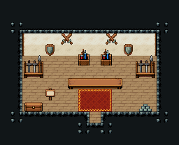

# 무기점

크림 벽 집 실내. 뒷벽에 방패·교차검, 양옆 무기 거치대, 상인 뒤 검·물약 진열대 263/293, 긴 카운터 325·326·327, 문에서 카운터까지 붉은 러그. 16×13, tilesetId=tibo_interior_expanded. 입구 (8,10), 상인·주인 자리 (8,6). 통행 검사 목표 [[8,8],[8,6]].



## 놓은 소품 (저작 순서)
tibo-kit은 tibo_interior_expanded의 structureKits id, tiles는 직접 놓은 번호 행렬이다. (x,y)는 왼쪽 위.
```json
[
  {
    "kind": "tibo-kit",
    "kitId": "tibo-library-221",
    "name": "방패 벽 장식",
    "x": 4,
    "y": 3,
    "w": 1,
    "h": 2
  },
  {
    "kind": "tibo-kit",
    "kitId": "tibo-library-222",
    "name": "교차 나무 연습검",
    "x": 5,
    "y": 3,
    "w": 2,
    "h": 1
  },
  {
    "kind": "tibo-kit",
    "kitId": "tibo-library-222",
    "name": "교차 나무 연습검",
    "x": 9,
    "y": 3,
    "w": 2,
    "h": 1
  },
  {
    "kind": "tibo-kit",
    "kitId": "tibo-library-221",
    "name": "방패 벽 장식",
    "x": 11,
    "y": 3,
    "w": 1,
    "h": 2
  },
  {
    "kind": "tibo-kit",
    "kitId": "tibo-fantasy-weapon-rack",
    "name": "무기 거치대",
    "x": 2,
    "y": 4,
    "w": 2,
    "h": 3
  },
  {
    "kind": "tibo-kit",
    "kitId": "tibo-fantasy-weapon-rack",
    "name": "무기 거치대",
    "x": 12,
    "y": 4,
    "w": 2,
    "h": 3
  },
  {
    "kind": "tiles",
    "layer": "upper",
    "x": 7,
    "y": 4,
    "w": 1,
    "h": 2,
    "rows": [
      [
        263
      ],
      [
        293
      ]
    ]
  },
  {
    "kind": "tiles",
    "layer": "upper",
    "x": 9,
    "y": 4,
    "w": 1,
    "h": 2,
    "rows": [
      [
        263
      ],
      [
        293
      ]
    ]
  },
  {
    "kind": "tiles",
    "layer": "upper",
    "x": 6,
    "y": 7,
    "w": 5,
    "h": 1,
    "rows": [
      [
        325,
        326,
        326,
        326,
        327
      ]
    ]
  },
  {
    "kind": "tibo-kit",
    "kitId": "tibo-library-231",
    "name": "긴 공구 상자",
    "x": 2,
    "y": 9,
    "w": 2,
    "h": 1
  },
  {
    "kind": "tibo-kit",
    "kitId": "tibo-library-100",
    "name": "금속 주괴 더미",
    "x": 12,
    "y": 9,
    "w": 2,
    "h": 1
  },
  {
    "kind": "tibo-kit",
    "kitId": "tibo-library-129",
    "name": "가격 표지판",
    "x": 4,
    "y": 7,
    "w": 1,
    "h": 2
  }
]
```

전체 두 레이어는 다음 배열 문서가 정답이다.
