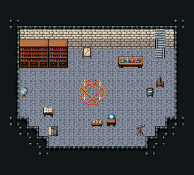

# 마법사 탑 · 한 층

문 없이 계단으로 오가는 탑 한 층. 오른쪽 위 올라가는 계단 111/141/171, 왼쪽 아래 내려가는 계단 475, 가운데 마법진 381~443, 책장 18~80, 연금술 작업대·가마솥·수정구·별자리 판·망원경. 아래 두 모서리를 깎아 둥근 탑 느낌. 20×18, tilesetId=tibo_interior_expanded. 입구 (16,6). 통행 검사 목표 [[5,12],[10,11],[13,7]].



## 놓은 소품 (저작 순서)
tibo-kit은 tibo_interior_expanded의 structureKits id, tiles는 직접 놓은 번호 행렬이다. (x,y)는 왼쪽 위.
```json
[
  {
    "kind": "tiles",
    "layer": "upper",
    "x": 8,
    "y": 8,
    "w": 3,
    "h": 3,
    "rows": [
      [
        381,
        382,
        383
      ],
      [
        411,
        412,
        413
      ],
      [
        441,
        442,
        443
      ]
    ]
  },
  {
    "kind": "tiles",
    "layer": "lower",
    "x": 2,
    "y": 4,
    "w": 3,
    "h": 3,
    "rows": [
      [
        18,
        19,
        20
      ],
      [
        48,
        49,
        50
      ],
      [
        78,
        79,
        80
      ]
    ]
  },
  {
    "kind": "tiles",
    "layer": "lower",
    "x": 5,
    "y": 4,
    "w": 2,
    "h": 3,
    "rows": [
      [
        18,
        20
      ],
      [
        48,
        50
      ],
      [
        78,
        80
      ]
    ]
  },
  {
    "kind": "tiles",
    "layer": "lower",
    "x": 16,
    "y": 3,
    "w": 1,
    "h": 3,
    "rows": [
      [
        111
      ],
      [
        141
      ],
      [
        171
      ]
    ]
  },
  {
    "kind": "tibo-kit",
    "kitId": "tibo-fantasy-alchemy-desk",
    "name": "연금술 작업대",
    "x": 12,
    "y": 5,
    "w": 3,
    "h": 2
  },
  {
    "kind": "tibo-kit",
    "kitId": "tibo-library-166",
    "name": "물약 가마솥",
    "x": 15,
    "y": 9,
    "w": 1,
    "h": 1
  },
  {
    "kind": "tibo-kit",
    "kitId": "tibo-fantasy-crystal-stand",
    "name": "수정구 받침",
    "x": 11,
    "y": 11,
    "w": 1,
    "h": 2
  },
  {
    "kind": "tibo-kit",
    "kitId": "tibo-library-164",
    "name": "별자리 판",
    "x": 8,
    "y": 4,
    "w": 2,
    "h": 2
  },
  {
    "kind": "tibo-kit",
    "kitId": "tibo-v11-1-3",
    "name": "천체망원경",
    "x": 14,
    "y": 12,
    "w": 1,
    "h": 2
  },
  {
    "kind": "tibo-kit",
    "kitId": "tibo-v12-1-2",
    "name": "지구본",
    "x": 2,
    "y": 8,
    "w": 1,
    "h": 2
  },
  {
    "kind": "tibo-kit",
    "kitId": "tibo-library-168",
    "name": "의식 초 세 개",
    "x": 9,
    "y": 12,
    "w": 2,
    "h": 1
  },
  {
    "kind": "tibo-kit",
    "kitId": "tibo-library-159",
    "name": "마법봉 걸이",
    "x": 16,
    "y": 7,
    "w": 1,
    "h": 2
  },
  {
    "kind": "tibo-kit",
    "kitId": "tibo-library-158",
    "name": "펼친 룬 서적",
    "x": 4,
    "y": 11,
    "w": 2,
    "h": 1
  }
]
```

전체 두 레이어는 다음 배열 문서가 정답이다.
