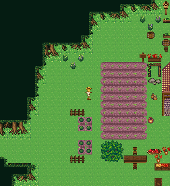

# 승인된 숲 몸통을 보존하는 조립

숲 외곽 모양만 변형한다. 아래 원본 몸통/뿌리 16px 그림을 다른 단독 나무로 바꾸지 않는다. 수관은 상위, 3행 몸통은 하위. 하위 첫 행은 해당 남쪽 수관 끝과 같은 y에서 시작하고 뿌리는 y+2이다.

왼쪽(3×3):
```json
[
  [
    1422,
    1423,
    1424
  ],
  [
    1426,
    1427,
    1428
  ],
  [
    1430,
    1431,
    1432
  ]
]
```

반복 몸통(2×3):
```json
[
  [
    1425,
    1350
  ],
  [
    1429,
    1428
  ],
  [
    1433,
    1432
  ]
]
```

오른쪽(3×3):
```json
[
  [
    1453,
    1454,
    1455
  ],
  [
    1457,
    1458,
    1459
  ],
  [
    1461,
    1462,
    1463
  ]
]
```


노출 구간 시작 x=s, 길이 w>4라면 span=max(8,2*ceil(w/2)). 왼쪽을 s, 반복 k=0..(span-6)/2-1을 s+3+2*k, 오른쪽을 s+span-3에 놓는다. 실패하면 원점을 s+w-span으로 바꿔 같은 전체 조각을 시도한다. 3행 모두 영역 내부·보호되지 않은 칸이며 다른 몸통과 호환되고, 첫 행 위에 수관이 있는 후보만 채택한다.
폭≤4라면 왼쪽마감=LEFT+PAIR 첫 열(4×3)을 s, 또는 오른쪽마감=PAIR 둘째 열+RIGHT(4×3)를 s+w-4에 시도한다. 폭이 좁다는 이유로 조각을 잘라서는 안 된다. 두 후보 모두 안 맞으면 그 노출 수관 행을 제거하고 경계를 다시 맞춘다. 최하단 맵 밖으로 이어지는 숲은 보이지 않는 뿌리를 강제로 그리지 않는다.

수관 모서리: N,E,S,W,NE,SE,SW,NW 순서로 bit0..7. 같은 수관이 이웃이면 비트를 켜고 아래 variantMap[mask]를 상위에 쓴다. 임의 좌우 반전 대신 정확한 이웃 mask를 쓴다.
```json
{
  "0": 2550,
  "1": 2551,
  "2": 2552,
  "3": 2569,
  "4": 2553,
  "5": 2554,
  "6": 2570,
  "7": 2571,
  "8": 2555,
  "9": 2572,
  "10": 2556,
  "11": 2573,
  "12": 2574,
  "13": 2575,
  "14": 2576,
  "15": 2557,
  "16": 2550,
  "17": 2551,
  "18": 2552,
  "19": 2577,
  "20": 2553,
  "21": 2554,
  "22": 2570,
  "23": 2578,
  "24": 2555,
  "25": 2572,
  "26": 2556,
  "27": 2579,
  "28": 2574,
  "29": 2575,
  "30": 2576,
  "31": 2558,
  "32": 2550,
  "33": 2551,
  "34": 2552,
  "35": 2569,
  "36": 2553,
  "37": 2554,
  "38": 2580,
  "39": 2581,
  "40": 2555,
  "41": 2572,
  "42": 2556,
  "43": 2573,
  "44": 2574,
  "45": 2575,
  "46": 2582,
  "47": 2559,
  "48": 2550,
  "49": 2551,
  "50": 2552,
  "51": 2577,
  "52": 2553,
  "53": 2554,
  "54": 2580,
  "55": 2583,
  "56": 2555,
  "57": 2572,
  "58": 2556,
  "59": 2579,
  "60": 2574,
  "61": 2575,
  "62": 2582,
  "63": 2560,
  "64": 2550,
  "65": 2551,
  "66": 2552,
  "67": 2569,
  "68": 2553,
  "69": 2554,
  "70": 2570,
  "71": 2571,
  "72": 2555,
  "73": 2572,
  "74": 2556,
  "75": 2573,
  "76": 2584,
  "77": 2585,
  "78": 2586,
  "79": 2561,
  "80": 2550,
  "81": 2551,
  "82": 2552,
  "83": 2577,
  "84": 2553,
  "85": 2554,
  "86": 2570,
  "87": 2578,
  "88": 2555,
  "89": 2572,
  "90": 2556,
  "91": 2579,
  "92": 2584,
  "93": 2585,
  "94": 2586,
  "95": 2562,
  "96": 2550,
  "97": 2551,
  "98": 2552,
  "99": 2569,
  "100": 2553,
  "101": 2554,
  "102": 2580,
  "103": 2581,
  "104": 2555,
  "105": 2572,
  "106": 2556,
  "107": 2573,
  "108": 2584,
  "109": 2585,
  "110": 2587,
  "111": 2563,
  "112": 2550,
  "113": 2551,
  "114": 2552,
  "115": 2577,
  "116": 2553,
  "117": 2554,
  "118": 2580,
  "119": 2583,
  "120": 2555,
  "121": 2572,
  "122": 2556,
  "123": 2579,
  "124": 2584,
  "125": 2585,
  "126": 2587,
  "127": 2588,
  "128": 2550,
  "129": 2551,
  "130": 2552,
  "131": 2569,
  "132": 2553,
  "133": 2554,
  "134": 2570,
  "135": 2571,
  "136": 2555,
  "137": 2589,
  "138": 2556,
  "139": 2590,
  "140": 2574,
  "141": 2591,
  "142": 2576,
  "143": 2564,
  "144": 2550,
  "145": 2551,
  "146": 2552,
  "147": 2577,
  "148": 2553,
  "149": 2554,
  "150": 2570,
  "151": 2578,
  "152": 2555,
  "153": 2589,
  "154": 2556,
  "155": 2592,
  "156": 2574,
  "157": 2591,
  "158": 2576,
  "159": 2565,
  "160": 2550,
  "161": 2551,
  "162": 2552,
  "163": 2569,
  "164": 2553,
  "165": 2554,
  "166": 2580,
  "167": 2581,
  "168": 2555,
  "169": 2589,
  "170": 2556,
  "171": 2590,
  "172": 2574,
  "173": 2591,
  "174": 2582,
  "175": 2566,
  "176": 2550,
  "177": 2551,
  "178": 2552,
  "179": 2577,
  "180": 2553,
  "181": 2554,
  "182": 2580,
  "183": 2583,
  "184": 2555,
  "185": 2589,
  "186": 2556,
  "187": 2592,
  "188": 2574,
  "189": 2591,
  "190": 2582,
  "191": 2593,
  "192": 2550,
  "193": 2551,
  "194": 2552,
  "195": 2569,
  "196": 2553,
  "197": 2554,
  "198": 2570,
  "199": 2571,
  "200": 2555,
  "201": 2589,
  "202": 2556,
  "203": 2590,
  "204": 2584,
  "205": 2594,
  "206": 2586,
  "207": 2567,
  "208": 2550,
  "209": 2551,
  "210": 2552,
  "211": 2577,
  "212": 2553,
  "213": 2554,
  "214": 2570,
  "215": 2578,
  "216": 2555,
  "217": 2589,
  "218": 2556,
  "219": 2592,
  "220": 2584,
  "221": 2594,
  "222": 2586,
  "223": 2595,
  "224": 2550,
  "225": 2551,
  "226": 2552,
  "227": 2569,
  "228": 2553,
  "229": 2554,
  "230": 2580,
  "231": 2581,
  "232": 2555,
  "233": 2589,
  "234": 2556,
  "235": 2590,
  "236": 2584,
  "237": 2594,
  "238": 2587,
  "239": 2596,
  "240": 2550,
  "241": 2551,
  "242": 2552,
  "243": 2577,
  "244": 2553,
  "245": 2554,
  "246": 2580,
  "247": 2583,
  "248": 2555,
  "249": 2589,
  "250": 2556,
  "251": 2592,
  "252": 2584,
  "253": 2594,
  "254": 2587,
  "255": 2568
}
```


## 숲 영역 입력→정답 배열→완성 그림
입력은 승인 마을에서 rect=(9,6,22,24)의 숲/빈터 마스크를 재현하는 경우이다. 아래 상위 2550..2596 칸이 마스크의 true, 나머지는 false이며 하위는 기존 지형과 맞춘 전체 정답이다. 임의 사각형을 지정하면 언제나 같은 마을이 나온다는 뜻은 아니다. 자유 영역 생성 구현은 src/editor/tools/village/forestContour.ts의 paintContouredForest이며 free 예약칸과 seed를 함께 받아야 한다.
```json
{
  "x": 9,
  "y": 6,
  "w": 22,
  "h": 24,
  "lowerTiles": [
    [
      240,
      240,
      240,
      240,
      240,
      240,
      240,
      240,
      240,
      240,
      240,
      240,
      240,
      1350,
      1453,
      1454,
      1455,
      1428,
      1457,
      1458,
      1459,
      240
    ],
    [
      240,
      240,
      240,
      240,
      240,
      240,
      240,
      240,
      240,
      1350,
      1453,
      1454,
      1455,
      1428,
      1457,
      1458,
      1459,
      1432,
      1461,
      1462,
      1463,
      240
    ],
    [
      240,
      240,
      240,
      240,
      240,
      240,
      240,
      240,
      240,
      1428,
      1457,
      1458,
      1459,
      1432,
      1461,
      1462,
      1463,
      240,
      240,
      240,
      240,
      240
    ],
    [
      240,
      240,
      240,
      240,
      240,
      240,
      240,
      240,
      240,
      1432,
      1461,
      1462,
      1463,
      240,
      240,
      240,
      240,
      240,
      240,
      240,
      240,
      240
    ],
    [
      240,
      240,
      240,
      240,
      240,
      240,
      240,
      240,
      1350,
      1453,
      1454,
      1455,
      240,
      240,
      240,
      240,
      240,
      240,
      240,
      240,
      240,
      240
    ],
    [
      240,
      240,
      240,
      240,
      1350,
      1453,
      1454,
      1455,
      1428,
      1457,
      1458,
      1459,
      240,
      240,
      240,
      240,
      240,
      240,
      240,
      240,
      240,
      240
    ],
    [
      240,
      240,
      240,
      240,
      1428,
      1457,
      1458,
      1459,
      1432,
      1461,
      1462,
      1463,
      240,
      240,
      240,
      240,
      240,
      240,
      240,
      240,
      240,
      240
    ],
    [
      240,
      240,
      240,
      240,
      1432,
      1461,
      1462,
      1463,
      240,
      240,
      240,
      240,
      240,
      240,
      240,
      240,
      240,
      240,
      240,
      240,
      240,
      240
    ],
    [
      240,
      240,
      1350,
      1453,
      1454,
      1455,
      240,
      240,
      240,
      240,
      240,
      240,
      240,
      156,
      157,
      157,
      157,
      157,
      158,
      240,
      240,
      240
    ],
    [
      240,
      240,
      1428,
      1457,
      1458,
      1459,
      240,
      240,
      240,
      240,
      240,
      240,
      240,
      186,
      187,
      187,
      187,
      187,
      188,
      240,
      240,
      376
    ],
    [
      240,
      240,
      1432,
      1461,
      1462,
      1463,
      240,
      240,
      240,
      240,
      240,
      240,
      240,
      186,
      187,
      187,
      187,
      187,
      188,
      240,
      240,
      376
    ],
    [
      240,
      240,
      240,
      240,
      240,
      240,
      240,
      240,
      240,
      240,
      240,
      240,
      240,
      186,
      187,
      187,
      187,
      187,
      188,
      240,
      240,
      405
    ],
    [
      240,
      1350,
      1453,
      1454,
      1455,
      240,
      240,
      240,
      240,
      240,
      240,
      240,
      240,
      186,
      187,
      187,
      187,
      187,
      188,
      240,
      240,
      12
    ],
    [
      240,
      1428,
      1457,
      1458,
      1459,
      240,
      240,
      240,
      240,
      240,
      240,
      240,
      240,
      186,
      187,
      187,
      187,
      187,
      188,
      240,
      240,
      42
    ],
    [
      240,
      1432,
      1461,
      1462,
      1463,
      240,
      240,
      240,
      240,
      240,
      240,
      240,
      240,
      186,
      187,
      187,
      187,
      187,
      188,
      240,
      240,
      72
    ],
    [
      1350,
      1453,
      1454,
      1455,
      240,
      240,
      240,
      240,
      240,
      240,
      240,
      240,
      240,
      186,
      187,
      187,
      187,
      187,
      188,
      240,
      240,
      240
    ],
    [
      1428,
      1457,
      1458,
      1459,
      240,
      240,
      240,
      240,
      240,
      240,
      240,
      240,
      240,
      186,
      187,
      187,
      187,
      187,
      188,
      240,
      240,
      240
    ],
    [
      1432,
      1461,
      1462,
      1463,
      240,
      240,
      240,
      240,
      240,
      240,
      240,
      240,
      240,
      216,
      217,
      217,
      217,
      217,
      218,
      240,
      240,
      240
    ],
    [
      240,
      240,
      240,
      240,
      240,
      240,
      240,
      240,
      240,
      240,
      240,
      240,
      240,
      983,
      984,
      985,
      240,
      240,
      240,
      240,
      240,
      240
    ],
    [
      240,
      240,
      240,
      240,
      240,
      240,
      240,
      240,
      240,
      240,
      240,
      240,
      240,
      1013,
      1014,
      1015,
      240,
      240,
      240,
      240,
      240,
      240
    ],
    [
      240,
      240,
      240,
      240,
      240,
      240,
      240,
      240,
      240,
      240,
      240,
      240,
      240,
      1043,
      1044,
      1045,
      240,
      240,
      240,
      240,
      240,
      240
    ],
    [
      240,
      1350,
      1453,
      1454,
      1455,
      240,
      240,
      240,
      240,
      240,
      240,
      240,
      240,
      240,
      240,
      240,
      240,
      240,
      240,
      240,
      240,
      240
    ],
    [
      240,
      1428,
      1457,
      1458,
      1459,
      240,
      240,
      240,
      240,
      240,
      240,
      240,
      240,
      240,
      240,
      240,
      240,
      240,
      240,
      240,
      240,
      240
    ],
    [
      240,
      1432,
      1461,
      1462,
      1463,
      240,
      240,
      240,
      240,
      240,
      240,
      240,
      240,
      240,
      240,
      240,
      240,
      240,
      240,
      240,
      240,
      240
    ]
  ],
  "upperTiles": [
    [
      2568,
      2568,
      2568,
      2568,
      2568,
      2568,
      2568,
      2568,
      2568,
      2568,
      2568,
      2568,
      2568,
      2568,
      2568,
      2595,
      2592,
      2592,
      2592,
      2589,
      -1,
      2622
    ],
    [
      2568,
      2568,
      2568,
      2568,
      2568,
      2568,
      2568,
      2568,
      2568,
      2568,
      2568,
      2595,
      2592,
      2592,
      2592,
      2589,
      -1,
      -1,
      -1,
      -1,
      -1,
      2627
    ],
    [
      2568,
      2568,
      2568,
      2568,
      2568,
      2568,
      2568,
      2568,
      2568,
      2568,
      2568,
      2594,
      -1,
      -1,
      -1,
      -1,
      -1,
      -1,
      289,
      -1,
      288,
      2623
    ],
    [
      2568,
      2568,
      2568,
      2568,
      2568,
      2568,
      2568,
      2568,
      2568,
      2568,
      2568,
      2594,
      -1,
      -1,
      -1,
      -1,
      -1,
      -1,
      -1,
      288,
      -1,
      -1
    ],
    [
      2568,
      2568,
      2568,
      2568,
      2568,
      2568,
      2568,
      2568,
      2568,
      2568,
      2595,
      2589,
      -1,
      -1,
      -1,
      -1,
      -1,
      -1,
      -1,
      2638,
      -1,
      2623
    ],
    [
      2568,
      2568,
      2568,
      2568,
      2568,
      2595,
      2592,
      2592,
      2592,
      2592,
      2589,
      -1,
      -1,
      -1,
      -1,
      -1,
      -1,
      -1,
      -1,
      -1,
      -1,
      177
    ],
    [
      2568,
      2568,
      2568,
      2568,
      2568,
      2594,
      -1,
      -1,
      -1,
      -1,
      -1,
      -1,
      -1,
      -1,
      -1,
      -1,
      -1,
      -1,
      2610,
      2611,
      2612,
      207
    ],
    [
      2568,
      2568,
      2568,
      2568,
      2568,
      2594,
      -1,
      -1,
      289,
      -1,
      288,
      -1,
      -1,
      -1,
      -1,
      -1,
      -1,
      -1,
      2615,
      2616,
      2617,
      -1
    ],
    [
      2568,
      2568,
      2568,
      2568,
      2595,
      2589,
      -1,
      -1,
      -1,
      288,
      -1,
      -1,
      -1,
      -1,
      -1,
      -1,
      -1,
      -1,
      -1,
      2643,
      2644,
      354
    ],
    [
      2568,
      2568,
      2568,
      2568,
      2594,
      -1,
      -1,
      -1,
      -1,
      -1,
      -1,
      -1,
      -1,
      -1,
      -1,
      -1,
      -1,
      -1,
      -1,
      2647,
      2648,
      -1
    ],
    [
      2568,
      2568,
      2568,
      2568,
      2594,
      -1,
      -1,
      -1,
      -1,
      -1,
      -1,
      -1,
      -1,
      -1,
      -1,
      -1,
      -1,
      -1,
      -1,
      2649,
      2650,
      -1
    ],
    [
      2568,
      2568,
      2568,
      2568,
      2594,
      -1,
      -1,
      -1,
      -1,
      -1,
      -1,
      2651,
      -1,
      -1,
      -1,
      -1,
      -1,
      -1,
      -1,
      -1,
      -1,
      384
    ],
    [
      2568,
      2568,
      2568,
      2595,
      2589,
      -1,
      -1,
      -1,
      -1,
      -1,
      -1,
      2654,
      -1,
      -1,
      -1,
      -1,
      -1,
      -1,
      -1,
      2652,
      2653,
      -1
    ],
    [
      2568,
      2568,
      2568,
      2594,
      -1,
      -1,
      -1,
      -1,
      -1,
      -1,
      -1,
      -1,
      -1,
      -1,
      -1,
      -1,
      -1,
      -1,
      -1,
      -1,
      -1,
      -1
    ],
    [
      2568,
      2568,
      2568,
      2594,
      -1,
      -1,
      -1,
      -1,
      -1,
      2636,
      2637,
      -1,
      -1,
      -1,
      -1,
      -1,
      -1,
      -1,
      -1,
      -1,
      -1,
      -1
    ],
    [
      2592,
      2592,
      2592,
      2589,
      -1,
      -1,
      -1,
      -1,
      -1,
      -1,
      2613,
      2614,
      -1,
      -1,
      -1,
      -1,
      -1,
      -1,
      -1,
      352,
      -1,
      -1
    ],
    [
      -1,
      -1,
      -1,
      -1,
      -1,
      -1,
      -1,
      -1,
      -1,
      -1,
      2618,
      2619,
      -1,
      -1,
      -1,
      -1,
      -1,
      -1,
      -1,
      -1,
      -1,
      -1
    ],
    [
      -1,
      -1,
      -1,
      -1,
      -1,
      -1,
      -1,
      -1,
      -1,
      -1,
      -1,
      -1,
      -1,
      -1,
      -1,
      -1,
      -1,
      -1,
      -1,
      -1,
      -1,
      -1
    ],
    [
      -1,
      -1,
      -1,
      -1,
      -1,
      -1,
      -1,
      -1,
      -1,
      -1,
      2613,
      2614,
      -1,
      -1,
      -1,
      -1,
      -1,
      -1,
      -1,
      -1,
      -1,
      -1
    ],
    [
      -1,
      -1,
      -1,
      -1,
      -1,
      -1,
      -1,
      -1,
      -1,
      -1,
      2618,
      2619,
      -1,
      -1,
      -1,
      -1,
      -1,
      175,
      -1,
      2628,
      2629,
      351
    ],
    [
      2584,
      -1,
      -1,
      -1,
      -1,
      -1,
      -1,
      -1,
      -1,
      2636,
      2637,
      -1,
      -1,
      -1,
      -1,
      -1,
      234,
      235,
      236,
      -1,
      351,
      -1
    ],
    [
      2596,
      2587,
      2587,
      2586,
      2555,
      -1,
      -1,
      -1,
      -1,
      -1,
      -1,
      -1,
      -1,
      -1,
      -1,
      -1,
      -1,
      176,
      -1,
      -1,
      202,
      203
    ],
    [
      2568,
      2595,
      2592,
      2589,
      -1,
      -1,
      -1,
      -1,
      -1,
      -1,
      -1,
      -1,
      -1,
      -1,
      -1,
      -1,
      -1,
      -1,
      -1,
      -1,
      -1,
      -1
    ],
    [
      2568,
      2594,
      -1,
      -1,
      -1,
      -1,
      -1,
      -1,
      -1,
      -1,
      -1,
      -1,
      -1,
      -1,
      -1,
      -1,
      -1,
      -1,
      -1,
      -1,
      237,
      -1
    ]
  ]
}
```


