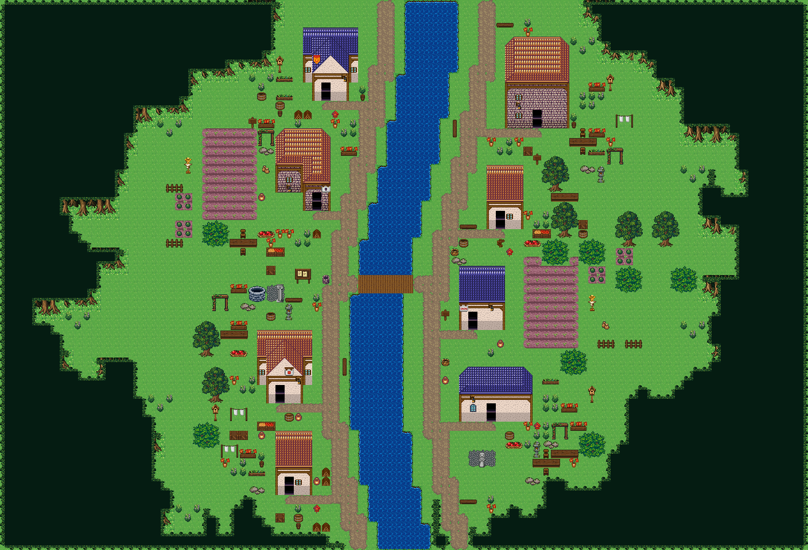

# 이슬여울 마을 · 승인된 장식 조립 사전

88×60, 16px, forest_harmony (숲마을 · 거리별 잔디), 원본 tex_forest_harmony, 30열. 좌표는 모두 0기준 좌상단. i=y*88+x. 빈 타일은 -1; KEEP는 기존 하위 타일을 읽어 유지하라는 연산이며 타일 번호가 아니다.

25종/85개 장식, 건물 8채. 소품 19종은 별도 공용 shared_forest_village_objects (tex_shared_forest_village_objects, 6열)에서 47칸을 이식했다. 나머지 6종은 forest_harmony 원래 칸이다. 기본 forest_harmony 시트만 선택하면 2610번 소품이 생기는 것은 아니다.

## 그대로 실행하는 순서
1. 원본 시트와 225개 사용 타일의 이식 결합표를 확인한다. sourceChipset+sourceTile이 그림 정체성이다. 번호만 다른 시트에 복사하지 않는다.
2. 지형·강·다리·길 하위 배열을 먼저 깐다. 전체 배열 01~06은 이 승인 표본의 정답이다. 부분 저작은 해당 좌표의 하위를 KEEP한다.
3. 건물 전체 하위→전체 상위를 한 묶음으로 놓는다. 건물 문서의 8개 직사각형은 확대·반복하지 않는 고정 조각이다. 문 칸과 남쪽 접근칸을 예약하고 이벤트를 유지한다.
4. 숲 영역은 수관 마스크→남쪽 노출 경계 탐색→3행 몸통 왼쪽 마감→2열 반복 몸통→오른쪽 마감 순서. 전체가 들어갈 때만 쓴다. 맞지 않으면 노출된 수관 행을 줄여 재시도한다. 뿌리 한 행을 잘라 맞추지 않는다. 마지막으로 하위 몸통→상위 수관을 합성한다.
5. 울타리는 남쪽 열린 통로를 남기고 놓는다. 이번 표본의 나무 울타리는 2×1 고정 패널이다. 모서리 부품이나 무제한 반복 몸통으로 해석하지 않는다.
6. 장식 배치표 순서대로 각 상위 직사각형 전체를 놓는다. 일반 소품 조건: 영역 안, 하위 잔디 240, 상위 -1, 추가 스택 없음, 건물·문앞·이벤트 주변 예약 칸 제외. 벽걸이 등불만 기존 벽 하위를 KEEP하고 문 열 ±1을 피한다. 표에는 승인된 실제 좌표가 있으므로 재검색할 필요 없다.
7. 과일상자는 탁자 위 장식이 아니다. 탁자와 바구니는 각각 독립 상위 조각으로 놓는다. 우물·게시판·상자 등 상호작용할 소품은 적어도 한 면에 접근 가능 칸을 둔다. 등불은 벽 장식이라 별도 접근 검사에서 제외한다.
8. 두 레이어 전체 비교, 원본 이식 결합 검사, (36,30)에서 8개 문앞 및 소품으로의 타일 통행 검사를 수행한다. 실패하면 작업 복사본을 버리고 수정 후 다시 적용한다. 실제 프로젝트 저장→같은 SQLite 저장소 재로드가 마지막 단계다.

## 다른 프로젝트에 이식할 때
소품 47개 원본 번호를 오름차순 정렬한다. start=30*ceil(max(tileset.count,1+max(existingGraft.targetTile))/30). 정렬 위치 k의 target=start+k. 이 표본에서는 start=2610, 사용 2610..2656, count=2670이다. 기존 2550..2596 수관 이식은 유지한다. source tileMeta·passability·priority와 tileGrafts를 같이 복사한다. 충돌하는 2610번을 덮어쓰지 않는다. 기존 번호와 달라지면 모든 상위 배열과 structureKits의 참조도 대응표로 바꾼다.

이 문서의 표본 검사기는 승인된 번호/좌표 전용이다. 재배치·재이식한 다른 마을은 자기 정답 배열을 따로 만들거나 공용 inspect_tile_recipe / validate_tile_recipes 도구로 등록 조립법 단위를 검사한다. 이슬여울과 다른 배치라는 이유만으로 잘못된 마을이라고 하지 않는다.

## 건물·가구·울타리·동굴의 추가 조립
이번 표본에는 동굴이 없다. 새 동굴은 같은 타일 참고문서의 정밀조립·검증(public-assembly-v2) → cave-cliff 문서 및 inspect_tile_recipe를 사용한다. 절벽 윗면→절벽 벽→하위 받침652+동굴 입구893→남쪽 접근칸 순서. 입구893은 tex_easyrpg_chipset_retro_world 원본413 이식이며 자동 전이 이벤트가 아니다.
닫힌 울타리는 같은 자료의 fence-gate: NW378, NE380, SW438, SE410, 수평379, 수직408. 아래 조립 부록에 두 레이어 전체를 실었다. 방향을 뒤집거나 이번 2×1 소품을 모서리로 늘리지 않는다.

출처: 정본 SQLite에서 승인 후 추출. projectId 31250868-3eb7-42c9-a1f6-bd7d1d8e8245, SHA256 0c198b2917b952cd8350a567d246272badb8cc9d1a556f5be3c512856c6e70aa. sample.json은 조립 학습용 맵/타일셋 표본이며 완전한 플레이 프로젝트가 아니다. 이벤트의 내부맵 참조는 원 프로젝트에 있다. 그림 저작권/출처는 기존 tiledata/forest-villages의 출처 기록 및 저장소 타일 출처 표기을 따른다. 새 그림은 생성하지 않았다.
