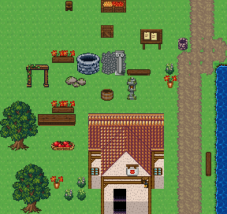
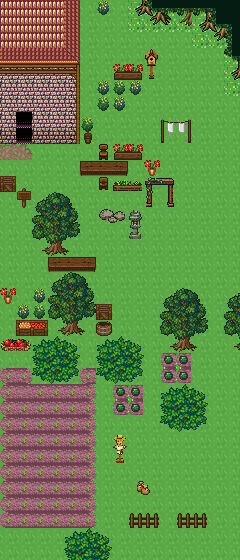

# 이전 설명 정정과 적용 범위

|오해를 부르는 설명|정확한 적용|
|---|---|
|모든 숲 줄기는 수관과 같은 행에서 시작한다|6행 forest-repeat 본체 하위는 3행째, 마감은 4행째. 이번 굽이숲의 3행 몸통은 마지막 수관과 같은 행에서 시작한다. 서로 다른 조립법이다.|
|상위 그림의 바탕 잔디까지 복사한다|소품 25종은 upper. 하위는 KEEP. 사전의 투명 조각에 미리보기 잔디를 붙이지 않는다.|
|투명 타일이면 모두 상위다|투명 여부·홈 레이어·받침·priority·통행은 별개. 몸통은 lower, 수관은 upper. 동굴893은 lower+받침652.|
|2610번은 공용 숲마을의 고정 소품 번호다|이 표본에서만 2610..2656. 원본 sourceChipset+sourceTile로 확인하고 새 시트에서는 빈 행부터 이식한다.|
|2칸 울타리를 잘라 모서리에 쓴다|이번 2×1은 고정 패널. 모서리는 공용 fence-gate의 378/380/438/410을 사용한다.|

기존 공용 문서/메타데이터의 99개 홈 레이어 정정은 recipes/layer-corrections.json, 설명 정정은 recipes/layer-prose-corrections.json 및 forestHarmony.ts가 관리한다. 이 자료집은 해당 정정을 취소하지 않는다. 사용자 편집 문서는 덮어쓰지 않는다.

