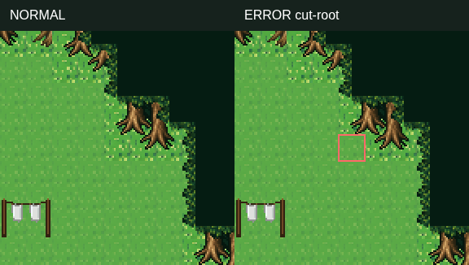
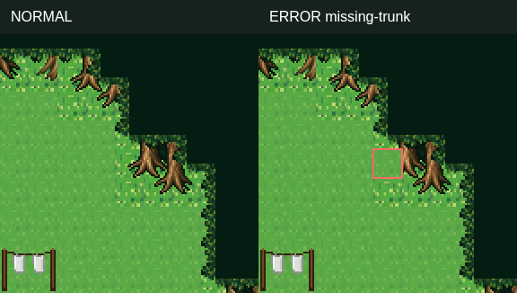
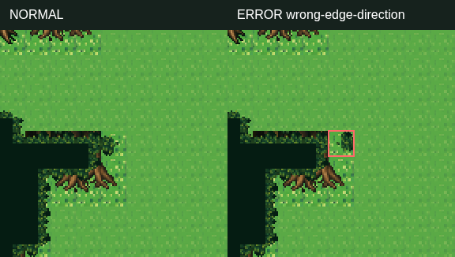
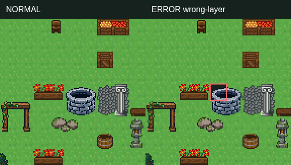
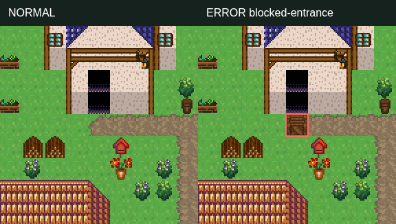

# 자동 검증 · 정상/오류 좌표

저장 전 프로젝트 JSON을 내보내 아래 읽기 전용 검사를 실행한다. 정답 표본과 같은 88×60 배치/이식 번호에만 적용한다. 다른 맵에서 나온 차이는 이 표본과 다르다는 뜻이다.

```bash
node scripts/content/validate-dewbank-village.mjs exported-project.json dewbank_village
```

성공 exit0, 오류 exit1. errors는 최대128개, totalErrors는 전체 수. 실제 엔진 canMove 기반 타일 통행을 사용하고 이벤트 실행, NPC 충돌·전이 성공, 미적 품질은 검사하지 않는다. 외곽 오류는 승인 배열 비교이며 임의 그림의 방향 인식이 아니다. 등록 조립법은 편집기 validate_tile_recipes도 사용 가능하다.

## 정상 결과
```json
{
  "valid": true,
  "reference": "dewbank-village-v1",
  "mapId": "dewbank_village",
  "totalErrors": 0,
  "truncated": false,
  "errors": [],
  "scope": "Exact approved arrays and source bindings; engine tile reachability from (36,30). Events and aesthetic quality are not evaluated."
}
```

## cut-root
```json
{
  "input": {
    "id": "cut-root",
    "x": 71,
    "y": 10,
    "layer": "lower",
    "tile": 1430,
    "replacement": 240
  },
  "result": {
    "valid": false,
    "reference": "dewbank-village-v1",
    "mapId": "dewbank_village",
    "totalErrors": 1,
    "truncated": false,
    "errors": [
      {
        "code": "cut-root",
        "x": 71,
        "y": 10,
        "layer": "lower",
        "expected": 1430,
        "actual": 240
      }
    ],
    "scope": "Exact approved arrays and source bindings; engine tile reachability from (36,30). Events and aesthetic quality are not evaluated."
  }
}
```



## missing-trunk
```json
{
  "input": {
    "id": "missing-trunk",
    "x": 71,
    "y": 9,
    "layer": "lower",
    "tile": 1426,
    "replacement": 240
  },
  "result": {
    "valid": false,
    "reference": "dewbank-village-v1",
    "mapId": "dewbank_village",
    "totalErrors": 1,
    "truncated": false,
    "errors": [
      {
        "code": "missing-trunk",
        "x": 71,
        "y": 9,
        "layer": "lower",
        "expected": 1426,
        "actual": 240
      }
    ],
    "scope": "Exact approved arrays and source bindings; engine tile reachability from (36,30). Events and aesthetic quality are not evaluated."
  }
}
```



## wrong-edge-direction
```json
{
  "input": {
    "id": "wrong-edge-direction",
    "x": 13,
    "y": 27,
    "layer": "upper",
    "tile": 2555,
    "replacement": 2552
  },
  "result": {
    "valid": false,
    "reference": "dewbank-village-v1",
    "mapId": "dewbank_village",
    "totalErrors": 1,
    "truncated": false,
    "errors": [
      {
        "code": "wrong-edge-direction",
        "x": 13,
        "y": 27,
        "layer": "upper",
        "expected": 2555,
        "actual": 2552
      }
    ],
    "scope": "Exact approved arrays and source bindings; engine tile reachability from (36,30). Events and aesthetic quality are not evaluated."
  }
}
```



## wrong-layer
```json
{
  "input": {
    "id": "wrong-layer",
    "x": 27,
    "y": 31,
    "layer": "upper",
    "tile": 2639,
    "replacement": -1,
    "moveToOtherLayer": true
  },
  "result": {
    "valid": false,
    "reference": "dewbank-village-v1",
    "mapId": "dewbank_village",
    "totalErrors": 2,
    "truncated": false,
    "errors": [
      {
        "code": "tile-mismatch",
        "x": 27,
        "y": 31,
        "layer": "lower",
        "expected": 240,
        "actual": 2639
      },
      {
        "code": "wrong-layer",
        "x": 27,
        "y": 31,
        "layer": "upper",
        "expected": 2639,
        "actual": -1
      }
    ],
    "scope": "Exact approved arrays and source bindings; engine tile reachability from (36,30). Events and aesthetic quality are not evaluated."
  }
}
```



## blocked-entrance
```json
{
  "input": {
    "id": "blocked-entrance",
    "x": 35,
    "y": 11,
    "layer": "upper",
    "tile": -1,
    "replacement": 237
  },
  "result": {
    "valid": false,
    "reference": "dewbank-village-v1",
    "mapId": "dewbank_village",
    "totalErrors": 2,
    "truncated": false,
    "errors": [
      {
        "code": "tile-mismatch",
        "x": 35,
        "y": 11,
        "layer": "upper",
        "expected": -1,
        "actual": 237
      },
      {
        "code": "blocked-entrance",
        "x": 35,
        "y": 11,
        "houseId": "village_house_1",
        "door": {
          "x": 35,
          "y": 10
        }
      }
    ],
    "scope": "Exact approved arrays and source bindings; engine tile reachability from (36,30). Events and aesthetic quality are not evaluated."
  }
}
```


